<div align="center">

<h1 align="center">
  
  CI/CD / Field Notes
</h1>

Workflow triggers, jobs, runtime parity, artifacts, security, and deployment.

<a href="qa.md">QA docs</a>  <a href="testing.md">Testing docs</a>  <a href="test.md">Full test matrix</a>  <a href="../README.md">README</a>

</div>

---

<p align="center">
  
  
  
  
  
</p>

<table>
  <thead>
    <tr><th>Topic</th><th>Project baseline</th><th>Use it for</th></tr>
  </thead>
  <tbody>
    <tr><td>Runtime</td><td>Node 24</td><td>All current workflows use the same major runtime.</td></tr>
    <tr><td>Install</td><td>pnpm install --frozen-lockfile</td><td>Every workflow uses the same lockfile and cache.</td></tr>
    <tr><td>Quality</td><td>lint to Lighthouse</td><td>Jobs move from cheap static checks to browser audits.</td></tr>
    <tr><td>Delivery</td><td>Docker + Vercel</td><td>Images, security reports, and production output have separate jobs.</td></tr>
  </tbody>
</table>

## Contents

- [01 / Workflow map](#01--workflow-map)
- [02 / Triggers](#02--triggers)
- [03 / Runtime](#03--runtime)
- [04 / Dependency install](#04--dependency-install)
- [05 / Static jobs](#05--static-jobs)
- [06 / Test job](#06--test-job)
- [07 / Frontend QA job](#07--frontend-qa-job)
- [08 / Build job](#08--build-job)
- [09 / Bundle analysis](#09--bundle-analysis)
- [10 / Lighthouse job](#10--lighthouse-job)
- [11 / CodeQL](#11--codeql)
- [12 / Dependency updates](#12--dependency-updates)
- [13 / Docker workflow](#13--docker-workflow)
- [14 / Deployment](#14--deployment)
- [15 / Secrets and permissions](#15--secrets-and-permissions)
- [16 / Local parity](#16--local-parity)
- [17 / CI review checklist](#17--ci-review-checklist)
- [Repository map](#repository-map)
- [Command matrix](#command-matrix)
- [Evidence and troubleshooting](#evidence-and-troubleshooting)
- [References](#references)

<h1 align="center">
   Operating model
</h1>

This guide explains **CI/CD / Field Notes** through the source tree, the runtime boundary, the smallest useful test, and the evidence a reviewer can inspect.

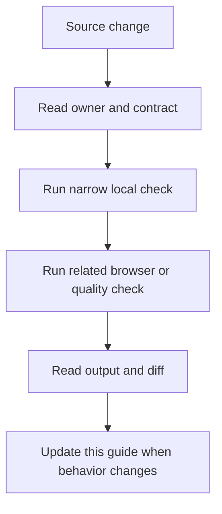

### Reading order

- Start at the section for the changed file or runtime.
- Copy the narrow command before running the broad suite.
- Check the failure branch and the evidence path.
- Compare README links after editing any docs entry point.

<a id="01--workflow-map"></a>
## 01 / Workflow map

GitHub Actions separates main CI, frontend QA, CodeQL, dependency updates, Docker, and deployment concerns.

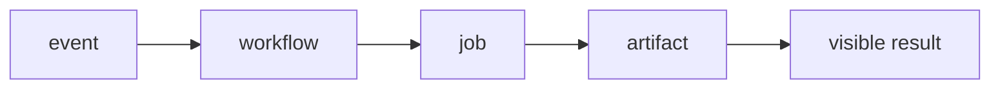

### How it works

1. `event` enters **Workflow map** as the value, event, file, or runtime that needs a decision.
2. `workflow` applies the rule owned by this section; keep that decision close to its source boundary.
3. `job` carries the checked result to the next consumer instead of exposing private setup.
4. `artifact` receives the result and makes it visible through markup, output, or an exit code.
5. Exercise the normal path and the failure path at the runtime named by the example.

### Project reading

- **Rule:** Keep one purpose per workflow so a failure points to the right owner.
- **Failure to catch:** A deployment job carries an unrelated quality check and makes diagnosis slow.
- **Evidence:** Workflow run, job name, and step output.
- **Owner:** `CI/CD / Field Notes` documents the contract; source files and tests remain the executable reference.
- **Scope:** Read this section with the linked source path in the repository catalog below.

### Example

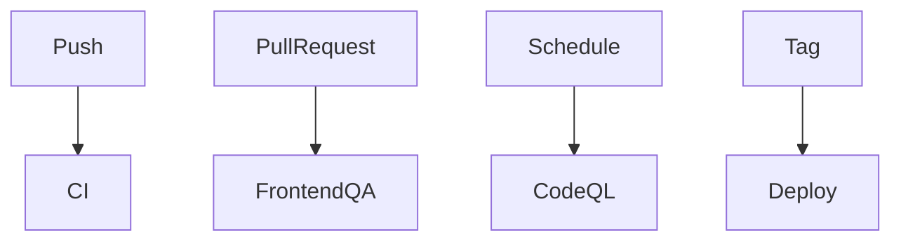

### Decision table

<table>
  <thead>
    <tr><th>Input</th><th>Project decision</th><th>Check</th></tr>
  </thead>
  <tbody>
    <tr><td>event</td><td>Keep it at the boundary named by the section.</td><td>A focused test or source inspection.</td></tr>
    <tr><td>workflow</td><td>Use the smallest rule that explains the branch.</td><td>Lint, type check, or browser assertion.</td></tr>
    <tr><td>job</td><td>Return a readable value or state.</td><td>Success and failure cases.</td></tr>
    <tr><td>artifact</td><td>Expose a semantic or reviewable consumer.</td><td>Role, report, screenshot, or exit code.</td></tr>
  </tbody>
</table>

### Checks

- Inspect the owner for `workflow` before editing the consumer.
- Assert the successful `job` result through the public surface.
- Force the failure branch and confirm it reaches `artifact`.
- Record the command and artifact path shown in this guide.

<a id="02--triggers"></a>
## 02 / Triggers

Main CI and frontend QA run on push and pull request branches; CodeQL also runs on a schedule.

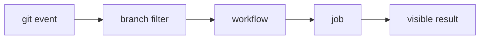

### How it works

1. `git event` enters **Triggers** as the value, event, file, or runtime that needs a decision.
2. `branch filter` applies the rule owned by this section; keep that decision close to its source boundary.
3. `workflow` carries the checked result to the next consumer instead of exposing private setup.
4. `job` receives the result and makes it visible through markup, output, or an exit code.
5. Exercise the normal path and the failure path at the runtime named by the example.

### Project reading

- **Rule:** Read the on block before assuming a check runs for every branch or tag.
- **Failure to catch:** A workflow exists but never runs for the branch used by a change.
- **Evidence:** Workflow trigger and run URL.
- **Owner:** `CI/CD / Field Notes` documents the contract; source files and tests remain the executable reference.
- **Scope:** Read this section with the linked source path in the repository catalog below.

### Example

```yaml
on:
  push:
    branches: [main, master, develop]
  pull_request:
    branches: [main, master, develop]
```

### Decision table

<table>
  <thead>
    <tr><th>Input</th><th>Project decision</th><th>Check</th></tr>
  </thead>
  <tbody>
    <tr><td>git event</td><td>Keep it at the boundary named by the section.</td><td>A focused test or source inspection.</td></tr>
    <tr><td>branch filter</td><td>Use the smallest rule that explains the branch.</td><td>Lint, type check, or browser assertion.</td></tr>
    <tr><td>workflow</td><td>Return a readable value or state.</td><td>Success and failure cases.</td></tr>
    <tr><td>job</td><td>Expose a semantic or reviewable consumer.</td><td>Role, report, screenshot, or exit code.</td></tr>
  </tbody>
</table>

### Checks

- Inspect the owner for `branch filter` before editing the consumer.
- Assert the successful `workflow` result through the public surface.
- Force the failure branch and confirm it reaches `job`.
- Record the command and artifact path shown in this guide.

<a id="03--runtime"></a>
## 03 / Runtime

CI sets Node 24. Frontend QA also sets up pnpm 11.9.0 and installs with the frozen pnpm lockfile.

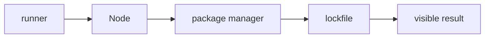

### How it works

1. `runner` enters **Runtime** as the value, event, file, or runtime that needs a decision.
2. `Node` applies the rule owned by this section; keep that decision close to its source boundary.
3. `package manager` carries the checked result to the next consumer instead of exposing private setup.
4. `lockfile` receives the result and makes it visible through markup, output, or an exit code.
5. Exercise the normal path and the failure path at the runtime named by the example.

### Project reading

- **Rule:** Use the workflow runtime when reproducing a failure locally.
- **Failure to catch:** Node or lockfile differences create a failure that cannot be reproduced on the developer machine.
- **Evidence:** Node version, package manager version, and install output.
- **Owner:** `CI/CD / Field Notes` documents the contract; source files and tests remain the executable reference.
- **Scope:** Read this section with the linked source path in the repository catalog below.

### Example

```yaml
env:
  NODE_VERSION: '24'

packageManager: pnpm@11.9.0
```

### Decision table

<table>
  <thead>
    <tr><th>Input</th><th>Project decision</th><th>Check</th></tr>
  </thead>
  <tbody>
    <tr><td>runner</td><td>Keep it at the boundary named by the section.</td><td>A focused test or source inspection.</td></tr>
    <tr><td>Node</td><td>Use the smallest rule that explains the branch.</td><td>Lint, type check, or browser assertion.</td></tr>
    <tr><td>package manager</td><td>Return a readable value or state.</td><td>Success and failure cases.</td></tr>
    <tr><td>lockfile</td><td>Expose a semantic or reviewable consumer.</td><td>Role, report, screenshot, or exit code.</td></tr>
  </tbody>
</table>

### Checks

- Inspect the owner for `Node` before editing the consumer.
- Assert the successful `package manager` result through the public surface.
- Force the failure branch and confirm it reaches `lockfile`.
- Record the command and artifact path shown in this guide.

<a id="04--dependency-install"></a>
## 04 / Dependency install

All workflows use pnpm install --frozen-lockfile.

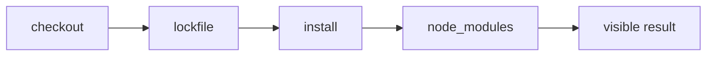

### How it works

1. `checkout` enters **Dependency install** as the value, event, file, or runtime that needs a decision.
2. `lockfile` applies the rule owned by this section; keep that decision close to its source boundary.
3. `install` carries the checked result to the next consumer instead of exposing private setup.
4. `node_modules` receives the result and makes it visible through markup, output, or an exit code.
5. Exercise the normal path and the failure path at the runtime named by the example.

### Project reading

- **Rule:** Do not mix lockfile assumptions in a workflow step.
- **Failure to catch:** A package update passes with one lockfile and fails in another workflow.
- **Evidence:** Install command and lockfile diff.
- **Owner:** `CI/CD / Field Notes` documents the contract; source files and tests remain the executable reference.
- **Scope:** Read this section with the linked source path in the repository catalog below.

### Example

```bash
pnpm install --frozen-lockfile
```

### Decision table

<table>
  <thead>
    <tr><th>Input</th><th>Project decision</th><th>Check</th></tr>
  </thead>
  <tbody>
    <tr><td>checkout</td><td>Keep it at the boundary named by the section.</td><td>A focused test or source inspection.</td></tr>
    <tr><td>lockfile</td><td>Use the smallest rule that explains the branch.</td><td>Lint, type check, or browser assertion.</td></tr>
    <tr><td>install</td><td>Return a readable value or state.</td><td>Success and failure cases.</td></tr>
    <tr><td>node_modules</td><td>Expose a semantic or reviewable consumer.</td><td>Role, report, screenshot, or exit code.</td></tr>
  </tbody>
</table>

### Checks

- Inspect the owner for `lockfile` before editing the consumer.
- Assert the successful `install` result through the public surface.
- Force the failure branch and confirm it reaches `node_modules`.
- Record the command and artifact path shown in this guide.

<a id="05--static-jobs"></a>
## 05 / Static jobs

The main lint job runs ESLint and tsc after installing dependencies on Node 24.

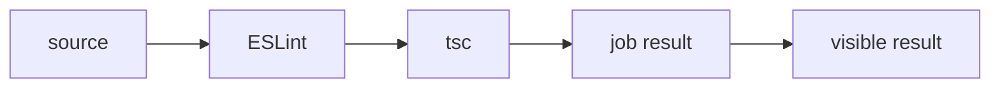

### How it works

1. `source` enters **Static jobs** as the value, event, file, or runtime that needs a decision.
2. `ESLint` applies the rule owned by this section; keep that decision close to its source boundary.
3. `tsc` carries the checked result to the next consumer instead of exposing private setup.
4. `job result` receives the result and makes it visible through markup, output, or an exit code.
5. Exercise the normal path and the failure path at the runtime named by the example.

### Project reading

- **Rule:** Keep static checks early so failed code does not consume browser or deployment time.
- **Failure to catch:** A build hides a simple lint or type error behind a longer job.
- **Evidence:** Lint and type job logs.
- **Owner:** `CI/CD / Field Notes` documents the contract; source files and tests remain the executable reference.
- **Scope:** Read this section with the linked source path in the repository catalog below.

### Example

```yaml
- run: npm run lint
- run: npx tsc --noEmit
```

### Decision table

<table>
  <thead>
    <tr><th>Input</th><th>Project decision</th><th>Check</th></tr>
  </thead>
  <tbody>
    <tr><td>source</td><td>Keep it at the boundary named by the section.</td><td>A focused test or source inspection.</td></tr>
    <tr><td>ESLint</td><td>Use the smallest rule that explains the branch.</td><td>Lint, type check, or browser assertion.</td></tr>
    <tr><td>tsc</td><td>Return a readable value or state.</td><td>Success and failure cases.</td></tr>
    <tr><td>job result</td><td>Expose a semantic or reviewable consumer.</td><td>Role, report, screenshot, or exit code.</td></tr>
  </tbody>
</table>

### Checks

- Inspect the owner for `ESLint` before editing the consumer.
- Assert the successful `tsc` result through the public surface.
- Force the failure branch and confirm it reaches `job result`.
- Record the command and artifact path shown in this guide.

<a id="06--test-job"></a>
## 06 / Test job

The main test job installs Chromium, the headless shell, and Firefox, builds the app, then runs npm test.

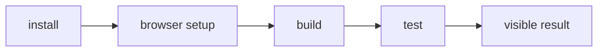

### How it works

1. `install` enters **Test job** as the value, event, file, or runtime that needs a decision.
2. `browser setup` applies the rule owned by this section; keep that decision close to its source boundary.
3. `build` carries the checked result to the next consumer instead of exposing private setup.
4. `test` receives the result and makes it visible through markup, output, or an exit code.
5. Exercise the normal path and the failure path at the runtime named by the example.

### Project reading

- **Rule:** Build before browser tests when the suite expects a production artifact.
- **Failure to catch:** The server starts from stale output or a missing browser binary.
- **Evidence:** Test job log and Playwright report.
- **Owner:** `CI/CD / Field Notes` documents the contract; source files and tests remain the executable reference.
- **Scope:** Read this section with the linked source path in the repository catalog below.

### Example

```yaml
- run: npx playwright install --with-deps chromium chromium-headless-shell firefox
- run: npm run build
- run: npm test
```

### Decision table

<table>
  <thead>
    <tr><th>Input</th><th>Project decision</th><th>Check</th></tr>
  </thead>
  <tbody>
    <tr><td>install</td><td>Keep it at the boundary named by the section.</td><td>A focused test or source inspection.</td></tr>
    <tr><td>browser setup</td><td>Use the smallest rule that explains the branch.</td><td>Lint, type check, or browser assertion.</td></tr>
    <tr><td>build</td><td>Return a readable value or state.</td><td>Success and failure cases.</td></tr>
    <tr><td>test</td><td>Expose a semantic or reviewable consumer.</td><td>Role, report, screenshot, or exit code.</td></tr>
  </tbody>
</table>

### Checks

- Inspect the owner for `browser setup` before editing the consumer.
- Assert the successful `build` result through the public surface.
- Force the failure branch and confirm it reaches `test`.
- Record the command and artifact path shown in this guide.

<a id="07--frontend-qa-job"></a>
## 07 / Frontend QA job

Frontend QA runs lint, types, Jest, Vitest, Browser Mode, build, all Playwright projects, video conversion, Storybook, Lighthouse, and screenshots.

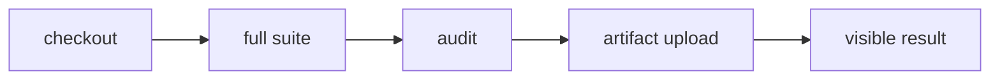

### How it works

1. `checkout` enters **Frontend QA job** as the value, event, file, or runtime that needs a decision.
2. `full suite` applies the rule owned by this section; keep that decision close to its source boundary.
3. `audit` carries the checked result to the next consumer instead of exposing private setup.
4. `artifact upload` receives the result and makes it visible through markup, output, or an exit code.
5. Exercise the normal path and the failure path at the runtime named by the example.

### Project reading

- **Rule:** Use this workflow as the broad browser and audit reference.
- **Failure to catch:** The main CI test job passes while a webkit, Storybook, or Lighthouse step fails elsewhere.
- **Evidence:** frontend-qa-artifacts and job log.
- **Owner:** `CI/CD / Field Notes` documents the contract; source files and tests remain the executable reference.
- **Scope:** Read this section with the linked source path in the repository catalog below.

### Example

```bash
pnpm run test:playwright:all
pnpm run convert:video
pnpm run build-storybook
pnpm exec lhci autorun
```

### Decision table

<table>
  <thead>
    <tr><th>Input</th><th>Project decision</th><th>Check</th></tr>
  </thead>
  <tbody>
    <tr><td>checkout</td><td>Keep it at the boundary named by the section.</td><td>A focused test or source inspection.</td></tr>
    <tr><td>full suite</td><td>Use the smallest rule that explains the branch.</td><td>Lint, type check, or browser assertion.</td></tr>
    <tr><td>audit</td><td>Return a readable value or state.</td><td>Success and failure cases.</td></tr>
    <tr><td>artifact upload</td><td>Expose a semantic or reviewable consumer.</td><td>Role, report, screenshot, or exit code.</td></tr>
  </tbody>
</table>

### Checks

- Inspect the owner for `full suite` before editing the consumer.
- Assert the successful `audit` result through the public surface.
- Force the failure branch and confirm it reaches `artifact upload`.
- Record the command and artifact path shown in this guide.

<a id="08--build-job"></a>
## 08 / Build job

The main build job creates the Next.js artifact and uploads .next, public, package files, and configuration files.

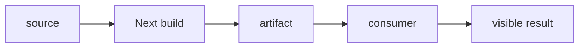

### How it works

1. `source` enters **Build job** as the value, event, file, or runtime that needs a decision.
2. `Next build` applies the rule owned by this section; keep that decision close to its source boundary.
3. `artifact` carries the checked result to the next consumer instead of exposing private setup.
4. `consumer` receives the result and makes it visible through markup, output, or an exit code.
5. Exercise the normal path and the failure path at the runtime named by the example.

### Project reading

- **Rule:** Keep the build artifact list aligned with the deployment consumer.
- **Failure to catch:** A later job receives .next but misses public assets or package metadata.
- **Evidence:** nextjs-build artifact.
- **Owner:** `CI/CD / Field Notes` documents the contract; source files and tests remain the executable reference.
- **Scope:** Read this section with the linked source path in the repository catalog below.

### Example

```yaml
- run: npm run build
- uses: actions/upload-artifact@v4
  with:
    name: nextjs-build
```

### Decision table

<table>
  <thead>
    <tr><th>Input</th><th>Project decision</th><th>Check</th></tr>
  </thead>
  <tbody>
    <tr><td>source</td><td>Keep it at the boundary named by the section.</td><td>A focused test or source inspection.</td></tr>
    <tr><td>Next build</td><td>Use the smallest rule that explains the branch.</td><td>Lint, type check, or browser assertion.</td></tr>
    <tr><td>artifact</td><td>Return a readable value or state.</td><td>Success and failure cases.</td></tr>
    <tr><td>consumer</td><td>Expose a semantic or reviewable consumer.</td><td>Role, report, screenshot, or exit code.</td></tr>
  </tbody>
</table>

### Checks

- Inspect the owner for `Next build` before editing the consumer.
- Assert the successful `artifact` result through the public surface.
- Force the failure branch and confirm it reaches `consumer`.
- Record the command and artifact path shown in this guide.

<a id="09--bundle-analysis"></a>
## 09 / Bundle analysis

Pull requests run ANALYZE=true npm run build and upload .next/analyze for review.

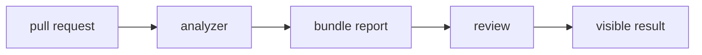

### How it works

1. `pull request` enters **Bundle analysis** as the value, event, file, or runtime that needs a decision.
2. `analyzer` applies the rule owned by this section; keep that decision close to its source boundary.
3. `bundle report` carries the checked result to the next consumer instead of exposing private setup.
4. `review` receives the result and makes it visible through markup, output, or an exit code.
5. Exercise the normal path and the failure path at the runtime named by the example.

### Project reading

- **Rule:** Use bundle output to explain size changes, not as a score without context.
- **Failure to catch:** A dependency adds a large client chunk and no artifact records which import caused it.
- **Evidence:** bundle-analysis artifact.
- **Owner:** `CI/CD / Field Notes` documents the contract; source files and tests remain the executable reference.
- **Scope:** Read this section with the linked source path in the repository catalog below.

### Example

```yaml
if: github.event_name == 'pull_request'
run: ANALYZE=true npm run build
```

### Decision table

<table>
  <thead>
    <tr><th>Input</th><th>Project decision</th><th>Check</th></tr>
  </thead>
  <tbody>
    <tr><td>pull request</td><td>Keep it at the boundary named by the section.</td><td>A focused test or source inspection.</td></tr>
    <tr><td>analyzer</td><td>Use the smallest rule that explains the branch.</td><td>Lint, type check, or browser assertion.</td></tr>
    <tr><td>bundle report</td><td>Return a readable value or state.</td><td>Success and failure cases.</td></tr>
    <tr><td>review</td><td>Expose a semantic or reviewable consumer.</td><td>Role, report, screenshot, or exit code.</td></tr>
  </tbody>
</table>

### Checks

- Inspect the owner for `analyzer` before editing the consumer.
- Assert the successful `bundle report` result through the public surface.
- Force the failure branch and confirm it reaches `review`.
- Record the command and artifact path shown in this guide.

<a id="10--lighthouse-job"></a>
## 10 / Lighthouse job

Pull requests build the app, run lhci autorun, and upload .lighthouseci reports.

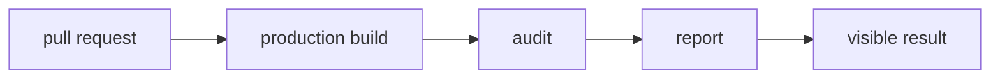

### How it works

1. `pull request` enters **Lighthouse job** as the value, event, file, or runtime that needs a decision.
2. `production build` applies the rule owned by this section; keep that decision close to its source boundary.
3. `audit` carries the checked result to the next consumer instead of exposing private setup.
4. `report` receives the result and makes it visible through markup, output, or an exit code.
5. Exercise the normal path and the failure path at the runtime named by the example.

### Project reading

- **Rule:** Read route scores and blocking assertions together with the source diff.
- **Failure to catch:** A score changes because the server was not ready or a route was omitted.
- **Evidence:** lighthouse-results artifact.
- **Owner:** `CI/CD / Field Notes` documents the contract; source files and tests remain the executable reference.
- **Scope:** Read this section with the linked source path in the repository catalog below.

### Example

```bash
npm run build
lhci autorun
# output: .lighthouseci
```

### Decision table

<table>
  <thead>
    <tr><th>Input</th><th>Project decision</th><th>Check</th></tr>
  </thead>
  <tbody>
    <tr><td>pull request</td><td>Keep it at the boundary named by the section.</td><td>A focused test or source inspection.</td></tr>
    <tr><td>production build</td><td>Use the smallest rule that explains the branch.</td><td>Lint, type check, or browser assertion.</td></tr>
    <tr><td>audit</td><td>Return a readable value or state.</td><td>Success and failure cases.</td></tr>
    <tr><td>report</td><td>Expose a semantic or reviewable consumer.</td><td>Role, report, screenshot, or exit code.</td></tr>
  </tbody>
</table>

### Checks

- Inspect the owner for `production build` before editing the consumer.
- Assert the successful `audit` result through the public surface.
- Force the failure branch and confirm it reaches `report`.
- Record the command and artifact path shown in this guide.

<a id="11--codeql"></a>
## 11 / CodeQL

CodeQL initializes a matrix for JavaScript and TypeScript, then uploads analysis results for repository review.

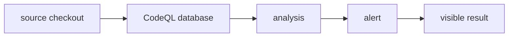

### How it works

1. `source checkout` enters **CodeQL** as the value, event, file, or runtime that needs a decision.
2. `CodeQL database` applies the rule owned by this section; keep that decision close to its source boundary.
3. `analysis` carries the checked result to the next consumer instead of exposing private setup.
4. `alert` receives the result and makes it visible through markup, output, or an exit code.
5. Exercise the normal path and the failure path at the runtime named by the example.

### Project reading

- **Rule:** Keep the language matrix aligned with the code in the repository.
- **Failure to catch:** A workflow says it scans the app but the matrix omits the language used by a changed file.
- **Evidence:** CodeQL run and alert details.
- **Owner:** `CI/CD / Field Notes` documents the contract; source files and tests remain the executable reference.
- **Scope:** Read this section with the linked source path in the repository catalog below.

### Example

```yaml
strategy:
  matrix:
    language: ["javascript-typescript"]
```

### Decision table

<table>
  <thead>
    <tr><th>Input</th><th>Project decision</th><th>Check</th></tr>
  </thead>
  <tbody>
    <tr><td>source checkout</td><td>Keep it at the boundary named by the section.</td><td>A focused test or source inspection.</td></tr>
    <tr><td>CodeQL database</td><td>Use the smallest rule that explains the branch.</td><td>Lint, type check, or browser assertion.</td></tr>
    <tr><td>analysis</td><td>Return a readable value or state.</td><td>Success and failure cases.</td></tr>
    <tr><td>alert</td><td>Expose a semantic or reviewable consumer.</td><td>Role, report, screenshot, or exit code.</td></tr>
  </tbody>
</table>

### Checks

- Inspect the owner for `CodeQL database` before editing the consumer.
- Assert the successful `analysis` result through the public surface.
- Force the failure branch and confirm it reaches `alert`.
- Record the command and artifact path shown in this guide.

<a id="12--dependency-updates"></a>
## 12 / Dependency updates

The scheduled dependency workflow updates packages, runs install and test commands, then opens a pull request.

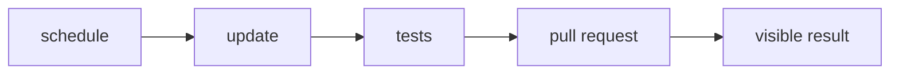

### How it works

1. `schedule` enters **Dependency updates** as the value, event, file, or runtime that needs a decision.
2. `update` applies the rule owned by this section; keep that decision close to its source boundary.
3. `tests` carries the checked result to the next consumer instead of exposing private setup.
4. `pull request` receives the result and makes it visible through markup, output, or an exit code.
5. Exercise the normal path and the failure path at the runtime named by the example.

### Project reading

- **Rule:** Dependency updates need the same core checks as a manual package change.
- **Failure to catch:** A lockfile update opens a PR with no test or build evidence.
- **Evidence:** Dependency PR and workflow logs.
- **Owner:** `CI/CD / Field Notes` documents the contract; source files and tests remain the executable reference.
- **Scope:** Read this section with the linked source path in the repository catalog below.

### Example

```yaml
schedule:
  - cron: '0 4 * * 1'

pnpm install --frozen-lockfile
pnpm test
```

### Decision table

<table>
  <thead>
    <tr><th>Input</th><th>Project decision</th><th>Check</th></tr>
  </thead>
  <tbody>
    <tr><td>schedule</td><td>Keep it at the boundary named by the section.</td><td>A focused test or source inspection.</td></tr>
    <tr><td>update</td><td>Use the smallest rule that explains the branch.</td><td>Lint, type check, or browser assertion.</td></tr>
    <tr><td>tests</td><td>Return a readable value or state.</td><td>Success and failure cases.</td></tr>
    <tr><td>pull request</td><td>Expose a semantic or reviewable consumer.</td><td>Role, report, screenshot, or exit code.</td></tr>
  </tbody>
</table>

### Checks

- Inspect the owner for `update` before editing the consumer.
- Assert the successful `tests` result through the public surface.
- Force the failure branch and confirm it reaches `pull request`.
- Record the command and artifact path shown in this guide.

<a id="13--docker-workflow"></a>
## 13 / Docker workflow

Pull requests build and smoke test an image; non-PR refs push the image, scan it with Trivy, and upload SARIF.

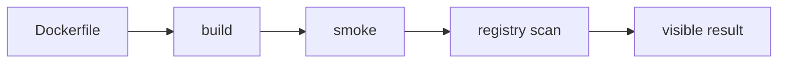

### How it works

1. `Dockerfile` enters **Docker workflow** as the value, event, file, or runtime that needs a decision.
2. `build` applies the rule owned by this section; keep that decision close to its source boundary.
3. `smoke` carries the checked result to the next consumer instead of exposing private setup.
4. `registry scan` receives the result and makes it visible through markup, output, or an exit code.
5. Exercise the normal path and the failure path at the runtime named by the example.

### Project reading

- **Rule:** Keep push and scan conditions visible because PRs and branch builds have different outputs.
- **Failure to catch:** A PR publishes an image or a branch build skips the image security report.
- **Evidence:** Docker job log and SARIF artifact.
- **Owner:** `CI/CD / Field Notes` documents the contract; source files and tests remain the executable reference.
- **Scope:** Read this section with the linked source path in the repository catalog below.

### Example

```bash
docker run --detach --name portfolio-qa-smoke --publish 3000:3000 portfolio-qa:pr
curl --fail http://127.0.0.1:3000/api/health
```

### Decision table

<table>
  <thead>
    <tr><th>Input</th><th>Project decision</th><th>Check</th></tr>
  </thead>
  <tbody>
    <tr><td>Dockerfile</td><td>Keep it at the boundary named by the section.</td><td>A focused test or source inspection.</td></tr>
    <tr><td>build</td><td>Use the smallest rule that explains the branch.</td><td>Lint, type check, or browser assertion.</td></tr>
    <tr><td>smoke</td><td>Return a readable value or state.</td><td>Success and failure cases.</td></tr>
    <tr><td>registry scan</td><td>Expose a semantic or reviewable consumer.</td><td>Role, report, screenshot, or exit code.</td></tr>
  </tbody>
</table>

### Checks

- Inspect the owner for `build` before editing the consumer.
- Assert the successful `smoke` result through the public surface.
- Force the failure branch and confirm it reaches `registry scan`.
- Record the command and artifact path shown in this guide.

<a id="14--deployment"></a>
## 14 / Deployment

The deployment workflow builds, pulls production environment values, builds Vercel artifacts, deploys prebuilt output, and creates tag releases.

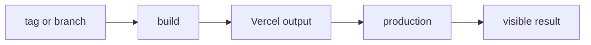

### How it works

1. `tag or branch` enters **Deployment** as the value, event, file, or runtime that needs a decision.
2. `build` applies the rule owned by this section; keep that decision close to its source boundary.
3. `Vercel output` carries the checked result to the next consumer instead of exposing private setup.
4. `production` receives the result and makes it visible through markup, output, or an exit code.
5. Exercise the normal path and the failure path at the runtime named by the example.

### Project reading

- **Rule:** Keep deployment steps after build and quality jobs so a failed source does not reach production.
- **Failure to catch:** A deployment receives environment values or artifacts that were never validated by the same commit.
- **Evidence:** Deployment log, success marker, or failure output.
- **Owner:** `CI/CD / Field Notes` documents the contract; source files and tests remain the executable reference.
- **Scope:** Read this section with the linked source path in the repository catalog below.

### Example

```bash
npm run build
vercel pull --yes --environment=production
vercel build --prod
vercel deploy --prebuilt --prod
```

### Decision table

<table>
  <thead>
    <tr><th>Input</th><th>Project decision</th><th>Check</th></tr>
  </thead>
  <tbody>
    <tr><td>tag or branch</td><td>Keep it at the boundary named by the section.</td><td>A focused test or source inspection.</td></tr>
    <tr><td>build</td><td>Use the smallest rule that explains the branch.</td><td>Lint, type check, or browser assertion.</td></tr>
    <tr><td>Vercel output</td><td>Return a readable value or state.</td><td>Success and failure cases.</td></tr>
    <tr><td>production</td><td>Expose a semantic or reviewable consumer.</td><td>Role, report, screenshot, or exit code.</td></tr>
  </tbody>
</table>

### Checks

- Inspect the owner for `build` before editing the consumer.
- Assert the successful `Vercel output` result through the public surface.
- Force the failure branch and confirm it reaches `production`.
- Record the command and artifact path shown in this guide.

<a id="15--secrets-and-permissions"></a>
## 15 / Secrets and permissions

Workflow permissions and secrets decide which jobs can read, publish, scan, or deploy.

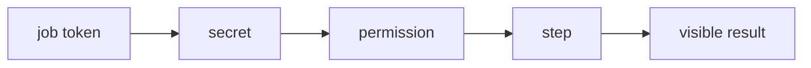

### How it works

1. `job token` enters **Secrets and permissions** as the value, event, file, or runtime that needs a decision.
2. `secret` applies the rule owned by this section; keep that decision close to its source boundary.
3. `permission` carries the checked result to the next consumer instead of exposing private setup.
4. `step` receives the result and makes it visible through markup, output, or an exit code.
5. Exercise the normal path and the failure path at the runtime named by the example.

### Project reading

- **Rule:** Give a job only the permission needed for its output.
- **Failure to catch:** A read-only job can publish packages or a deploy step runs without the required secret.
- **Evidence:** Workflow YAML review and masked log output.
- **Owner:** `CI/CD / Field Notes` documents the contract; source files and tests remain the executable reference.
- **Scope:** Read this section with the linked source path in the repository catalog below.

### Example

```yaml
permissions:
  contents: read
  packages: write
```

### Decision table

<table>
  <thead>
    <tr><th>Input</th><th>Project decision</th><th>Check</th></tr>
  </thead>
  <tbody>
    <tr><td>job token</td><td>Keep it at the boundary named by the section.</td><td>A focused test or source inspection.</td></tr>
    <tr><td>secret</td><td>Use the smallest rule that explains the branch.</td><td>Lint, type check, or browser assertion.</td></tr>
    <tr><td>permission</td><td>Return a readable value or state.</td><td>Success and failure cases.</td></tr>
    <tr><td>step</td><td>Expose a semantic or reviewable consumer.</td><td>Role, report, screenshot, or exit code.</td></tr>
  </tbody>
</table>

### Checks

- Inspect the owner for `secret` before editing the consumer.
- Assert the successful `permission` result through the public surface.
- Force the failure branch and confirm it reaches `step`.
- Record the command and artifact path shown in this guide.

<a id="16--local-parity"></a>
## 16 / Local parity

Local commands should mirror the workflow that owns the check, including package manager, runtime, browsers, and environment.

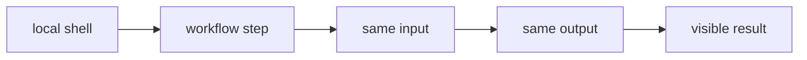

### How it works

1. `local shell` enters **Local parity** as the value, event, file, or runtime that needs a decision.
2. `workflow step` applies the rule owned by this section; keep that decision close to its source boundary.
3. `same input` carries the checked result to the next consumer instead of exposing private setup.
4. `same output` receives the result and makes it visible through markup, output, or an exit code.
5. Exercise the normal path and the failure path at the runtime named by the example.

### Project reading

- **Rule:** Start with the failing job and copy its exact command before trying variants.
- **Failure to catch:** A different command creates a second failure that is unrelated to CI.
- **Evidence:** Local command, workflow command, and exit codes.
- **Owner:** `CI/CD / Field Notes` documents the contract; source files and tests remain the executable reference.
- **Scope:** Read this section with the linked source path in the repository catalog below.

### Example

```bash
pnpm run lint
pnpm exec tsc --noEmit
pnpm run test:playwright:all
```

### Decision table

<table>
  <thead>
    <tr><th>Input</th><th>Project decision</th><th>Check</th></tr>
  </thead>
  <tbody>
    <tr><td>local shell</td><td>Keep it at the boundary named by the section.</td><td>A focused test or source inspection.</td></tr>
    <tr><td>workflow step</td><td>Use the smallest rule that explains the branch.</td><td>Lint, type check, or browser assertion.</td></tr>
    <tr><td>same input</td><td>Return a readable value or state.</td><td>Success and failure cases.</td></tr>
    <tr><td>same output</td><td>Expose a semantic or reviewable consumer.</td><td>Role, report, screenshot, or exit code.</td></tr>
  </tbody>
</table>

### Checks

- Inspect the owner for `workflow step` before editing the consumer.
- Assert the successful `same input` result through the public surface.
- Force the failure branch and confirm it reaches `same output`.
- Record the command and artifact path shown in this guide.

<a id="17--ci-review-checklist"></a>
## 17 / CI review checklist

Review CI changes for trigger scope, runtime, install, command order, conditions, artifacts, permissions, and secrets.

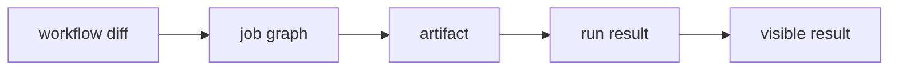

### How it works

1. `workflow diff` enters **CI review checklist** as the value, event, file, or runtime that needs a decision.
2. `job graph` applies the rule owned by this section; keep that decision close to its source boundary.
3. `artifact` carries the checked result to the next consumer instead of exposing private setup.
4. `run result` receives the result and makes it visible through markup, output, or an exit code.
5. Exercise the normal path and the failure path at the runtime named by the example.

### Project reading

- **Rule:** Treat workflow files as executable code and test the smallest changed path.
- **Failure to catch:** A YAML edit parses but changes a condition or artifact path silently.
- **Evidence:** Diff review plus a workflow run.
- **Owner:** `CI/CD / Field Notes` documents the contract; source files and tests remain the executable reference.
- **Scope:** Read this section with the linked source path in the repository catalog below.

### Example

```ts
const ciReview = ['trigger', 'runtime', 'install', 'order', 'condition', 'artifact', 'permissions'];
```

### Decision table

<table>
  <thead>
    <tr><th>Input</th><th>Project decision</th><th>Check</th></tr>
  </thead>
  <tbody>
    <tr><td>workflow diff</td><td>Keep it at the boundary named by the section.</td><td>A focused test or source inspection.</td></tr>
    <tr><td>job graph</td><td>Use the smallest rule that explains the branch.</td><td>Lint, type check, or browser assertion.</td></tr>
    <tr><td>artifact</td><td>Return a readable value or state.</td><td>Success and failure cases.</td></tr>
    <tr><td>run result</td><td>Expose a semantic or reviewable consumer.</td><td>Role, report, screenshot, or exit code.</td></tr>
  </tbody>
</table>

### Checks

- Inspect the owner for `job graph` before editing the consumer.
- Assert the successful `artifact` result through the public surface.
- Force the failure branch and confirm it reaches `run result`.
- Record the command and artifact path shown in this guide.

<a id="repository-map"></a>
<h1 align="center">
   Repository map
</h1>

The catalog is intentionally concrete. Use it to jump from a concept to the source or test that implements it.

<table>
  <thead>
    <tr><th>Area</th><th>Paths</th><th>Read for</th></tr>
  </thead>
  <tbody>
    <tr><td>Application</td><td>`src/app/`</td><td>Routes, layouts, metadata, and API handlers.</td></tr>
    <tr><td>Components</td><td>`src/components/`</td><td>React composition, effects, UI, and project surfaces.</td></tr>
    <tr><td>Tests</td><td>`tests/` and `src/**/tests/`</td><td>Runner-specific behavior and boundary cases.</td></tr>
    <tr><td>Scripts</td><td>`scripts/tests/` and `scripts/qa/`</td><td>Quality reports, server startup, screenshots, and video conversion.</td></tr>
    <tr><td>Automation</td><td>`.github/workflows/`</td><td>CI triggers, jobs, artifacts, and delivery.</td></tr>
  </tbody>
</table>


<table>
  <thead>
    <tr><th>Path</th><th>Relation to this guide</th><th>Open with</th></tr>
  </thead>
  <tbody>
    <tr><td><code>.github/workflows/ci.yml</code></td><td>Automation or delivery boundary.</td><td>`ci.md` or the workflow job log.</td></tr>
    <tr><td><code>.github/workflows/codeql.yml</code></td><td>Automation or delivery boundary.</td><td>`ci.md` or the workflow job log.</td></tr>
    <tr><td><code>.github/workflows/dependencies.yml</code></td><td>Automation or delivery boundary.</td><td>`ci.md` or the workflow job log.</td></tr>
    <tr><td><code>.github/workflows/deploy.yml</code></td><td>Automation or delivery boundary.</td><td>`ci.md` or the workflow job log.</td></tr>
    <tr><td><code>.github/workflows/docker.yml</code></td><td>Automation or delivery boundary.</td><td>`ci.md` or the workflow job log.</td></tr>
    <tr><td><code>.github/workflows/frontend-qa.yml</code></td><td>Automation or delivery boundary.</td><td>`ci.md` or the workflow job log.</td></tr>
    <tr><td><code>.storybook/main.ts</code></td><td>Application source, typed component, or style rule.</td><td>The nearest test and route.</td></tr>
    <tr><td><code>README.md</code></td><td>Project configuration or documentation entry point.</td><td>The command that consumes it.</td></tr>
    <tr><td><code>jest.config.js</code></td><td>Project configuration or documentation entry point.</td><td>The command that consumes it.</td></tr>
    <tr><td><code>lighthouserc.js</code></td><td>Project configuration or documentation entry point.</td><td>The command that consumes it.</td></tr>
    <tr><td><code>package.json</code></td><td>Project configuration or documentation entry point.</td><td>The command that consumes it.</td></tr>
    <tr><td><code>playwright.config.ts</code></td><td>Application source, typed component, or style rule.</td><td>The nearest test and route.</td></tr>
    <tr><td><code>scripts/qa/capture-lighthouse-screenshots.mjs</code></td><td>QA runtime helper or evidence producer.</td><td>`testing.md` or `qa.md`.</td></tr>
    <tr><td><code>scripts/qa/convert-playwright-video.mjs</code></td><td>QA runtime helper or evidence producer.</td><td>`testing.md` or `qa.md`.</td></tr>
    <tr><td><code>scripts/qa/start-production.mjs</code></td><td>QA runtime helper or evidence producer.</td><td>`testing.md` or `qa.md`.</td></tr>
    <tr><td><code>scripts/tests/benchmark.mjs</code></td><td>Behavior check or test fixture.</td><td>The related source module.</td></tr>
    <tr><td><code>scripts/tests/benchmark.node-test.mjs</code></td><td>Behavior check or test fixture.</td><td>The related source module.</td></tr>
    <tr><td><code>scripts/tests/check-file-size.mjs</code></td><td>Behavior check or test fixture.</td><td>The related source module.</td></tr>
    <tr><td><code>scripts/tests/check-file-size.node-test.mjs</code></td><td>Behavior check or test fixture.</td><td>The related source module.</td></tr>
    <tr><td><code>scripts/tests/file-size-policy.mjs</code></td><td>Behavior check or test fixture.</td><td>The related source module.</td></tr>
    <tr><td><code>scripts/tests/jscpd.mjs</code></td><td>Behavior check or test fixture.</td><td>The related source module.</td></tr>
    <tr><td><code>scripts/tests/jscpd.node-test.mjs</code></td><td>Behavior check or test fixture.</td><td>The related source module.</td></tr>
    <tr><td><code>scripts/tests/quality-metrics.mjs</code></td><td>Behavior check or test fixture.</td><td>The related source module.</td></tr>
    <tr><td><code>scripts/tests/quality-metrics.node-test.mjs</code></td><td>Behavior check or test fixture.</td><td>The related source module.</td></tr>
    <tr><td><code>scripts/tests/quality-policy.mjs</code></td><td>Behavior check or test fixture.</td><td>The related source module.</td></tr>
    <tr><td><code>scripts/tests/quality-report.mjs</code></td><td>Behavior check or test fixture.</td><td>The related source module.</td></tr>
    <tr><td><code>scripts/tests/quality-report.node-test.mjs</code></td><td>Behavior check or test fixture.</td><td>The related source module.</td></tr>
    <tr><td><code>scripts/tests/quality-review.mjs</code></td><td>Behavior check or test fixture.</td><td>The related source module.</td></tr>
    <tr><td><code>scripts/tests/quality-review.node-test.mjs</code></td><td>Behavior check or test fixture.</td><td>The related source module.</td></tr>
    <tr><td><code>scripts/tests/quality-security.mjs</code></td><td>Behavior check or test fixture.</td><td>The related source module.</td></tr>
    <tr><td><code>src/app/[locale]/[...not-found]/page.tsx</code></td><td>Application source, typed component, or style rule.</td><td>The nearest test and route.</td></tr>
    <tr><td><code>src/app/[locale]/about/layout.tsx</code></td><td>Application source, typed component, or style rule.</td><td>The nearest test and route.</td></tr>
    <tr><td><code>src/app/[locale]/about/page.tsx</code></td><td>Application source, typed component, or style rule.</td><td>The nearest test and route.</td></tr>
    <tr><td><code>src/app/[locale]/certifications/layout.tsx</code></td><td>Application source, typed component, or style rule.</td><td>The nearest test and route.</td></tr>
    <tr><td><code>src/app/[locale]/certifications/page.tsx</code></td><td>Application source, typed component, or style rule.</td><td>The nearest test and route.</td></tr>
    <tr><td><code>src/app/[locale]/chat/layout.tsx</code></td><td>Application source, typed component, or style rule.</td><td>The nearest test and route.</td></tr>
    <tr><td><code>src/app/[locale]/chat/page.tsx</code></td><td>Application source, typed component, or style rule.</td><td>The nearest test and route.</td></tr>
    <tr><td><code>src/app/[locale]/contact/layout.tsx</code></td><td>Application source, typed component, or style rule.</td><td>The nearest test and route.</td></tr>
    <tr><td><code>src/app/[locale]/contact/page.tsx</code></td><td>Application source, typed component, or style rule.</td><td>The nearest test and route.</td></tr>
    <tr><td><code>src/app/[locale]/layout.tsx</code></td><td>Application source, typed component, or style rule.</td><td>The nearest test and route.</td></tr>
    <tr><td><code>src/app/[locale]/not-found.tsx</code></td><td>Application source, typed component, or style rule.</td><td>The nearest test and route.</td></tr>
    <tr><td><code>src/app/[locale]/page.tsx</code></td><td>Application source, typed component, or style rule.</td><td>The nearest test and route.</td></tr>
    <tr><td><code>src/app/[locale]/projects/layout.tsx</code></td><td>Application source, typed component, or style rule.</td><td>The nearest test and route.</td></tr>
    <tr><td><code>src/app/[locale]/projects/page.tsx</code></td><td>Application source, typed component, or style rule.</td><td>The nearest test and route.</td></tr>
    <tr><td><code>src/app/[locale]/tests/pages.test.tsx</code></td><td>Behavior check or test fixture.</td><td>The related source module.</td></tr>
    <tr><td><code>src/app/api/auth/[...nextauth]/route.ts</code></td><td>Application source, typed component, or style rule.</td><td>The nearest test and route.</td></tr>
    <tr><td><code>src/app/api/chat/messages/route.ts</code></td><td>Application source, typed component, or style rule.</td><td>The nearest test and route.</td></tr>
    <tr><td><code>src/app/api/github/repos/[owner]/[repo]/readme/route.ts</code></td><td>Application source, typed component, or style rule.</td><td>The nearest test and route.</td></tr>
    <tr><td><code>src/app/api/github/repos/[owner]/[repo]/readme/tests/route.test.ts</code></td><td>Behavior check or test fixture.</td><td>The related source module.</td></tr>
    <tr><td><code>src/app/api/github/repos/route.ts</code></td><td>Application source, typed component, or style rule.</td><td>The nearest test and route.</td></tr>
    <tr><td><code>src/app/api/github/repos/tests/route-branches.test.ts</code></td><td>Behavior check or test fixture.</td><td>The related source module.</td></tr>
    <tr><td><code>src/app/api/github/repos/tests/route.test.ts</code></td><td>Behavior check or test fixture.</td><td>The related source module.</td></tr>
    <tr><td><code>src/app/api/github/stats/route.ts</code></td><td>Application source, typed component, or style rule.</td><td>The nearest test and route.</td></tr>
    <tr><td><code>src/app/api/health/route.ts</code></td><td>Application source, typed component, or style rule.</td><td>The nearest test and route.</td></tr>
    <tr><td><code>src/app/api/tests/uncovered-routes.test.ts</code></td><td>Behavior check or test fixture.</td><td>The related source module.</td></tr>
    <tr><td><code>src/app/api/upload/route.ts</code></td><td>Application source, typed component, or style rule.</td><td>The nearest test and route.</td></tr>
    <tr><td><code>src/app/api/visitors/route.ts</code></td><td>Application source, typed component, or style rule.</td><td>The nearest test and route.</td></tr>
    <tr><td><code>src/app/api/youtube/config/route.ts</code></td><td>Application source, typed component, or style rule.</td><td>The nearest test and route.</td></tr>
    <tr><td><code>src/app/globals.css</code></td><td>Application source, typed component, or style rule.</td><td>The nearest test and route.</td></tr>
    <tr><td><code>src/app/layout.tsx</code></td><td>Application source, typed component, or style rule.</td><td>The nearest test and route.</td></tr>
    <tr><td><code>src/app/page.tsx</code></td><td>Application source, typed component, or style rule.</td><td>The nearest test and route.</td></tr>
    <tr><td><code>src/app/robots.ts</code></td><td>Application source, typed component, or style rule.</td><td>The nearest test and route.</td></tr>
    <tr><td><code>src/app/sitemap.ts</code></td><td>Application source, typed component, or style rule.</td><td>The nearest test and route.</td></tr>
    <tr><td><code>src/app/tests/shell.test.tsx</code></td><td>Behavior check or test fixture.</td><td>The related source module.</td></tr>
    <tr><td><code>src/components/about/AboutParticleField.tsx</code></td><td>Application source, typed component, or style rule.</td><td>The nearest test and route.</td></tr>
    <tr><td><code>src/components/about/AboutScrollStory.tsx</code></td><td>Application source, typed component, or style rule.</td><td>The nearest test and route.</td></tr>
    <tr><td><code>src/components/about/InteractiveExpertiseGrid.tsx</code></td><td>Application source, typed component, or style rule.</td><td>The nearest test and route.</td></tr>
    <tr><td><code>src/components/chat/ChatEffects.tsx</code></td><td>Application source, typed component, or style rule.</td><td>The nearest test and route.</td></tr>
    <tr><td><code>src/components/chat/ChatRoom.tsx</code></td><td>Application source, typed component, or style rule.</td><td>The nearest test and route.</td></tr>
    <tr><td><code>src/components/contact/ClickSpark.tsx</code></td><td>Application source, typed component, or style rule.</td><td>The nearest test and route.</td></tr>
    <tr><td><code>src/components/contact/Contact.tsx</code></td><td>Application source, typed component, or style rule.</td><td>The nearest test and route.</td></tr>
    <tr><td><code>src/components/contact/ContactCommandForm.tsx</code></td><td>Application source, typed component, or style rule.</td><td>The nearest test and route.</td></tr>
    <tr><td><code>src/components/effects/HexagonGrid.tsx</code></td><td>Application source, typed component, or style rule.</td><td>The nearest test and route.</td></tr>
    <tr><td><code>src/components/effects/LetterGlitch.tsx</code></td><td>Application source, typed component, or style rule.</td><td>The nearest test and route.</td></tr>
    <tr><td><code>src/components/effects/MatrixBackground.tsx</code></td><td>Application source, typed component, or style rule.</td><td>The nearest test and route.</td></tr>
    <tr><td><code>src/components/effects/ParticleBackground.tsx</code></td><td>Application source, typed component, or style rule.</td><td>The nearest test and route.</td></tr>
    <tr><td><code>src/components/effects/ScrollEffect.tsx</code></td><td>Application source, typed component, or style rule.</td><td>The nearest test and route.</td></tr>
    <tr><td><code>src/components/effects/ScrollProgress.tsx</code></td><td>Application source, typed component, or style rule.</td><td>The nearest test and route.</td></tr>
    <tr><td><code>src/components/effects/ScrollReveal.tsx</code></td><td>Application source, typed component, or style rule.</td><td>The nearest test and route.</td></tr>
    <tr><td><code>src/components/effects/ScrollVelocityRibbon.tsx</code></td><td>Application source, typed component, or style rule.</td><td>The nearest test and route.</td></tr>
    <tr><td><code>src/components/home/BongoCat.tsx</code></td><td>Application source, typed component, or style rule.</td><td>The nearest test and route.</td></tr>
    <tr><td><code>src/components/home/CapabilityRail.tsx</code></td><td>Application source, typed component, or style rule.</td><td>The nearest test and route.</td></tr>
    <tr><td><code>src/components/home/Hero.tsx</code></td><td>Application source, typed component, or style rule.</td><td>The nearest test and route.</td></tr>
    <tr><td><code>src/components/home/MetricsTicker.tsx</code></td><td>Application source, typed component, or style rule.</td><td>The nearest test and route.</td></tr>
    <tr><td><code>src/components/home/Skills.tsx</code></td><td>Application source, typed component, or style rule.</td><td>The nearest test and route.</td></tr>
    <tr><td><code>src/components/home/TechCarousel.tsx</code></td><td>Application source, typed component, or style rule.</td><td>The nearest test and route.</td></tr>
    <tr><td><code>src/components/home/bongo-cat-styles.ts</code></td><td>Application source, typed component, or style rule.</td><td>The nearest test and route.</td></tr>
    <tr><td><code>src/components/layout/DynamicFavicon.tsx</code></td><td>Application source, typed component, or style rule.</td><td>The nearest test and route.</td></tr>
    <tr><td><code>src/components/layout/LanguageSwitcher.tsx</code></td><td>Application source, typed component, or style rule.</td><td>The nearest test and route.</td></tr>
    <tr><td><code>src/components/layout/Navigation.tsx</code></td><td>Application source, typed component, or style rule.</td><td>The nearest test and route.</td></tr>
    <tr><td><code>src/components/layout/PageTransition.tsx</code></td><td>Application source, typed component, or style rule.</td><td>The nearest test and route.</td></tr>
    <tr><td><code>src/components/layout/PageTransitionOverlay.tsx</code></td><td>Application source, typed component, or style rule.</td><td>The nearest test and route.</td></tr>
    <tr><td><code>src/components/layout/ThemeProvider.tsx</code></td><td>Application source, typed component, or style rule.</td><td>The nearest test and route.</td></tr>
    <tr><td><code>src/components/layout/ThemeToggle.tsx</code></td><td>Application source, typed component, or style rule.</td><td>The nearest test and route.</td></tr>
    <tr><td><code>src/components/layout/page-transition-config.ts</code></td><td>Application source, typed component, or style rule.</td><td>The nearest test and route.</td></tr>
    <tr><td><code>src/components/loading-screen/GameLoadingScreen.css</code></td><td>Application source, typed component, or style rule.</td><td>The nearest test and route.</td></tr>
    <tr><td><code>src/components/loading-screen/GameLoadingScreen.tsx</code></td><td>Application source, typed component, or style rule.</td><td>The nearest test and route.</td></tr>
    <tr><td><code>src/components/loading-screen/LoadingScreenDemo.tsx</code></td><td>Application source, typed component, or style rule.</td><td>The nearest test and route.</td></tr>
    <tr><td><code>src/components/loading-screen/MatrixRain.tsx</code></td><td>Application source, typed component, or style rule.</td><td>The nearest test and route.</td></tr>
    <tr><td><code>src/components/loading-screen/SoloLevelingBoot.tsx</code></td><td>Application source, typed component, or style rule.</td><td>The nearest test and route.</td></tr>
    <tr><td><code>src/components/loading-screen/loadingMessages.ts</code></td><td>Application source, typed component, or style rule.</td><td>The nearest test and route.</td></tr>
    <tr><td><code>src/components/loading-screen/solo-leveling-boot-styles.ts</code></td><td>Application source, typed component, or style rule.</td><td>The nearest test and route.</td></tr>
    <tr><td><code>src/components/media/BackgroundMusic.tsx</code></td><td>Application source, typed component, or style rule.</td><td>The nearest test and route.</td></tr>
    <tr><td><code>src/components/projects/CityMap.tsx</code></td><td>Application source, typed component, or style rule.</td><td>The nearest test and route.</td></tr>
    <tr><td><code>src/components/projects/GitHubProjects.tsx</code></td><td>Application source, typed component, or style rule.</td><td>The nearest test and route.</td></tr>
    <tr><td><code>src/components/projects/ImageSlideshow.tsx</code></td><td>Application source, typed component, or style rule.</td><td>The nearest test and route.</td></tr>
    <tr><td><code>src/components/projects/LivePreview.tsx</code></td><td>Application source, typed component, or style rule.</td><td>The nearest test and route.</td></tr>
    <tr><td><code>src/components/projects/ProjectCardParts.tsx</code></td><td>Application source, typed component, or style rule.</td><td>The nearest test and route.</td></tr>
    <tr><td><code>src/components/projects/ProjectReadmeModal.tsx</code></td><td>Application source, typed component, or style rule.</td><td>The nearest test and route.</td></tr>
    <tr><td><code>src/components/projects/SoloLevelingProjectCard.tsx</code></td><td>Application source, typed component, or style rule.</td><td>The nearest test and route.</td></tr>
  </tbody>
</table>

<a id="command-matrix"></a>
<h1 align="center">
   Command matrix
</h1>

<table>
  <thead>
    <tr><th>Command</th><th>Script</th><th>Proof</th></tr>
  </thead>
  <tbody>
    <tr><td>Main CI</td><td>`npm test`</td><td>Workflow test job</td></tr>
    <tr><td>Frontend QA</td><td>`pnpm run test:playwright:all`</td><td>All browser projects</td></tr>
    <tr><td>Deploy</td><td>`npm run build`</td><td>Production build job</td></tr>
    <tr><td>Container</td><td>`curl --fail /api/health`</td><td>Docker smoke</td></tr>
  </tbody>
</table>

### Command rules

- Use `pnpm` locally when the change is covered by the pnpm lockfile.
- Run `pnpm run docs:check` after changing any guide or README link.
- Use the exact workflow command when reproducing CI.
- Keep snapshot updates explicit and review the diff.
- Run the build before browser checks that depend on production output.
- Record failures with the exit code and artifact path.

<a id="evidence-and-troubleshooting"></a>
<h1 align="center">
   Evidence and troubleshooting
</h1>

<table>
  <thead>
    <tr><th>Symptom</th><th>First inspection</th><th>Next command</th></tr>
  </thead>
  <tbody>
    <tr><td>Compiler error</td><td>`tsconfig.json` and the first diagnostic</td><td>`pnpm exec tsc --noEmit`</td></tr>
    <tr><td>Test not found</td><td>Runner include pattern and test path</td><td>`pnpm run test:scripts` or the runner command</td></tr>
    <tr><td>Browser startup</td><td>Installed browser and server URL</td><td>`pnpm exec playwright install --with-deps chromium`</td></tr>
    <tr><td>Visual diff</td><td>Font, viewport, theme, and animated layer</td><td>`pnpm run test:visual`</td></tr>
    <tr><td>Missing report</td><td>Output path and upload step</td><td>`find reports coverage playwright-report test-results .lighthouseci -maxdepth 2 -type f`</td></tr>
    <tr><td>CI-only failure</td><td>Node, package manager, env, and browser matrix</td><td>Copy the workflow command locally</td></tr>
  </tbody>
</table>

### Evidence record

- Command: `<exact command>`
- Input: `<changed path or fixture>`
- Result: `<literal summary>`
- Exit code: `<0 or failure code>`
- Artifact: `<path or none>`
- Follow-up: `<source fix, test fix, or environment fix>`

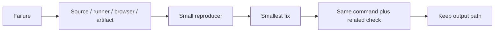

### Stop conditions

- Stop changing source when the failure is a missing runtime dependency.
- Stop updating snapshots when the diff has an unexplained content change.
- Stop widening types when the input has no runtime guard.
- Stop adding waits when the test has an ownership or cleanup bug.
- Stop after the requested behavior and rollback path have a passing check.

<a id="references"></a>
<h1 align="center">
   References
</h1>

- https://docs.github.com/en/actions
- https://docs.github.com/en/actions/using-workflows
- https://vercel.com/docs/deployments
- [Project README](../README.md)
- [Package scripts](../package.json)
- [GitHub Actions workflows](../.github/workflows/)

<details>
  <summary>Review checklist</summary>

- [ ] Source owner is named.
- [ ] Runtime boundary is named.
- [ ] Success and failure states are described.
- [ ] Example matches current project syntax.
- [ ] Focused check ran.
- [ ] Related browser or quality check ran.
- [ ] Evidence path is recorded.
- [ ] README link resolves.

</details>

---
