<div align="center">

<h1 align="center">
  
  CSS / Field Notes
</h1>

Tokens, layout, themes, motion, and paint rules used by the interface.

<a href="react.md">React docs</a>  <a href="jsx.md">JSX docs</a>  <a href="qa.md">QA docs</a>  <a href="../README.md">README</a>

</div>

---

<p align="center">
  
  
  
  
  
</p>

<table>
  <thead>
    <tr><th>Topic</th><th>Project baseline</th><th>Use it for</th></tr>
  </thead>
  <tbody>
    <tr><td>Global layer</td><td>src/app/globals.css</td><td>Tokens, themes, effects, and shared selectors.</td></tr>
    <tr><td>Utilities</td><td>Tailwind CSS 3.4.x</td><td>Local layout and responsive variants in JSX.</td></tr>
    <tr><td>Themes</td><td>dark + light</td><td>The light class swaps variables and selected rules.</td></tr>
    <tr><td>Evidence</td><td>visual + browser</td><td>Screenshots pair with interaction and preference checks.</td></tr>
  </tbody>
</table>

## Contents

- [01 / Cascade order](#01--cascade-order)
- [02 / Design tokens](#02--design-tokens)
- [03 / Dark and light themes](#03--dark-and-light-themes)
- [04 / Tailwind utilities](#04--tailwind-utilities)
- [05 / Layout](#05--layout)
- [06 / Responsive rules](#06--responsive-rules)
- [07 / Typography](#07--typography)
- [08 / Animation timing](#08--animation-timing)
- [09 / Reduced motion](#09--reduced-motion)
- [10 / Stacking and overlays](#10--stacking-and-overlays)
- [11 / Pseudo-elements and texture](#11--pseudo-elements-and-texture)
- [12 / Scrollbar](#12--scrollbar)
- [13 / Component selectors](#13--component-selectors)
- [14 / Visual verification](#14--visual-verification)
- [15 / CSS performance](#15--css-performance)
- [16 / Troubleshooting CSS](#16--troubleshooting-css)
- [17 / Review checklist](#17--review-checklist)
- [18 / CSS glossary](#18--css-glossary)
- [19 / Horizontal project rail](#19--horizontal-project-rail)
- [Repository map](#repository-map)
- [Command matrix](#command-matrix)
- [Evidence and troubleshooting](#evidence-and-troubleshooting)
- [References](#references)

<h1 align="center">
   Operating model
</h1>

This guide explains **CSS / Field Notes** through the source tree, the runtime boundary, the smallest useful test, and the evidence a reviewer can inspect.

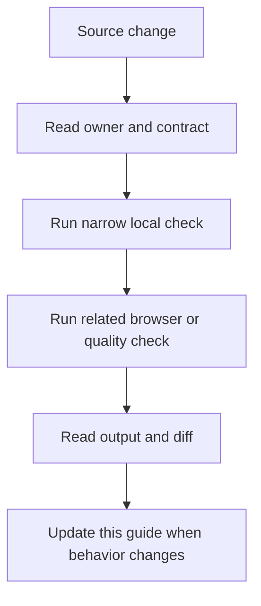

### Reading order

- Start at the section for the changed file or runtime.
- Copy the narrow command before running the broad suite.
- Check the failure branch and the evidence path.
- Compare README links after editing any docs entry point.

<a id="01--cascade-order"></a>
## 01 / Cascade order

CSS resolves declarations through origin, importance, layers, specificity, and source order.

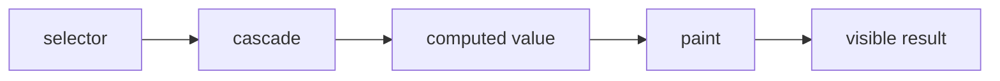

### How it works

1. `selector` enters **Cascade order** as the value, event, file, or runtime that needs a decision.
2. `cascade` applies the rule owned by this section; keep that decision close to its source boundary.
3. `computed value` carries the checked result to the next consumer instead of exposing private setup.
4. `paint` receives the result and makes it visible through markup, output, or an exit code.
5. Exercise the normal path and the failure path at the runtime named by the example.

### Project reading

- **Rule:** Prefer a clear component selector or utility over a specificity contest.
- **Failure to catch:** A later global rule changes a card or a theme rule loses to a more specific selector.
- **Evidence:** Computed style inspection and a visual check.
- **Owner:** `CSS / Field Notes` documents the contract; source files and tests remain the executable reference.
- **Scope:** Read this section with the linked source path in the repository catalog below.

### Example

```css
:root { --theme-primary: #a855f7; }
.project-card { border-color: var(--border); }
.project-card:hover { border-color: var(--theme-primary); }
```

### Decision table

<table>
  <thead>
    <tr><th>Input</th><th>Project decision</th><th>Check</th></tr>
  </thead>
  <tbody>
    <tr><td>selector</td><td>Keep it at the boundary named by the section.</td><td>A focused test or source inspection.</td></tr>
    <tr><td>cascade</td><td>Use the smallest rule that explains the branch.</td><td>Lint, type check, or browser assertion.</td></tr>
    <tr><td>computed value</td><td>Return a readable value or state.</td><td>Success and failure cases.</td></tr>
    <tr><td>paint</td><td>Expose a semantic or reviewable consumer.</td><td>Role, report, screenshot, or exit code.</td></tr>
  </tbody>
</table>

### Checks

- Inspect the owner for `cascade` before editing the consumer.
- Assert the successful `computed value` result through the public surface.
- Force the failure branch and confirm it reaches `paint`.
- Record the command and artifact path shown in this guide.

<a id="02--design-tokens"></a>
## 02 / Design tokens

Global custom properties keep colors, borders, text, fonts, and theme choices in one readable contract.

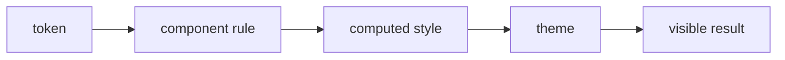

### How it works

1. `token` enters **Design tokens** as the value, event, file, or runtime that needs a decision.
2. `component rule` applies the rule owned by this section; keep that decision close to its source boundary.
3. `computed style` carries the checked result to the next consumer instead of exposing private setup.
4. `theme` receives the result and makes it visible through markup, output, or an exit code.
5. Exercise the normal path and the failure path at the runtime named by the example.

### Project reading

- **Rule:** Use a token when several surfaces share a value or a theme changes it.
- **Failure to catch:** A component hard-codes the dark color and stays purple in the light palette.
- **Evidence:** Light and dark screenshots plus computed token values.
- **Owner:** `CSS / Field Notes` documents the contract; source files and tests remain the executable reference.
- **Scope:** Read this section with the linked source path in the repository catalog below.

### Example

```css
:root {
  --bg-dark: #09090b;
  --text-primary: #fafafa;
  --border: #27272a;
}
.light { --bg-dark: #fff; --text-primary: #09090b; }
```

### Decision table

<table>
  <thead>
    <tr><th>Input</th><th>Project decision</th><th>Check</th></tr>
  </thead>
  <tbody>
    <tr><td>token</td><td>Keep it at the boundary named by the section.</td><td>A focused test or source inspection.</td></tr>
    <tr><td>component rule</td><td>Use the smallest rule that explains the branch.</td><td>Lint, type check, or browser assertion.</td></tr>
    <tr><td>computed style</td><td>Return a readable value or state.</td><td>Success and failure cases.</td></tr>
    <tr><td>theme</td><td>Expose a semantic or reviewable consumer.</td><td>Role, report, screenshot, or exit code.</td></tr>
  </tbody>
</table>

### Checks

- Inspect the owner for `component rule` before editing the consumer.
- Assert the successful `computed style` result through the public surface.
- Force the failure branch and confirm it reaches `theme`.
- Record the command and artifact path shown in this guide.

<a id="03--dark-and-light-themes"></a>
## 03 / Dark and light themes

The light class swaps variables and selected component rules while the DOM structure stays stable.

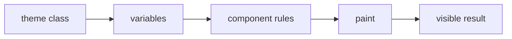

### How it works

1. `theme class` enters **Dark and light themes** as the value, event, file, or runtime that needs a decision.
2. `variables` applies the rule owned by this section; keep that decision close to its source boundary.
3. `component rules` carries the checked result to the next consumer instead of exposing private setup.
4. `paint` receives the result and makes it visible through markup, output, or an exit code.
5. Exercise the normal path and the failure path at the runtime named by the example.

### Project reading

- **Rule:** Change tokens first; add a scoped override only when the visual treatment truly differs.
- **Failure to catch:** One surface changes color but its border, shadow, or image blend remains from dark mode.
- **Evidence:** Theme toggle test and paired visual snapshots.
- **Owner:** `CSS / Field Notes` documents the contract; source files and tests remain the executable reference.
- **Scope:** Read this section with the linked source path in the repository catalog below.

### Example

```css
.light .main-nav {
  background: rgba(255, 255, 255, 0.95);
  border-bottom-color: #e4e4e7;
}
```

### Decision table

<table>
  <thead>
    <tr><th>Input</th><th>Project decision</th><th>Check</th></tr>
  </thead>
  <tbody>
    <tr><td>theme class</td><td>Keep it at the boundary named by the section.</td><td>A focused test or source inspection.</td></tr>
    <tr><td>variables</td><td>Use the smallest rule that explains the branch.</td><td>Lint, type check, or browser assertion.</td></tr>
    <tr><td>component rules</td><td>Return a readable value or state.</td><td>Success and failure cases.</td></tr>
    <tr><td>paint</td><td>Expose a semantic or reviewable consumer.</td><td>Role, report, screenshot, or exit code.</td></tr>
  </tbody>
</table>

### Checks

- Inspect the owner for `variables` before editing the consumer.
- Assert the successful `component rules` result through the public surface.
- Force the failure branch and confirm it reaches `paint`.
- Record the command and artifact path shown in this guide.

<a id="04--tailwind-utilities"></a>
## 04 / Tailwind utilities

Tailwind classes express layout and state at the JSX call site; globals cover tokens and effects that need named selectors.

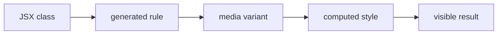

### How it works

1. `JSX class` enters **Tailwind utilities** as the value, event, file, or runtime that needs a decision.
2. `generated rule` applies the rule owned by this section; keep that decision close to its source boundary.
3. `media variant` carries the checked result to the next consumer instead of exposing private setup.
4. `computed style` receives the result and makes it visible through markup, output, or an exit code.
5. Exercise the normal path and the failure path at the runtime named by the example.

### Project reading

- **Rule:** Use utilities for local layout and a named class for a repeated visual system.
- **Failure to catch:** A long class string hides a shared effect or a runtime class is missing from the content scan.
- **Evidence:** Build output, class assertion, and a screenshot.
- **Owner:** `CSS / Field Notes` documents the contract; source files and tests remain the executable reference.
- **Scope:** Read this section with the linked source path in the repository catalog below.

### Example

```tsx
<section className="mx-auto grid max-w-7xl gap-6 px-4 md:grid-cols-2">
  <Card />
</section>
```

### Decision table

<table>
  <thead>
    <tr><th>Input</th><th>Project decision</th><th>Check</th></tr>
  </thead>
  <tbody>
    <tr><td>JSX class</td><td>Keep it at the boundary named by the section.</td><td>A focused test or source inspection.</td></tr>
    <tr><td>generated rule</td><td>Use the smallest rule that explains the branch.</td><td>Lint, type check, or browser assertion.</td></tr>
    <tr><td>media variant</td><td>Return a readable value or state.</td><td>Success and failure cases.</td></tr>
    <tr><td>computed style</td><td>Expose a semantic or reviewable consumer.</td><td>Role, report, screenshot, or exit code.</td></tr>
  </tbody>
</table>

### Checks

- Inspect the owner for `generated rule` before editing the consumer.
- Assert the successful `media variant` result through the public surface.
- Force the failure branch and confirm it reaches `computed style`.
- Record the command and artifact path shown in this guide.

<a id="05--layout"></a>
## 05 / Layout

Grid, flex, intrinsic sizing, and gaps decide how content occupies the page at each width.

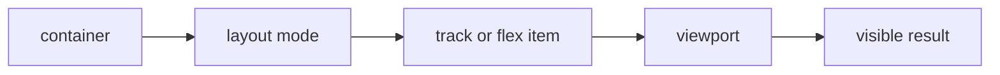

### How it works

1. `container` enters **Layout** as the value, event, file, or runtime that needs a decision.
2. `layout mode` applies the rule owned by this section; keep that decision close to its source boundary.
3. `track or flex item` carries the checked result to the next consumer instead of exposing private setup.
4. `viewport` receives the result and makes it visible through markup, output, or an exit code.
5. Exercise the normal path and the failure path at the runtime named by the example.

### Project reading

- **Rule:** Give content a max width and let the layout adapt before adding absolute coordinates.
- **Failure to catch:** A desktop width overflows on mobile or an absolute layer covers the focus target.
- **Evidence:** Desktop and mobile viewport screenshots.
- **Owner:** `CSS / Field Notes` documents the contract; source files and tests remain the executable reference.
- **Scope:** Read this section with the linked source path in the repository catalog below.

### Example

```css
.hero-grid {
  display: grid;
  grid-template-columns: 1fr 1fr;
  gap: 4rem;
}
@media (max-width: 767px) { .hero-grid { grid-template-columns: 1fr; } }
```

### Decision table

<table>
  <thead>
    <tr><th>Input</th><th>Project decision</th><th>Check</th></tr>
  </thead>
  <tbody>
    <tr><td>container</td><td>Keep it at the boundary named by the section.</td><td>A focused test or source inspection.</td></tr>
    <tr><td>layout mode</td><td>Use the smallest rule that explains the branch.</td><td>Lint, type check, or browser assertion.</td></tr>
    <tr><td>track or flex item</td><td>Return a readable value or state.</td><td>Success and failure cases.</td></tr>
    <tr><td>viewport</td><td>Expose a semantic or reviewable consumer.</td><td>Role, report, screenshot, or exit code.</td></tr>
  </tbody>
</table>

### Checks

- Inspect the owner for `layout mode` before editing the consumer.
- Assert the successful `track or flex item` result through the public surface.
- Force the failure branch and confirm it reaches `viewport`.
- Record the command and artifact path shown in this guide.

<a id="06--responsive-rules"></a>
## 06 / Responsive rules

The project uses a desktop viewport of 1366 by 768 and a mobile viewport of 390 by 844 in browser tests.

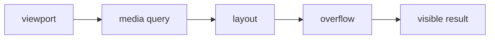

### How it works

1. `viewport` enters **Responsive rules** as the value, event, file, or runtime that needs a decision.
2. `media query` applies the rule owned by this section; keep that decision close to its source boundary.
3. `layout` carries the checked result to the next consumer instead of exposing private setup.
4. `overflow` receives the result and makes it visible through markup, output, or an exit code.
5. Exercise the normal path and the failure path at the runtime named by the example.

### Project reading

- **Rule:** Choose breakpoints from content failure, not from a device list alone.
- **Failure to catch:** A nav label wraps, a modal exceeds the viewport, or the page gains horizontal scroll.
- **Evidence:** Responsive Playwright checks and visual baselines.
- **Owner:** `CSS / Field Notes` documents the contract; source files and tests remain the executable reference.
- **Scope:** Read this section with the linked source path in the repository catalog below.

### Example

```css
@media (max-width: 640px) {
  .portfolio-transition__marquee-line { font-size: clamp(13px, 4vw, 22px); }
}
```

### Decision table

<table>
  <thead>
    <tr><th>Input</th><th>Project decision</th><th>Check</th></tr>
  </thead>
  <tbody>
    <tr><td>viewport</td><td>Keep it at the boundary named by the section.</td><td>A focused test or source inspection.</td></tr>
    <tr><td>media query</td><td>Use the smallest rule that explains the branch.</td><td>Lint, type check, or browser assertion.</td></tr>
    <tr><td>layout</td><td>Return a readable value or state.</td><td>Success and failure cases.</td></tr>
    <tr><td>overflow</td><td>Expose a semantic or reviewable consumer.</td><td>Role, report, screenshot, or exit code.</td></tr>
  </tbody>
</table>

### Checks

- Inspect the owner for `media query` before editing the consumer.
- Assert the successful `layout` result through the public surface.
- Force the failure branch and confirm it reaches `overflow`.
- Record the command and artifact path shown in this guide.

<a id="07--typography"></a>
## 07 / Typography

Font variables connect imported Inter, JetBrains Mono, Rajdhani, Teko, and Codystar families to surfaces.

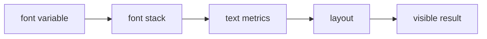

### How it works

1. `font variable` enters **Typography** as the value, event, file, or runtime that needs a decision.
2. `font stack` applies the rule owned by this section; keep that decision close to its source boundary.
3. `text metrics` carries the checked result to the next consumer instead of exposing private setup.
4. `layout` receives the result and makes it visible through markup, output, or an exit code.
5. Exercise the normal path and the failure path at the runtime named by the example.

### Project reading

- **Rule:** Choose a readable fallback and test long translated strings against the same layout.
- **Failure to catch:** A missing font changes line breaks or a decorative font makes a control hard to read.
- **Evidence:** Font-loaded and fallback screenshots plus text overflow review.
- **Owner:** `CSS / Field Notes` documents the contract; source files and tests remain the executable reference.
- **Scope:** Read this section with the linked source path in the repository catalog below.

### Example

```css
body {
  font-family: var(--font-geist-sans);
  line-height: 1.6;
}
.nav-link { font-family: var(--font-geist-mono); }
```

### Decision table

<table>
  <thead>
    <tr><th>Input</th><th>Project decision</th><th>Check</th></tr>
  </thead>
  <tbody>
    <tr><td>font variable</td><td>Keep it at the boundary named by the section.</td><td>A focused test or source inspection.</td></tr>
    <tr><td>font stack</td><td>Use the smallest rule that explains the branch.</td><td>Lint, type check, or browser assertion.</td></tr>
    <tr><td>text metrics</td><td>Return a readable value or state.</td><td>Success and failure cases.</td></tr>
    <tr><td>layout</td><td>Expose a semantic or reviewable consumer.</td><td>Role, report, screenshot, or exit code.</td></tr>
  </tbody>
</table>

### Checks

- Inspect the owner for `font stack` before editing the consumer.
- Assert the successful `text metrics` result through the public surface.
- Force the failure branch and confirm it reaches `layout`.
- Record the command and artifact path shown in this guide.

<a id="08--animation-timing"></a>
## 08 / Animation timing

Keyframes move or reveal layers; the class or data attribute decides when the animation runs.

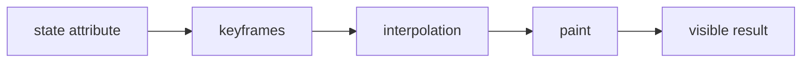

### How it works

1. `state attribute` enters **Animation timing** as the value, event, file, or runtime that needs a decision.
2. `keyframes` applies the rule owned by this section; keep that decision close to its source boundary.
3. `interpolation` carries the checked result to the next consumer instead of exposing private setup.
4. `paint` receives the result and makes it visible through markup, output, or an exit code.
5. Exercise the normal path and the failure path at the runtime named by the example.

### Project reading

- **Rule:** Animate transform and opacity when possible, and define the static state beside the animated state.
- **Failure to catch:** An element flashes, animates from the wrong origin, or keeps a will-change hint after the effect ends.
- **Evidence:** Initial, active, and final screenshots with reduced-motion coverage.
- **Owner:** `CSS / Field Notes` documents the contract; source files and tests remain the executable reference.
- **Scope:** Read this section with the linked source path in the repository catalog below.

### Example

```css
@keyframes clip-in {
  from { clip-path: polygon(0 0, 0 0, 0 100%, 0 100%); }
  to { clip-path: polygon(0 0, 100% 0, 100% 100%, 0 100%); }
}
```

### Decision table

<table>
  <thead>
    <tr><th>Input</th><th>Project decision</th><th>Check</th></tr>
  </thead>
  <tbody>
    <tr><td>state attribute</td><td>Keep it at the boundary named by the section.</td><td>A focused test or source inspection.</td></tr>
    <tr><td>keyframes</td><td>Use the smallest rule that explains the branch.</td><td>Lint, type check, or browser assertion.</td></tr>
    <tr><td>interpolation</td><td>Return a readable value or state.</td><td>Success and failure cases.</td></tr>
    <tr><td>paint</td><td>Expose a semantic or reviewable consumer.</td><td>Role, report, screenshot, or exit code.</td></tr>
  </tbody>
</table>

### Checks

- Inspect the owner for `keyframes` before editing the consumer.
- Assert the successful `interpolation` result through the public surface.
- Force the failure branch and confirm it reaches `paint`.
- Record the command and artifact path shown in this guide.

<a id="09--reduced-motion"></a>
## 09 / Reduced motion

The prefers-reduced-motion media query removes transition layers that add movement without adding meaning.

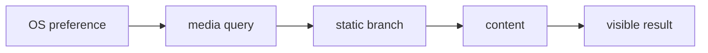

### How it works

1. `OS preference` enters **Reduced motion** as the value, event, file, or runtime that needs a decision.
2. `media query` applies the rule owned by this section; keep that decision close to its source boundary.
3. `static branch` carries the checked result to the next consumer instead of exposing private setup.
4. `content` receives the result and makes it visible through markup, output, or an exit code.
5. Exercise the normal path and the failure path at the runtime named by the example.

### Project reading

- **Rule:** The static layout must still show the same content and controls.
- **Failure to catch:** A reduced-motion user receives a blank layer or waits for a transition to finish.
- **Evidence:** Playwright preference plus DOM visibility checks.
- **Owner:** `CSS / Field Notes` documents the contract; source files and tests remain the executable reference.
- **Scope:** Read this section with the linked source path in the repository catalog below.

### Example

```css
@media (prefers-reduced-motion: reduce) {
  .portfolio-transition { display: none !important; }
  .nav-icon-button { transition: none; }
}
```

### Decision table

<table>
  <thead>
    <tr><th>Input</th><th>Project decision</th><th>Check</th></tr>
  </thead>
  <tbody>
    <tr><td>OS preference</td><td>Keep it at the boundary named by the section.</td><td>A focused test or source inspection.</td></tr>
    <tr><td>media query</td><td>Use the smallest rule that explains the branch.</td><td>Lint, type check, or browser assertion.</td></tr>
    <tr><td>static branch</td><td>Return a readable value or state.</td><td>Success and failure cases.</td></tr>
    <tr><td>content</td><td>Expose a semantic or reviewable consumer.</td><td>Role, report, screenshot, or exit code.</td></tr>
  </tbody>
</table>

### Checks

- Inspect the owner for `media query` before editing the consumer.
- Assert the successful `static branch` result through the public surface.
- Force the failure branch and confirm it reaches `content`.
- Record the command and artifact path shown in this guide.

<a id="10--stacking-and-overlays"></a>
## 10 / Stacking and overlays

Fixed backgrounds, navigation, modals, and transitions use z-index and pointer-events to separate paint from input.

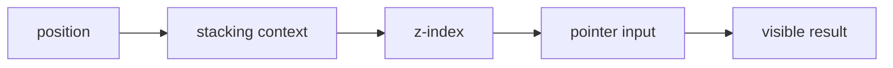

### How it works

1. `position` enters **Stacking and overlays** as the value, event, file, or runtime that needs a decision.
2. `stacking context` applies the rule owned by this section; keep that decision close to its source boundary.
3. `z-index` carries the checked result to the next consumer instead of exposing private setup.
4. `pointer input` receives the result and makes it visible through markup, output, or an exit code.
5. Exercise the normal path and the failure path at the runtime named by the example.

### Project reading

- **Rule:** Document the layer order and keep decorative surfaces pointer-events none.
- **Failure to catch:** A background captures clicks or a modal sits below a fixed effect.
- **Evidence:** Pointer test, focus test, and computed z-index inspection.
- **Owner:** `CSS / Field Notes` documents the contract; source files and tests remain the executable reference.
- **Scope:** Read this section with the linked source path in the repository catalog below.

### Example

```css
.page-grid-overlay {
  position: fixed;
  inset: 0;
  z-index: -1;
  pointer-events: none;
}
```

### Decision table

<table>
  <thead>
    <tr><th>Input</th><th>Project decision</th><th>Check</th></tr>
  </thead>
  <tbody>
    <tr><td>position</td><td>Keep it at the boundary named by the section.</td><td>A focused test or source inspection.</td></tr>
    <tr><td>stacking context</td><td>Use the smallest rule that explains the branch.</td><td>Lint, type check, or browser assertion.</td></tr>
    <tr><td>z-index</td><td>Return a readable value or state.</td><td>Success and failure cases.</td></tr>
    <tr><td>pointer input</td><td>Expose a semantic or reviewable consumer.</td><td>Role, report, screenshot, or exit code.</td></tr>
  </tbody>
</table>

### Checks

- Inspect the owner for `stacking context` before editing the consumer.
- Assert the successful `z-index` result through the public surface.
- Force the failure branch and confirm it reaches `pointer input`.
- Record the command and artifact path shown in this guide.

<a id="11--pseudo-elements-and-texture"></a>
## 11 / Pseudo-elements and texture

body pseudo-elements add ambient gradients and noise without adding markup to the React tree.

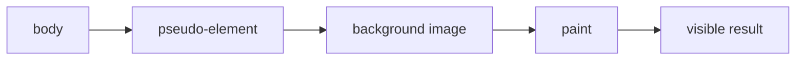

### How it works

1. `body` enters **Pseudo-elements and texture** as the value, event, file, or runtime that needs a decision.
2. `pseudo-element` applies the rule owned by this section; keep that decision close to its source boundary.
3. `background image` carries the checked result to the next consumer instead of exposing private setup.
4. `paint` receives the result and makes it visible through markup, output, or an exit code.
5. Exercise the normal path and the failure path at the runtime named by the example.

### Project reading

- **Rule:** Keep decorative pseudo-elements fixed, non-interactive, and low-cost.
- **Failure to catch:** A texture creates a new scroll layer or covers text contrast.
- **Evidence:** Screenshot, scroll test, and accessibility contrast review.
- **Owner:** `CSS / Field Notes` documents the contract; source files and tests remain the executable reference.
- **Scope:** Read this section with the linked source path in the repository catalog below.

### Example

```css
body::after {
  content: '';
  position: fixed;
  inset: 0;
  pointer-events: none;
  opacity: 0.03;
}
```

### Decision table

<table>
  <thead>
    <tr><th>Input</th><th>Project decision</th><th>Check</th></tr>
  </thead>
  <tbody>
    <tr><td>body</td><td>Keep it at the boundary named by the section.</td><td>A focused test or source inspection.</td></tr>
    <tr><td>pseudo-element</td><td>Use the smallest rule that explains the branch.</td><td>Lint, type check, or browser assertion.</td></tr>
    <tr><td>background image</td><td>Return a readable value or state.</td><td>Success and failure cases.</td></tr>
    <tr><td>paint</td><td>Expose a semantic or reviewable consumer.</td><td>Role, report, screenshot, or exit code.</td></tr>
  </tbody>
</table>

### Checks

- Inspect the owner for `pseudo-element` before editing the consumer.
- Assert the successful `background image` result through the public surface.
- Force the failure branch and confirm it reaches `paint`.
- Record the command and artifact path shown in this guide.

<a id="12--scrollbar"></a>
## 12 / Scrollbar

The global stylesheet supplies thin Firefox scrollbars and gradient WebKit tracks with theme-aware thumbs.

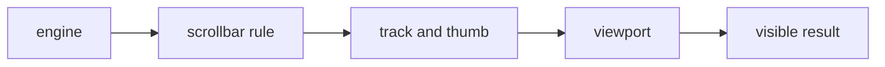

### How it works

1. `engine` enters **Scrollbar** as the value, event, file, or runtime that needs a decision.
2. `scrollbar rule` applies the rule owned by this section; keep that decision close to its source boundary.
3. `track and thumb` carries the checked result to the next consumer instead of exposing private setup.
4. `viewport` receives the result and makes it visible through markup, output, or an exit code.
5. Exercise the normal path and the failure path at the runtime named by the example.

### Project reading

- **Rule:** Use feature queries and keep the scrollbar contrast visible in both themes.
- **Failure to catch:** One engine ignores the rule or the thumb disappears against the page background.
- **Evidence:** Chromium and Firefox screenshots or manual checks.
- **Owner:** `CSS / Field Notes` documents the contract; source files and tests remain the executable reference.
- **Scope:** Read this section with the linked source path in the repository catalog below.

### Example

```css
@supports (scrollbar-width: auto) {
  * { scrollbar-width: thin; scrollbar-color: var(--theme-primary) transparent; }
}
```

### Decision table

<table>
  <thead>
    <tr><th>Input</th><th>Project decision</th><th>Check</th></tr>
  </thead>
  <tbody>
    <tr><td>engine</td><td>Keep it at the boundary named by the section.</td><td>A focused test or source inspection.</td></tr>
    <tr><td>scrollbar rule</td><td>Use the smallest rule that explains the branch.</td><td>Lint, type check, or browser assertion.</td></tr>
    <tr><td>track and thumb</td><td>Return a readable value or state.</td><td>Success and failure cases.</td></tr>
    <tr><td>viewport</td><td>Expose a semantic or reviewable consumer.</td><td>Role, report, screenshot, or exit code.</td></tr>
  </tbody>
</table>

### Checks

- Inspect the owner for `scrollbar rule` before editing the consumer.
- Assert the successful `track and thumb` result through the public surface.
- Force the failure branch and confirm it reaches `viewport`.
- Record the command and artifact path shown in this guide.

<a id="13--component-selectors"></a>
## 13 / Component selectors

Named selectors such as main-nav, project-card, and portfolio-transition connect source components to repeatable visual behavior.

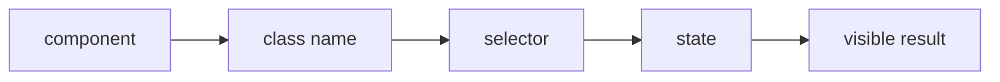

### How it works

1. `component` enters **Component selectors** as the value, event, file, or runtime that needs a decision.
2. `class name` applies the rule owned by this section; keep that decision close to its source boundary.
3. `selector` carries the checked result to the next consumer instead of exposing private setup.
4. `state` receives the result and makes it visible through markup, output, or an exit code.
5. Exercise the normal path and the failure path at the runtime named by the example.

### Project reading

- **Rule:** Keep selector names specific enough to avoid leaking style into sibling surfaces.
- **Failure to catch:** A generic .title or .active rule changes a different page.
- **Evidence:** Class search, visual test, and route smoke test.
- **Owner:** `CSS / Field Notes` documents the contract; source files and tests remain the executable reference.
- **Scope:** Read this section with the linked source path in the repository catalog below.

### Example

```css
.project-card {
  background: var(--bg-card);
  color: var(--text-primary);
  border: 1px solid var(--border);
}
```

### Decision table

<table>
  <thead>
    <tr><th>Input</th><th>Project decision</th><th>Check</th></tr>
  </thead>
  <tbody>
    <tr><td>component</td><td>Keep it at the boundary named by the section.</td><td>A focused test or source inspection.</td></tr>
    <tr><td>class name</td><td>Use the smallest rule that explains the branch.</td><td>Lint, type check, or browser assertion.</td></tr>
    <tr><td>selector</td><td>Return a readable value or state.</td><td>Success and failure cases.</td></tr>
    <tr><td>state</td><td>Expose a semantic or reviewable consumer.</td><td>Role, report, screenshot, or exit code.</td></tr>
  </tbody>
</table>

### Checks

- Inspect the owner for `class name` before editing the consumer.
- Assert the successful `selector` result through the public surface.
- Force the failure branch and confirm it reaches `state`.
- Record the command and artifact path shown in this guide.

<a id="14--visual-verification"></a>
## 14 / Visual verification

Screenshots compare stable rendered states while browser tests cover motion, canvas, and data changes separately.

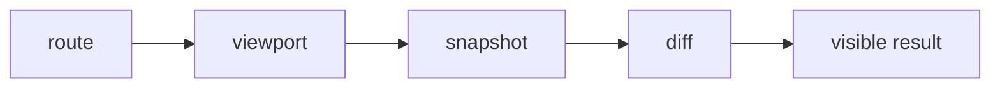

### How it works

1. `route` enters **Visual verification** as the value, event, file, or runtime that needs a decision.
2. `viewport` applies the rule owned by this section; keep that decision close to its source boundary.
3. `snapshot` carries the checked result to the next consumer instead of exposing private setup.
4. `diff` receives the result and makes it visible through markup, output, or an exit code.
5. Exercise the normal path and the failure path at the runtime named by the example.

### Project reading

- **Rule:** Update a baseline only after reading the diff and confirming the source change explains it.
- **Failure to catch:** A snapshot is accepted to hide a font, spacing, or unintended overflow regression.
- **Evidence:** Snapshot diff, command, and reason for any update.
- **Owner:** `CSS / Field Notes` documents the contract; source files and tests remain the executable reference.
- **Scope:** Read this section with the linked source path in the repository catalog below.

### Example

```bash
pnpm run test:visual
pnpm run test:visual:update
```

### Decision table

<table>
  <thead>
    <tr><th>Input</th><th>Project decision</th><th>Check</th></tr>
  </thead>
  <tbody>
    <tr><td>route</td><td>Keep it at the boundary named by the section.</td><td>A focused test or source inspection.</td></tr>
    <tr><td>viewport</td><td>Use the smallest rule that explains the branch.</td><td>Lint, type check, or browser assertion.</td></tr>
    <tr><td>snapshot</td><td>Return a readable value or state.</td><td>Success and failure cases.</td></tr>
    <tr><td>diff</td><td>Expose a semantic or reviewable consumer.</td><td>Role, report, screenshot, or exit code.</td></tr>
  </tbody>
</table>

### Checks

- Inspect the owner for `viewport` before editing the consumer.
- Assert the successful `snapshot` result through the public surface.
- Force the failure branch and confirm it reaches `diff`.
- Record the command and artifact path shown in this guide.

<a id="15--css-performance"></a>
## 15 / CSS performance

Paint-heavy layers, blur, filters, and large fixed surfaces affect browser work even when React renders once.

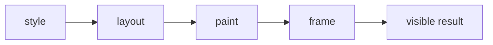

### How it works

1. `style` enters **CSS performance** as the value, event, file, or runtime that needs a decision.
2. `layout` applies the rule owned by this section; keep that decision close to its source boundary.
3. `paint` carries the checked result to the next consumer instead of exposing private setup.
4. `frame` receives the result and makes it visible through markup, output, or an exit code.
5. Exercise the normal path and the failure path at the runtime named by the example.

### Project reading

- **Rule:** Measure before adding another layer; remove work that does not change the user result.
- **Failure to catch:** A decorative layer increases long tasks or causes scroll jank on mobile.
- **Evidence:** Lighthouse timings and a mobile browser pass.
- **Owner:** `CSS / Field Notes` documents the contract; source files and tests remain the executable reference.
- **Scope:** Read this section with the linked source path in the repository catalog below.

### Example

```ts
const budget = {
  lcpMs: 2500,
  tbtMs: 300,
  cls: 0.1,
};
```

### Decision table

<table>
  <thead>
    <tr><th>Input</th><th>Project decision</th><th>Check</th></tr>
  </thead>
  <tbody>
    <tr><td>style</td><td>Keep it at the boundary named by the section.</td><td>A focused test or source inspection.</td></tr>
    <tr><td>layout</td><td>Use the smallest rule that explains the branch.</td><td>Lint, type check, or browser assertion.</td></tr>
    <tr><td>paint</td><td>Return a readable value or state.</td><td>Success and failure cases.</td></tr>
    <tr><td>frame</td><td>Expose a semantic or reviewable consumer.</td><td>Role, report, screenshot, or exit code.</td></tr>
  </tbody>
</table>

### Checks

- Inspect the owner for `layout` before editing the consumer.
- Assert the successful `paint` result through the public surface.
- Force the failure branch and confirm it reaches `frame`.
- Record the command and artifact path shown in this guide.

<a id="16--troubleshooting-css"></a>
## 16 / Troubleshooting CSS

A CSS bug is easier to isolate by checking the selector, computed value, box, and stacking context in that order.

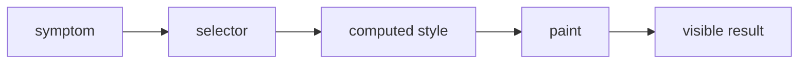

### How it works

1. `symptom` enters **Troubleshooting CSS** as the value, event, file, or runtime that needs a decision.
2. `selector` applies the rule owned by this section; keep that decision close to its source boundary.
3. `computed style` carries the checked result to the next consumer instead of exposing private setup.
4. `paint` receives the result and makes it visible through markup, output, or an exit code.
5. Exercise the normal path and the failure path at the runtime named by the example.

### Project reading

- **Rule:** Reduce the case to one element and one rule before changing global styles.
- **Failure to catch:** A broad selector change fixes one route and breaks another.
- **Evidence:** DevTools computed styles and a focused visual check.
- **Owner:** `CSS / Field Notes` documents the contract; source files and tests remain the executable reference.
- **Scope:** Read this section with the linked source path in the repository catalog below.

### Example

```css
/* Inspect selector reach before adding specificity. */
.project-card[data-state='error'] {
  border-color: #ef4444;
}
```

### Decision table

<table>
  <thead>
    <tr><th>Input</th><th>Project decision</th><th>Check</th></tr>
  </thead>
  <tbody>
    <tr><td>symptom</td><td>Keep it at the boundary named by the section.</td><td>A focused test or source inspection.</td></tr>
    <tr><td>selector</td><td>Use the smallest rule that explains the branch.</td><td>Lint, type check, or browser assertion.</td></tr>
    <tr><td>computed style</td><td>Return a readable value or state.</td><td>Success and failure cases.</td></tr>
    <tr><td>paint</td><td>Expose a semantic or reviewable consumer.</td><td>Role, report, screenshot, or exit code.</td></tr>
  </tbody>
</table>

### Checks

- Inspect the owner for `selector` before editing the consumer.
- Assert the successful `computed style` result through the public surface.
- Force the failure branch and confirm it reaches `paint`.
- Record the command and artifact path shown in this guide.

<a id="17--review-checklist"></a>
## 17 / Review checklist

Review CSS for readable tokens, content-driven layout, accessible contrast, motion preference, and stable selectors.

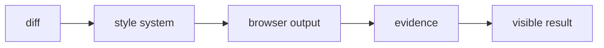

### How it works

1. `diff` enters **Review checklist** as the value, event, file, or runtime that needs a decision.
2. `style system` applies the rule owned by this section; keep that decision close to its source boundary.
3. `browser output` carries the checked result to the next consumer instead of exposing private setup.
4. `evidence` receives the result and makes it visible through markup, output, or an exit code.
5. Exercise the normal path and the failure path at the runtime named by the example.

### Project reading

- **Rule:** Review the light theme and mobile viewport for every shared style change.
- **Failure to catch:** The dark desktop view passes while the light mobile view clips or loses contrast.
- **Evidence:** Paired screenshots and the command that produced them.
- **Owner:** `CSS / Field Notes` documents the contract; source files and tests remain the executable reference.
- **Scope:** Read this section with the linked source path in the repository catalog below.

### Example

```ts
const cssReview = ['tokens', 'mobile', 'light', 'reduced motion', 'focus'];
```

### Decision table

<table>
  <thead>
    <tr><th>Input</th><th>Project decision</th><th>Check</th></tr>
  </thead>
  <tbody>
    <tr><td>diff</td><td>Keep it at the boundary named by the section.</td><td>A focused test or source inspection.</td></tr>
    <tr><td>style system</td><td>Use the smallest rule that explains the branch.</td><td>Lint, type check, or browser assertion.</td></tr>
    <tr><td>browser output</td><td>Return a readable value or state.</td><td>Success and failure cases.</td></tr>
    <tr><td>evidence</td><td>Expose a semantic or reviewable consumer.</td><td>Role, report, screenshot, or exit code.</td></tr>
  </tbody>
</table>

### Checks

- Inspect the owner for `style system` before editing the consumer.
- Assert the successful `browser output` result through the public surface.
- Force the failure branch and confirm it reaches `evidence`.
- Record the command and artifact path shown in this guide.

<a id="18--css-glossary"></a>
## 18 / CSS glossary

Cascade, specificity, custom property, media query, stacking context, paint, and layout describe different browser steps.

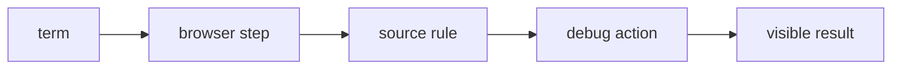

### How it works

1. `term` enters **CSS glossary** as the value, event, file, or runtime that needs a decision.
2. `browser step` applies the rule owned by this section; keep that decision close to its source boundary.
3. `source rule` carries the checked result to the next consumer instead of exposing private setup.
4. `debug action` receives the result and makes it visible through markup, output, or an exit code.
5. Exercise the normal path and the failure path at the runtime named by the example.

### Project reading

- **Rule:** Use the browser term that points to the right panel or test.
- **Failure to catch:** Calling every visual issue a layout bug sends debugging toward the wrong layer.
- **Evidence:** A term linked to one source rule and one check.
- **Owner:** `CSS / Field Notes` documents the contract; source files and tests remain the executable reference.
- **Scope:** Read this section with the linked source path in the repository catalog below.

### Example

```css
/* Custom properties inherit until a nearer scope changes them. */
:root { --border: #27272a; }
.card { border-color: var(--border); }
```

### Decision table

<table>
  <thead>
    <tr><th>Input</th><th>Project decision</th><th>Check</th></tr>
  </thead>
  <tbody>
    <tr><td>term</td><td>Keep it at the boundary named by the section.</td><td>A focused test or source inspection.</td></tr>
    <tr><td>browser step</td><td>Use the smallest rule that explains the branch.</td><td>Lint, type check, or browser assertion.</td></tr>
    <tr><td>source rule</td><td>Return a readable value or state.</td><td>Success and failure cases.</td></tr>
    <tr><td>debug action</td><td>Expose a semantic or reviewable consumer.</td><td>Role, report, screenshot, or exit code.</td></tr>
  </tbody>
</table>

### Checks

- Inspect the owner for `browser step` before editing the consumer.
- Assert the successful `source rule` result through the public surface.
- Force the failure branch and confirm it reaches `debug action`.
- Record the command and artifact path shown in this guide.

<a id="repository-map"></a>
<h1 align="center">
   Repository map
</h1>

The catalog is intentionally concrete. Use it to jump from a concept to the source or test that implements it.

<table>
  <thead>
    <tr><th>Area</th><th>Paths</th><th>Read for</th></tr>
  </thead>
  <tbody>
    <tr><td>Application</td><td>`src/app/`</td><td>Routes, layouts, metadata, and API handlers.</td></tr>
    <tr><td>Components</td><td>`src/components/`</td><td>React composition, effects, UI, and project surfaces.</td></tr>
    <tr><td>Tests</td><td>`tests/` and `src/**/tests/`</td><td>Runner-specific behavior and boundary cases.</td></tr>
    <tr><td>Scripts</td><td>`scripts/tests/` and `scripts/qa/`</td><td>Quality reports, server startup, screenshots, and video conversion.</td></tr>
    <tr><td>Automation</td><td>`.github/workflows/`</td><td>CI triggers, jobs, artifacts, and delivery.</td></tr>
  </tbody>
</table>


<table>
  <thead>
    <tr><th>Path</th><th>Relation to this guide</th><th>Open with</th></tr>
  </thead>
  <tbody>
    <tr><td><code>.github/workflows/ci.yml</code></td><td>Automation or delivery boundary.</td><td>`ci.md` or the workflow job log.</td></tr>
    <tr><td><code>.github/workflows/codeql.yml</code></td><td>Automation or delivery boundary.</td><td>`ci.md` or the workflow job log.</td></tr>
    <tr><td><code>.github/workflows/dependencies.yml</code></td><td>Automation or delivery boundary.</td><td>`ci.md` or the workflow job log.</td></tr>
    <tr><td><code>.github/workflows/deploy.yml</code></td><td>Automation or delivery boundary.</td><td>`ci.md` or the workflow job log.</td></tr>
    <tr><td><code>.github/workflows/docker.yml</code></td><td>Automation or delivery boundary.</td><td>`ci.md` or the workflow job log.</td></tr>
    <tr><td><code>.github/workflows/frontend-qa.yml</code></td><td>Automation or delivery boundary.</td><td>`ci.md` or the workflow job log.</td></tr>
    <tr><td><code>.storybook/main.ts</code></td><td>Application source, typed component, or style rule.</td><td>The nearest test and route.</td></tr>
    <tr><td><code>README.md</code></td><td>Project configuration or documentation entry point.</td><td>The command that consumes it.</td></tr>
    <tr><td><code>jest.config.js</code></td><td>Project configuration or documentation entry point.</td><td>The command that consumes it.</td></tr>
    <tr><td><code>lighthouserc.js</code></td><td>Project configuration or documentation entry point.</td><td>The command that consumes it.</td></tr>
    <tr><td><code>package.json</code></td><td>Project configuration or documentation entry point.</td><td>The command that consumes it.</td></tr>
    <tr><td><code>playwright.config.ts</code></td><td>Application source, typed component, or style rule.</td><td>The nearest test and route.</td></tr>
    <tr><td><code>scripts/qa/capture-lighthouse-screenshots.mjs</code></td><td>QA runtime helper or evidence producer.</td><td>`testing.md` or `qa.md`.</td></tr>
    <tr><td><code>scripts/qa/convert-playwright-video.mjs</code></td><td>QA runtime helper or evidence producer.</td><td>`testing.md` or `qa.md`.</td></tr>
    <tr><td><code>scripts/qa/start-production.mjs</code></td><td>QA runtime helper or evidence producer.</td><td>`testing.md` or `qa.md`.</td></tr>
    <tr><td><code>scripts/tests/benchmark.mjs</code></td><td>Behavior check or test fixture.</td><td>The related source module.</td></tr>
    <tr><td><code>scripts/tests/benchmark.node-test.mjs</code></td><td>Behavior check or test fixture.</td><td>The related source module.</td></tr>
    <tr><td><code>scripts/tests/check-file-size.mjs</code></td><td>Behavior check or test fixture.</td><td>The related source module.</td></tr>
    <tr><td><code>scripts/tests/check-file-size.node-test.mjs</code></td><td>Behavior check or test fixture.</td><td>The related source module.</td></tr>
    <tr><td><code>scripts/tests/file-size-policy.mjs</code></td><td>Behavior check or test fixture.</td><td>The related source module.</td></tr>
    <tr><td><code>scripts/tests/jscpd.mjs</code></td><td>Behavior check or test fixture.</td><td>The related source module.</td></tr>
    <tr><td><code>scripts/tests/jscpd.node-test.mjs</code></td><td>Behavior check or test fixture.</td><td>The related source module.</td></tr>
    <tr><td><code>scripts/tests/quality-metrics.mjs</code></td><td>Behavior check or test fixture.</td><td>The related source module.</td></tr>
    <tr><td><code>scripts/tests/quality-metrics.node-test.mjs</code></td><td>Behavior check or test fixture.</td><td>The related source module.</td></tr>
    <tr><td><code>scripts/tests/quality-policy.mjs</code></td><td>Behavior check or test fixture.</td><td>The related source module.</td></tr>
    <tr><td><code>scripts/tests/quality-report.mjs</code></td><td>Behavior check or test fixture.</td><td>The related source module.</td></tr>
    <tr><td><code>scripts/tests/quality-report.node-test.mjs</code></td><td>Behavior check or test fixture.</td><td>The related source module.</td></tr>
    <tr><td><code>scripts/tests/quality-review.mjs</code></td><td>Behavior check or test fixture.</td><td>The related source module.</td></tr>
    <tr><td><code>scripts/tests/quality-review.node-test.mjs</code></td><td>Behavior check or test fixture.</td><td>The related source module.</td></tr>
    <tr><td><code>scripts/tests/quality-security.mjs</code></td><td>Behavior check or test fixture.</td><td>The related source module.</td></tr>
    <tr><td><code>src/app/[locale]/[...not-found]/page.tsx</code></td><td>Application source, typed component, or style rule.</td><td>The nearest test and route.</td></tr>
    <tr><td><code>src/app/[locale]/about/layout.tsx</code></td><td>Application source, typed component, or style rule.</td><td>The nearest test and route.</td></tr>
    <tr><td><code>src/app/[locale]/about/page.tsx</code></td><td>Application source, typed component, or style rule.</td><td>The nearest test and route.</td></tr>
    <tr><td><code>src/app/[locale]/certifications/layout.tsx</code></td><td>Application source, typed component, or style rule.</td><td>The nearest test and route.</td></tr>
    <tr><td><code>src/app/[locale]/certifications/page.tsx</code></td><td>Application source, typed component, or style rule.</td><td>The nearest test and route.</td></tr>
    <tr><td><code>src/app/[locale]/chat/layout.tsx</code></td><td>Application source, typed component, or style rule.</td><td>The nearest test and route.</td></tr>
    <tr><td><code>src/app/[locale]/chat/page.tsx</code></td><td>Application source, typed component, or style rule.</td><td>The nearest test and route.</td></tr>
    <tr><td><code>src/app/[locale]/contact/layout.tsx</code></td><td>Application source, typed component, or style rule.</td><td>The nearest test and route.</td></tr>
    <tr><td><code>src/app/[locale]/contact/page.tsx</code></td><td>Application source, typed component, or style rule.</td><td>The nearest test and route.</td></tr>
    <tr><td><code>src/app/[locale]/layout.tsx</code></td><td>Application source, typed component, or style rule.</td><td>The nearest test and route.</td></tr>
    <tr><td><code>src/app/[locale]/not-found.tsx</code></td><td>Application source, typed component, or style rule.</td><td>The nearest test and route.</td></tr>
    <tr><td><code>src/app/[locale]/page.tsx</code></td><td>Application source, typed component, or style rule.</td><td>The nearest test and route.</td></tr>
    <tr><td><code>src/app/[locale]/projects/layout.tsx</code></td><td>Application source, typed component, or style rule.</td><td>The nearest test and route.</td></tr>
    <tr><td><code>src/app/[locale]/projects/page.tsx</code></td><td>Application source, typed component, or style rule.</td><td>The nearest test and route.</td></tr>
    <tr><td><code>src/app/[locale]/tests/pages.test.tsx</code></td><td>Behavior check or test fixture.</td><td>The related source module.</td></tr>
    <tr><td><code>src/app/api/auth/[...nextauth]/route.ts</code></td><td>Application source, typed component, or style rule.</td><td>The nearest test and route.</td></tr>
    <tr><td><code>src/app/api/chat/messages/route.ts</code></td><td>Application source, typed component, or style rule.</td><td>The nearest test and route.</td></tr>
    <tr><td><code>src/app/api/github/repos/[owner]/[repo]/readme/route.ts</code></td><td>Application source, typed component, or style rule.</td><td>The nearest test and route.</td></tr>
    <tr><td><code>src/app/api/github/repos/[owner]/[repo]/readme/tests/route.test.ts</code></td><td>Behavior check or test fixture.</td><td>The related source module.</td></tr>
    <tr><td><code>src/app/api/github/repos/route.ts</code></td><td>Application source, typed component, or style rule.</td><td>The nearest test and route.</td></tr>
    <tr><td><code>src/app/api/github/repos/tests/route-branches.test.ts</code></td><td>Behavior check or test fixture.</td><td>The related source module.</td></tr>
    <tr><td><code>src/app/api/github/repos/tests/route.test.ts</code></td><td>Behavior check or test fixture.</td><td>The related source module.</td></tr>
    <tr><td><code>src/app/api/github/stats/route.ts</code></td><td>Application source, typed component, or style rule.</td><td>The nearest test and route.</td></tr>
    <tr><td><code>src/app/api/health/route.ts</code></td><td>Application source, typed component, or style rule.</td><td>The nearest test and route.</td></tr>
    <tr><td><code>src/app/api/tests/uncovered-routes.test.ts</code></td><td>Behavior check or test fixture.</td><td>The related source module.</td></tr>
    <tr><td><code>src/app/api/upload/route.ts</code></td><td>Application source, typed component, or style rule.</td><td>The nearest test and route.</td></tr>
    <tr><td><code>src/app/api/visitors/route.ts</code></td><td>Application source, typed component, or style rule.</td><td>The nearest test and route.</td></tr>
    <tr><td><code>src/app/api/youtube/config/route.ts</code></td><td>Application source, typed component, or style rule.</td><td>The nearest test and route.</td></tr>
    <tr><td><code>src/app/globals.css</code></td><td>Application source, typed component, or style rule.</td><td>The nearest test and route.</td></tr>
    <tr><td><code>src/app/layout.tsx</code></td><td>Application source, typed component, or style rule.</td><td>The nearest test and route.</td></tr>
    <tr><td><code>src/app/page.tsx</code></td><td>Application source, typed component, or style rule.</td><td>The nearest test and route.</td></tr>
    <tr><td><code>src/app/robots.ts</code></td><td>Application source, typed component, or style rule.</td><td>The nearest test and route.</td></tr>
    <tr><td><code>src/app/sitemap.ts</code></td><td>Application source, typed component, or style rule.</td><td>The nearest test and route.</td></tr>
    <tr><td><code>src/app/tests/shell.test.tsx</code></td><td>Behavior check or test fixture.</td><td>The related source module.</td></tr>
    <tr><td><code>src/components/about/AboutParticleField.tsx</code></td><td>Application source, typed component, or style rule.</td><td>The nearest test and route.</td></tr>
    <tr><td><code>src/components/about/AboutScrollStory.tsx</code></td><td>Application source, typed component, or style rule.</td><td>The nearest test and route.</td></tr>
    <tr><td><code>src/components/about/InteractiveExpertiseGrid.tsx</code></td><td>Application source, typed component, or style rule.</td><td>The nearest test and route.</td></tr>
    <tr><td><code>src/components/chat/ChatEffects.tsx</code></td><td>Application source, typed component, or style rule.</td><td>The nearest test and route.</td></tr>
    <tr><td><code>src/components/chat/ChatRoom.tsx</code></td><td>Application source, typed component, or style rule.</td><td>The nearest test and route.</td></tr>
    <tr><td><code>src/components/contact/ClickSpark.tsx</code></td><td>Application source, typed component, or style rule.</td><td>The nearest test and route.</td></tr>
    <tr><td><code>src/components/contact/Contact.tsx</code></td><td>Application source, typed component, or style rule.</td><td>The nearest test and route.</td></tr>
    <tr><td><code>src/components/contact/ContactCommandForm.tsx</code></td><td>Application source, typed component, or style rule.</td><td>The nearest test and route.</td></tr>
    <tr><td><code>src/components/effects/HexagonGrid.tsx</code></td><td>Application source, typed component, or style rule.</td><td>The nearest test and route.</td></tr>
    <tr><td><code>src/components/effects/LetterGlitch.tsx</code></td><td>Application source, typed component, or style rule.</td><td>The nearest test and route.</td></tr>
    <tr><td><code>src/components/effects/MatrixBackground.tsx</code></td><td>Application source, typed component, or style rule.</td><td>The nearest test and route.</td></tr>
    <tr><td><code>src/components/effects/ParticleBackground.tsx</code></td><td>Application source, typed component, or style rule.</td><td>The nearest test and route.</td></tr>
    <tr><td><code>src/components/effects/ScrollEffect.tsx</code></td><td>Application source, typed component, or style rule.</td><td>The nearest test and route.</td></tr>
    <tr><td><code>src/components/effects/ScrollProgress.tsx</code></td><td>Application source, typed component, or style rule.</td><td>The nearest test and route.</td></tr>
    <tr><td><code>src/components/effects/ScrollReveal.tsx</code></td><td>Application source, typed component, or style rule.</td><td>The nearest test and route.</td></tr>
    <tr><td><code>src/components/effects/ScrollVelocityRibbon.tsx</code></td><td>Application source, typed component, or style rule.</td><td>The nearest test and route.</td></tr>
    <tr><td><code>src/components/home/BongoCat.tsx</code></td><td>Application source, typed component, or style rule.</td><td>The nearest test and route.</td></tr>
    <tr><td><code>src/components/home/CapabilityRail.tsx</code></td><td>Application source, typed component, or style rule.</td><td>The nearest test and route.</td></tr>
    <tr><td><code>src/components/home/Hero.tsx</code></td><td>Application source, typed component, or style rule.</td><td>The nearest test and route.</td></tr>
    <tr><td><code>src/components/home/MetricsTicker.tsx</code></td><td>Application source, typed component, or style rule.</td><td>The nearest test and route.</td></tr>
    <tr><td><code>src/components/home/Skills.tsx</code></td><td>Application source, typed component, or style rule.</td><td>The nearest test and route.</td></tr>
    <tr><td><code>src/components/home/TechCarousel.tsx</code></td><td>Application source, typed component, or style rule.</td><td>The nearest test and route.</td></tr>
    <tr><td><code>src/components/home/bongo-cat-styles.ts</code></td><td>Application source, typed component, or style rule.</td><td>The nearest test and route.</td></tr>
    <tr><td><code>src/components/layout/DynamicFavicon.tsx</code></td><td>Application source, typed component, or style rule.</td><td>The nearest test and route.</td></tr>
    <tr><td><code>src/components/layout/LanguageSwitcher.tsx</code></td><td>Application source, typed component, or style rule.</td><td>The nearest test and route.</td></tr>
    <tr><td><code>src/components/layout/Navigation.tsx</code></td><td>Application source, typed component, or style rule.</td><td>The nearest test and route.</td></tr>
    <tr><td><code>src/components/layout/PageTransition.tsx</code></td><td>Application source, typed component, or style rule.</td><td>The nearest test and route.</td></tr>
    <tr><td><code>src/components/layout/PageTransitionOverlay.tsx</code></td><td>Application source, typed component, or style rule.</td><td>The nearest test and route.</td></tr>
    <tr><td><code>src/components/layout/ThemeProvider.tsx</code></td><td>Application source, typed component, or style rule.</td><td>The nearest test and route.</td></tr>
    <tr><td><code>src/components/layout/ThemeToggle.tsx</code></td><td>Application source, typed component, or style rule.</td><td>The nearest test and route.</td></tr>
    <tr><td><code>src/components/layout/page-transition-config.ts</code></td><td>Application source, typed component, or style rule.</td><td>The nearest test and route.</td></tr>
    <tr><td><code>src/components/loading-screen/GameLoadingScreen.css</code></td><td>Application source, typed component, or style rule.</td><td>The nearest test and route.</td></tr>
    <tr><td><code>src/components/loading-screen/GameLoadingScreen.tsx</code></td><td>Application source, typed component, or style rule.</td><td>The nearest test and route.</td></tr>
    <tr><td><code>src/components/loading-screen/LoadingScreenDemo.tsx</code></td><td>Application source, typed component, or style rule.</td><td>The nearest test and route.</td></tr>
    <tr><td><code>src/components/loading-screen/MatrixRain.tsx</code></td><td>Application source, typed component, or style rule.</td><td>The nearest test and route.</td></tr>
    <tr><td><code>src/components/loading-screen/SoloLevelingBoot.tsx</code></td><td>Application source, typed component, or style rule.</td><td>The nearest test and route.</td></tr>
    <tr><td><code>src/components/loading-screen/loadingMessages.ts</code></td><td>Application source, typed component, or style rule.</td><td>The nearest test and route.</td></tr>
    <tr><td><code>src/components/loading-screen/solo-leveling-boot-styles.ts</code></td><td>Application source, typed component, or style rule.</td><td>The nearest test and route.</td></tr>
    <tr><td><code>src/components/media/BackgroundMusic.tsx</code></td><td>Application source, typed component, or style rule.</td><td>The nearest test and route.</td></tr>
    <tr><td><code>src/components/projects/CityMap.tsx</code></td><td>Application source, typed component, or style rule.</td><td>The nearest test and route.</td></tr>
    <tr><td><code>src/components/projects/GitHubProjects.tsx</code></td><td>Application source, typed component, or style rule.</td><td>The nearest test and route.</td></tr>
    <tr><td><code>src/components/projects/ImageSlideshow.tsx</code></td><td>Application source, typed component, or style rule.</td><td>The nearest test and route.</td></tr>
    <tr><td><code>src/components/projects/LivePreview.tsx</code></td><td>Application source, typed component, or style rule.</td><td>The nearest test and route.</td></tr>
    <tr><td><code>src/components/projects/ProjectCardParts.tsx</code></td><td>Application source, typed component, or style rule.</td><td>The nearest test and route.</td></tr>
    <tr><td><code>src/components/projects/ProjectReadmeModal.tsx</code></td><td>Application source, typed component, or style rule.</td><td>The nearest test and route.</td></tr>
    <tr><td><code>src/components/projects/SoloLevelingProjectCard.tsx</code></td><td>Application source, typed component, or style rule.</td><td>The nearest test and route.</td></tr>
  </tbody>
</table>

<a id="command-matrix"></a>
<h1 align="center">
   Command matrix
</h1>

<table>
  <thead>
    <tr><th>Command</th><th>Script</th><th>Proof</th></tr>
  </thead>
  <tbody>
    <tr><td>Visual</td><td>`pnpm run test:visual`</td><td>Stable screenshots</td></tr>
    <tr><td>Responsive</td><td>`pnpm run test:e2e`</td><td>Desktop and mobile paths</td></tr>
    <tr><td>Audit</td><td>`pnpm run test:lighthouse`</td><td>Built page performance</td></tr>
    <tr><td>Browser</td><td>`pnpm run test:browser`</td><td>Real DOM style behavior</td></tr>
  </tbody>
</table>

### Command rules

- Use `pnpm` locally when the change is covered by the pnpm lockfile.
- Use the exact workflow command when reproducing CI.
- Keep snapshot updates explicit and review the diff.
- Run the build before browser checks that depend on production output.
- Record failures with the exit code and artifact path.

<a id="evidence-and-troubleshooting"></a>
<h1 align="center">
   Evidence and troubleshooting
</h1>

<table>
  <thead>
    <tr><th>Symptom</th><th>First inspection</th><th>Next command</th></tr>
  </thead>
  <tbody>
    <tr><td>Compiler error</td><td>`tsconfig.json` and the first diagnostic</td><td>`pnpm exec tsc --noEmit`</td></tr>
    <tr><td>Test not found</td><td>Runner include pattern and test path</td><td>`pnpm run test:scripts` or the runner command</td></tr>
    <tr><td>Browser startup</td><td>Installed browser and server URL</td><td>`pnpm exec playwright install --with-deps chromium`</td></tr>
    <tr><td>Visual diff</td><td>Font, viewport, theme, and animated layer</td><td>`pnpm run test:visual`</td></tr>
    <tr><td>Missing report</td><td>Output path and upload step</td><td>`find reports coverage playwright-report test-results .lighthouseci -maxdepth 2 -type f`</td></tr>
    <tr><td>CI-only failure</td><td>Node, package manager, env, and browser matrix</td><td>Copy the workflow command locally</td></tr>
  </tbody>
</table>

### Evidence record

- Command: `<exact command>`
- Input: `<changed path or fixture>`
- Result: `<literal summary>`
- Exit code: `<0 or failure code>`
- Artifact: `<path or none>`
- Follow-up: `<source fix, test fix, or environment fix>`

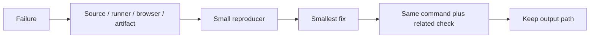

### Stop conditions

- Stop changing source when the failure is a missing runtime dependency.
- Stop updating snapshots when the diff has an unexplained content change.
- Stop widening types when the input has no runtime guard.
- Stop adding waits when the test has an ownership or cleanup bug.
- Stop after the requested behavior and rollback path have a passing check.

<a id="19--horizontal-project-rail"></a>
<h1 align="center">
   Horizontal project rail
</h1>

The About project rail uses native horizontal scrolling. CSS keeps the card width readable, creates snap points, and leaves touch scrolling to the browser.

```mermaid
flowchart LR
    C[Card width] --> O[overflow-x-auto]
    O --> X[Touch or wheel scroll]
    X --> S[snap-start card]
    S --> F[Focused rail]
```

### How it works

- `overflow-x-auto` creates a scroll container only when cards exceed the viewport.
- `flex-none` prevents cards from shrinking into unreadable columns.
- `snap-x` and `snap-start` align the next card after touch or trackpad movement.
- Responsive negative margins let the rail reach the content edge while its parent keeps page spacing.
- `tabIndex={0}` gives keyboard users an entry point; browser arrow keys handle movement.

### Project reading

```tsx
<div
  className="flex snap-x gap-4 overflow-x-auto pb-5"
  tabIndex={0}
  aria-label={railLabel}
>
  {projects.map((project) => (
    <div key={project.id} className="w-[min(86vw,28rem)] flex-none snap-start">
      <ProjectCard repo={project} />
    </div>
  ))}
</div>
```

### Decision table

| Rule | Purpose | Failure avoided |
|---|---|---|
| `overflow-x-auto` | Keep rail inside viewport | Page-wide horizontal overflow. |
| `flex-none` | Preserve card width | Compressed project previews. |
| `snap-start` | Align cards after movement | Partial, hard-to-read cards. |
| `tabIndex` | Expose keyboard focus | Keyboard user misses rail. |

### Checks

- Test desktop and mobile widths.
- Confirm document width does not exceed viewport width.
- Focus rail and send horizontal keyboard input.
- Test reduced motion without adding scroll animation to the rail itself.

<a id="references"></a>
<h1 align="center">
   References
</h1>

- https://developer.mozilla.org/en-US/docs/Web/CSS
- https://tailwindcss.com/docs
- https://web.dev/learn/css
- [Project README](../README.md)
- [Package scripts](../package.json)
- [GitHub Actions workflows](../.github/workflows/)

<details>
  <summary>Review checklist</summary>

- [ ] Source owner is named.
- [ ] Runtime boundary is named.
- [ ] Success and failure states are described.
- [ ] Example matches current project syntax.
- [ ] Focused check ran.
- [ ] Related browser or quality check ran.
- [ ] Evidence path is recorded.
- [ ] README link resolves.

</details>

---
