<div align="center">

<h1 align="center">
  
  JSX / Field Notes
</h1>

JSX syntax as typed JavaScript that becomes semantic HTML.

<a href="react.md">React docs</a>  <a href="typescript.md">TypeScript docs</a>  <a href="css.md">CSS docs</a>  <a href="../README.md">README</a>

</div>

---

<p align="center">
  
  
  
  
  
</p>

<table>
  <thead>
    <tr><th>Topic</th><th>Project baseline</th><th>Use it for</th></tr>
  </thead>
  <tbody>
    <tr><td>Syntax</td><td>TSX + react-jsx</td><td>Elements become React output.</td></tr>
    <tr><td>Inputs</td><td>props + children</td><td>Callers pass typed intent and content.</td></tr>
    <tr><td>Output</td><td>semantic HTML</td><td>The browser receives roles, names, and structure.</td></tr>
    <tr><td>Checks</td><td>tsc + runners</td><td>Compiler and user-facing tests catch different errors.</td></tr>
  </tbody>
</table>

## Contents

- [01 / Element syntax](#01--element-syntax)
- [02 / Expressions](#02--expressions)
- [03 / Props and attributes](#03--props-and-attributes)
- [04 / Fragments](#04--fragments)
- [05 / Children](#05--children)
- [06 / Conditional output](#06--conditional-output)
- [07 / Lists](#07--lists)
- [08 / Events](#08--events)
- [09 / Forms](#09--forms)
- [10 / TypeScript in JSX](#10--typescript-in-jsx)
- [11 / Server JSX](#11--server-jsx)
- [12 / JSX and CSS](#12--jsx-and-css)
- [13 / JSX and motion](#13--jsx-and-motion)
- [14 / JSX tests](#14--jsx-tests)
- [15 / Review checklist](#15--review-checklist)
- [16 / Troubleshooting JSX](#16--troubleshooting-jsx)
- [17 / Skill controls and project rail](#17--skill-controls-and-project-rail)
- [Repository map](#repository-map)
- [Command matrix](#command-matrix)
- [Evidence and troubleshooting](#evidence-and-troubleshooting)
- [References](#references)

<h1 align="center">
   Operating model
</h1>

This guide explains **JSX / Field Notes** through the source tree, the runtime boundary, the smallest useful test, and the evidence a reviewer can inspect.

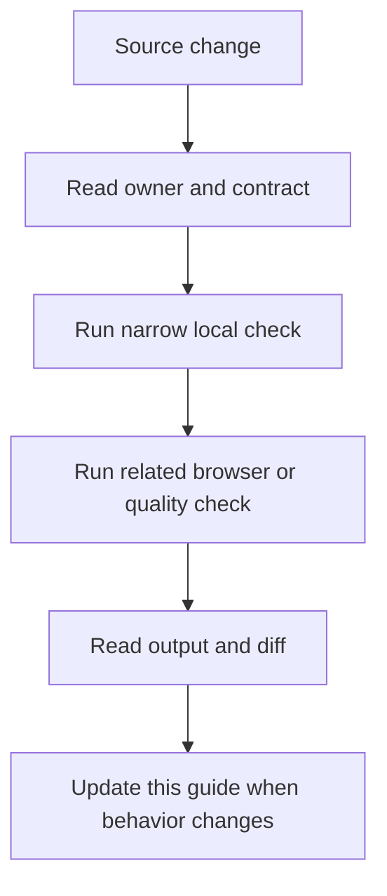

### Reading order

- Start at the section for the changed file or runtime.
- Copy the narrow command before running the broad suite.
- Check the failure branch and the evidence path.
- Compare README links after editing any docs entry point.

<a id="01--element-syntax"></a>
## 01 / Element syntax

JSX turns a readable element tree into calls that React can render.

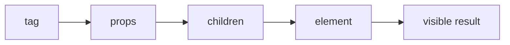

### How it works

1. `tag` enters **Element syntax** as the value, event, file, or runtime that needs a decision.
2. `props` applies the rule owned by this section; keep that decision close to its source boundary.
3. `children` carries the checked result to the next consumer instead of exposing private setup.
4. `element` receives the result and makes it visible through markup, output, or an exit code.
5. Exercise the normal path and the failure path at the runtime named by the example.

### Project reading

- **Rule:** Close every element and keep one parent tree or use a fragment.
- **Failure to catch:** A missing close tag or misplaced expression stops the file before tests run.
- **Evidence:** The compiler and a render smoke test.
- **Owner:** `JSX / Field Notes` documents the contract; source files and tests remain the executable reference.
- **Scope:** Read this section with the linked source path in the repository catalog below.

### Example

```tsx
const title = <h1>Projects</h1>;
const panel = <section aria-labelledby="title">
  <h2 id="title">{title}</h2>
</section>;
```

### Decision table

<table>
  <thead>
    <tr><th>Input</th><th>Project decision</th><th>Check</th></tr>
  </thead>
  <tbody>
    <tr><td>tag</td><td>Keep it at the boundary named by the section.</td><td>A focused test or source inspection.</td></tr>
    <tr><td>props</td><td>Use the smallest rule that explains the branch.</td><td>Lint, type check, or browser assertion.</td></tr>
    <tr><td>children</td><td>Return a readable value or state.</td><td>Success and failure cases.</td></tr>
    <tr><td>element</td><td>Expose a semantic or reviewable consumer.</td><td>Role, report, screenshot, or exit code.</td></tr>
  </tbody>
</table>

### Checks

- Inspect the owner for `props` before editing the consumer.
- Assert the successful `children` result through the public surface.
- Force the failure branch and confirm it reaches `element`.
- Record the command and artifact path shown in this guide.

<a id="02--expressions"></a>
## 02 / Expressions

Curly braces insert JavaScript values into JSX while markup remains declarative.

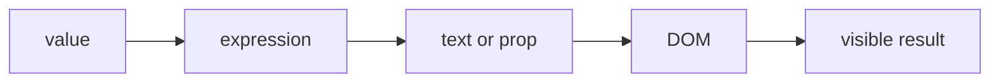

### How it works

1. `value` enters **Expressions** as the value, event, file, or runtime that needs a decision.
2. `expression` applies the rule owned by this section; keep that decision close to its source boundary.
3. `text or prop` carries the checked result to the next consumer instead of exposing private setup.
4. `DOM` receives the result and makes it visible through markup, output, or an exit code.
5. Exercise the normal path and the failure path at the runtime named by the example.

### Project reading

- **Rule:** Keep expressions small; move multi-step decisions to named variables above the return.
- **Failure to catch:** A nested ternary hides a branch or an object is rendered where text was expected.
- **Evidence:** Branch assertions for each visible output.
- **Owner:** `JSX / Field Notes` documents the contract; source files and tests remain the executable reference.
- **Scope:** Read this section with the linked source path in the repository catalog below.

### Example

```tsx
const label = count === 1 ? '1 item' : `${count} items`;
return <span aria-label={label}>{label}</span>;
```

### Decision table

<table>
  <thead>
    <tr><th>Input</th><th>Project decision</th><th>Check</th></tr>
  </thead>
  <tbody>
    <tr><td>value</td><td>Keep it at the boundary named by the section.</td><td>A focused test or source inspection.</td></tr>
    <tr><td>expression</td><td>Use the smallest rule that explains the branch.</td><td>Lint, type check, or browser assertion.</td></tr>
    <tr><td>text or prop</td><td>Return a readable value or state.</td><td>Success and failure cases.</td></tr>
    <tr><td>DOM</td><td>Expose a semantic or reviewable consumer.</td><td>Role, report, screenshot, or exit code.</td></tr>
  </tbody>
</table>

### Checks

- Inspect the owner for `expression` before editing the consumer.
- Assert the successful `text or prop` result through the public surface.
- Force the failure branch and confirm it reaches `DOM`.
- Record the command and artifact path shown in this guide.

<a id="03--props-and-attributes"></a>
## 03 / Props and attributes

JSX uses JavaScript property names and typed values for component and DOM props.

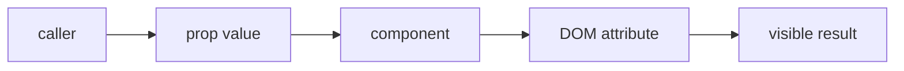

### How it works

1. `caller` enters **Props and attributes** as the value, event, file, or runtime that needs a decision.
2. `prop value` applies the rule owned by this section; keep that decision close to its source boundary.
3. `component` carries the checked result to the next consumer instead of exposing private setup.
4. `DOM attribute` receives the result and makes it visible through markup, output, or an exit code.
5. Exercise the normal path and the failure path at the runtime named by the example.

### Project reading

- **Rule:** Use htmlFor, className, and boolean properties according to React DOM conventions.
- **Failure to catch:** A string such as disabled="false" still disables a control.
- **Evidence:** Rendered attribute assertions and type checking.
- **Owner:** `JSX / Field Notes` documents the contract; source files and tests remain the executable reference.
- **Scope:** Read this section with the linked source path in the repository catalog below.

### Example

```tsx
<label htmlFor="query">Search</label>
<input id="query" className="field" disabled={false} />
```

### Decision table

<table>
  <thead>
    <tr><th>Input</th><th>Project decision</th><th>Check</th></tr>
  </thead>
  <tbody>
    <tr><td>caller</td><td>Keep it at the boundary named by the section.</td><td>A focused test or source inspection.</td></tr>
    <tr><td>prop value</td><td>Use the smallest rule that explains the branch.</td><td>Lint, type check, or browser assertion.</td></tr>
    <tr><td>component</td><td>Return a readable value or state.</td><td>Success and failure cases.</td></tr>
    <tr><td>DOM attribute</td><td>Expose a semantic or reviewable consumer.</td><td>Role, report, screenshot, or exit code.</td></tr>
  </tbody>
</table>

### Checks

- Inspect the owner for `prop value` before editing the consumer.
- Assert the successful `component` result through the public surface.
- Force the failure branch and confirm it reaches `DOM attribute`.
- Record the command and artifact path shown in this guide.

<a id="04--fragments"></a>
## 04 / Fragments

Fragments group siblings without adding a wrapper element to the DOM.

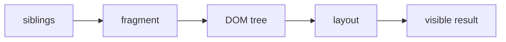

### How it works

1. `siblings` enters **Fragments** as the value, event, file, or runtime that needs a decision.
2. `fragment` applies the rule owned by this section; keep that decision close to its source boundary.
3. `DOM tree` carries the checked result to the next consumer instead of exposing private setup.
4. `layout` receives the result and makes it visible through markup, output, or an exit code.
5. Exercise the normal path and the failure path at the runtime named by the example.

### Project reading

- **Rule:** Use a fragment when grouping has no semantic meaning; use a section or list when it does.
- **Failure to catch:** A wrapper changes layout, landmark structure, or selector behavior.
- **Evidence:** DOM shape and accessibility tree assertions.
- **Owner:** `JSX / Field Notes` documents the contract; source files and tests remain the executable reference.
- **Scope:** Read this section with the linked source path in the repository catalog below.

### Example

```tsx
return (
  <>
    <h1>About</h1>
    <p>Systems and interfaces.</p>
  </>
);
```

### Decision table

<table>
  <thead>
    <tr><th>Input</th><th>Project decision</th><th>Check</th></tr>
  </thead>
  <tbody>
    <tr><td>siblings</td><td>Keep it at the boundary named by the section.</td><td>A focused test or source inspection.</td></tr>
    <tr><td>fragment</td><td>Use the smallest rule that explains the branch.</td><td>Lint, type check, or browser assertion.</td></tr>
    <tr><td>DOM tree</td><td>Return a readable value or state.</td><td>Success and failure cases.</td></tr>
    <tr><td>layout</td><td>Expose a semantic or reviewable consumer.</td><td>Role, report, screenshot, or exit code.</td></tr>
  </tbody>
</table>

### Checks

- Inspect the owner for `fragment` before editing the consumer.
- Assert the successful `DOM tree` result through the public surface.
- Force the failure branch and confirm it reaches `layout`.
- Record the command and artifact path shown in this guide.

<a id="05--children"></a>
## 05 / Children

Children let the caller own nested content while the receiving component owns the frame and semantics.

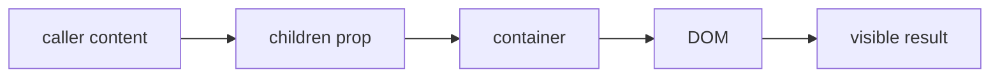

### How it works

1. `caller content` enters **Children** as the value, event, file, or runtime that needs a decision.
2. `children prop` applies the rule owned by this section; keep that decision close to its source boundary.
3. `container` carries the checked result to the next consumer instead of exposing private setup.
4. `DOM` receives the result and makes it visible through markup, output, or an exit code.
5. Exercise the normal path and the failure path at the runtime named by the example.

### Project reading

- **Rule:** Type children as ReactNode and give the container a meaningful role or element.
- **Failure to catch:** The component accepts opaque HTML but exposes no heading relationship or label.
- **Evidence:** A composed render test that checks the visible nested content.
- **Owner:** `JSX / Field Notes` documents the contract; source files and tests remain the executable reference.
- **Scope:** Read this section with the linked source path in the repository catalog below.

### Example

```tsx
function Panel({ title, children }: { title: string; children: React.ReactNode }) {
  return <section aria-label={title}>{children}</section>;
}
```

### Decision table

<table>
  <thead>
    <tr><th>Input</th><th>Project decision</th><th>Check</th></tr>
  </thead>
  <tbody>
    <tr><td>caller content</td><td>Keep it at the boundary named by the section.</td><td>A focused test or source inspection.</td></tr>
    <tr><td>children prop</td><td>Use the smallest rule that explains the branch.</td><td>Lint, type check, or browser assertion.</td></tr>
    <tr><td>container</td><td>Return a readable value or state.</td><td>Success and failure cases.</td></tr>
    <tr><td>DOM</td><td>Expose a semantic or reviewable consumer.</td><td>Role, report, screenshot, or exit code.</td></tr>
  </tbody>
</table>

### Checks

- Inspect the owner for `children prop` before editing the consumer.
- Assert the successful `container` result through the public surface.
- Force the failure branch and confirm it reaches `DOM`.
- Record the command and artifact path shown in this guide.

<a id="06--conditional-output"></a>
## 06 / Conditional output

JSX conditions decide which branch reaches the DOM.

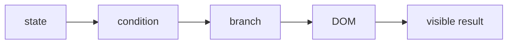

### How it works

1. `state` enters **Conditional output** as the value, event, file, or runtime that needs a decision.
2. `condition` applies the rule owned by this section; keep that decision close to its source boundary.
3. `branch` carries the checked result to the next consumer instead of exposing private setup.
4. `DOM` receives the result and makes it visible through markup, output, or an exit code.
5. Exercise the normal path and the failure path at the runtime named by the example.

### Project reading

- **Rule:** Use explicit branches when zero, empty strings, or false are valid values.
- **Failure to catch:** A count of zero renders an unwanted 0 or an error branch disappears.
- **Evidence:** Tests for true, false, zero, empty, and error values.
- **Owner:** `JSX / Field Notes` documents the contract; source files and tests remain the executable reference.
- **Scope:** Read this section with the linked source path in the repository catalog below.

### Example

```tsx
{loading ? <Spinner /> : error ? <ErrorNotice /> : <ProjectList items={items} />}
{count > 0 && <span>{count}</span>}
```

### Decision table

<table>
  <thead>
    <tr><th>Input</th><th>Project decision</th><th>Check</th></tr>
  </thead>
  <tbody>
    <tr><td>state</td><td>Keep it at the boundary named by the section.</td><td>A focused test or source inspection.</td></tr>
    <tr><td>condition</td><td>Use the smallest rule that explains the branch.</td><td>Lint, type check, or browser assertion.</td></tr>
    <tr><td>branch</td><td>Return a readable value or state.</td><td>Success and failure cases.</td></tr>
    <tr><td>DOM</td><td>Expose a semantic or reviewable consumer.</td><td>Role, report, screenshot, or exit code.</td></tr>
  </tbody>
</table>

### Checks

- Inspect the owner for `condition` before editing the consumer.
- Assert the successful `branch` result through the public surface.
- Force the failure branch and confirm it reaches `DOM`.
- Record the command and artifact path shown in this guide.

<a id="07--lists"></a>
## 07 / Lists

Array mapping creates repeated JSX while stable keys preserve child identity.

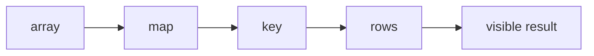

### How it works

1. `array` enters **Lists** as the value, event, file, or runtime that needs a decision.
2. `map` applies the rule owned by this section; keep that decision close to its source boundary.
3. `key` carries the checked result to the next consumer instead of exposing private setup.
4. `rows` receives the result and makes it visible through markup, output, or an exit code.
5. Exercise the normal path and the failure path at the runtime named by the example.

### Project reading

- **Rule:** Keep key at the element returned by map and use domain identity.
- **Failure to catch:** A key lives inside a child component or an index causes state to move after sorting.
- **Evidence:** A list render and order-change test.
- **Owner:** `JSX / Field Notes` documents the contract; source files and tests remain the executable reference.
- **Scope:** Read this section with the linked source path in the repository catalog below.

### Example

```tsx
<ul>
  {items.map((item) => (
    <li key={item.id}>{item.label}</li>
  ))}
</ul>
```

### Decision table

<table>
  <thead>
    <tr><th>Input</th><th>Project decision</th><th>Check</th></tr>
  </thead>
  <tbody>
    <tr><td>array</td><td>Keep it at the boundary named by the section.</td><td>A focused test or source inspection.</td></tr>
    <tr><td>map</td><td>Use the smallest rule that explains the branch.</td><td>Lint, type check, or browser assertion.</td></tr>
    <tr><td>key</td><td>Return a readable value or state.</td><td>Success and failure cases.</td></tr>
    <tr><td>rows</td><td>Expose a semantic or reviewable consumer.</td><td>Role, report, screenshot, or exit code.</td></tr>
  </tbody>
</table>

### Checks

- Inspect the owner for `map` before editing the consumer.
- Assert the successful `key` result through the public surface.
- Force the failure branch and confirm it reaches `rows`.
- Record the command and artifact path shown in this guide.

<a id="08--events"></a>
## 08 / Events

JSX passes functions to event props; React calls them with browser event data.

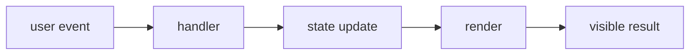

### How it works

1. `user event` enters **Events** as the value, event, file, or runtime that needs a decision.
2. `handler` applies the rule owned by this section; keep that decision close to its source boundary.
3. `state update` carries the checked result to the next consumer instead of exposing private setup.
4. `render` receives the result and makes it visible through markup, output, or an exit code.
5. Exercise the normal path and the failure path at the runtime named by the example.

### Project reading

- **Rule:** Pass a function reference or callback expression, not the result of calling it during render.
- **Failure to catch:** onClick={close()} runs while rendering and passes an undefined handler.
- **Evidence:** Keyboard and pointer event tests.
- **Owner:** `JSX / Field Notes` documents the contract; source files and tests remain the executable reference.
- **Scope:** Read this section with the linked source path in the repository catalog below.

### Example

```tsx
<button type="button" onClick={onClose}>Close</button>
<input onChange={(event) => setQuery(event.currentTarget.value)} />
```

### Decision table

<table>
  <thead>
    <tr><th>Input</th><th>Project decision</th><th>Check</th></tr>
  </thead>
  <tbody>
    <tr><td>user event</td><td>Keep it at the boundary named by the section.</td><td>A focused test or source inspection.</td></tr>
    <tr><td>handler</td><td>Use the smallest rule that explains the branch.</td><td>Lint, type check, or browser assertion.</td></tr>
    <tr><td>state update</td><td>Return a readable value or state.</td><td>Success and failure cases.</td></tr>
    <tr><td>render</td><td>Expose a semantic or reviewable consumer.</td><td>Role, report, screenshot, or exit code.</td></tr>
  </tbody>
</table>

### Checks

- Inspect the owner for `handler` before editing the consumer.
- Assert the successful `state update` result through the public surface.
- Force the failure branch and confirm it reaches `render`.
- Record the command and artifact path shown in this guide.

<a id="09--forms"></a>
## 09 / Forms

JSX expresses labels, inputs, validation attributes, and submit controls as one browser form.

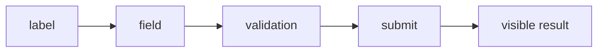

### How it works

1. `label` enters **Forms** as the value, event, file, or runtime that needs a decision.
2. `field` applies the rule owned by this section; keep that decision close to its source boundary.
3. `validation` carries the checked result to the next consumer instead of exposing private setup.
4. `submit` receives the result and makes it visible through markup, output, or an exit code.
5. Exercise the normal path and the failure path at the runtime named by the example.

### Project reading

- **Rule:** Let native constraints handle basic shape, then test the submit boundary.
- **Failure to catch:** A field has placeholder text but no accessible label or the submit button submits the wrong form.
- **Evidence:** Role, label, invalid, and valid submit checks.
- **Owner:** `JSX / Field Notes` documents the contract; source files and tests remain the executable reference.
- **Scope:** Read this section with the linked source path in the repository catalog below.

### Example

```tsx
<form onSubmit={handleSubmit}>
  <label htmlFor="message">Message</label>
  <textarea id="message" required />
  <button type="submit">Send</button>
</form>
```

### Decision table

<table>
  <thead>
    <tr><th>Input</th><th>Project decision</th><th>Check</th></tr>
  </thead>
  <tbody>
    <tr><td>label</td><td>Keep it at the boundary named by the section.</td><td>A focused test or source inspection.</td></tr>
    <tr><td>field</td><td>Use the smallest rule that explains the branch.</td><td>Lint, type check, or browser assertion.</td></tr>
    <tr><td>validation</td><td>Return a readable value or state.</td><td>Success and failure cases.</td></tr>
    <tr><td>submit</td><td>Expose a semantic or reviewable consumer.</td><td>Role, report, screenshot, or exit code.</td></tr>
  </tbody>
</table>

### Checks

- Inspect the owner for `field` before editing the consumer.
- Assert the successful `validation` result through the public surface.
- Force the failure branch and confirm it reaches `submit`.
- Record the command and artifact path shown in this guide.

<a id="10--typescript-in-jsx"></a>
## 10 / TypeScript in JSX

TSX combines JSX syntax with TypeScript contracts for props, event targets, refs, and children.

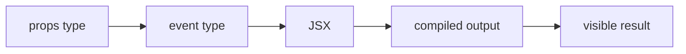

### How it works

1. `props type` enters **TypeScript in JSX** as the value, event, file, or runtime that needs a decision.
2. `event type` applies the rule owned by this section; keep that decision close to its source boundary.
3. `JSX` carries the checked result to the next consumer instead of exposing private setup.
4. `compiled output` receives the result and makes it visible through markup, output, or an exit code.
5. Exercise the normal path and the failure path at the runtime named by the example.

### Project reading

- **Rule:** Type the public prop once and let event types infer from the intrinsic element where possible.
- **Failure to catch:** A broad event cast hides a missing field or a prop allows an impossible mode.
- **Evidence:** tsc plus a user behavior test.
- **Owner:** `JSX / Field Notes` documents the contract; source files and tests remain the executable reference.
- **Scope:** Read this section with the linked source path in the repository catalog below.

### Example

```tsx
type FilterProps = {
  value: string;
  onChange: (value: string) => void;
};

function Filter({ value, onChange }: FilterProps) {
  return <input value={value} onChange={(event) => onChange(event.currentTarget.value)} />;
}
```

### Decision table

<table>
  <thead>
    <tr><th>Input</th><th>Project decision</th><th>Check</th></tr>
  </thead>
  <tbody>
    <tr><td>props type</td><td>Keep it at the boundary named by the section.</td><td>A focused test or source inspection.</td></tr>
    <tr><td>event type</td><td>Use the smallest rule that explains the branch.</td><td>Lint, type check, or browser assertion.</td></tr>
    <tr><td>JSX</td><td>Return a readable value or state.</td><td>Success and failure cases.</td></tr>
    <tr><td>compiled output</td><td>Expose a semantic or reviewable consumer.</td><td>Role, report, screenshot, or exit code.</td></tr>
  </tbody>
</table>

### Checks

- Inspect the owner for `event type` before editing the consumer.
- Assert the successful `JSX` result through the public surface.
- Force the failure branch and confirm it reaches `compiled output`.
- Record the command and artifact path shown in this guide.

<a id="11--server-jsx"></a>
## 11 / Server JSX

Server-rendered JSX can emit HTML before client hydration; browser hooks need a client boundary.

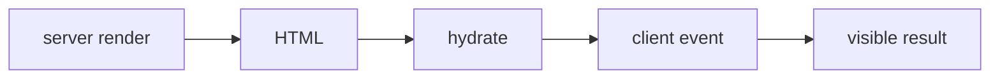

### How it works

1. `server render` enters **Server JSX** as the value, event, file, or runtime that needs a decision.
2. `HTML` applies the rule owned by this section; keep that decision close to its source boundary.
3. `hydrate` carries the checked result to the next consumer instead of exposing private setup.
4. `client event` receives the result and makes it visible through markup, output, or an exit code.
5. Exercise the normal path and the failure path at the runtime named by the example.

### Project reading

- **Rule:** Keep the initial tree deterministic so server HTML and client output agree.
- **Failure to catch:** A random value, date, or browser read changes the first client render.
- **Evidence:** Production build plus browser hydration checks.
- **Owner:** `JSX / Field Notes` documents the contract; source files and tests remain the executable reference.
- **Scope:** Read this section with the linked source path in the repository catalog below.

### Example

```tsx
export default function Page() {
  return <main><h1>Projects</h1><ProjectSummary /></main>;
}
```

### Decision table

<table>
  <thead>
    <tr><th>Input</th><th>Project decision</th><th>Check</th></tr>
  </thead>
  <tbody>
    <tr><td>server render</td><td>Keep it at the boundary named by the section.</td><td>A focused test or source inspection.</td></tr>
    <tr><td>HTML</td><td>Use the smallest rule that explains the branch.</td><td>Lint, type check, or browser assertion.</td></tr>
    <tr><td>hydrate</td><td>Return a readable value or state.</td><td>Success and failure cases.</td></tr>
    <tr><td>client event</td><td>Expose a semantic or reviewable consumer.</td><td>Role, report, screenshot, or exit code.</td></tr>
  </tbody>
</table>

### Checks

- Inspect the owner for `HTML` before editing the consumer.
- Assert the successful `hydrate` result through the public surface.
- Force the failure branch and confirm it reaches `client event`.
- Record the command and artifact path shown in this guide.

<a id="12--jsx-and-css"></a>
## 12 / JSX and CSS

Class names connect JSX structure to Tailwind utilities, global tokens, and component selectors.

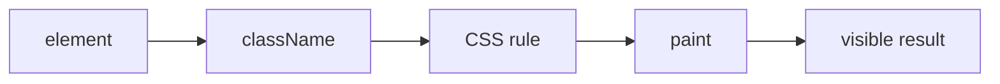

### How it works

1. `element` enters **JSX and CSS** as the value, event, file, or runtime that needs a decision.
2. `className` applies the rule owned by this section; keep that decision close to its source boundary.
3. `CSS rule` carries the checked result to the next consumer instead of exposing private setup.
4. `paint` receives the result and makes it visible through markup, output, or an exit code.
5. Exercise the normal path and the failure path at the runtime named by the example.

### Project reading

- **Rule:** Keep class names tied to stable structure and document any data attribute used by CSS.
- **Failure to catch:** A visual state uses a class that never reaches the stylesheet or a selector is too broad.
- **Evidence:** Visual snapshot and DOM class assertion.
- **Owner:** `JSX / Field Notes` documents the contract; source files and tests remain the executable reference.
- **Scope:** Read this section with the linked source path in the repository catalog below.

### Example

```tsx
<article className="project-card" data-tone={tone}>
  <h2 className="project-card__title">{name}</h2>
</article>
```

### Decision table

<table>
  <thead>
    <tr><th>Input</th><th>Project decision</th><th>Check</th></tr>
  </thead>
  <tbody>
    <tr><td>element</td><td>Keep it at the boundary named by the section.</td><td>A focused test or source inspection.</td></tr>
    <tr><td>className</td><td>Use the smallest rule that explains the branch.</td><td>Lint, type check, or browser assertion.</td></tr>
    <tr><td>CSS rule</td><td>Return a readable value or state.</td><td>Success and failure cases.</td></tr>
    <tr><td>paint</td><td>Expose a semantic or reviewable consumer.</td><td>Role, report, screenshot, or exit code.</td></tr>
  </tbody>
</table>

### Checks

- Inspect the owner for `className` before editing the consumer.
- Assert the successful `CSS rule` result through the public surface.
- Force the failure branch and confirm it reaches `paint`.
- Record the command and artifact path shown in this guide.

<a id="13--jsx-and-motion"></a>
## 13 / JSX and motion

Motion components extend JSX with animation props while the DOM still needs meaningful content.

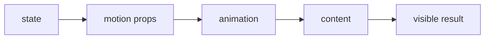

### How it works

1. `state` enters **JSX and motion** as the value, event, file, or runtime that needs a decision.
2. `motion props` applies the rule owned by this section; keep that decision close to its source boundary.
3. `animation` carries the checked result to the next consumer instead of exposing private setup.
4. `content` receives the result and makes it visible through markup, output, or an exit code.
5. Exercise the normal path and the failure path at the runtime named by the example.

### Project reading

- **Rule:** Keep animation optional and keep the content present in the static tree.
- **Failure to catch:** The page communicates state only through opacity or movement.
- **Evidence:** Reduced-motion and visible-content tests.
- **Owner:** `JSX / Field Notes` documents the contract; source files and tests remain the executable reference.
- **Scope:** Read this section with the linked source path in the repository catalog below.

### Example

```tsx
<motion.div
  initial={{ opacity: 0, y: 12 }}
  animate={{ opacity: 1, y: 0 }}
>
  <h2>Loaded</h2>
</motion.div>
```

### Decision table

<table>
  <thead>
    <tr><th>Input</th><th>Project decision</th><th>Check</th></tr>
  </thead>
  <tbody>
    <tr><td>state</td><td>Keep it at the boundary named by the section.</td><td>A focused test or source inspection.</td></tr>
    <tr><td>motion props</td><td>Use the smallest rule that explains the branch.</td><td>Lint, type check, or browser assertion.</td></tr>
    <tr><td>animation</td><td>Return a readable value or state.</td><td>Success and failure cases.</td></tr>
    <tr><td>content</td><td>Expose a semantic or reviewable consumer.</td><td>Role, report, screenshot, or exit code.</td></tr>
  </tbody>
</table>

### Checks

- Inspect the owner for `motion props` before editing the consumer.
- Assert the successful `animation` result through the public surface.
- Force the failure branch and confirm it reaches `content`.
- Record the command and artifact path shown in this guide.

<a id="14--jsx-tests"></a>
## 14 / JSX tests

A TSX test renders the tree, queries the browser-facing contract, performs an action, and checks the result.

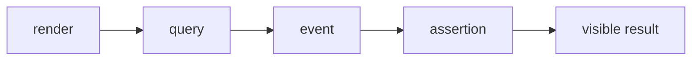

### How it works

1. `render` enters **JSX tests** as the value, event, file, or runtime that needs a decision.
2. `query` applies the rule owned by this section; keep that decision close to its source boundary.
3. `event` carries the checked result to the next consumer instead of exposing private setup.
4. `assertion` receives the result and makes it visible through markup, output, or an exit code.
5. Exercise the normal path and the failure path at the runtime named by the example.

### Project reading

- **Rule:** Keep test selectors aligned with roles, names, labels, and visible text.
- **Failure to catch:** A test depends on class names or implementation state instead of user behavior.
- **Evidence:** The test source, command, and report.
- **Owner:** `JSX / Field Notes` documents the contract; source files and tests remain the executable reference.
- **Scope:** Read this section with the linked source path in the repository catalog below.

### Example

```tsx
render(<Filter value="react" onChange={onChange} />);
await user.clear(screen.getByRole('textbox'));
await user.type(screen.getByRole('textbox'), 'css');
expect(onChange).toHaveBeenLastCalledWith('css');
```

### Decision table

<table>
  <thead>
    <tr><th>Input</th><th>Project decision</th><th>Check</th></tr>
  </thead>
  <tbody>
    <tr><td>render</td><td>Keep it at the boundary named by the section.</td><td>A focused test or source inspection.</td></tr>
    <tr><td>query</td><td>Use the smallest rule that explains the branch.</td><td>Lint, type check, or browser assertion.</td></tr>
    <tr><td>event</td><td>Return a readable value or state.</td><td>Success and failure cases.</td></tr>
    <tr><td>assertion</td><td>Expose a semantic or reviewable consumer.</td><td>Role, report, screenshot, or exit code.</td></tr>
  </tbody>
</table>

### Checks

- Inspect the owner for `query` before editing the consumer.
- Assert the successful `event` result through the public surface.
- Force the failure branch and confirm it reaches `assertion`.
- Record the command and artifact path shown in this guide.

<a id="15--review-checklist"></a>
## 15 / Review checklist

Review JSX as both JavaScript and HTML: inspect expressions, identity, semantics, and browser behavior.

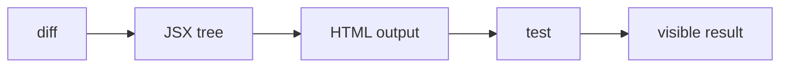

### How it works

1. `diff` enters **Review checklist** as the value, event, file, or runtime that needs a decision.
2. `JSX tree` applies the rule owned by this section; keep that decision close to its source boundary.
3. `HTML output` carries the checked result to the next consumer instead of exposing private setup.
4. `test` receives the result and makes it visible through markup, output, or an exit code.
5. Exercise the normal path and the failure path at the runtime named by the example.

### Project reading

- **Rule:** Read the returned tree from top to bottom and name what each element means.
- **Failure to catch:** A tidy component contains a hidden semantics or event problem.
- **Evidence:** A short review note with one behavior command.
- **Owner:** `JSX / Field Notes` documents the contract; source files and tests remain the executable reference.
- **Scope:** Read this section with the linked source path in the repository catalog below.

### Example

```ts
const checks = ['balanced tree', 'stable keys', 'native controls', 'typed handlers', 'visible states'];
```

### Decision table

<table>
  <thead>
    <tr><th>Input</th><th>Project decision</th><th>Check</th></tr>
  </thead>
  <tbody>
    <tr><td>diff</td><td>Keep it at the boundary named by the section.</td><td>A focused test or source inspection.</td></tr>
    <tr><td>JSX tree</td><td>Use the smallest rule that explains the branch.</td><td>Lint, type check, or browser assertion.</td></tr>
    <tr><td>HTML output</td><td>Return a readable value or state.</td><td>Success and failure cases.</td></tr>
    <tr><td>test</td><td>Expose a semantic or reviewable consumer.</td><td>Role, report, screenshot, or exit code.</td></tr>
  </tbody>
</table>

### Checks

- Inspect the owner for `JSX tree` before editing the consumer.
- Assert the successful `HTML output` result through the public surface.
- Force the failure branch and confirm it reaches `test`.
- Record the command and artifact path shown in this guide.

<a id="16--troubleshooting-jsx"></a>
## 16 / Troubleshooting JSX

Compiler errors, hydration warnings, and odd DOM output each point to a different JSX boundary.

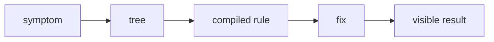

### How it works

1. `symptom` enters **Troubleshooting JSX** as the value, event, file, or runtime that needs a decision.
2. `tree` applies the rule owned by this section; keep that decision close to its source boundary.
3. `compiled rule` carries the checked result to the next consumer instead of exposing private setup.
4. `fix` receives the result and makes it visible through markup, output, or an exit code.
5. Exercise the normal path and the failure path at the runtime named by the example.

### Project reading

- **Rule:** Reduce the tree to one element and add branches back after the smallest case passes.
- **Failure to catch:** A broad rewrite removes the symptom while changing unrelated layout or behavior.
- **Evidence:** Small reproducer plus compiler, test, or browser output.
- **Owner:** `JSX / Field Notes` documents the contract; source files and tests remain the executable reference.
- **Scope:** Read this section with the linked source path in the repository catalog below.

### Example

```tsx
return condition
  ? <Success value={value} />
  : <ErrorNotice message={message} />;
```

### Decision table

<table>
  <thead>
    <tr><th>Input</th><th>Project decision</th><th>Check</th></tr>
  </thead>
  <tbody>
    <tr><td>symptom</td><td>Keep it at the boundary named by the section.</td><td>A focused test or source inspection.</td></tr>
    <tr><td>tree</td><td>Use the smallest rule that explains the branch.</td><td>Lint, type check, or browser assertion.</td></tr>
    <tr><td>compiled rule</td><td>Return a readable value or state.</td><td>Success and failure cases.</td></tr>
    <tr><td>fix</td><td>Expose a semantic or reviewable consumer.</td><td>Role, report, screenshot, or exit code.</td></tr>
  </tbody>
</table>

### Checks

- Inspect the owner for `tree` before editing the consumer.
- Assert the successful `compiled rule` result through the public surface.
- Force the failure branch and confirm it reaches `fix`.
- Record the command and artifact path shown in this guide.

<a id="repository-map"></a>
<h1 align="center">
   Repository map
</h1>

The catalog is intentionally concrete. Use it to jump from a concept to the source or test that implements it.

<table>
  <thead>
    <tr><th>Area</th><th>Paths</th><th>Read for</th></tr>
  </thead>
  <tbody>
    <tr><td>Application</td><td>`src/app/`</td><td>Routes, layouts, metadata, and API handlers.</td></tr>
    <tr><td>Components</td><td>`src/components/`</td><td>React composition, effects, UI, and project surfaces.</td></tr>
    <tr><td>Tests</td><td>`tests/` and `src/**/tests/`</td><td>Runner-specific behavior and boundary cases.</td></tr>
    <tr><td>Scripts</td><td>`scripts/tests/` and `scripts/qa/`</td><td>Quality reports, server startup, screenshots, and video conversion.</td></tr>
    <tr><td>Automation</td><td>`.github/workflows/`</td><td>CI triggers, jobs, artifacts, and delivery.</td></tr>
  </tbody>
</table>


<table>
  <thead>
    <tr><th>Path</th><th>Relation to this guide</th><th>Open with</th></tr>
  </thead>
  <tbody>
    <tr><td><code>.github/workflows/ci.yml</code></td><td>Automation or delivery boundary.</td><td>`ci.md` or the workflow job log.</td></tr>
    <tr><td><code>.github/workflows/codeql.yml</code></td><td>Automation or delivery boundary.</td><td>`ci.md` or the workflow job log.</td></tr>
    <tr><td><code>.github/workflows/dependencies.yml</code></td><td>Automation or delivery boundary.</td><td>`ci.md` or the workflow job log.</td></tr>
    <tr><td><code>.github/workflows/deploy.yml</code></td><td>Automation or delivery boundary.</td><td>`ci.md` or the workflow job log.</td></tr>
    <tr><td><code>.github/workflows/docker.yml</code></td><td>Automation or delivery boundary.</td><td>`ci.md` or the workflow job log.</td></tr>
    <tr><td><code>.github/workflows/frontend-qa.yml</code></td><td>Automation or delivery boundary.</td><td>`ci.md` or the workflow job log.</td></tr>
    <tr><td><code>.storybook/main.ts</code></td><td>Application source, typed component, or style rule.</td><td>The nearest test and route.</td></tr>
    <tr><td><code>README.md</code></td><td>Project configuration or documentation entry point.</td><td>The command that consumes it.</td></tr>
    <tr><td><code>jest.config.js</code></td><td>Project configuration or documentation entry point.</td><td>The command that consumes it.</td></tr>
    <tr><td><code>lighthouserc.js</code></td><td>Project configuration or documentation entry point.</td><td>The command that consumes it.</td></tr>
    <tr><td><code>package.json</code></td><td>Project configuration or documentation entry point.</td><td>The command that consumes it.</td></tr>
    <tr><td><code>playwright.config.ts</code></td><td>Application source, typed component, or style rule.</td><td>The nearest test and route.</td></tr>
    <tr><td><code>scripts/qa/capture-lighthouse-screenshots.mjs</code></td><td>QA runtime helper or evidence producer.</td><td>`testing.md` or `qa.md`.</td></tr>
    <tr><td><code>scripts/qa/convert-playwright-video.mjs</code></td><td>QA runtime helper or evidence producer.</td><td>`testing.md` or `qa.md`.</td></tr>
    <tr><td><code>scripts/qa/start-production.mjs</code></td><td>QA runtime helper or evidence producer.</td><td>`testing.md` or `qa.md`.</td></tr>
    <tr><td><code>scripts/tests/benchmark.mjs</code></td><td>Behavior check or test fixture.</td><td>The related source module.</td></tr>
    <tr><td><code>scripts/tests/benchmark.node-test.mjs</code></td><td>Behavior check or test fixture.</td><td>The related source module.</td></tr>
    <tr><td><code>scripts/tests/check-file-size.mjs</code></td><td>Behavior check or test fixture.</td><td>The related source module.</td></tr>
    <tr><td><code>scripts/tests/check-file-size.node-test.mjs</code></td><td>Behavior check or test fixture.</td><td>The related source module.</td></tr>
    <tr><td><code>scripts/tests/file-size-policy.mjs</code></td><td>Behavior check or test fixture.</td><td>The related source module.</td></tr>
    <tr><td><code>scripts/tests/jscpd.mjs</code></td><td>Behavior check or test fixture.</td><td>The related source module.</td></tr>
    <tr><td><code>scripts/tests/jscpd.node-test.mjs</code></td><td>Behavior check or test fixture.</td><td>The related source module.</td></tr>
    <tr><td><code>scripts/tests/quality-metrics.mjs</code></td><td>Behavior check or test fixture.</td><td>The related source module.</td></tr>
    <tr><td><code>scripts/tests/quality-metrics.node-test.mjs</code></td><td>Behavior check or test fixture.</td><td>The related source module.</td></tr>
    <tr><td><code>scripts/tests/quality-policy.mjs</code></td><td>Behavior check or test fixture.</td><td>The related source module.</td></tr>
    <tr><td><code>scripts/tests/quality-report.mjs</code></td><td>Behavior check or test fixture.</td><td>The related source module.</td></tr>
    <tr><td><code>scripts/tests/quality-report.node-test.mjs</code></td><td>Behavior check or test fixture.</td><td>The related source module.</td></tr>
    <tr><td><code>scripts/tests/quality-review.mjs</code></td><td>Behavior check or test fixture.</td><td>The related source module.</td></tr>
    <tr><td><code>scripts/tests/quality-review.node-test.mjs</code></td><td>Behavior check or test fixture.</td><td>The related source module.</td></tr>
    <tr><td><code>scripts/tests/quality-security.mjs</code></td><td>Behavior check or test fixture.</td><td>The related source module.</td></tr>
    <tr><td><code>src/app/[locale]/[...not-found]/page.tsx</code></td><td>Application source, typed component, or style rule.</td><td>The nearest test and route.</td></tr>
    <tr><td><code>src/app/[locale]/about/layout.tsx</code></td><td>Application source, typed component, or style rule.</td><td>The nearest test and route.</td></tr>
    <tr><td><code>src/app/[locale]/about/page.tsx</code></td><td>Application source, typed component, or style rule.</td><td>The nearest test and route.</td></tr>
    <tr><td><code>src/app/[locale]/certifications/layout.tsx</code></td><td>Application source, typed component, or style rule.</td><td>The nearest test and route.</td></tr>
    <tr><td><code>src/app/[locale]/certifications/page.tsx</code></td><td>Application source, typed component, or style rule.</td><td>The nearest test and route.</td></tr>
    <tr><td><code>src/app/[locale]/chat/layout.tsx</code></td><td>Application source, typed component, or style rule.</td><td>The nearest test and route.</td></tr>
    <tr><td><code>src/app/[locale]/chat/page.tsx</code></td><td>Application source, typed component, or style rule.</td><td>The nearest test and route.</td></tr>
    <tr><td><code>src/app/[locale]/contact/layout.tsx</code></td><td>Application source, typed component, or style rule.</td><td>The nearest test and route.</td></tr>
    <tr><td><code>src/app/[locale]/contact/page.tsx</code></td><td>Application source, typed component, or style rule.</td><td>The nearest test and route.</td></tr>
    <tr><td><code>src/app/[locale]/layout.tsx</code></td><td>Application source, typed component, or style rule.</td><td>The nearest test and route.</td></tr>
    <tr><td><code>src/app/[locale]/not-found.tsx</code></td><td>Application source, typed component, or style rule.</td><td>The nearest test and route.</td></tr>
    <tr><td><code>src/app/[locale]/page.tsx</code></td><td>Application source, typed component, or style rule.</td><td>The nearest test and route.</td></tr>
    <tr><td><code>src/app/[locale]/projects/layout.tsx</code></td><td>Application source, typed component, or style rule.</td><td>The nearest test and route.</td></tr>
    <tr><td><code>src/app/[locale]/projects/page.tsx</code></td><td>Application source, typed component, or style rule.</td><td>The nearest test and route.</td></tr>
    <tr><td><code>src/app/[locale]/tests/pages.test.tsx</code></td><td>Behavior check or test fixture.</td><td>The related source module.</td></tr>
    <tr><td><code>src/app/api/auth/[...nextauth]/route.ts</code></td><td>Application source, typed component, or style rule.</td><td>The nearest test and route.</td></tr>
    <tr><td><code>src/app/api/chat/messages/route.ts</code></td><td>Application source, typed component, or style rule.</td><td>The nearest test and route.</td></tr>
    <tr><td><code>src/app/api/github/repos/[owner]/[repo]/readme/route.ts</code></td><td>Application source, typed component, or style rule.</td><td>The nearest test and route.</td></tr>
    <tr><td><code>src/app/api/github/repos/[owner]/[repo]/readme/tests/route.test.ts</code></td><td>Behavior check or test fixture.</td><td>The related source module.</td></tr>
    <tr><td><code>src/app/api/github/repos/route.ts</code></td><td>Application source, typed component, or style rule.</td><td>The nearest test and route.</td></tr>
    <tr><td><code>src/app/api/github/repos/tests/route-branches.test.ts</code></td><td>Behavior check or test fixture.</td><td>The related source module.</td></tr>
    <tr><td><code>src/app/api/github/repos/tests/route.test.ts</code></td><td>Behavior check or test fixture.</td><td>The related source module.</td></tr>
    <tr><td><code>src/app/api/github/stats/route.ts</code></td><td>Application source, typed component, or style rule.</td><td>The nearest test and route.</td></tr>
    <tr><td><code>src/app/api/health/route.ts</code></td><td>Application source, typed component, or style rule.</td><td>The nearest test and route.</td></tr>
    <tr><td><code>src/app/api/tests/uncovered-routes.test.ts</code></td><td>Behavior check or test fixture.</td><td>The related source module.</td></tr>
    <tr><td><code>src/app/api/upload/route.ts</code></td><td>Application source, typed component, or style rule.</td><td>The nearest test and route.</td></tr>
    <tr><td><code>src/app/api/visitors/route.ts</code></td><td>Application source, typed component, or style rule.</td><td>The nearest test and route.</td></tr>
    <tr><td><code>src/app/api/youtube/config/route.ts</code></td><td>Application source, typed component, or style rule.</td><td>The nearest test and route.</td></tr>
    <tr><td><code>src/app/globals.css</code></td><td>Application source, typed component, or style rule.</td><td>The nearest test and route.</td></tr>
    <tr><td><code>src/app/layout.tsx</code></td><td>Application source, typed component, or style rule.</td><td>The nearest test and route.</td></tr>
    <tr><td><code>src/app/page.tsx</code></td><td>Application source, typed component, or style rule.</td><td>The nearest test and route.</td></tr>
    <tr><td><code>src/app/robots.ts</code></td><td>Application source, typed component, or style rule.</td><td>The nearest test and route.</td></tr>
    <tr><td><code>src/app/sitemap.ts</code></td><td>Application source, typed component, or style rule.</td><td>The nearest test and route.</td></tr>
    <tr><td><code>src/app/tests/shell.test.tsx</code></td><td>Behavior check or test fixture.</td><td>The related source module.</td></tr>
    <tr><td><code>src/components/about/AboutParticleField.tsx</code></td><td>Application source, typed component, or style rule.</td><td>The nearest test and route.</td></tr>
    <tr><td><code>src/components/about/AboutScrollStory.tsx</code></td><td>Application source, typed component, or style rule.</td><td>The nearest test and route.</td></tr>
    <tr><td><code>src/components/about/InteractiveExpertiseGrid.tsx</code></td><td>Application source, typed component, or style rule.</td><td>The nearest test and route.</td></tr>
    <tr><td><code>src/components/chat/ChatEffects.tsx</code></td><td>Application source, typed component, or style rule.</td><td>The nearest test and route.</td></tr>
    <tr><td><code>src/components/chat/ChatRoom.tsx</code></td><td>Application source, typed component, or style rule.</td><td>The nearest test and route.</td></tr>
    <tr><td><code>src/components/contact/ClickSpark.tsx</code></td><td>Application source, typed component, or style rule.</td><td>The nearest test and route.</td></tr>
    <tr><td><code>src/components/contact/Contact.tsx</code></td><td>Application source, typed component, or style rule.</td><td>The nearest test and route.</td></tr>
    <tr><td><code>src/components/contact/ContactCommandForm.tsx</code></td><td>Application source, typed component, or style rule.</td><td>The nearest test and route.</td></tr>
    <tr><td><code>src/components/effects/HexagonGrid.tsx</code></td><td>Application source, typed component, or style rule.</td><td>The nearest test and route.</td></tr>
    <tr><td><code>src/components/effects/LetterGlitch.tsx</code></td><td>Application source, typed component, or style rule.</td><td>The nearest test and route.</td></tr>
    <tr><td><code>src/components/effects/MatrixBackground.tsx</code></td><td>Application source, typed component, or style rule.</td><td>The nearest test and route.</td></tr>
    <tr><td><code>src/components/effects/ParticleBackground.tsx</code></td><td>Application source, typed component, or style rule.</td><td>The nearest test and route.</td></tr>
    <tr><td><code>src/components/effects/ScrollEffect.tsx</code></td><td>Application source, typed component, or style rule.</td><td>The nearest test and route.</td></tr>
    <tr><td><code>src/components/effects/ScrollProgress.tsx</code></td><td>Application source, typed component, or style rule.</td><td>The nearest test and route.</td></tr>
    <tr><td><code>src/components/effects/ScrollReveal.tsx</code></td><td>Application source, typed component, or style rule.</td><td>The nearest test and route.</td></tr>
    <tr><td><code>src/components/effects/ScrollVelocityRibbon.tsx</code></td><td>Application source, typed component, or style rule.</td><td>The nearest test and route.</td></tr>
    <tr><td><code>src/components/home/BongoCat.tsx</code></td><td>Application source, typed component, or style rule.</td><td>The nearest test and route.</td></tr>
    <tr><td><code>src/components/home/CapabilityRail.tsx</code></td><td>Application source, typed component, or style rule.</td><td>The nearest test and route.</td></tr>
    <tr><td><code>src/components/home/Hero.tsx</code></td><td>Application source, typed component, or style rule.</td><td>The nearest test and route.</td></tr>
    <tr><td><code>src/components/home/MetricsTicker.tsx</code></td><td>Application source, typed component, or style rule.</td><td>The nearest test and route.</td></tr>
    <tr><td><code>src/components/home/Skills.tsx</code></td><td>Application source, typed component, or style rule.</td><td>The nearest test and route.</td></tr>
    <tr><td><code>src/components/home/TechCarousel.tsx</code></td><td>Application source, typed component, or style rule.</td><td>The nearest test and route.</td></tr>
    <tr><td><code>src/components/home/bongo-cat-styles.ts</code></td><td>Application source, typed component, or style rule.</td><td>The nearest test and route.</td></tr>
    <tr><td><code>src/components/layout/DynamicFavicon.tsx</code></td><td>Application source, typed component, or style rule.</td><td>The nearest test and route.</td></tr>
    <tr><td><code>src/components/layout/LanguageSwitcher.tsx</code></td><td>Application source, typed component, or style rule.</td><td>The nearest test and route.</td></tr>
    <tr><td><code>src/components/layout/Navigation.tsx</code></td><td>Application source, typed component, or style rule.</td><td>The nearest test and route.</td></tr>
    <tr><td><code>src/components/layout/PageTransition.tsx</code></td><td>Application source, typed component, or style rule.</td><td>The nearest test and route.</td></tr>
    <tr><td><code>src/components/layout/PageTransitionOverlay.tsx</code></td><td>Application source, typed component, or style rule.</td><td>The nearest test and route.</td></tr>
    <tr><td><code>src/components/layout/ThemeProvider.tsx</code></td><td>Application source, typed component, or style rule.</td><td>The nearest test and route.</td></tr>
    <tr><td><code>src/components/layout/ThemeToggle.tsx</code></td><td>Application source, typed component, or style rule.</td><td>The nearest test and route.</td></tr>
    <tr><td><code>src/components/layout/page-transition-config.ts</code></td><td>Application source, typed component, or style rule.</td><td>The nearest test and route.</td></tr>
    <tr><td><code>src/components/loading-screen/GameLoadingScreen.css</code></td><td>Application source, typed component, or style rule.</td><td>The nearest test and route.</td></tr>
    <tr><td><code>src/components/loading-screen/GameLoadingScreen.tsx</code></td><td>Application source, typed component, or style rule.</td><td>The nearest test and route.</td></tr>
    <tr><td><code>src/components/loading-screen/LoadingScreenDemo.tsx</code></td><td>Application source, typed component, or style rule.</td><td>The nearest test and route.</td></tr>
    <tr><td><code>src/components/loading-screen/MatrixRain.tsx</code></td><td>Application source, typed component, or style rule.</td><td>The nearest test and route.</td></tr>
    <tr><td><code>src/components/loading-screen/SoloLevelingBoot.tsx</code></td><td>Application source, typed component, or style rule.</td><td>The nearest test and route.</td></tr>
    <tr><td><code>src/components/loading-screen/loadingMessages.ts</code></td><td>Application source, typed component, or style rule.</td><td>The nearest test and route.</td></tr>
    <tr><td><code>src/components/loading-screen/solo-leveling-boot-styles.ts</code></td><td>Application source, typed component, or style rule.</td><td>The nearest test and route.</td></tr>
    <tr><td><code>src/components/media/BackgroundMusic.tsx</code></td><td>Application source, typed component, or style rule.</td><td>The nearest test and route.</td></tr>
    <tr><td><code>src/components/projects/CityMap.tsx</code></td><td>Application source, typed component, or style rule.</td><td>The nearest test and route.</td></tr>
    <tr><td><code>src/components/projects/GitHubProjects.tsx</code></td><td>Application source, typed component, or style rule.</td><td>The nearest test and route.</td></tr>
    <tr><td><code>src/components/projects/ImageSlideshow.tsx</code></td><td>Application source, typed component, or style rule.</td><td>The nearest test and route.</td></tr>
    <tr><td><code>src/components/projects/LivePreview.tsx</code></td><td>Application source, typed component, or style rule.</td><td>The nearest test and route.</td></tr>
    <tr><td><code>src/components/projects/ProjectCardParts.tsx</code></td><td>Application source, typed component, or style rule.</td><td>The nearest test and route.</td></tr>
    <tr><td><code>src/components/projects/ProjectReadmeModal.tsx</code></td><td>Application source, typed component, or style rule.</td><td>The nearest test and route.</td></tr>
    <tr><td><code>src/components/projects/SoloLevelingProjectCard.tsx</code></td><td>Application source, typed component, or style rule.</td><td>The nearest test and route.</td></tr>
  </tbody>
</table>

<a id="command-matrix"></a>
<h1 align="center">
   Command matrix
</h1>

<table>
  <thead>
    <tr><th>Command</th><th>Script</th><th>Proof</th></tr>
  </thead>
  <tbody>
    <tr><td>Compiler</td><td>`pnpm exec tsc --noEmit`</td><td>TSX syntax and props</td></tr>
    <tr><td>Lint</td><td>`pnpm run lint`</td><td>JSX and hook rules</td></tr>
    <tr><td>Component</td><td>`pnpm run test:jest`</td><td>Rendered tree behavior</td></tr>
    <tr><td>Browser</td><td>`pnpm run test:browser`</td><td>Browser output</td></tr>
  </tbody>
</table>

### Command rules

- Use `pnpm` locally when the change is covered by the pnpm lockfile.
- Use the exact workflow command when reproducing CI.
- Keep snapshot updates explicit and review the diff.
- Run the build before browser checks that depend on production output.
- Record failures with the exit code and artifact path.

<a id="evidence-and-troubleshooting"></a>
<h1 align="center">
   Evidence and troubleshooting
</h1>

<table>
  <thead>
    <tr><th>Symptom</th><th>First inspection</th><th>Next command</th></tr>
  </thead>
  <tbody>
    <tr><td>Compiler error</td><td>`tsconfig.json` and the first diagnostic</td><td>`pnpm exec tsc --noEmit`</td></tr>
    <tr><td>Test not found</td><td>Runner include pattern and test path</td><td>`pnpm run test:scripts` or the runner command</td></tr>
    <tr><td>Browser startup</td><td>Installed browser and server URL</td><td>`pnpm exec playwright install --with-deps chromium`</td></tr>
    <tr><td>Visual diff</td><td>Font, viewport, theme, and animated layer</td><td>`pnpm run test:visual`</td></tr>
    <tr><td>Missing report</td><td>Output path and upload step</td><td>`find reports coverage playwright-report test-results .lighthouseci -maxdepth 2 -type f`</td></tr>
    <tr><td>CI-only failure</td><td>Node, package manager, env, and browser matrix</td><td>Copy the workflow command locally</td></tr>
  </tbody>
</table>

### Evidence record

- Command: `<exact command>`
- Input: `<changed path or fixture>`
- Result: `<literal summary>`
- Exit code: `<0 or failure code>`
- Artifact: `<path or none>`
- Follow-up: `<source fix, test fix, or environment fix>`

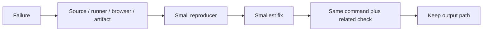

### Stop conditions

- Stop changing source when the failure is a missing runtime dependency.
- Stop updating snapshots when the diff has an unexplained content change.
- Stop widening types when the input has no runtime guard.
- Stop adding waits when the test has an ownership or cleanup bug.
- Stop after the requested behavior and rollback path have a passing check.

<a id="17--skill-controls-and-project-rail"></a>
<h1 align="center">
   Skill controls and project rail
</h1>

JSX carries the interaction contract in the markup. Each About skill is a button, the selected state is exposed through `aria-pressed`, and the project rail exposes a label and keyboard focus target.

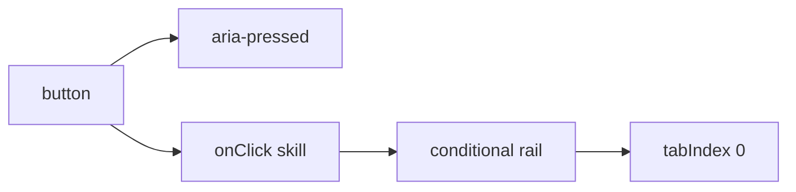

### How it works

- `type="button"` prevents a future surrounding form from treating a skill click as submit.
- `aria-pressed` reports the selected skill without relying on color or motion.
- Conditional JSX renders loading, empty, or matching project states.
- `tabIndex={0}` gives keyboard users a direct focus target for the horizontal rail.
- Stable `repo.id` values become React keys for matched project cards.

### Project reading

```tsx
<button
  type="button"
  aria-pressed={selectedSkill === item}
  onClick={() => onSkillSelect?.(item)}
>
  {item}
</button>
```

The page then maps filtered repositories into the existing card component. JSX owns structure; the matcher owns data comparison.

### Decision table

| JSX branch | Visible result | Accessibility contract |
|---|---|---|
| No selected skill | Expertise grid only | Skill buttons remain available. |
| Loading repositories | Loading message | `aria-live` reports status. |
| No matching repository | Empty message | The section keeps its heading. |
| Matching repositories | Horizontal card rail | Rail has label and keyboard focus. |

### Checks

- Query skill controls by role, not CSS class.
- Click a button and assert its callback value.
- Assert `aria-pressed="true"` for the selected skill.
- Check the rail renders stable card keys and localized states.

<a id="references"></a>
<h1 align="center">
   References
</h1>

- https://react.dev/learn/writing-markup-with-jsx
- https://react.dev/reference/react/createElement
- https://www.typescriptlang.org/docs/handbook/jsx.html
- [Project README](../README.md)
- [Package scripts](../package.json)
- [GitHub Actions workflows](../.github/workflows/)

<details>
  <summary>Review checklist</summary>

- [ ] Source owner is named.
- [ ] Runtime boundary is named.
- [ ] Success and failure states are described.
- [ ] Example matches current project syntax.
- [ ] Focused check ran.
- [ ] Related browser or quality check ran.
- [ ] Evidence path is recorded.
- [ ] README link resolves.

</details>

---
