<div align="center">

<h1 align="center">
  
  QA / Field Notes
</h1>

Quality gates for source, tests, browser output, audits, and review evidence.

<a href="testing.md">Testing docs</a>  <a href="ci.md">CI docs</a>  <a href="test.md">Full test matrix</a>  <a href="../README.md">README</a>

</div>

---

<p align="center">
  
  
  
  
  
</p>

<table>
  <thead>
    <tr><th>Topic</th><th>Project baseline</th><th>Use it for</th></tr>
  </thead>
  <tbody>
    <tr><td>Static</td><td>ESLint + tsc</td><td>Find source and type errors early.</td></tr>
    <tr><td>Quality</td><td>size + JSCPD + Lizard</td><td>Keep file, duplication, and complexity signals visible.</td></tr>
    <tr><td>Audit</td><td>Lighthouse + security</td><td>Inspect production pages, dependencies, and images.</td></tr>
    <tr><td>Artifacts</td><td>reports/ + .lighthouseci</td><td>Every gate leaves a path a reviewer can open.</td></tr>
  </tbody>
</table>

## Contents

- [01 / QA model](#01--qa-model)
- [02 / Lint gate](#02--lint-gate)
- [03 / Type gate](#03--type-gate)
- [04 / Behavior gates](#04--behavior-gates)
- [05 / File-size policy](#05--file-size-policy)
- [06 / Duplication policy](#06--duplication-policy)
- [07 / Complexity policy](#07--complexity-policy)
- [08 / Coverage gate](#08--coverage-gate)
- [09 / JUnit evidence](#09--junit-evidence)
- [10 / Lighthouse](#10--lighthouse)
- [11 / Security checks](#11--security-checks)
- [12 / Storybook review](#12--storybook-review)
- [13 / Docker check](#13--docker-check)
- [14 / Review flow](#14--review-flow)
- [15 / Failure triage](#15--failure-triage)
- [16 / Artifact retention](#16--artifact-retention)
- [17 / QA checklist](#17--qa-checklist)
- [18 / Project media classification](#18--project-media-classification)
- [19 / Hydration and DOM mutation triage](#19--hydration-and-dom-mutation-triage)
- [20 / Transition panel media](#20--transition-panel-media)
- [Repository map](#repository-map)
- [Command matrix](#command-matrix)
- [Evidence and troubleshooting](#evidence-and-troubleshooting)
- [References](#references)

<h1 align="center">
   Operating model
</h1>

This guide explains **QA / Field Notes** through the source tree, the runtime boundary, the smallest useful test, and the evidence a reviewer can inspect.

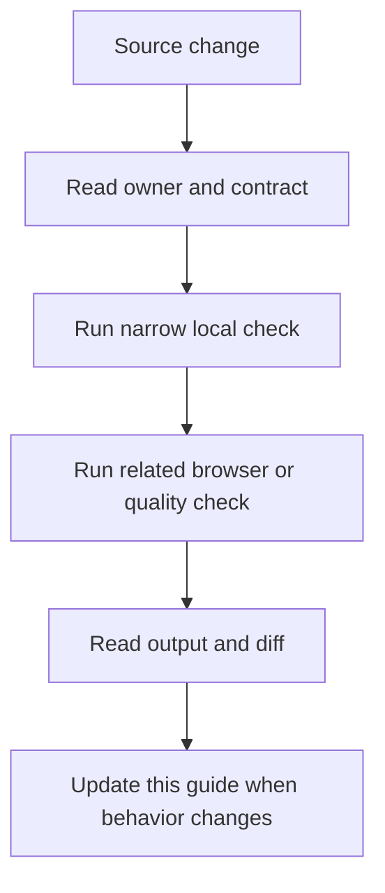

### Reading order

- Start at the section for the changed file or runtime.
- Copy the narrow command before running the broad suite.
- Check the failure branch and the evidence path.
- Compare README links after editing any docs entry point.

<a id="01--qa-model"></a>
## 01 / QA model

QA combines static checks, automated behavior tests, browser checks, visual review, audits, and human inspection.

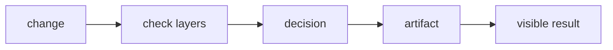

### How it works

1. `change` enters **QA model** as the value, event, file, or runtime that needs a decision.
2. `check layers` applies the rule owned by this section; keep that decision close to its source boundary.
3. `decision` carries the checked result to the next consumer instead of exposing private setup.
4. `artifact` receives the result and makes it visible through markup, output, or an exit code.
5. Exercise the normal path and the failure path at the runtime named by the example.

### Project reading

- **Rule:** Each layer should answer one question and leave inspectable evidence.
- **Failure to catch:** A single green command is treated as proof for unrelated behavior.
- **Evidence:** A matrix row with command, purpose, and result.
- **Owner:** `QA / Field Notes` documents the contract; source files and tests remain the executable reference.
- **Scope:** Read this section with the linked source path in the repository catalog below.

### Example

```ts
const layers = ['lint', 'types', 'tests', 'browser', 'visual', 'audit'];
```

### Decision table

<table>
  <thead>
    <tr><th>Input</th><th>Project decision</th><th>Check</th></tr>
  </thead>
  <tbody>
    <tr><td>change</td><td>Keep it at the boundary named by the section.</td><td>A focused test or source inspection.</td></tr>
    <tr><td>check layers</td><td>Use the smallest rule that explains the branch.</td><td>Lint, type check, or browser assertion.</td></tr>
    <tr><td>decision</td><td>Return a readable value or state.</td><td>Success and failure cases.</td></tr>
    <tr><td>artifact</td><td>Expose a semantic or reviewable consumer.</td><td>Role, report, screenshot, or exit code.</td></tr>
  </tbody>
</table>

### Checks

- Inspect the owner for `check layers` before editing the consumer.
- Assert the successful `decision` result through the public surface.
- Force the failure branch and confirm it reaches `artifact`.
- Record the command and artifact path shown in this guide.

<a id="02--lint-gate"></a>
## 02 / Lint gate

ESLint runs across the repository with the flat config and Next.js rules used by the application.

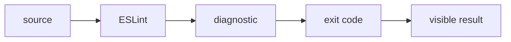

### How it works

1. `source` enters **Lint gate** as the value, event, file, or runtime that needs a decision.
2. `ESLint` applies the rule owned by this section; keep that decision close to its source boundary.
3. `diagnostic` carries the checked result to the next consumer instead of exposing private setup.
4. `exit code` receives the result and makes it visible through markup, output, or an exit code.
5. Exercise the normal path and the failure path at the runtime named by the example.

### Project reading

- **Rule:** Fix the source pattern named by the rule before suppressing it.
- **Failure to catch:** A disable comment removes a useful warning from a shared component.
- **Evidence:** ESLint terminal output.
- **Owner:** `QA / Field Notes` documents the contract; source files and tests remain the executable reference.
- **Scope:** Read this section with the linked source path in the repository catalog below.

### Example

```bash
pnpm run lint
pnpm run lint -- --fix
```

### Decision table

<table>
  <thead>
    <tr><th>Input</th><th>Project decision</th><th>Check</th></tr>
  </thead>
  <tbody>
    <tr><td>source</td><td>Keep it at the boundary named by the section.</td><td>A focused test or source inspection.</td></tr>
    <tr><td>ESLint</td><td>Use the smallest rule that explains the branch.</td><td>Lint, type check, or browser assertion.</td></tr>
    <tr><td>diagnostic</td><td>Return a readable value or state.</td><td>Success and failure cases.</td></tr>
    <tr><td>exit code</td><td>Expose a semantic or reviewable consumer.</td><td>Role, report, screenshot, or exit code.</td></tr>
  </tbody>
</table>

### Checks

- Inspect the owner for `ESLint` before editing the consumer.
- Assert the successful `diagnostic` result through the public surface.
- Force the failure branch and confirm it reaches `exit code`.
- Record the command and artifact path shown in this guide.

<a id="03--type-gate"></a>
## 03 / Type gate

The TypeScript compiler checks the project graph with strict mode and emits no files.

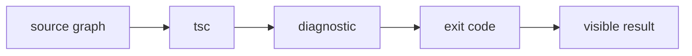

### How it works

1. `source graph` enters **Type gate** as the value, event, file, or runtime that needs a decision.
2. `tsc` applies the rule owned by this section; keep that decision close to its source boundary.
3. `diagnostic` carries the checked result to the next consumer instead of exposing private setup.
4. `exit code` receives the result and makes it visible through markup, output, or an exit code.
5. Exercise the normal path and the failure path at the runtime named by the example.

### Project reading

- **Rule:** Run tsc after interface, route, prop, or config changes.
- **Failure to catch:** A local editor narrows a type differently from the project compiler.
- **Evidence:** tsc output and command.
- **Owner:** `QA / Field Notes` documents the contract; source files and tests remain the executable reference.
- **Scope:** Read this section with the linked source path in the repository catalog below.

### Example

```bash
pnpm exec tsc --noEmit
```

### Decision table

<table>
  <thead>
    <tr><th>Input</th><th>Project decision</th><th>Check</th></tr>
  </thead>
  <tbody>
    <tr><td>source graph</td><td>Keep it at the boundary named by the section.</td><td>A focused test or source inspection.</td></tr>
    <tr><td>tsc</td><td>Use the smallest rule that explains the branch.</td><td>Lint, type check, or browser assertion.</td></tr>
    <tr><td>diagnostic</td><td>Return a readable value or state.</td><td>Success and failure cases.</td></tr>
    <tr><td>exit code</td><td>Expose a semantic or reviewable consumer.</td><td>Role, report, screenshot, or exit code.</td></tr>
  </tbody>
</table>

### Checks

- Inspect the owner for `tsc` before editing the consumer.
- Assert the successful `diagnostic` result through the public surface.
- Force the failure branch and confirm it reaches `exit code`.
- Record the command and artifact path shown in this guide.

<a id="04--behavior-gates"></a>
## 04 / Behavior gates

Jest, Vitest, Browser Mode, and Playwright cover different runtime surfaces and should be read as one matrix.

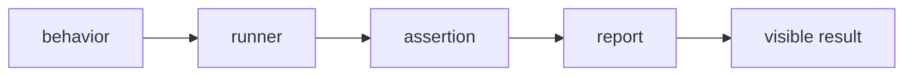

### How it works

1. `behavior` enters **Behavior gates** as the value, event, file, or runtime that needs a decision.
2. `runner` applies the rule owned by this section; keep that decision close to its source boundary.
3. `assertion` carries the checked result to the next consumer instead of exposing private setup.
4. `report` receives the result and makes it visible through markup, output, or an exit code.
5. Exercise the normal path and the failure path at the runtime named by the example.

### Project reading

- **Rule:** Place a check where its runtime assumptions match the behavior.
- **Failure to catch:** A test is added to the fastest runner even though the browser owns the result.
- **Evidence:** Test result grouped by runner.
- **Owner:** `QA / Field Notes` documents the contract; source files and tests remain the executable reference.
- **Scope:** Read this section with the linked source path in the repository catalog below.

### Example

```bash
pnpm run test:jest
pnpm run test:vitest
pnpm run test:browser
pnpm run test:playwright:all
```

### Decision table

<table>
  <thead>
    <tr><th>Input</th><th>Project decision</th><th>Check</th></tr>
  </thead>
  <tbody>
    <tr><td>behavior</td><td>Keep it at the boundary named by the section.</td><td>A focused test or source inspection.</td></tr>
    <tr><td>runner</td><td>Use the smallest rule that explains the branch.</td><td>Lint, type check, or browser assertion.</td></tr>
    <tr><td>assertion</td><td>Return a readable value or state.</td><td>Success and failure cases.</td></tr>
    <tr><td>report</td><td>Expose a semantic or reviewable consumer.</td><td>Role, report, screenshot, or exit code.</td></tr>
  </tbody>
</table>

### Checks

- Inspect the owner for `runner` before editing the consumer.
- Assert the successful `assertion` result through the public surface.
- Force the failure branch and confirm it reaches `report`.
- Record the command and artifact path shown in this guide.

<a id="05--file-size-policy"></a>
## 05 / File-size policy

The file-size script reports source files over the review and hard limits, with 700 and 800 physical lines as defaults.

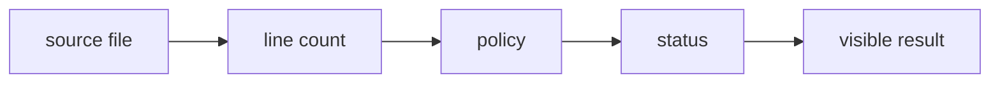

### How it works

1. `source file` enters **File-size policy** as the value, event, file, or runtime that needs a decision.
2. `line count` applies the rule owned by this section; keep that decision close to its source boundary.
3. `policy` carries the checked result to the next consumer instead of exposing private setup.
4. `status` receives the result and makes it visible through markup, output, or an exit code.
5. Exercise the normal path and the failure path at the runtime named by the example.

### Project reading

- **Rule:** Split a growing source file by responsibility before it reaches the hard limit.
- **Failure to catch:** A large component hides unrelated state, rendering, and integration decisions.
- **Evidence:** reports/quality file-size report and exit code.
- **Owner:** `QA / Field Notes` documents the contract; source files and tests remain the executable reference.
- **Scope:** Read this section with the linked source path in the repository catalog below.

### Example

```bash
pnpm run quality:files
# review limit: 700 lines
# hard limit: 800 lines
```

### Decision table

<table>
  <thead>
    <tr><th>Input</th><th>Project decision</th><th>Check</th></tr>
  </thead>
  <tbody>
    <tr><td>source file</td><td>Keep it at the boundary named by the section.</td><td>A focused test or source inspection.</td></tr>
    <tr><td>line count</td><td>Use the smallest rule that explains the branch.</td><td>Lint, type check, or browser assertion.</td></tr>
    <tr><td>policy</td><td>Return a readable value or state.</td><td>Success and failure cases.</td></tr>
    <tr><td>status</td><td>Expose a semantic or reviewable consumer.</td><td>Role, report, screenshot, or exit code.</td></tr>
  </tbody>
</table>

### Checks

- Inspect the owner for `line count` before editing the consumer.
- Assert the successful `policy` result through the public surface.
- Force the failure branch and confirm it reaches `status`.
- Record the command and artifact path shown in this guide.

<a id="06--duplication-policy"></a>
## 06 / Duplication policy

JSCPD scans source with configurable line and token thresholds and writes console, JSON, and SARIF reports.

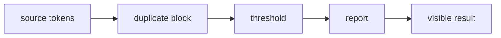

### How it works

1. `source tokens` enters **Duplication policy** as the value, event, file, or runtime that needs a decision.
2. `duplicate block` applies the rule owned by this section; keep that decision close to its source boundary.
3. `threshold` carries the checked result to the next consumer instead of exposing private setup.
4. `report` receives the result and makes it visible through markup, output, or an exit code.
5. Exercise the normal path and the failure path at the runtime named by the example.

### Project reading

- **Rule:** Extract repeated behavior only when the abstraction has one clear owner.
- **Failure to catch:** Copying a branch creates two fixes and two different edge-case outcomes.
- **Evidence:** reports/quality/jscpd and metrics JSON.
- **Owner:** `QA / Field Notes` documents the contract; source files and tests remain the executable reference.
- **Scope:** Read this section with the linked source path in the repository catalog below.

### Example

```bash
pnpm run quality:jscpd
# reporters: console, json, sarif
# default threshold: 5%
```

### Decision table

<table>
  <thead>
    <tr><th>Input</th><th>Project decision</th><th>Check</th></tr>
  </thead>
  <tbody>
    <tr><td>source tokens</td><td>Keep it at the boundary named by the section.</td><td>A focused test or source inspection.</td></tr>
    <tr><td>duplicate block</td><td>Use the smallest rule that explains the branch.</td><td>Lint, type check, or browser assertion.</td></tr>
    <tr><td>threshold</td><td>Return a readable value or state.</td><td>Success and failure cases.</td></tr>
    <tr><td>report</td><td>Expose a semantic or reviewable consumer.</td><td>Role, report, screenshot, or exit code.</td></tr>
  </tbody>
</table>

### Checks

- Inspect the owner for `duplicate block` before editing the consumer.
- Assert the successful `threshold` result through the public surface.
- Force the failure branch and confirm it reaches `report`.
- Record the command and artifact path shown in this guide.

<a id="07--complexity-policy"></a>
## 07 / Complexity policy

Quality review sends CSS, TS, and TSX source through Lizard and marks review or hard findings.

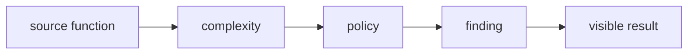

### How it works

1. `source function` enters **Complexity policy** as the value, event, file, or runtime that needs a decision.
2. `complexity` applies the rule owned by this section; keep that decision close to its source boundary.
3. `policy` carries the checked result to the next consumer instead of exposing private setup.
4. `finding` receives the result and makes it visible through markup, output, or an exit code.
5. Exercise the normal path and the failure path at the runtime named by the example.

### Project reading

- **Rule:** Split branch-heavy render helpers around domain decisions, not arbitrary line counts.
- **Failure to catch:** A large render function makes one change affect unrelated states.
- **Evidence:** Lizard findings and quality report status.
- **Owner:** `QA / Field Notes` documents the contract; source files and tests remain the executable reference.
- **Scope:** Read this section with the linked source path in the repository catalog below.

### Example

```bash
pnpm run quality:report
# review tools: Lizard and JSCPD
```

### Decision table

<table>
  <thead>
    <tr><th>Input</th><th>Project decision</th><th>Check</th></tr>
  </thead>
  <tbody>
    <tr><td>source function</td><td>Keep it at the boundary named by the section.</td><td>A focused test or source inspection.</td></tr>
    <tr><td>complexity</td><td>Use the smallest rule that explains the branch.</td><td>Lint, type check, or browser assertion.</td></tr>
    <tr><td>policy</td><td>Return a readable value or state.</td><td>Success and failure cases.</td></tr>
    <tr><td>finding</td><td>Expose a semantic or reviewable consumer.</td><td>Role, report, screenshot, or exit code.</td></tr>
  </tbody>
</table>

### Checks

- Inspect the owner for `complexity` before editing the consumer.
- Assert the successful `policy` result through the public surface.
- Force the failure branch and confirm it reaches `finding`.
- Record the command and artifact path shown in this guide.

<a id="08--coverage-gate"></a>
## 08 / Coverage gate

The quality report reads LCOV and enforces a minimum line coverage value passed by the review command.

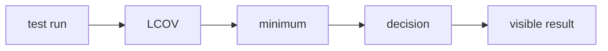

### How it works

1. `test run` enters **Coverage gate** as the value, event, file, or runtime that needs a decision.
2. `LCOV` applies the rule owned by this section; keep that decision close to its source boundary.
3. `minimum` carries the checked result to the next consumer instead of exposing private setup.
4. `decision` receives the result and makes it visible through markup, output, or an exit code.
5. Exercise the normal path and the failure path at the runtime named by the example.

### Project reading

- **Rule:** Investigate uncovered branches that represent a user-visible state.
- **Failure to catch:** A threshold passes while a route error or cleanup path has no test.
- **Evidence:** coverage/lcov.info and report table.
- **Owner:** `QA / Field Notes` documents the contract; source files and tests remain the executable reference.
- **Scope:** Read this section with the linked source path in the repository catalog below.

### Example

```bash
pnpm run quality:report
# minimum line coverage: 90
```

### Decision table

<table>
  <thead>
    <tr><th>Input</th><th>Project decision</th><th>Check</th></tr>
  </thead>
  <tbody>
    <tr><td>test run</td><td>Keep it at the boundary named by the section.</td><td>A focused test or source inspection.</td></tr>
    <tr><td>LCOV</td><td>Use the smallest rule that explains the branch.</td><td>Lint, type check, or browser assertion.</td></tr>
    <tr><td>minimum</td><td>Return a readable value or state.</td><td>Success and failure cases.</td></tr>
    <tr><td>decision</td><td>Expose a semantic or reviewable consumer.</td><td>Role, report, screenshot, or exit code.</td></tr>
  </tbody>
</table>

### Checks

- Inspect the owner for `LCOV` before editing the consumer.
- Assert the successful `minimum` result through the public surface.
- Force the failure branch and confirm it reaches `decision`.
- Record the command and artifact path shown in this guide.

<a id="09--junit-evidence"></a>
## 09 / JUnit evidence

Jest writes reports/junit.xml, and the quality report parses test cases and statuses into its summary.

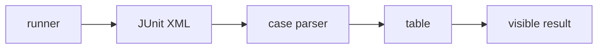

### How it works

1. `runner` enters **JUnit evidence** as the value, event, file, or runtime that needs a decision.
2. `JUnit XML` applies the rule owned by this section; keep that decision close to its source boundary.
3. `case parser` carries the checked result to the next consumer instead of exposing private setup.
4. `table` receives the result and makes it visible through markup, output, or an exit code.
5. Exercise the normal path and the failure path at the runtime named by the example.

### Project reading

- **Rule:** Keep the JUnit path stable so CI and local review use the same input.
- **Failure to catch:** A renamed report makes the quality review say evidence is missing.
- **Evidence:** reports/junit.xml and parsed case count.
- **Owner:** `QA / Field Notes` documents the contract; source files and tests remain the executable reference.
- **Scope:** Read this section with the linked source path in the repository catalog below.

### Example

```bash
pnpm run test:coverage
# report: reports/junit.xml
```

### Decision table

<table>
  <thead>
    <tr><th>Input</th><th>Project decision</th><th>Check</th></tr>
  </thead>
  <tbody>
    <tr><td>runner</td><td>Keep it at the boundary named by the section.</td><td>A focused test or source inspection.</td></tr>
    <tr><td>JUnit XML</td><td>Use the smallest rule that explains the branch.</td><td>Lint, type check, or browser assertion.</td></tr>
    <tr><td>case parser</td><td>Return a readable value or state.</td><td>Success and failure cases.</td></tr>
    <tr><td>table</td><td>Expose a semantic or reviewable consumer.</td><td>Role, report, screenshot, or exit code.</td></tr>
  </tbody>
</table>

### Checks

- Inspect the owner for `JUnit XML` before editing the consumer.
- Assert the successful `case parser` result through the public surface.
- Force the failure branch and confirm it reaches `table`.
- Record the command and artifact path shown in this guide.

<a id="10--lighthouse"></a>
## 10 / Lighthouse

Lighthouse CI audits built routes for performance, accessibility, best practices, SEO, console errors, and layout shift.

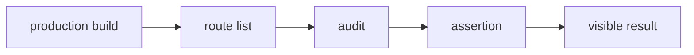

### How it works

1. `production build` enters **Lighthouse** as the value, event, file, or runtime that needs a decision.
2. `route list` applies the rule owned by this section; keep that decision close to its source boundary.
3. `audit` carries the checked result to the next consumer instead of exposing private setup.
4. `assertion` receives the result and makes it visible through markup, output, or an exit code.
5. Exercise the normal path and the failure path at the runtime named by the example.

### Project reading

- **Rule:** Run Lighthouse against the production server, not a hot development page.
- **Failure to catch:** Development-only behavior hides build, asset, or runtime problems.
- **Evidence:** .lighthouseci report files and optional screenshots.
- **Owner:** `QA / Field Notes` documents the contract; source files and tests remain the executable reference.
- **Scope:** Read this section with the linked source path in the repository catalog below.

### Example

```bash
pnpm run test:lighthouse
pnpm run test:lighthouse:screenshots
```

### Decision table

<table>
  <thead>
    <tr><th>Input</th><th>Project decision</th><th>Check</th></tr>
  </thead>
  <tbody>
    <tr><td>production build</td><td>Keep it at the boundary named by the section.</td><td>A focused test or source inspection.</td></tr>
    <tr><td>route list</td><td>Use the smallest rule that explains the branch.</td><td>Lint, type check, or browser assertion.</td></tr>
    <tr><td>audit</td><td>Return a readable value or state.</td><td>Success and failure cases.</td></tr>
    <tr><td>assertion</td><td>Expose a semantic or reviewable consumer.</td><td>Role, report, screenshot, or exit code.</td></tr>
  </tbody>
</table>

### Checks

- Inspect the owner for `route list` before editing the consumer.
- Assert the successful `audit` result through the public surface.
- Force the failure branch and confirm it reaches `assertion`.
- Record the command and artifact path shown in this guide.

<a id="11--security-checks"></a>
## 11 / Security checks

CI uses pnpm audit, CodeQL, and Trivy in different workflows to inspect dependencies, source patterns, and container images.

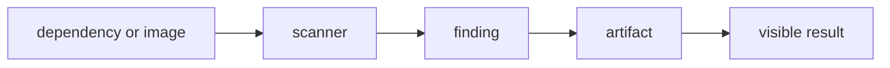

### How it works

1. `dependency or image` enters **Security checks** as the value, event, file, or runtime that needs a decision.
2. `scanner` applies the rule owned by this section; keep that decision close to its source boundary.
3. `finding` carries the checked result to the next consumer instead of exposing private setup.
4. `artifact` receives the result and makes it visible through markup, output, or an exit code.
5. Exercise the normal path and the failure path at the runtime named by the example.

### Project reading

- **Rule:** Keep security output attached to the workflow that owns the scanned input.
- **Failure to catch:** A scanner result is ignored because the report path or severity policy is unclear.
- **Evidence:** Audit log, CodeQL result, or SARIF upload.
- **Owner:** `QA / Field Notes` documents the contract; source files and tests remain the executable reference.
- **Scope:** Read this section with the linked source path in the repository catalog below.

### Example

```bash
pnpm audit --audit-level=moderate
# CodeQL: .github/workflows/codeql.yml
# Trivy: .github/workflows/docker.yml
```

### Decision table

<table>
  <thead>
    <tr><th>Input</th><th>Project decision</th><th>Check</th></tr>
  </thead>
  <tbody>
    <tr><td>dependency or image</td><td>Keep it at the boundary named by the section.</td><td>A focused test or source inspection.</td></tr>
    <tr><td>scanner</td><td>Use the smallest rule that explains the branch.</td><td>Lint, type check, or browser assertion.</td></tr>
    <tr><td>finding</td><td>Return a readable value or state.</td><td>Success and failure cases.</td></tr>
    <tr><td>artifact</td><td>Expose a semantic or reviewable consumer.</td><td>Role, report, screenshot, or exit code.</td></tr>
  </tbody>
</table>

### Checks

- Inspect the owner for `scanner` before editing the consumer.
- Assert the successful `finding` result through the public surface.
- Force the failure branch and confirm it reaches `artifact`.
- Record the command and artifact path shown in this guide.

<a id="12--storybook-review"></a>
## 12 / Storybook review

Storybook builds component stories for ContactCommandForm and SoloLevelingProjectCard with the a11y addon.

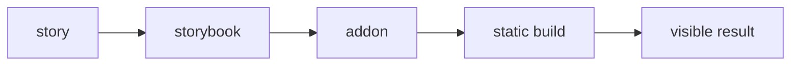

### How it works

1. `story` enters **Storybook review** as the value, event, file, or runtime that needs a decision.
2. `storybook` applies the rule owned by this section; keep that decision close to its source boundary.
3. `addon` carries the checked result to the next consumer instead of exposing private setup.
4. `static build` receives the result and makes it visible through markup, output, or an exit code.
5. Exercise the normal path and the failure path at the runtime named by the example.

### Project reading

- **Rule:** Keep a story for a meaningful state that is hard to inspect inside a full page.
- **Failure to catch:** A component only appears inside one route and its empty or error state stays unseen.
- **Evidence:** storybook-static output.
- **Owner:** `QA / Field Notes` documents the contract; source files and tests remain the executable reference.
- **Scope:** Read this section with the linked source path in the repository catalog below.

### Example

```bash
pnpm run storybook
pnpm run build-storybook
```

### Decision table

<table>
  <thead>
    <tr><th>Input</th><th>Project decision</th><th>Check</th></tr>
  </thead>
  <tbody>
    <tr><td>story</td><td>Keep it at the boundary named by the section.</td><td>A focused test or source inspection.</td></tr>
    <tr><td>storybook</td><td>Use the smallest rule that explains the branch.</td><td>Lint, type check, or browser assertion.</td></tr>
    <tr><td>addon</td><td>Return a readable value or state.</td><td>Success and failure cases.</td></tr>
    <tr><td>static build</td><td>Expose a semantic or reviewable consumer.</td><td>Role, report, screenshot, or exit code.</td></tr>
  </tbody>
</table>

### Checks

- Inspect the owner for `storybook` before editing the consumer.
- Assert the successful `addon` result through the public surface.
- Force the failure branch and confirm it reaches `static build`.
- Record the command and artifact path shown in this guide.

<a id="13--docker-check"></a>
## 13 / Docker check

The Docker workflow builds a PR image, runs health and locale smoke requests, then publishes and scans non-PR images.

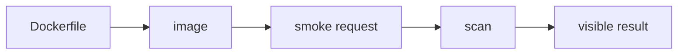

### How it works

1. `Dockerfile` enters **Docker check** as the value, event, file, or runtime that needs a decision.
2. `image` applies the rule owned by this section; keep that decision close to its source boundary.
3. `smoke request` carries the checked result to the next consumer instead of exposing private setup.
4. `scan` receives the result and makes it visible through markup, output, or an exit code.
5. Exercise the normal path and the failure path at the runtime named by the example.

### Project reading

- **Rule:** Treat the container as another production entry point with its own startup evidence.
- **Failure to catch:** The app works on the host but the image lacks public assets or cannot answer health.
- **Evidence:** Container logs, curl responses, and Trivy SARIF.
- **Owner:** `QA / Field Notes` documents the contract; source files and tests remain the executable reference.
- **Scope:** Read this section with the linked source path in the repository catalog below.

### Example

```bash
docker build --tag portfolio-qa:pr .
curl --fail http://127.0.0.1:3000/api/health
```

### Decision table

<table>
  <thead>
    <tr><th>Input</th><th>Project decision</th><th>Check</th></tr>
  </thead>
  <tbody>
    <tr><td>Dockerfile</td><td>Keep it at the boundary named by the section.</td><td>A focused test or source inspection.</td></tr>
    <tr><td>image</td><td>Use the smallest rule that explains the branch.</td><td>Lint, type check, or browser assertion.</td></tr>
    <tr><td>smoke request</td><td>Return a readable value or state.</td><td>Success and failure cases.</td></tr>
    <tr><td>scan</td><td>Expose a semantic or reviewable consumer.</td><td>Role, report, screenshot, or exit code.</td></tr>
  </tbody>
</table>

### Checks

- Inspect the owner for `image` before editing the consumer.
- Assert the successful `smoke request` result through the public surface.
- Force the failure branch and confirm it reaches `scan`.
- Record the command and artifact path shown in this guide.

<a id="14--review-flow"></a>
## 14 / Review flow

A practical QA pass starts with the changed behavior, selects narrow checks, then expands to release gates.

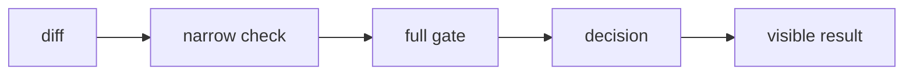

### How it works

1. `diff` enters **Review flow** as the value, event, file, or runtime that needs a decision.
2. `narrow check` applies the rule owned by this section; keep that decision close to its source boundary.
3. `full gate` carries the checked result to the next consumer instead of exposing private setup.
4. `decision` receives the result and makes it visible through markup, output, or an exit code.
5. Exercise the normal path and the failure path at the runtime named by the example.

### Project reading

- **Rule:** Record the smallest command that caught a problem and the broader command that cleared it.
- **Failure to catch:** A full suite fails with no clue which behavior changed.
- **Evidence:** Pull request note with commands and outputs.
- **Owner:** `QA / Field Notes` documents the contract; source files and tests remain the executable reference.
- **Scope:** Read this section with the linked source path in the repository catalog below.

### Example

```bash
pnpm run lint
pnpm exec tsc --noEmit
pnpm run test:jest
pnpm run quality:full
```

### Decision table

<table>
  <thead>
    <tr><th>Input</th><th>Project decision</th><th>Check</th></tr>
  </thead>
  <tbody>
    <tr><td>diff</td><td>Keep it at the boundary named by the section.</td><td>A focused test or source inspection.</td></tr>
    <tr><td>narrow check</td><td>Use the smallest rule that explains the branch.</td><td>Lint, type check, or browser assertion.</td></tr>
    <tr><td>full gate</td><td>Return a readable value or state.</td><td>Success and failure cases.</td></tr>
    <tr><td>decision</td><td>Expose a semantic or reviewable consumer.</td><td>Role, report, screenshot, or exit code.</td></tr>
  </tbody>
</table>

### Checks

- Inspect the owner for `narrow check` before editing the consumer.
- Assert the successful `full gate` result through the public surface.
- Force the failure branch and confirm it reaches `decision`.
- Record the command and artifact path shown in this guide.

<a id="15--failure-triage"></a>
## 15 / Failure triage

Triage separates source errors, environment gaps, flaky timing, missing artifacts, and real regressions.

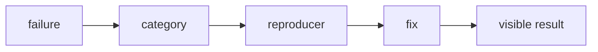

### How it works

1. `failure` enters **Failure triage** as the value, event, file, or runtime that needs a decision.
2. `category` applies the rule owned by this section; keep that decision close to its source boundary.
3. `reproducer` carries the checked result to the next consumer instead of exposing private setup.
4. `fix` receives the result and makes it visible through markup, output, or an exit code.
5. Exercise the normal path and the failure path at the runtime named by the example.

### Project reading

- **Rule:** Name the category before changing the test or source.
- **Failure to catch:** Retries, skips, and broad snapshots hide the root cause.
- **Evidence:** Failure text, environment, rerun, and result.
- **Owner:** `QA / Field Notes` documents the contract; source files and tests remain the executable reference.
- **Scope:** Read this section with the linked source path in the repository catalog below.

### Example

```ts
const categories = ['source', 'dependency', 'browser', 'timing', 'artifact'];
```

### Decision table

<table>
  <thead>
    <tr><th>Input</th><th>Project decision</th><th>Check</th></tr>
  </thead>
  <tbody>
    <tr><td>failure</td><td>Keep it at the boundary named by the section.</td><td>A focused test or source inspection.</td></tr>
    <tr><td>category</td><td>Use the smallest rule that explains the branch.</td><td>Lint, type check, or browser assertion.</td></tr>
    <tr><td>reproducer</td><td>Return a readable value or state.</td><td>Success and failure cases.</td></tr>
    <tr><td>fix</td><td>Expose a semantic or reviewable consumer.</td><td>Role, report, screenshot, or exit code.</td></tr>
  </tbody>
</table>

### Checks

- Inspect the owner for `category` before editing the consumer.
- Assert the successful `reproducer` result through the public surface.
- Force the failure branch and confirm it reaches `fix`.
- Record the command and artifact path shown in this guide.

<a id="16--artifact-retention"></a>
## 16 / Artifact retention

Frontend QA uploads reports, screenshots, Lighthouse output, and Storybook for seven days when the job reaches the upload step.

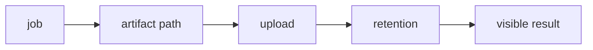

### How it works

1. `job` enters **Artifact retention** as the value, event, file, or runtime that needs a decision.
2. `artifact path` applies the rule owned by this section; keep that decision close to its source boundary.
3. `upload` carries the checked result to the next consumer instead of exposing private setup.
4. `retention` receives the result and makes it visible through markup, output, or an exit code.
5. Exercise the normal path and the failure path at the runtime named by the example.

### Project reading

- **Rule:** Keep failure evidence even when a later step fails.
- **Failure to catch:** A failed build prevents the artifacts that explain the earlier failure from being uploaded.
- **Evidence:** Artifact name, path, and retention setting.
- **Owner:** `QA / Field Notes` documents the contract; source files and tests remain the executable reference.
- **Scope:** Read this section with the linked source path in the repository catalog below.

### Example

```yaml
name: frontend-qa-artifacts
retention-days: 7
```

### Decision table

<table>
  <thead>
    <tr><th>Input</th><th>Project decision</th><th>Check</th></tr>
  </thead>
  <tbody>
    <tr><td>job</td><td>Keep it at the boundary named by the section.</td><td>A focused test or source inspection.</td></tr>
    <tr><td>artifact path</td><td>Use the smallest rule that explains the branch.</td><td>Lint, type check, or browser assertion.</td></tr>
    <tr><td>upload</td><td>Return a readable value or state.</td><td>Success and failure cases.</td></tr>
    <tr><td>retention</td><td>Expose a semantic or reviewable consumer.</td><td>Role, report, screenshot, or exit code.</td></tr>
  </tbody>
</table>

### Checks

- Inspect the owner for `artifact path` before editing the consumer.
- Assert the successful `upload` result through the public surface.
- Force the failure branch and confirm it reaches `retention`.
- Record the command and artifact path shown in this guide.

<a id="17--qa-checklist"></a>
## 17 / QA checklist

QA review checks code, tests, browser behavior, accessibility, visuals, performance, security, and artifacts.

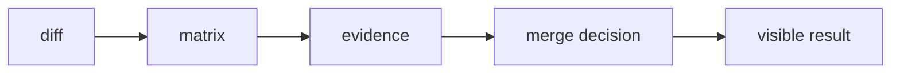

### How it works

1. `diff` enters **QA checklist** as the value, event, file, or runtime that needs a decision.
2. `matrix` applies the rule owned by this section; keep that decision close to its source boundary.
3. `evidence` carries the checked result to the next consumer instead of exposing private setup.
4. `merge decision` receives the result and makes it visible through markup, output, or an exit code.
5. Exercise the normal path and the failure path at the runtime named by the example.

### Project reading

- **Rule:** Mark a layer skipped only when its scope does not include the change.
- **Failure to catch:** A visual or security layer is skipped by habit after a broad UI change.
- **Evidence:** Completed checklist with commands.
- **Owner:** `QA / Field Notes` documents the contract; source files and tests remain the executable reference.
- **Scope:** Read this section with the linked source path in the repository catalog below.

### Example

```ts
const qaReview = ['lint', 'types', 'tests', 'browser', 'a11y', 'visual', 'audit'];
```

### Decision table

<table>
  <thead>
    <tr><th>Input</th><th>Project decision</th><th>Check</th></tr>
  </thead>
  <tbody>
    <tr><td>diff</td><td>Keep it at the boundary named by the section.</td><td>A focused test or source inspection.</td></tr>
    <tr><td>matrix</td><td>Use the smallest rule that explains the branch.</td><td>Lint, type check, or browser assertion.</td></tr>
    <tr><td>evidence</td><td>Return a readable value or state.</td><td>Success and failure cases.</td></tr>
    <tr><td>merge decision</td><td>Expose a semantic or reviewable consumer.</td><td>Role, report, screenshot, or exit code.</td></tr>
  </tbody>
</table>

### Checks

- Inspect the owner for `matrix` before editing the consumer.
- Assert the successful `evidence` result through the public surface.
- Force the failure branch and confirm it reaches `merge decision`.
- Record the command and artifact path shown in this guide.

<a id="repository-map"></a>
<h1 align="center">
   Repository map
</h1>

The catalog is intentionally concrete. Use it to jump from a concept to the source or test that implements it.

<table>
  <thead>
    <tr><th>Area</th><th>Paths</th><th>Read for</th></tr>
  </thead>
  <tbody>
    <tr><td>Application</td><td>`src/app/`</td><td>Routes, layouts, metadata, and API handlers.</td></tr>
    <tr><td>Components</td><td>`src/components/`</td><td>React composition, effects, UI, and project surfaces.</td></tr>
    <tr><td>Tests</td><td>`tests/` and `src/**/tests/`</td><td>Runner-specific behavior and boundary cases.</td></tr>
    <tr><td>Scripts</td><td>`scripts/tests/` and `scripts/qa/`</td><td>Quality reports, server startup, screenshots, and video conversion.</td></tr>
    <tr><td>Automation</td><td>`.github/workflows/`</td><td>CI triggers, jobs, artifacts, and delivery.</td></tr>
  </tbody>
</table>


<table>
  <thead>
    <tr><th>Path</th><th>Relation to this guide</th><th>Open with</th></tr>
  </thead>
  <tbody>
    <tr><td><code>.github/workflows/ci.yml</code></td><td>Automation or delivery boundary.</td><td>`ci.md` or the workflow job log.</td></tr>
    <tr><td><code>.github/workflows/codeql.yml</code></td><td>Automation or delivery boundary.</td><td>`ci.md` or the workflow job log.</td></tr>
    <tr><td><code>.github/workflows/dependencies.yml</code></td><td>Automation or delivery boundary.</td><td>`ci.md` or the workflow job log.</td></tr>
    <tr><td><code>.github/workflows/deploy.yml</code></td><td>Automation or delivery boundary.</td><td>`ci.md` or the workflow job log.</td></tr>
    <tr><td><code>.github/workflows/docker.yml</code></td><td>Automation or delivery boundary.</td><td>`ci.md` or the workflow job log.</td></tr>
    <tr><td><code>.github/workflows/frontend-qa.yml</code></td><td>Automation or delivery boundary.</td><td>`ci.md` or the workflow job log.</td></tr>
    <tr><td><code>.storybook/main.ts</code></td><td>Application source, typed component, or style rule.</td><td>The nearest test and route.</td></tr>
    <tr><td><code>README.md</code></td><td>Project configuration or documentation entry point.</td><td>The command that consumes it.</td></tr>
    <tr><td><code>jest.config.js</code></td><td>Project configuration or documentation entry point.</td><td>The command that consumes it.</td></tr>
    <tr><td><code>lighthouserc.js</code></td><td>Project configuration or documentation entry point.</td><td>The command that consumes it.</td></tr>
    <tr><td><code>package.json</code></td><td>Project configuration or documentation entry point.</td><td>The command that consumes it.</td></tr>
    <tr><td><code>playwright.config.ts</code></td><td>Application source, typed component, or style rule.</td><td>The nearest test and route.</td></tr>
    <tr><td><code>scripts/qa/capture-lighthouse-screenshots.mjs</code></td><td>QA runtime helper or evidence producer.</td><td>`testing.md` or `qa.md`.</td></tr>
    <tr><td><code>scripts/qa/convert-playwright-video.mjs</code></td><td>QA runtime helper or evidence producer.</td><td>`testing.md` or `qa.md`.</td></tr>
    <tr><td><code>scripts/qa/start-production.mjs</code></td><td>QA runtime helper or evidence producer.</td><td>`testing.md` or `qa.md`.</td></tr>
    <tr><td><code>scripts/tests/benchmark.mjs</code></td><td>Behavior check or test fixture.</td><td>The related source module.</td></tr>
    <tr><td><code>scripts/tests/benchmark.node-test.mjs</code></td><td>Behavior check or test fixture.</td><td>The related source module.</td></tr>
    <tr><td><code>scripts/tests/check-file-size.mjs</code></td><td>Behavior check or test fixture.</td><td>The related source module.</td></tr>
    <tr><td><code>scripts/tests/check-file-size.node-test.mjs</code></td><td>Behavior check or test fixture.</td><td>The related source module.</td></tr>
    <tr><td><code>scripts/tests/file-size-policy.mjs</code></td><td>Behavior check or test fixture.</td><td>The related source module.</td></tr>
    <tr><td><code>scripts/tests/jscpd.mjs</code></td><td>Behavior check or test fixture.</td><td>The related source module.</td></tr>
    <tr><td><code>scripts/tests/jscpd.node-test.mjs</code></td><td>Behavior check or test fixture.</td><td>The related source module.</td></tr>
    <tr><td><code>scripts/tests/quality-metrics.mjs</code></td><td>Behavior check or test fixture.</td><td>The related source module.</td></tr>
    <tr><td><code>scripts/tests/quality-metrics.node-test.mjs</code></td><td>Behavior check or test fixture.</td><td>The related source module.</td></tr>
    <tr><td><code>scripts/tests/quality-policy.mjs</code></td><td>Behavior check or test fixture.</td><td>The related source module.</td></tr>
    <tr><td><code>scripts/tests/quality-report.mjs</code></td><td>Behavior check or test fixture.</td><td>The related source module.</td></tr>
    <tr><td><code>scripts/tests/quality-report.node-test.mjs</code></td><td>Behavior check or test fixture.</td><td>The related source module.</td></tr>
    <tr><td><code>scripts/tests/quality-review.mjs</code></td><td>Behavior check or test fixture.</td><td>The related source module.</td></tr>
    <tr><td><code>scripts/tests/quality-review.node-test.mjs</code></td><td>Behavior check or test fixture.</td><td>The related source module.</td></tr>
    <tr><td><code>scripts/tests/quality-security.mjs</code></td><td>Behavior check or test fixture.</td><td>The related source module.</td></tr>
    <tr><td><code>src/app/[locale]/[...not-found]/page.tsx</code></td><td>Application source, typed component, or style rule.</td><td>The nearest test and route.</td></tr>
    <tr><td><code>src/app/[locale]/about/layout.tsx</code></td><td>Application source, typed component, or style rule.</td><td>The nearest test and route.</td></tr>
    <tr><td><code>src/app/[locale]/about/page.tsx</code></td><td>Application source, typed component, or style rule.</td><td>The nearest test and route.</td></tr>
    <tr><td><code>src/app/[locale]/certifications/layout.tsx</code></td><td>Application source, typed component, or style rule.</td><td>The nearest test and route.</td></tr>
    <tr><td><code>src/app/[locale]/certifications/page.tsx</code></td><td>Application source, typed component, or style rule.</td><td>The nearest test and route.</td></tr>
    <tr><td><code>src/app/[locale]/chat/layout.tsx</code></td><td>Application source, typed component, or style rule.</td><td>The nearest test and route.</td></tr>
    <tr><td><code>src/app/[locale]/chat/page.tsx</code></td><td>Application source, typed component, or style rule.</td><td>The nearest test and route.</td></tr>
    <tr><td><code>src/app/[locale]/contact/layout.tsx</code></td><td>Application source, typed component, or style rule.</td><td>The nearest test and route.</td></tr>
    <tr><td><code>src/app/[locale]/contact/page.tsx</code></td><td>Application source, typed component, or style rule.</td><td>The nearest test and route.</td></tr>
    <tr><td><code>src/app/[locale]/layout.tsx</code></td><td>Application source, typed component, or style rule.</td><td>The nearest test and route.</td></tr>
    <tr><td><code>src/app/[locale]/not-found.tsx</code></td><td>Application source, typed component, or style rule.</td><td>The nearest test and route.</td></tr>
    <tr><td><code>src/app/[locale]/page.tsx</code></td><td>Application source, typed component, or style rule.</td><td>The nearest test and route.</td></tr>
    <tr><td><code>src/app/[locale]/projects/layout.tsx</code></td><td>Application source, typed component, or style rule.</td><td>The nearest test and route.</td></tr>
    <tr><td><code>src/app/[locale]/projects/page.tsx</code></td><td>Application source, typed component, or style rule.</td><td>The nearest test and route.</td></tr>
    <tr><td><code>src/app/[locale]/tests/pages.test.tsx</code></td><td>Behavior check or test fixture.</td><td>The related source module.</td></tr>
    <tr><td><code>src/app/api/auth/[...nextauth]/route.ts</code></td><td>Application source, typed component, or style rule.</td><td>The nearest test and route.</td></tr>
    <tr><td><code>src/app/api/chat/messages/route.ts</code></td><td>Application source, typed component, or style rule.</td><td>The nearest test and route.</td></tr>
    <tr><td><code>src/app/api/github/repos/[owner]/[repo]/readme/route.ts</code></td><td>Application source, typed component, or style rule.</td><td>The nearest test and route.</td></tr>
    <tr><td><code>src/app/api/github/repos/[owner]/[repo]/readme/tests/route.test.ts</code></td><td>Behavior check or test fixture.</td><td>The related source module.</td></tr>
    <tr><td><code>src/app/api/github/repos/route.ts</code></td><td>Application source, typed component, or style rule.</td><td>The nearest test and route.</td></tr>
    <tr><td><code>src/app/api/github/repos/tests/route-branches.test.ts</code></td><td>Behavior check or test fixture.</td><td>The related source module.</td></tr>
    <tr><td><code>src/app/api/github/repos/tests/route.test.ts</code></td><td>Behavior check or test fixture.</td><td>The related source module.</td></tr>
    <tr><td><code>src/app/api/github/stats/route.ts</code></td><td>Application source, typed component, or style rule.</td><td>The nearest test and route.</td></tr>
    <tr><td><code>src/app/api/health/route.ts</code></td><td>Application source, typed component, or style rule.</td><td>The nearest test and route.</td></tr>
    <tr><td><code>src/app/api/tests/uncovered-routes.test.ts</code></td><td>Behavior check or test fixture.</td><td>The related source module.</td></tr>
    <tr><td><code>src/app/api/upload/route.ts</code></td><td>Application source, typed component, or style rule.</td><td>The nearest test and route.</td></tr>
    <tr><td><code>src/app/api/visitors/route.ts</code></td><td>Application source, typed component, or style rule.</td><td>The nearest test and route.</td></tr>
    <tr><td><code>src/app/api/youtube/config/route.ts</code></td><td>Application source, typed component, or style rule.</td><td>The nearest test and route.</td></tr>
    <tr><td><code>src/app/globals.css</code></td><td>Application source, typed component, or style rule.</td><td>The nearest test and route.</td></tr>
    <tr><td><code>src/app/layout.tsx</code></td><td>Application source, typed component, or style rule.</td><td>The nearest test and route.</td></tr>
    <tr><td><code>src/app/page.tsx</code></td><td>Application source, typed component, or style rule.</td><td>The nearest test and route.</td></tr>
    <tr><td><code>src/app/robots.ts</code></td><td>Application source, typed component, or style rule.</td><td>The nearest test and route.</td></tr>
    <tr><td><code>src/app/sitemap.ts</code></td><td>Application source, typed component, or style rule.</td><td>The nearest test and route.</td></tr>
    <tr><td><code>src/app/tests/shell.test.tsx</code></td><td>Behavior check or test fixture.</td><td>The related source module.</td></tr>
    <tr><td><code>src/components/about/AboutParticleField.tsx</code></td><td>Application source, typed component, or style rule.</td><td>The nearest test and route.</td></tr>
    <tr><td><code>src/components/about/AboutScrollStory.tsx</code></td><td>Application source, typed component, or style rule.</td><td>The nearest test and route.</td></tr>
    <tr><td><code>src/components/about/InteractiveExpertiseGrid.tsx</code></td><td>Application source, typed component, or style rule.</td><td>The nearest test and route.</td></tr>
    <tr><td><code>src/components/chat/ChatEffects.tsx</code></td><td>Application source, typed component, or style rule.</td><td>The nearest test and route.</td></tr>
    <tr><td><code>src/components/chat/ChatRoom.tsx</code></td><td>Application source, typed component, or style rule.</td><td>The nearest test and route.</td></tr>
    <tr><td><code>src/components/contact/ClickSpark.tsx</code></td><td>Application source, typed component, or style rule.</td><td>The nearest test and route.</td></tr>
    <tr><td><code>src/components/contact/Contact.tsx</code></td><td>Application source, typed component, or style rule.</td><td>The nearest test and route.</td></tr>
    <tr><td><code>src/components/contact/ContactCommandForm.tsx</code></td><td>Application source, typed component, or style rule.</td><td>The nearest test and route.</td></tr>
    <tr><td><code>src/components/effects/HexagonGrid.tsx</code></td><td>Application source, typed component, or style rule.</td><td>The nearest test and route.</td></tr>
    <tr><td><code>src/components/effects/LetterGlitch.tsx</code></td><td>Application source, typed component, or style rule.</td><td>The nearest test and route.</td></tr>
    <tr><td><code>src/components/effects/MatrixBackground.tsx</code></td><td>Application source, typed component, or style rule.</td><td>The nearest test and route.</td></tr>
    <tr><td><code>src/components/effects/ParticleBackground.tsx</code></td><td>Application source, typed component, or style rule.</td><td>The nearest test and route.</td></tr>
    <tr><td><code>src/components/effects/ScrollEffect.tsx</code></td><td>Application source, typed component, or style rule.</td><td>The nearest test and route.</td></tr>
    <tr><td><code>src/components/effects/ScrollProgress.tsx</code></td><td>Application source, typed component, or style rule.</td><td>The nearest test and route.</td></tr>
    <tr><td><code>src/components/effects/ScrollReveal.tsx</code></td><td>Application source, typed component, or style rule.</td><td>The nearest test and route.</td></tr>
    <tr><td><code>src/components/effects/ScrollVelocityRibbon.tsx</code></td><td>Application source, typed component, or style rule.</td><td>The nearest test and route.</td></tr>
    <tr><td><code>src/components/home/BongoCat.tsx</code></td><td>Application source, typed component, or style rule.</td><td>The nearest test and route.</td></tr>
    <tr><td><code>src/components/home/CapabilityRail.tsx</code></td><td>Application source, typed component, or style rule.</td><td>The nearest test and route.</td></tr>
    <tr><td><code>src/components/home/Hero.tsx</code></td><td>Application source, typed component, or style rule.</td><td>The nearest test and route.</td></tr>
    <tr><td><code>src/components/home/MetricsTicker.tsx</code></td><td>Application source, typed component, or style rule.</td><td>The nearest test and route.</td></tr>
    <tr><td><code>src/components/home/Skills.tsx</code></td><td>Application source, typed component, or style rule.</td><td>The nearest test and route.</td></tr>
    <tr><td><code>src/components/home/TechCarousel.tsx</code></td><td>Application source, typed component, or style rule.</td><td>The nearest test and route.</td></tr>
    <tr><td><code>src/components/home/bongo-cat-styles.ts</code></td><td>Application source, typed component, or style rule.</td><td>The nearest test and route.</td></tr>
    <tr><td><code>src/components/layout/DynamicFavicon.tsx</code></td><td>Application source, typed component, or style rule.</td><td>The nearest test and route.</td></tr>
    <tr><td><code>src/components/layout/LanguageSwitcher.tsx</code></td><td>Application source, typed component, or style rule.</td><td>The nearest test and route.</td></tr>
    <tr><td><code>src/components/layout/Navigation.tsx</code></td><td>Application source, typed component, or style rule.</td><td>The nearest test and route.</td></tr>
    <tr><td><code>src/components/layout/PageTransition.tsx</code></td><td>Application source, typed component, or style rule.</td><td>The nearest test and route.</td></tr>
    <tr><td><code>src/components/layout/PageTransitionOverlay.tsx</code></td><td>Application source, typed component, or style rule.</td><td>The nearest test and route.</td></tr>
    <tr><td><code>src/components/layout/ThemeProvider.tsx</code></td><td>Application source, typed component, or style rule.</td><td>The nearest test and route.</td></tr>
    <tr><td><code>src/components/layout/ThemeToggle.tsx</code></td><td>Application source, typed component, or style rule.</td><td>The nearest test and route.</td></tr>
    <tr><td><code>src/components/layout/page-transition-config.ts</code></td><td>Application source, typed component, or style rule.</td><td>The nearest test and route.</td></tr>
    <tr><td><code>src/components/loading-screen/GameLoadingScreen.css</code></td><td>Application source, typed component, or style rule.</td><td>The nearest test and route.</td></tr>
    <tr><td><code>src/components/loading-screen/GameLoadingScreen.tsx</code></td><td>Application source, typed component, or style rule.</td><td>The nearest test and route.</td></tr>
    <tr><td><code>src/components/loading-screen/LoadingScreenDemo.tsx</code></td><td>Application source, typed component, or style rule.</td><td>The nearest test and route.</td></tr>
    <tr><td><code>src/components/loading-screen/MatrixRain.tsx</code></td><td>Application source, typed component, or style rule.</td><td>The nearest test and route.</td></tr>
    <tr><td><code>src/components/loading-screen/SoloLevelingBoot.tsx</code></td><td>Application source, typed component, or style rule.</td><td>The nearest test and route.</td></tr>
    <tr><td><code>src/components/loading-screen/loadingMessages.ts</code></td><td>Application source, typed component, or style rule.</td><td>The nearest test and route.</td></tr>
    <tr><td><code>src/components/loading-screen/solo-leveling-boot-styles.ts</code></td><td>Application source, typed component, or style rule.</td><td>The nearest test and route.</td></tr>
    <tr><td><code>src/components/media/BackgroundMusic.tsx</code></td><td>Application source, typed component, or style rule.</td><td>The nearest test and route.</td></tr>
    <tr><td><code>src/components/projects/CityMap.tsx</code></td><td>Application source, typed component, or style rule.</td><td>The nearest test and route.</td></tr>
    <tr><td><code>src/components/projects/GitHubProjects.tsx</code></td><td>Application source, typed component, or style rule.</td><td>The nearest test and route.</td></tr>
    <tr><td><code>src/components/projects/ImageSlideshow.tsx</code></td><td>Application source, typed component, or style rule.</td><td>The nearest test and route.</td></tr>
    <tr><td><code>src/components/projects/LivePreview.tsx</code></td><td>Application source, typed component, or style rule.</td><td>The nearest test and route.</td></tr>
    <tr><td><code>src/components/projects/ProjectCardParts.tsx</code></td><td>Application source, typed component, or style rule.</td><td>The nearest test and route.</td></tr>
    <tr><td><code>src/components/projects/ProjectReadmeModal.tsx</code></td><td>Application source, typed component, or style rule.</td><td>The nearest test and route.</td></tr>
    <tr><td><code>src/components/projects/SoloLevelingProjectCard.tsx</code></td><td>Application source, typed component, or style rule.</td><td>The nearest test and route.</td></tr>
  </tbody>
</table>

<a id="command-matrix"></a>
<h1 align="center">
   Command matrix
</h1>

<table>
  <thead>
    <tr><th>Command</th><th>Script</th><th>Proof</th></tr>
  </thead>
  <tbody>
    <tr><td>Quality</td><td>`pnpm run quality`</td><td>Benchmark and quality review</td></tr>
    <tr><td>Files</td><td>`pnpm run quality:files`</td><td>Physical line policy</td></tr>
    <tr><td>Duplication</td><td>`pnpm run quality:jscpd`</td><td>JSCPD reports</td></tr>
    <tr><td>Full</td><td>`pnpm run quality:full`</td><td>All gates plus build</td></tr>
  </tbody>
</table>

### Command rules

- Use `pnpm` locally when the change is covered by the pnpm lockfile.
- Run `pnpm run docs:check` after changing any guide or README link.
- Use the exact workflow command when reproducing CI.
- Keep snapshot updates explicit and review the diff.
- Run the build before browser checks that depend on production output.
- Record failures with the exit code and artifact path.

<a id="evidence-and-troubleshooting"></a>
<h1 align="center">
   Evidence and troubleshooting
</h1>

<table>
  <thead>
    <tr><th>Symptom</th><th>First inspection</th><th>Next command</th></tr>
  </thead>
  <tbody>
    <tr><td>Compiler error</td><td>`tsconfig.json` and the first diagnostic</td><td>`pnpm exec tsc --noEmit`</td></tr>
    <tr><td>Test not found</td><td>Runner include pattern and test path</td><td>`pnpm run test:scripts` or the runner command</td></tr>
    <tr><td>Browser startup</td><td>Installed browser and server URL</td><td>`pnpm exec playwright install --with-deps chromium`</td></tr>
    <tr><td>Visual diff</td><td>Font, viewport, theme, and animated layer</td><td>`pnpm run test:visual`</td></tr>
    <tr><td>Missing report</td><td>Output path and upload step</td><td>`find reports coverage playwright-report test-results .lighthouseci -maxdepth 2 -type f`</td></tr>
    <tr><td>CI-only failure</td><td>Node, package manager, env, and browser matrix</td><td>Copy the workflow command locally</td></tr>
  </tbody>
</table>

### Evidence record

- Command: `<exact command>`
- Input: `<changed path or fixture>`
- Result: `<literal summary>`
- Exit code: `<0 or failure code>`
- Artifact: `<path or none>`
- Follow-up: `<source fix, test fix, or environment fix>`

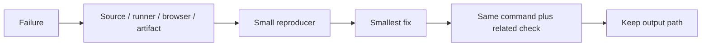

### Stop conditions

- Stop changing source when the failure is a missing runtime dependency.
- Stop updating snapshots when the diff has an unexplained content change.
- Stop widening types when the input has no runtime guard.
- Stop adding waits when the test has an ownership or cleanup bug.
- Stop after the requested behavior and rollback path have a passing check.

<a id="18--project-media-classification"></a>
<h1 align="center">
   Project media classification
</h1>

README labels describe purpose. File extensions and markup describe media. QA keeps those signals separate so an image link named `Demonstration` does not become a zero-duration video.

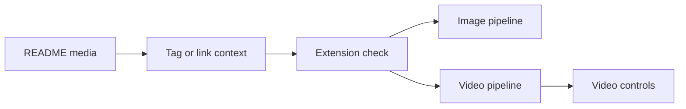

### How it works

- Markdown image syntax enters the image list unless its URL has a video extension.
- Markdown links use video extensions, GitHub attachment context, or explicit video words.
- Image extensions take precedence over stale `isVideo` data in client preview guards.
- Project cards, the project list, and the CityMap modal share the same stale-data guard.
- Route fixtures cover `.png` and `.webp` URLs paired with `Demonstration` and `Demonstração` labels.

### Project reading

| Signal | Classification |
|---|---|
| `.mp4`, `.webm`, `.mov`, `.m4v`, `.ogg` | Video. |
| `.png`, `.jpg`, `.jpeg`, `.webp`, `.avif`, `.svg`, `.gif` | Image. |
| `Demonstração` or `Demonstration` alone | Label only. |
| Stale video flag plus image extension | Image. |

### Checks

- Run route branch tests with both language labels.
- Assert image previews produce `` or slideshow output.
- Assert video previews keep `<video>` and controls.
- Inspect cached API responses after deployment and wait for revalidation.
- Run Lighthouse after media classification changes; inspect transfer size and media requests separately.

<a id="19--hydration-and-dom-mutation-triage"></a>
<h1 align="center">
   Hydration and DOM mutation triage
</h1>

Hydration failures need two separate checks: application markup must be deterministic, and browser extensions must not rewrite React-owned nodes before commit. This project covers both paths.

```mermaid
flowchart TB
    LOAD[Load production page] --> CONSOLE[Capture console errors]
    LOAD --> PAGE[Capture page errors]
    CONSOLE --> HYD[Check hydration diff]
    PAGE --> DOM[Check removeChild stack]
    HYD --> THEME[Check theme first render]
    DOM --> EXT[Check extension mutation]
    THEME --> RESULT[Record result]
    EXT --> RESULT
```

### How it works

- `Navigation` does not choose light/dark markup until hydration has a client snapshot.
- The layout places `darkreader-lock` in server-rendered `<head>` before client code runs.
- Smoke tests keep console errors and page errors separate so hydration warnings are not hidden by navigation failures.
- A `removeChild` stack with `finishedRoot.parentNode` points to an already-mutated DOM path, not a missing React component import.

### Project reading

| Check | Evidence |
|---|---|
| Initial markup | `Navigation.tsx` uses `useHydrated`. |
| Extension boundary | `src/app/[locale]/layout.tsx` emits the lock meta tag. |
| Runtime behavior | `tests/e2e/smoke.spec.ts` captures console and page errors. |
| Regression contract | `src/app/tests/shell.test.tsx` asserts the lock tag. |

### Checks

- Run `pnpm run lint` and `pnpm exec tsc --noEmit`.
- Run shell tests and production Chromium smoke tests.
- If an extension remains active, reload after the lock tag is present.
- Record whether the error disappears with extensions disabled and with the app's first render stabilized.

<a id="20--transition-panel-media"></a>
<h1 align="center">
   Transition panel media
</h1>

The manga transition has one six-panel contract. Three panels play existing MP4 files; three panels load animated GIF files from `public/images/gifs/`. The panel shape and timing stay shared, so QA checks media type separately from layout.

```mermaid
flowchart TB
    ASSET[Asset path] --> EXT{Extension}
    EXT -->|.mp4| VIDEO[Video element]
    EXT -->|.gif| GIF[Native image element]
    VIDEO --> PANEL[Shared panel CSS]
    GIF --> PANEL
    PANEL --> CHECK[Six-panel browser check]
```

### How it works

- `MOSAIC_VIDEOS` remains the video source list.
- `MOSAIC_GIFS` records each GIF path explicitly because public assets are not enumerated at browser runtime.
- `getMosaicMedia()` rotates both lists using the route transition seed and returns alternating media entries.
- Native image rendering preserves GIF animation; Next image optimization is not used for these transient panels.
- The CSS selector targets `portfolio-transition__manga-panel-media`, so both elements receive identical frame and animation rules.
- GIF panels use `object-fit: contain`; MP4 panels keep `object-fit: cover`.

### Checks

- Run `npx jest src/components/tests/page-transition.test.tsx --runInBand`.
- Assert six panel wrappers, three video nodes, and three image nodes.
- Check network requests for `/images/gifs/*.gif` after opening `/about`.
- Run production Chromium smoke and inspect console errors after asset changes.

<a id="references"></a>
<h1 align="center">
   References
</h1>

- https://eslint.org/docs/latest/
- https://github.com/kucherenko/jscpd
- https://github.com/GoogleChrome/lighthouse-ci
- https://github.com/terryyin/lizard
- [Project README](../README.md)
- [Package scripts](../package.json)
- [GitHub Actions workflows](../.github/workflows/)

<details>
  <summary>Review checklist</summary>

- [ ] Source owner is named.
- [ ] Runtime boundary is named.
- [ ] Success and failure states are described.
- [ ] Example matches current project syntax.
- [ ] Focused check ran.
- [ ] Related browser or quality check ran.
- [ ] Evidence path is recorded.
- [ ] README link resolves.

</details>

---
