<div align="center">

<h1 align="center">
  
  React / Field Notes
</h1>

Render flow, state ownership, effects, semantics, and browser behavior.

<a href="typescript.md">TypeScript docs</a>  <a href="jsx.md">JSX docs</a>  <a href="../README.md">README</a>  <a href="../src/components/">components</a>

</div>

---
<p align="center">
  
  
  
  
  
</p>

<table>
  <thead>
    <tr><th>Topic</th><th>Project baseline</th><th>Use it for</th></tr>
  </thead>
  <tbody>
    <tr><td>Runtime</td><td>React 19.2.8</td><td>State and props describe the current UI.</td></tr>
    <tr><td>Framework</td><td>Next.js 16.3.3</td><td>App Router supplies route and server boundaries.</td></tr>
    <tr><td>Contract</td><td>Typed props + HTML</td><td>Callers and browsers get readable interfaces.</td></tr>
    <tr><td>Motion</td><td>Framer Motion + CSS</td><td>Feedback stays separate from content.</td></tr>
  </tbody>
</table>

## Contents

- [01 / Render model](#01--render-model)
- [02 / Server and client boundary](#02--server-and-client-boundary)
- [03 / Component contracts](#03--component-contracts)
- [04 / State ownership](#04--state-ownership)
- [05 / Effects and cleanup](#05--effects-and-cleanup)
- [06 / Data fetching](#06--data-fetching)
- [07 / Lists and keys](#07--lists-and-keys)
- [08 / Events and intent](#08--events-and-intent)
- [09 / Forms](#09--forms)
- [10 / Semantic HTML](#10--semantic-html)
- [11 / Motion and preference](#11--motion-and-preference)
- [12 / Canvas and effects](#12--canvas-and-effects)
- [13 / Navigation composition](#13--navigation-composition)
- [14 / Project data flow](#14--project-data-flow)
- [15 / Component tests](#15--component-tests)
- [16 / Browser confidence](#16--browser-confidence)
- [17 / React review checklist](#17--react-review-checklist)
- [18 / Skill-linked project rail](#18--skill-linked-project-rail)
- [19 / Hydration and external DOM changes](#19--hydration-and-external-dom-changes)
- [20 / GIF and video panel media](#20--gif-and-video-panel-media)
- [Repository map](#repository-map)
- [Command matrix](#command-matrix)
- [Evidence and troubleshooting](#evidence-and-troubleshooting)
- [References](#references)

<h1 align="center">
   Operating model
</h1>

This guide explains **React / Field Notes** through the source tree, the runtime boundary, the smallest useful test, and the evidence a reviewer can inspect.

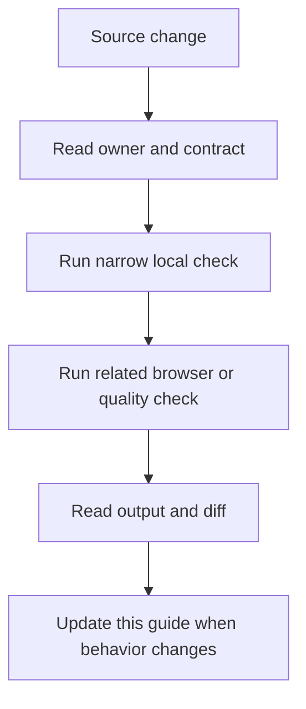

### Reading order

- Start at the section for the changed file or runtime.
- Copy the narrow command before running the broad suite.
- Check the failure branch and the evidence path.
- Compare README links after editing any docs entry point.

<a id="01--render-model"></a>
## 01 / Render model

React renders a description from current props and state, then commits the required DOM changes.

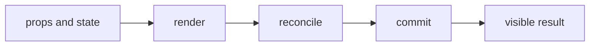

### How it works

1. `props and state` enters **Render model** as the value, event, file, or runtime that needs a decision.
2. `render` applies the rule owned by this section; keep that decision close to its source boundary.
3. `reconcile` carries the checked result to the next consumer instead of exposing private setup.
4. `commit` receives the result and makes it visible through markup, output, or an exit code.
5. Exercise the normal path and the failure path at the runtime named by the example.

### Project reading

- **Rule:** Keep render code pure and derive values from current inputs when a second state value is unnecessary.
- **Failure to catch:** A side effect runs during render or duplicated state drifts from its source.
- **Evidence:** A render test plus a user action that changes the state owner.
- **Owner:** `React / Field Notes` documents the contract; source files and tests remain the executable reference.
- **Scope:** Read this section with the linked source path in the repository catalog below.

### Example

```tsx
function Status({ ready }: { ready: boolean }) {
  return <p>{ready ? 'Ready' : 'Waiting'}</p>;
}
```

### Decision table

<table>
  <thead>
    <tr><th>Input</th><th>Project decision</th><th>Check</th></tr>
  </thead>
  <tbody>
    <tr><td>props and state</td><td>Keep it at the boundary named by the section.</td><td>A focused test or source inspection.</td></tr>
    <tr><td>render</td><td>Use the smallest rule that explains the branch.</td><td>Lint, type check, or browser assertion.</td></tr>
    <tr><td>reconcile</td><td>Return a readable value or state.</td><td>Success and failure cases.</td></tr>
    <tr><td>commit</td><td>Expose a semantic or reviewable consumer.</td><td>Role, report, screenshot, or exit code.</td></tr>
  </tbody>
</table>

### Checks

- Inspect the owner for `render` before editing the consumer.
- Assert the successful `reconcile` result through the public surface.
- Force the failure branch and confirm it reaches `commit`.
- Record the command and artifact path shown in this guide.

<a id="02--server-and-client-boundary"></a>
## 02 / Server and client boundary

Next.js decides where code runs. Client components opt into browser hooks and event handlers with use client.

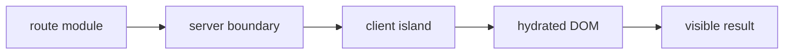

### How it works

1. `route module` enters **Server and client boundary** as the value, event, file, or runtime that needs a decision.
2. `server boundary` applies the rule owned by this section; keep that decision close to its source boundary.
3. `client island` carries the checked result to the next consumer instead of exposing private setup.
4. `hydrated DOM` receives the result and makes it visible through markup, output, or an exit code.
5. Exercise the normal path and the failure path at the runtime named by the example.

### Project reading

- **Rule:** Keep browser-only APIs inside client components and keep data work near the route that owns it.
- **Failure to catch:** window or document runs during server rendering, or a client boundary spreads without a browser need.
- **Evidence:** A production build and a browser test for the interactive branch.
- **Owner:** `React / Field Notes` documents the contract; source files and tests remain the executable reference.
- **Scope:** Read this section with the linked source path in the repository catalog below.

### Example

```tsx
'use client';

import { useState } from 'react';

export function Toggle() {
  const [open, setOpen] = useState(false);
  return <button onClick={() => setOpen(!open)}>{String(open)}</button>;
}
```

### Decision table

<table>
  <thead>
    <tr><th>Input</th><th>Project decision</th><th>Check</th></tr>
  </thead>
  <tbody>
    <tr><td>route module</td><td>Keep it at the boundary named by the section.</td><td>A focused test or source inspection.</td></tr>
    <tr><td>server boundary</td><td>Use the smallest rule that explains the branch.</td><td>Lint, type check, or browser assertion.</td></tr>
    <tr><td>client island</td><td>Return a readable value or state.</td><td>Success and failure cases.</td></tr>
    <tr><td>hydrated DOM</td><td>Expose a semantic or reviewable consumer.</td><td>Role, report, screenshot, or exit code.</td></tr>
  </tbody>
</table>

### Checks

- Inspect the owner for `server boundary` before editing the consumer.
- Assert the successful `client island` result through the public surface.
- Force the failure branch and confirm it reaches `hydrated DOM`.
- Record the command and artifact path shown in this guide.

<a id="03--component-contracts"></a>
## 03 / Component contracts

A component should have a small public surface with props that describe what the caller wants.

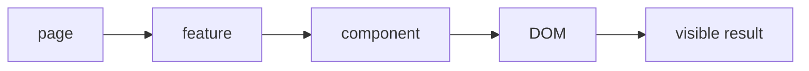

### How it works

1. `page` enters **Component contracts** as the value, event, file, or runtime that needs a decision.
2. `feature` applies the rule owned by this section; keep that decision close to its source boundary.
3. `component` carries the checked result to the next consumer instead of exposing private setup.
4. `DOM` receives the result and makes it visible through markup, output, or an exit code.
5. Exercise the normal path and the failure path at the runtime named by the example.

### Project reading

- **Rule:** Keep layout in the parent and local visual behavior in the feature component.
- **Failure to catch:** A component accepts many flags because it owns several unrelated decisions.
- **Evidence:** A call-site review and a test through the visible interaction.
- **Owner:** `React / Field Notes` documents the contract; source files and tests remain the executable reference.
- **Scope:** Read this section with the linked source path in the repository catalog below.

### Example

```tsx
type CardProps = {
  title: string;
  href: string;
  children: React.ReactNode;
};

export function Card({ title, href, children }: CardProps) {
  return <a href={href}><h2>{title}</h2>{children}</a>;
}
```

### Decision table

<table>
  <thead>
    <tr><th>Input</th><th>Project decision</th><th>Check</th></tr>
  </thead>
  <tbody>
    <tr><td>page</td><td>Keep it at the boundary named by the section.</td><td>A focused test or source inspection.</td></tr>
    <tr><td>feature</td><td>Use the smallest rule that explains the branch.</td><td>Lint, type check, or browser assertion.</td></tr>
    <tr><td>component</td><td>Return a readable value or state.</td><td>Success and failure cases.</td></tr>
    <tr><td>DOM</td><td>Expose a semantic or reviewable consumer.</td><td>Role, report, screenshot, or exit code.</td></tr>
  </tbody>
</table>

### Checks

- Inspect the owner for `feature` before editing the consumer.
- Assert the successful `component` result through the public surface.
- Force the failure branch and confirm it reaches `DOM`.
- Record the command and artifact path shown in this guide.

<a id="04--state-ownership"></a>
## 04 / State ownership

State belongs to the nearest component that needs to coordinate the value and its updates.

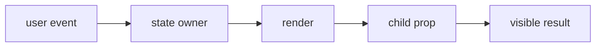

### How it works

1. `user event` enters **State ownership** as the value, event, file, or runtime that needs a decision.
2. `state owner` applies the rule owned by this section; keep that decision close to its source boundary.
3. `render` carries the checked result to the next consumer instead of exposing private setup.
4. `child prop` receives the result and makes it visible through markup, output, or an exit code.
5. Exercise the normal path and the failure path at the runtime named by the example.

### Project reading

- **Rule:** Lift state only when two siblings need the same source of truth.
- **Failure to catch:** Global state stores a local hover or a child keeps a filter that the parent must read.
- **Evidence:** A test that performs the user action and checks both affected surfaces.
- **Owner:** `React / Field Notes` documents the contract; source files and tests remain the executable reference.
- **Scope:** Read this section with the linked source path in the repository catalog below.

### Example

```tsx
const [selected, setSelected] = useState('all');
const visible = projects.filter((project) =>
  selected === 'all' || project.language === selected
);
```

### Decision table

<table>
  <thead>
    <tr><th>Input</th><th>Project decision</th><th>Check</th></tr>
  </thead>
  <tbody>
    <tr><td>user event</td><td>Keep it at the boundary named by the section.</td><td>A focused test or source inspection.</td></tr>
    <tr><td>state owner</td><td>Use the smallest rule that explains the branch.</td><td>Lint, type check, or browser assertion.</td></tr>
    <tr><td>render</td><td>Return a readable value or state.</td><td>Success and failure cases.</td></tr>
    <tr><td>child prop</td><td>Expose a semantic or reviewable consumer.</td><td>Role, report, screenshot, or exit code.</td></tr>
  </tbody>
</table>

### Checks

- Inspect the owner for `state owner` before editing the consumer.
- Assert the successful `render` result through the public surface.
- Force the failure branch and confirm it reaches `child prop`.
- Record the command and artifact path shown in this guide.

<a id="05--effects-and-cleanup"></a>
## 05 / Effects and cleanup

Effects synchronize React with subscriptions, timers, browser listeners, and requests that live outside render.

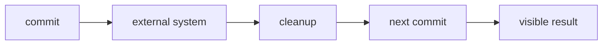

### How it works

1. `commit` enters **Effects and cleanup** as the value, event, file, or runtime that needs a decision.
2. `external system` applies the rule owned by this section; keep that decision close to its source boundary.
3. `cleanup` carries the checked result to the next consumer instead of exposing private setup.
4. `next commit` receives the result and makes it visible through markup, output, or an exit code.
5. Exercise the normal path and the failure path at the runtime named by the example.

### Project reading

- **Rule:** Return cleanup for every listener, timer, subscription, or abort controller created by an effect.
- **Failure to catch:** An old listener updates a new render or a timer fires after unmount.
- **Evidence:** Fake timers, unmount, and listener assertions.
- **Owner:** `React / Field Notes` documents the contract; source files and tests remain the executable reference.
- **Scope:** Read this section with the linked source path in the repository catalog below.

### Example

```tsx
useEffect(() => {
  const controller = new AbortController();
  void load(controller.signal);
  return () => controller.abort();
}, [load]);
```

### Decision table

<table>
  <thead>
    <tr><th>Input</th><th>Project decision</th><th>Check</th></tr>
  </thead>
  <tbody>
    <tr><td>commit</td><td>Keep it at the boundary named by the section.</td><td>A focused test or source inspection.</td></tr>
    <tr><td>external system</td><td>Use the smallest rule that explains the branch.</td><td>Lint, type check, or browser assertion.</td></tr>
    <tr><td>cleanup</td><td>Return a readable value or state.</td><td>Success and failure cases.</td></tr>
    <tr><td>next commit</td><td>Expose a semantic or reviewable consumer.</td><td>Role, report, screenshot, or exit code.</td></tr>
  </tbody>
</table>

### Checks

- Inspect the owner for `external system` before editing the consumer.
- Assert the successful `cleanup` result through the public surface.
- Force the failure branch and confirm it reaches `next commit`.
- Record the command and artifact path shown in this guide.

<a id="06--data-fetching"></a>
## 06 / Data fetching

Fetch state needs loading, success, empty, and error branches that the page can render directly.

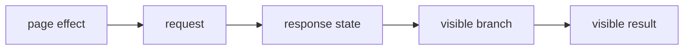

### How it works

1. `page effect` enters **Data fetching** as the value, event, file, or runtime that needs a decision.
2. `request` applies the rule owned by this section; keep that decision close to its source boundary.
3. `response state` carries the checked result to the next consumer instead of exposing private setup.
4. `visible branch` receives the result and makes it visible through markup, output, or an exit code.
5. Exercise the normal path and the failure path at the runtime named by the example.

### Project reading

- **Rule:** Keep request ownership clear and show a retry path when the user can recover.
- **Failure to catch:** A failed request leaves stale data or an empty page with no explanation.
- **Evidence:** Mocked success, empty, rejected, and retry cases.
- **Owner:** `React / Field Notes` documents the contract; source files and tests remain the executable reference.
- **Scope:** Read this section with the linked source path in the repository catalog below.

### Example

```tsx
const [status, setStatus] = useState<'idle' | 'loading' | 'ready' | 'error'>('idle');

async function reload() {
  setStatus('loading');
  try { await fetch('/api/projects'); setStatus('ready'); }
  catch { setStatus('error'); }
}
```

### Decision table

<table>
  <thead>
    <tr><th>Input</th><th>Project decision</th><th>Check</th></tr>
  </thead>
  <tbody>
    <tr><td>page effect</td><td>Keep it at the boundary named by the section.</td><td>A focused test or source inspection.</td></tr>
    <tr><td>request</td><td>Use the smallest rule that explains the branch.</td><td>Lint, type check, or browser assertion.</td></tr>
    <tr><td>response state</td><td>Return a readable value or state.</td><td>Success and failure cases.</td></tr>
    <tr><td>visible branch</td><td>Expose a semantic or reviewable consumer.</td><td>Role, report, screenshot, or exit code.</td></tr>
  </tbody>
</table>

### Checks

- Inspect the owner for `request` before editing the consumer.
- Assert the successful `response state` result through the public surface.
- Force the failure branch and confirm it reaches `visible branch`.
- Record the command and artifact path shown in this guide.

<a id="07--lists-and-keys"></a>
## 07 / Lists and keys

Lists need stable keys from domain identity so React can preserve the correct item when order changes.

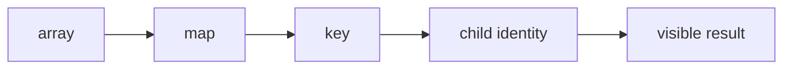

### How it works

1. `array` enters **Lists and keys** as the value, event, file, or runtime that needs a decision.
2. `map` applies the rule owned by this section; keep that decision close to its source boundary.
3. `key` carries the checked result to the next consumer instead of exposing private setup.
4. `child identity` receives the result and makes it visible through markup, output, or an exit code.
5. Exercise the normal path and the failure path at the runtime named by the example.

### Project reading

- **Rule:** Use a stable repository or record id; use an index only for a fixed, non-reorderable list.
- **Failure to catch:** Inputs, animation state, or focus move to another row after insertion.
- **Evidence:** A reorder test or a review of the domain identifier.
- **Owner:** `React / Field Notes` documents the contract; source files and tests remain the executable reference.
- **Scope:** Read this section with the linked source path in the repository catalog below.

### Example

```tsx
{projects.map((project) => (
  <ProjectCard key={project.id} repo={project} />
))}
```

### Decision table

<table>
  <thead>
    <tr><th>Input</th><th>Project decision</th><th>Check</th></tr>
  </thead>
  <tbody>
    <tr><td>array</td><td>Keep it at the boundary named by the section.</td><td>A focused test or source inspection.</td></tr>
    <tr><td>map</td><td>Use the smallest rule that explains the branch.</td><td>Lint, type check, or browser assertion.</td></tr>
    <tr><td>key</td><td>Return a readable value or state.</td><td>Success and failure cases.</td></tr>
    <tr><td>child identity</td><td>Expose a semantic or reviewable consumer.</td><td>Role, report, screenshot, or exit code.</td></tr>
  </tbody>
</table>

### Checks

- Inspect the owner for `map` before editing the consumer.
- Assert the successful `key` result through the public surface.
- Force the failure branch and confirm it reaches `child identity`.
- Record the command and artifact path shown in this guide.

<a id="08--events-and-intent"></a>
## 08 / Events and intent

Event props carry user intent from a semantic control to the component that owns the state change.

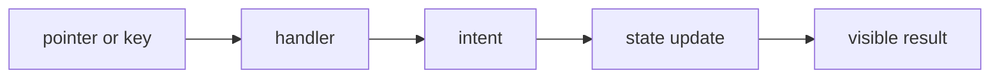

### How it works

1. `pointer or key` enters **Events and intent** as the value, event, file, or runtime that needs a decision.
2. `handler` applies the rule owned by this section; keep that decision close to its source boundary.
3. `intent` carries the checked result to the next consumer instead of exposing private setup.
4. `state update` receives the result and makes it visible through markup, output, or an exit code.
5. Exercise the normal path and the failure path at the runtime named by the example.

### Project reading

- **Rule:** Use buttons and links for their native actions before adding custom pointer handlers.
- **Failure to catch:** A clickable div works with a mouse but has no keyboard or focus behavior.
- **Evidence:** Role, name, keyboard, and click assertions.
- **Owner:** `React / Field Notes` documents the contract; source files and tests remain the executable reference.
- **Scope:** Read this section with the linked source path in the repository catalog below.

### Example

```tsx
<button type="button" onClick={() => onClose()}>
  Close
</button>
```

### Decision table

<table>
  <thead>
    <tr><th>Input</th><th>Project decision</th><th>Check</th></tr>
  </thead>
  <tbody>
    <tr><td>pointer or key</td><td>Keep it at the boundary named by the section.</td><td>A focused test or source inspection.</td></tr>
    <tr><td>handler</td><td>Use the smallest rule that explains the branch.</td><td>Lint, type check, or browser assertion.</td></tr>
    <tr><td>intent</td><td>Return a readable value or state.</td><td>Success and failure cases.</td></tr>
    <tr><td>state update</td><td>Expose a semantic or reviewable consumer.</td><td>Role, report, screenshot, or exit code.</td></tr>
  </tbody>
</table>

### Checks

- Inspect the owner for `handler` before editing the consumer.
- Assert the successful `intent` result through the public surface.
- Force the failure branch and confirm it reaches `state update`.
- Record the command and artifact path shown in this guide.

<a id="09--forms"></a>
## 09 / Forms

Forms collect user input, validate at the boundary, and expose a clear submit or error result.

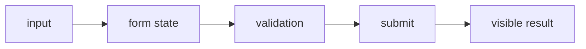

### How it works

1. `input` enters **Forms** as the value, event, file, or runtime that needs a decision.
2. `form state` applies the rule owned by this section; keep that decision close to its source boundary.
3. `validation` carries the checked result to the next consumer instead of exposing private setup.
4. `submit` receives the result and makes it visible through markup, output, or an exit code.
5. Exercise the normal path and the failure path at the runtime named by the example.

### Project reading

- **Rule:** Keep labels connected to fields and validate before opening a mail or API action.
- **Failure to catch:** The form submits with missing data or the error is only visible in the console.
- **Evidence:** Invalid input, valid submit, and focus behavior tests.
- **Owner:** `React / Field Notes` documents the contract; source files and tests remain the executable reference.
- **Scope:** Read this section with the linked source path in the repository catalog below.

### Example

```tsx
<label htmlFor="email">Email</label>
<input id="email" name="email" type="email" required />
<button type="submit">Send</button>
```

### Decision table

<table>
  <thead>
    <tr><th>Input</th><th>Project decision</th><th>Check</th></tr>
  </thead>
  <tbody>
    <tr><td>input</td><td>Keep it at the boundary named by the section.</td><td>A focused test or source inspection.</td></tr>
    <tr><td>form state</td><td>Use the smallest rule that explains the branch.</td><td>Lint, type check, or browser assertion.</td></tr>
    <tr><td>validation</td><td>Return a readable value or state.</td><td>Success and failure cases.</td></tr>
    <tr><td>submit</td><td>Expose a semantic or reviewable consumer.</td><td>Role, report, screenshot, or exit code.</td></tr>
  </tbody>
</table>

### Checks

- Inspect the owner for `form state` before editing the consumer.
- Assert the successful `validation` result through the public surface.
- Force the failure branch and confirm it reaches `submit`.
- Record the command and artifact path shown in this guide.

<a id="10--semantic-html"></a>
## 10 / Semantic HTML

React controls the tree, but the browser still needs headings, landmarks, lists, labels, links, and buttons.

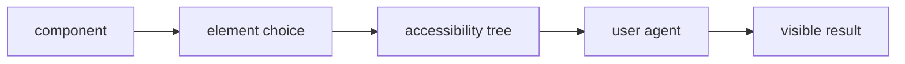

### How it works

1. `component` enters **Semantic HTML** as the value, event, file, or runtime that needs a decision.
2. `element choice` applies the rule owned by this section; keep that decision close to its source boundary.
3. `accessibility tree` carries the checked result to the next consumer instead of exposing private setup.
4. `user agent` receives the result and makes it visible through markup, output, or an exit code.
5. Exercise the normal path and the failure path at the runtime named by the example.

### Project reading

- **Rule:** Choose the native element that already supplies the expected keyboard and role behavior.
- **Failure to catch:** A div imitates a button and accessibility tests must repair behavior that HTML provided for free.
- **Evidence:** getByRole assertions and an axe run.
- **Owner:** `React / Field Notes` documents the contract; source files and tests remain the executable reference.
- **Scope:** Read this section with the linked source path in the repository catalog below.

### Example

```tsx
<main>
  <h1>Projects</h1>
  <nav aria-label="Project filters">
    <button type="button">All</button>
  </nav>
</main>
```

### Decision table

<table>
  <thead>
    <tr><th>Input</th><th>Project decision</th><th>Check</th></tr>
  </thead>
  <tbody>
    <tr><td>component</td><td>Keep it at the boundary named by the section.</td><td>A focused test or source inspection.</td></tr>
    <tr><td>element choice</td><td>Use the smallest rule that explains the branch.</td><td>Lint, type check, or browser assertion.</td></tr>
    <tr><td>accessibility tree</td><td>Return a readable value or state.</td><td>Success and failure cases.</td></tr>
    <tr><td>user agent</td><td>Expose a semantic or reviewable consumer.</td><td>Role, report, screenshot, or exit code.</td></tr>
  </tbody>
</table>

### Checks

- Inspect the owner for `element choice` before editing the consumer.
- Assert the successful `accessibility tree` result through the public surface.
- Force the failure branch and confirm it reaches `user agent`.
- Record the command and artifact path shown in this guide.

<a id="11--motion-and-preference"></a>
## 11 / Motion and preference

Motion adds feedback around state changes; content must stay understandable when reduced motion is requested.

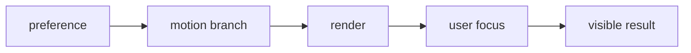

### How it works

1. `preference` enters **Motion and preference** as the value, event, file, or runtime that needs a decision.
2. `motion branch` applies the rule owned by this section; keep that decision close to its source boundary.
3. `render` carries the checked result to the next consumer instead of exposing private setup.
4. `user focus` receives the result and makes it visible through markup, output, or an exit code.
5. Exercise the normal path and the failure path at the runtime named by the example.

### Project reading

- **Rule:** Read reduced motion and remove motion that carries no meaning for the task.
- **Failure to catch:** A transition delays navigation or a canvas effect consumes work for a reduced-motion user.
- **Evidence:** Reduced-motion render and cleanup tests.
- **Owner:** `React / Field Notes` documents the contract; source files and tests remain the executable reference.
- **Scope:** Read this section with the linked source path in the repository catalog below.

### Example

```tsx
const reduced = useReducedMotion();
return reduced ? <StaticCard /> : <AnimatedCard />;
```

### Decision table

<table>
  <thead>
    <tr><th>Input</th><th>Project decision</th><th>Check</th></tr>
  </thead>
  <tbody>
    <tr><td>preference</td><td>Keep it at the boundary named by the section.</td><td>A focused test or source inspection.</td></tr>
    <tr><td>motion branch</td><td>Use the smallest rule that explains the branch.</td><td>Lint, type check, or browser assertion.</td></tr>
    <tr><td>render</td><td>Return a readable value or state.</td><td>Success and failure cases.</td></tr>
    <tr><td>user focus</td><td>Expose a semantic or reviewable consumer.</td><td>Role, report, screenshot, or exit code.</td></tr>
  </tbody>
</table>

### Checks

- Inspect the owner for `motion branch` before editing the consumer.
- Assert the successful `render` result through the public surface.
- Force the failure branch and confirm it reaches `user focus`.
- Record the command and artifact path shown in this guide.

<a id="12--canvas-and-effects"></a>
## 12 / Canvas and effects

Canvas layers decorate the page while React owns lifecycle, dimensions, pointer input, and cleanup.

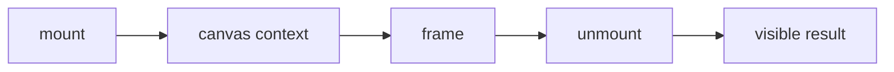

### How it works

1. `mount` enters **Canvas and effects** as the value, event, file, or runtime that needs a decision.
2. `canvas context` applies the rule owned by this section; keep that decision close to its source boundary.
3. `frame` carries the checked result to the next consumer instead of exposing private setup.
4. `unmount` receives the result and makes it visible through markup, output, or an exit code.
5. Exercise the normal path and the failure path at the runtime named by the example.

### Project reading

- **Rule:** Keep canvas work isolated from content and stop animation frames on cleanup.
- **Failure to catch:** A frame loop survives navigation or a missing context throws during a test.
- **Evidence:** Mocked context, resize, pointer, and unmount coverage.
- **Owner:** `React / Field Notes` documents the contract; source files and tests remain the executable reference.
- **Scope:** Read this section with the linked source path in the repository catalog below.

### Example

```tsx
useEffect(() => {
  let frame = requestAnimationFrame(draw);
  return () => cancelAnimationFrame(frame);
}, [draw]);
```

### Decision table

<table>
  <thead>
    <tr><th>Input</th><th>Project decision</th><th>Check</th></tr>
  </thead>
  <tbody>
    <tr><td>mount</td><td>Keep it at the boundary named by the section.</td><td>A focused test or source inspection.</td></tr>
    <tr><td>canvas context</td><td>Use the smallest rule that explains the branch.</td><td>Lint, type check, or browser assertion.</td></tr>
    <tr><td>frame</td><td>Return a readable value or state.</td><td>Success and failure cases.</td></tr>
    <tr><td>unmount</td><td>Expose a semantic or reviewable consumer.</td><td>Role, report, screenshot, or exit code.</td></tr>
  </tbody>
</table>

### Checks

- Inspect the owner for `canvas context` before editing the consumer.
- Assert the successful `frame` result through the public surface.
- Force the failure branch and confirm it reaches `unmount`.
- Record the command and artifact path shown in this guide.

<a id="13--navigation-composition"></a>
## 13 / Navigation composition

The app shell coordinates locale, navigation, theme controls, page transitions, and the active route.

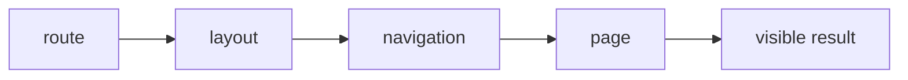

### How it works

1. `route` enters **Navigation composition** as the value, event, file, or runtime that needs a decision.
2. `layout` applies the rule owned by this section; keep that decision close to its source boundary.
3. `navigation` carries the checked result to the next consumer instead of exposing private setup.
4. `page` receives the result and makes it visible through markup, output, or an exit code.
5. Exercise the normal path and the failure path at the runtime named by the example.

### Project reading

- **Rule:** Keep route composition in layouts and keep page content in the route that owns it.
- **Failure to catch:** A page adds another global listener or breaks the mobile menu on a sibling route.
- **Evidence:** Shell tests and route-level Playwright navigation.
- **Owner:** `React / Field Notes` documents the contract; source files and tests remain the executable reference.
- **Scope:** Read this section with the linked source path in the repository catalog below.

### Example

```tsx
<Navigation />
<main>{children}</main>
<PageTransitionOverlay />
```

### Decision table

<table>
  <thead>
    <tr><th>Input</th><th>Project decision</th><th>Check</th></tr>
  </thead>
  <tbody>
    <tr><td>route</td><td>Keep it at the boundary named by the section.</td><td>A focused test or source inspection.</td></tr>
    <tr><td>layout</td><td>Use the smallest rule that explains the branch.</td><td>Lint, type check, or browser assertion.</td></tr>
    <tr><td>navigation</td><td>Return a readable value or state.</td><td>Success and failure cases.</td></tr>
    <tr><td>page</td><td>Expose a semantic or reviewable consumer.</td><td>Role, report, screenshot, or exit code.</td></tr>
  </tbody>
</table>

### Checks

- Inspect the owner for `layout` before editing the consumer.
- Assert the successful `navigation` result through the public surface.
- Force the failure branch and confirm it reaches `page`.
- Record the command and artifact path shown in this guide.

<a id="14--project-data-flow"></a>
## 14 / Project data flow

The projects page fetches repository data, derives metrics, filters the collection, and opens a README modal.

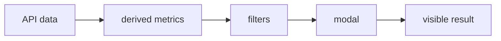

### How it works

1. `API data` enters **Project data flow** as the value, event, file, or runtime that needs a decision.
2. `derived metrics` applies the rule owned by this section; keep that decision close to its source boundary.
3. `filters` carries the checked result to the next consumer instead of exposing private setup.
4. `modal` receives the result and makes it visible through markup, output, or an exit code.
5. Exercise the normal path and the failure path at the runtime named by the example.

### Project reading

- **Rule:** Derive metrics and filtered results from projects instead of storing duplicate arrays.
- **Failure to catch:** A filter updates one list but the metric card reads an older copy.
- **Evidence:** Success, error, empty, filter, and modal tests.
- **Owner:** `React / Field Notes` documents the contract; source files and tests remain the executable reference.
- **Scope:** Read this section with the linked source path in the repository catalog below.

### Example

```tsx
const filtered = projects.filter((project) =>
  project.name.toLowerCase().includes(query.toLowerCase())
);
```

### Decision table

<table>
  <thead>
    <tr><th>Input</th><th>Project decision</th><th>Check</th></tr>
  </thead>
  <tbody>
    <tr><td>API data</td><td>Keep it at the boundary named by the section.</td><td>A focused test or source inspection.</td></tr>
    <tr><td>derived metrics</td><td>Use the smallest rule that explains the branch.</td><td>Lint, type check, or browser assertion.</td></tr>
    <tr><td>filters</td><td>Return a readable value or state.</td><td>Success and failure cases.</td></tr>
    <tr><td>modal</td><td>Expose a semantic or reviewable consumer.</td><td>Role, report, screenshot, or exit code.</td></tr>
  </tbody>
</table>

### Checks

- Inspect the owner for `derived metrics` before editing the consumer.
- Assert the successful `filters` result through the public surface.
- Force the failure branch and confirm it reaches `modal`.
- Record the command and artifact path shown in this guide.

<a id="15--component-tests"></a>
## 15 / Component tests

React Testing Library tests the user-visible contract instead of private state or implementation calls.

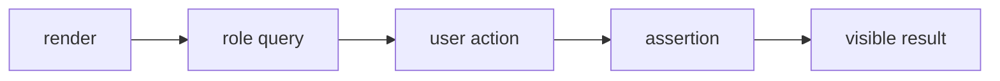

### How it works

1. `render` enters **Component tests** as the value, event, file, or runtime that needs a decision.
2. `role query` applies the rule owned by this section; keep that decision close to its source boundary.
3. `user action` carries the checked result to the next consumer instead of exposing private setup.
4. `assertion` receives the result and makes it visible through markup, output, or an exit code.
5. Exercise the normal path and the failure path at the runtime named by the example.

### Project reading

- **Rule:** Query by role and accessible name, then perform the action a user performs.
- **Failure to catch:** A test passes because it called a component method that no browser user can call.
- **Evidence:** The test name, action, and visible assertion.
- **Owner:** `React / Field Notes` documents the contract; source files and tests remain the executable reference.
- **Scope:** Read this section with the linked source path in the repository catalog below.

### Example

```tsx
render(<Notice title="Build" onClose={onClose}>Ready</Notice>);
await user.click(screen.getByRole('button', { name: 'Close' }));
expect(onClose).toHaveBeenCalled();
```

### Decision table

<table>
  <thead>
    <tr><th>Input</th><th>Project decision</th><th>Check</th></tr>
  </thead>
  <tbody>
    <tr><td>render</td><td>Keep it at the boundary named by the section.</td><td>A focused test or source inspection.</td></tr>
    <tr><td>role query</td><td>Use the smallest rule that explains the branch.</td><td>Lint, type check, or browser assertion.</td></tr>
    <tr><td>user action</td><td>Return a readable value or state.</td><td>Success and failure cases.</td></tr>
    <tr><td>assertion</td><td>Expose a semantic or reviewable consumer.</td><td>Role, report, screenshot, or exit code.</td></tr>
  </tbody>
</table>

### Checks

- Inspect the owner for `role query` before editing the consumer.
- Assert the successful `user action` result through the public surface.
- Force the failure branch and confirm it reaches `assertion`.
- Record the command and artifact path shown in this guide.

<a id="16--browser-confidence"></a>
## 16 / Browser confidence

Real browser checks cover hydration, focus, viewport behavior, CSS effects, and browser APIs that jsdom models poorly.

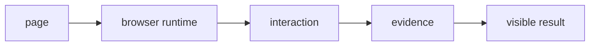

### How it works

1. `page` enters **Browser confidence** as the value, event, file, or runtime that needs a decision.
2. `browser runtime` applies the rule owned by this section; keep that decision close to its source boundary.
3. `interaction` carries the checked result to the next consumer instead of exposing private setup.
4. `evidence` receives the result and makes it visible through markup, output, or an exit code.
5. Exercise the normal path and the failure path at the runtime named by the example.

### Project reading

- **Rule:** Send browser-dependent behavior to Vitest Browser Mode or Playwright.
- **Failure to catch:** A jsdom test passes while focus, layout, or navigation fails in Chromium.
- **Evidence:** Browser report, screenshot, trace, or video when applicable.
- **Owner:** `React / Field Notes` documents the contract; source files and tests remain the executable reference.
- **Scope:** Read this section with the linked source path in the repository catalog below.

### Example

```ts
await page.goto('/en/projects');
await expect(page.getByRole('heading', { name: /projects/i })).toBeVisible();
```

### Decision table

<table>
  <thead>
    <tr><th>Input</th><th>Project decision</th><th>Check</th></tr>
  </thead>
  <tbody>
    <tr><td>page</td><td>Keep it at the boundary named by the section.</td><td>A focused test or source inspection.</td></tr>
    <tr><td>browser runtime</td><td>Use the smallest rule that explains the branch.</td><td>Lint, type check, or browser assertion.</td></tr>
    <tr><td>interaction</td><td>Return a readable value or state.</td><td>Success and failure cases.</td></tr>
    <tr><td>evidence</td><td>Expose a semantic or reviewable consumer.</td><td>Role, report, screenshot, or exit code.</td></tr>
  </tbody>
</table>

### Checks

- Inspect the owner for `browser runtime` before editing the consumer.
- Assert the successful `interaction` result through the public surface.
- Force the failure branch and confirm it reaches `evidence`.
- Record the command and artifact path shown in this guide.

<a id="17--react-review-checklist"></a>
## 17 / React review checklist

A review should connect render logic, state ownership, effects, semantics, and test evidence.

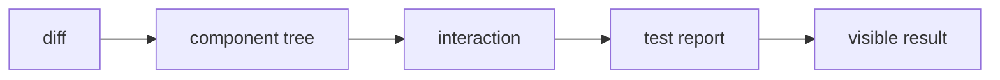

### How it works

1. `diff` enters **React review checklist** as the value, event, file, or runtime that needs a decision.
2. `component tree` applies the rule owned by this section; keep that decision close to its source boundary.
3. `interaction` carries the checked result to the next consumer instead of exposing private setup.
4. `test report` receives the result and makes it visible through markup, output, or an exit code.
5. Exercise the normal path and the failure path at the runtime named by the example.

### Project reading

- **Rule:** Review the rendered behavior from the user path back to the smallest code owner.
- **Failure to catch:** A local fix solves one branch but leaves cleanup or keyboard behavior untested.
- **Evidence:** Checklist results plus the focused command.
- **Owner:** `React / Field Notes` documents the contract; source files and tests remain the executable reference.
- **Scope:** Read this section with the linked source path in the repository catalog below.

### Example

```ts
const review = {
  pureRender: true,
  cleanup: true,
  semanticControl: true,
  browserEvidence: true,
};
```

### Decision table

<table>
  <thead>
    <tr><th>Input</th><th>Project decision</th><th>Check</th></tr>
  </thead>
  <tbody>
    <tr><td>diff</td><td>Keep it at the boundary named by the section.</td><td>A focused test or source inspection.</td></tr>
    <tr><td>component tree</td><td>Use the smallest rule that explains the branch.</td><td>Lint, type check, or browser assertion.</td></tr>
    <tr><td>interaction</td><td>Return a readable value or state.</td><td>Success and failure cases.</td></tr>
    <tr><td>test report</td><td>Expose a semantic or reviewable consumer.</td><td>Role, report, screenshot, or exit code.</td></tr>
  </tbody>
</table>

### Checks

- Inspect the owner for `component tree` before editing the consumer.
- Assert the successful `interaction` result through the public surface.
- Force the failure branch and confirm it reaches `test report`.
- Record the command and artifact path shown in this guide.

<a id="repository-map"></a>
<h1 align="center">
   Repository map
</h1>

The catalog is intentionally concrete. Use it to jump from a concept to the source or test that implements it.

<table>
  <thead>
    <tr><th>Area</th><th>Paths</th><th>Read for</th></tr>
  </thead>
  <tbody>
    <tr><td>Application</td><td>`src/app/`</td><td>Routes, layouts, metadata, and API handlers.</td></tr>
    <tr><td>Components</td><td>`src/components/`</td><td>React composition, effects, UI, and project surfaces.</td></tr>
    <tr><td>Tests</td><td>`tests/` and `src/**/tests/`</td><td>Runner-specific behavior and boundary cases.</td></tr>
    <tr><td>Scripts</td><td>`scripts/tests/` and `scripts/qa/`</td><td>Quality reports, server startup, screenshots, and video conversion.</td></tr>
    <tr><td>Automation</td><td>`.github/workflows/`</td><td>CI triggers, jobs, artifacts, and delivery.</td></tr>
  </tbody>
</table>


<table>
  <thead>
    <tr><th>Path</th><th>Relation to this guide</th><th>Open with</th></tr>
  </thead>
  <tbody>
    <tr><td><code>.github/workflows/ci.yml</code></td><td>Automation or delivery boundary.</td><td>`ci.md` or the workflow job log.</td></tr>
    <tr><td><code>.github/workflows/codeql.yml</code></td><td>Automation or delivery boundary.</td><td>`ci.md` or the workflow job log.</td></tr>
    <tr><td><code>.github/workflows/dependencies.yml</code></td><td>Automation or delivery boundary.</td><td>`ci.md` or the workflow job log.</td></tr>
    <tr><td><code>.github/workflows/deploy.yml</code></td><td>Automation or delivery boundary.</td><td>`ci.md` or the workflow job log.</td></tr>
    <tr><td><code>.github/workflows/docker.yml</code></td><td>Automation or delivery boundary.</td><td>`ci.md` or the workflow job log.</td></tr>
    <tr><td><code>.github/workflows/frontend-qa.yml</code></td><td>Automation or delivery boundary.</td><td>`ci.md` or the workflow job log.</td></tr>
    <tr><td><code>.storybook/main.ts</code></td><td>Application source, typed component, or style rule.</td><td>The nearest test and route.</td></tr>
    <tr><td><code>README.md</code></td><td>Project configuration or documentation entry point.</td><td>The command that consumes it.</td></tr>
    <tr><td><code>jest.config.js</code></td><td>Project configuration or documentation entry point.</td><td>The command that consumes it.</td></tr>
    <tr><td><code>lighthouserc.js</code></td><td>Project configuration or documentation entry point.</td><td>The command that consumes it.</td></tr>
    <tr><td><code>package.json</code></td><td>Project configuration or documentation entry point.</td><td>The command that consumes it.</td></tr>
    <tr><td><code>playwright.config.ts</code></td><td>Application source, typed component, or style rule.</td><td>The nearest test and route.</td></tr>
    <tr><td><code>scripts/qa/capture-lighthouse-screenshots.mjs</code></td><td>QA runtime helper or evidence producer.</td><td>`testing.md` or `qa.md`.</td></tr>
    <tr><td><code>scripts/qa/convert-playwright-video.mjs</code></td><td>QA runtime helper or evidence producer.</td><td>`testing.md` or `qa.md`.</td></tr>
    <tr><td><code>scripts/qa/start-production.mjs</code></td><td>QA runtime helper or evidence producer.</td><td>`testing.md` or `qa.md`.</td></tr>
    <tr><td><code>scripts/tests/benchmark.mjs</code></td><td>Behavior check or test fixture.</td><td>The related source module.</td></tr>
    <tr><td><code>scripts/tests/benchmark.node-test.mjs</code></td><td>Behavior check or test fixture.</td><td>The related source module.</td></tr>
    <tr><td><code>scripts/tests/check-file-size.mjs</code></td><td>Behavior check or test fixture.</td><td>The related source module.</td></tr>
    <tr><td><code>scripts/tests/check-file-size.node-test.mjs</code></td><td>Behavior check or test fixture.</td><td>The related source module.</td></tr>
    <tr><td><code>scripts/tests/file-size-policy.mjs</code></td><td>Behavior check or test fixture.</td><td>The related source module.</td></tr>
    <tr><td><code>scripts/tests/jscpd.mjs</code></td><td>Behavior check or test fixture.</td><td>The related source module.</td></tr>
    <tr><td><code>scripts/tests/jscpd.node-test.mjs</code></td><td>Behavior check or test fixture.</td><td>The related source module.</td></tr>
    <tr><td><code>scripts/tests/quality-metrics.mjs</code></td><td>Behavior check or test fixture.</td><td>The related source module.</td></tr>
    <tr><td><code>scripts/tests/quality-metrics.node-test.mjs</code></td><td>Behavior check or test fixture.</td><td>The related source module.</td></tr>
    <tr><td><code>scripts/tests/quality-policy.mjs</code></td><td>Behavior check or test fixture.</td><td>The related source module.</td></tr>
    <tr><td><code>scripts/tests/quality-report.mjs</code></td><td>Behavior check or test fixture.</td><td>The related source module.</td></tr>
    <tr><td><code>scripts/tests/quality-report.node-test.mjs</code></td><td>Behavior check or test fixture.</td><td>The related source module.</td></tr>
    <tr><td><code>scripts/tests/quality-review.mjs</code></td><td>Behavior check or test fixture.</td><td>The related source module.</td></tr>
    <tr><td><code>scripts/tests/quality-review.node-test.mjs</code></td><td>Behavior check or test fixture.</td><td>The related source module.</td></tr>
    <tr><td><code>scripts/tests/quality-security.mjs</code></td><td>Behavior check or test fixture.</td><td>The related source module.</td></tr>
    <tr><td><code>src/app/[locale]/[...not-found]/page.tsx</code></td><td>Application source, typed component, or style rule.</td><td>The nearest test and route.</td></tr>
    <tr><td><code>src/app/[locale]/about/layout.tsx</code></td><td>Application source, typed component, or style rule.</td><td>The nearest test and route.</td></tr>
    <tr><td><code>src/app/[locale]/about/page.tsx</code></td><td>Application source, typed component, or style rule.</td><td>The nearest test and route.</td></tr>
    <tr><td><code>src/app/[locale]/certifications/layout.tsx</code></td><td>Application source, typed component, or style rule.</td><td>The nearest test and route.</td></tr>
    <tr><td><code>src/app/[locale]/certifications/page.tsx</code></td><td>Application source, typed component, or style rule.</td><td>The nearest test and route.</td></tr>
    <tr><td><code>src/app/[locale]/chat/layout.tsx</code></td><td>Application source, typed component, or style rule.</td><td>The nearest test and route.</td></tr>
    <tr><td><code>src/app/[locale]/chat/page.tsx</code></td><td>Application source, typed component, or style rule.</td><td>The nearest test and route.</td></tr>
    <tr><td><code>src/app/[locale]/contact/layout.tsx</code></td><td>Application source, typed component, or style rule.</td><td>The nearest test and route.</td></tr>
    <tr><td><code>src/app/[locale]/contact/page.tsx</code></td><td>Application source, typed component, or style rule.</td><td>The nearest test and route.</td></tr>
    <tr><td><code>src/app/[locale]/layout.tsx</code></td><td>Application source, typed component, or style rule.</td><td>The nearest test and route.</td></tr>
    <tr><td><code>src/app/[locale]/not-found.tsx</code></td><td>Application source, typed component, or style rule.</td><td>The nearest test and route.</td></tr>
    <tr><td><code>src/app/[locale]/page.tsx</code></td><td>Application source, typed component, or style rule.</td><td>The nearest test and route.</td></tr>
    <tr><td><code>src/app/[locale]/projects/layout.tsx</code></td><td>Application source, typed component, or style rule.</td><td>The nearest test and route.</td></tr>
    <tr><td><code>src/app/[locale]/projects/page.tsx</code></td><td>Application source, typed component, or style rule.</td><td>The nearest test and route.</td></tr>
    <tr><td><code>src/app/[locale]/tests/pages.test.tsx</code></td><td>Behavior check or test fixture.</td><td>The related source module.</td></tr>
    <tr><td><code>src/app/api/auth/[...nextauth]/route.ts</code></td><td>Application source, typed component, or style rule.</td><td>The nearest test and route.</td></tr>
    <tr><td><code>src/app/api/chat/messages/route.ts</code></td><td>Application source, typed component, or style rule.</td><td>The nearest test and route.</td></tr>
    <tr><td><code>src/app/api/github/repos/[owner]/[repo]/readme/route.ts</code></td><td>Application source, typed component, or style rule.</td><td>The nearest test and route.</td></tr>
    <tr><td><code>src/app/api/github/repos/[owner]/[repo]/readme/tests/route.test.ts</code></td><td>Behavior check or test fixture.</td><td>The related source module.</td></tr>
    <tr><td><code>src/app/api/github/repos/route.ts</code></td><td>Application source, typed component, or style rule.</td><td>The nearest test and route.</td></tr>
    <tr><td><code>src/app/api/github/repos/tests/route-branches.test.ts</code></td><td>Behavior check or test fixture.</td><td>The related source module.</td></tr>
    <tr><td><code>src/app/api/github/repos/tests/route.test.ts</code></td><td>Behavior check or test fixture.</td><td>The related source module.</td></tr>
    <tr><td><code>src/app/api/github/stats/route.ts</code></td><td>Application source, typed component, or style rule.</td><td>The nearest test and route.</td></tr>
    <tr><td><code>src/app/api/health/route.ts</code></td><td>Application source, typed component, or style rule.</td><td>The nearest test and route.</td></tr>
    <tr><td><code>src/app/api/tests/uncovered-routes.test.ts</code></td><td>Behavior check or test fixture.</td><td>The related source module.</td></tr>
    <tr><td><code>src/app/api/upload/route.ts</code></td><td>Application source, typed component, or style rule.</td><td>The nearest test and route.</td></tr>
    <tr><td><code>src/app/api/visitors/route.ts</code></td><td>Application source, typed component, or style rule.</td><td>The nearest test and route.</td></tr>
    <tr><td><code>src/app/api/youtube/config/route.ts</code></td><td>Application source, typed component, or style rule.</td><td>The nearest test and route.</td></tr>
    <tr><td><code>src/app/globals.css</code></td><td>Application source, typed component, or style rule.</td><td>The nearest test and route.</td></tr>
    <tr><td><code>src/app/layout.tsx</code></td><td>Application source, typed component, or style rule.</td><td>The nearest test and route.</td></tr>
    <tr><td><code>src/app/page.tsx</code></td><td>Application source, typed component, or style rule.</td><td>The nearest test and route.</td></tr>
    <tr><td><code>src/app/robots.ts</code></td><td>Application source, typed component, or style rule.</td><td>The nearest test and route.</td></tr>
    <tr><td><code>src/app/sitemap.ts</code></td><td>Application source, typed component, or style rule.</td><td>The nearest test and route.</td></tr>
    <tr><td><code>src/app/tests/shell.test.tsx</code></td><td>Behavior check or test fixture.</td><td>The related source module.</td></tr>
    <tr><td><code>src/components/about/AboutParticleField.tsx</code></td><td>Application source, typed component, or style rule.</td><td>The nearest test and route.</td></tr>
    <tr><td><code>src/components/about/AboutScrollStory.tsx</code></td><td>Application source, typed component, or style rule.</td><td>The nearest test and route.</td></tr>
    <tr><td><code>src/components/about/InteractiveExpertiseGrid.tsx</code></td><td>Application source, typed component, or style rule.</td><td>The nearest test and route.</td></tr>
    <tr><td><code>src/components/chat/ChatEffects.tsx</code></td><td>Application source, typed component, or style rule.</td><td>The nearest test and route.</td></tr>
    <tr><td><code>src/components/chat/ChatRoom.tsx</code></td><td>Application source, typed component, or style rule.</td><td>The nearest test and route.</td></tr>
    <tr><td><code>src/components/contact/ClickSpark.tsx</code></td><td>Application source, typed component, or style rule.</td><td>The nearest test and route.</td></tr>
    <tr><td><code>src/components/contact/Contact.tsx</code></td><td>Application source, typed component, or style rule.</td><td>The nearest test and route.</td></tr>
    <tr><td><code>src/components/contact/ContactCommandForm.tsx</code></td><td>Application source, typed component, or style rule.</td><td>The nearest test and route.</td></tr>
    <tr><td><code>src/components/effects/HexagonGrid.tsx</code></td><td>Application source, typed component, or style rule.</td><td>The nearest test and route.</td></tr>
    <tr><td><code>src/components/effects/LetterGlitch.tsx</code></td><td>Application source, typed component, or style rule.</td><td>The nearest test and route.</td></tr>
    <tr><td><code>src/components/effects/MatrixBackground.tsx</code></td><td>Application source, typed component, or style rule.</td><td>The nearest test and route.</td></tr>
    <tr><td><code>src/components/effects/ParticleBackground.tsx</code></td><td>Application source, typed component, or style rule.</td><td>The nearest test and route.</td></tr>
    <tr><td><code>src/components/effects/ScrollEffect.tsx</code></td><td>Application source, typed component, or style rule.</td><td>The nearest test and route.</td></tr>
    <tr><td><code>src/components/effects/ScrollProgress.tsx</code></td><td>Application source, typed component, or style rule.</td><td>The nearest test and route.</td></tr>
    <tr><td><code>src/components/effects/ScrollReveal.tsx</code></td><td>Application source, typed component, or style rule.</td><td>The nearest test and route.</td></tr>
    <tr><td><code>src/components/effects/ScrollVelocityRibbon.tsx</code></td><td>Application source, typed component, or style rule.</td><td>The nearest test and route.</td></tr>
    <tr><td><code>src/components/home/BongoCat.tsx</code></td><td>Application source, typed component, or style rule.</td><td>The nearest test and route.</td></tr>
    <tr><td><code>src/components/home/CapabilityRail.tsx</code></td><td>Application source, typed component, or style rule.</td><td>The nearest test and route.</td></tr>
    <tr><td><code>src/components/home/Hero.tsx</code></td><td>Application source, typed component, or style rule.</td><td>The nearest test and route.</td></tr>
    <tr><td><code>src/components/home/MetricsTicker.tsx</code></td><td>Application source, typed component, or style rule.</td><td>The nearest test and route.</td></tr>
    <tr><td><code>src/components/home/Skills.tsx</code></td><td>Application source, typed component, or style rule.</td><td>The nearest test and route.</td></tr>
    <tr><td><code>src/components/home/TechCarousel.tsx</code></td><td>Application source, typed component, or style rule.</td><td>The nearest test and route.</td></tr>
    <tr><td><code>src/components/home/bongo-cat-styles.ts</code></td><td>Application source, typed component, or style rule.</td><td>The nearest test and route.</td></tr>
    <tr><td><code>src/components/layout/DynamicFavicon.tsx</code></td><td>Application source, typed component, or style rule.</td><td>The nearest test and route.</td></tr>
    <tr><td><code>src/components/layout/LanguageSwitcher.tsx</code></td><td>Application source, typed component, or style rule.</td><td>The nearest test and route.</td></tr>
    <tr><td><code>src/components/layout/Navigation.tsx</code></td><td>Application source, typed component, or style rule.</td><td>The nearest test and route.</td></tr>
    <tr><td><code>src/components/layout/PageTransition.tsx</code></td><td>Application source, typed component, or style rule.</td><td>The nearest test and route.</td></tr>
    <tr><td><code>src/components/layout/PageTransitionOverlay.tsx</code></td><td>Application source, typed component, or style rule.</td><td>The nearest test and route.</td></tr>
    <tr><td><code>src/components/layout/ThemeProvider.tsx</code></td><td>Application source, typed component, or style rule.</td><td>The nearest test and route.</td></tr>
    <tr><td><code>src/components/layout/ThemeToggle.tsx</code></td><td>Application source, typed component, or style rule.</td><td>The nearest test and route.</td></tr>
    <tr><td><code>src/components/layout/page-transition-config.ts</code></td><td>Application source, typed component, or style rule.</td><td>The nearest test and route.</td></tr>
    <tr><td><code>src/components/loading-screen/GameLoadingScreen.css</code></td><td>Application source, typed component, or style rule.</td><td>The nearest test and route.</td></tr>
    <tr><td><code>src/components/loading-screen/GameLoadingScreen.tsx</code></td><td>Application source, typed component, or style rule.</td><td>The nearest test and route.</td></tr>
    <tr><td><code>src/components/loading-screen/LoadingScreenDemo.tsx</code></td><td>Application source, typed component, or style rule.</td><td>The nearest test and route.</td></tr>
    <tr><td><code>src/components/loading-screen/MatrixRain.tsx</code></td><td>Application source, typed component, or style rule.</td><td>The nearest test and route.</td></tr>
    <tr><td><code>src/components/loading-screen/SoloLevelingBoot.tsx</code></td><td>Application source, typed component, or style rule.</td><td>The nearest test and route.</td></tr>
    <tr><td><code>src/components/loading-screen/loadingMessages.ts</code></td><td>Application source, typed component, or style rule.</td><td>The nearest test and route.</td></tr>
    <tr><td><code>src/components/loading-screen/solo-leveling-boot-styles.ts</code></td><td>Application source, typed component, or style rule.</td><td>The nearest test and route.</td></tr>
    <tr><td><code>src/components/media/BackgroundMusic.tsx</code></td><td>Application source, typed component, or style rule.</td><td>The nearest test and route.</td></tr>
    <tr><td><code>src/components/projects/CityMap.tsx</code></td><td>Application source, typed component, or style rule.</td><td>The nearest test and route.</td></tr>
    <tr><td><code>src/components/projects/GitHubProjects.tsx</code></td><td>Application source, typed component, or style rule.</td><td>The nearest test and route.</td></tr>
    <tr><td><code>src/components/projects/ImageSlideshow.tsx</code></td><td>Application source, typed component, or style rule.</td><td>The nearest test and route.</td></tr>
    <tr><td><code>src/components/projects/LivePreview.tsx</code></td><td>Application source, typed component, or style rule.</td><td>The nearest test and route.</td></tr>
    <tr><td><code>src/components/projects/ProjectCardParts.tsx</code></td><td>Application source, typed component, or style rule.</td><td>The nearest test and route.</td></tr>
    <tr><td><code>src/components/projects/ProjectReadmeModal.tsx</code></td><td>Application source, typed component, or style rule.</td><td>The nearest test and route.</td></tr>
    <tr><td><code>src/components/projects/SoloLevelingProjectCard.tsx</code></td><td>Application source, typed component, or style rule.</td><td>The nearest test and route.</td></tr>
  </tbody>
</table>

<a id="command-matrix"></a>
<h1 align="center">
   Command matrix
</h1>

<table>
  <thead>
    <tr><th>Command</th><th>Script</th><th>Proof</th></tr>
  </thead>
  <tbody>
    <tr><td>Component</td><td>`pnpm run test:jest`</td><td>jsdom behavior</td></tr>
    <tr><td>Focused</td><td>`pnpm run test:vitest`</td><td>React behavior in Vitest</td></tr>
    <tr><td>Browser</td><td>`pnpm run test:browser`</td><td>Real Chromium DOM</td></tr>
    <tr><td>E2E</td><td>`pnpm run test:e2e`</td><td>User paths</td></tr>
  </tbody>
</table>

### Command rules

- Use `pnpm` locally when the change is covered by the pnpm lockfile.
- Use the exact workflow command when reproducing CI.
- Keep snapshot updates explicit and review the diff.
- Run the build before browser checks that depend on production output.
- Record failures with the exit code and artifact path.

<a id="evidence-and-troubleshooting"></a>
<h1 align="center">
   Evidence and troubleshooting
</h1>

<table>
  <thead>
    <tr><th>Symptom</th><th>First inspection</th><th>Next command</th></tr>
  </thead>
  <tbody>
    <tr><td>Compiler error</td><td>`tsconfig.json` and the first diagnostic</td><td>`pnpm exec tsc --noEmit`</td></tr>
    <tr><td>Test not found</td><td>Runner include pattern and test path</td><td>`pnpm run test:scripts` or the runner command</td></tr>
    <tr><td>Browser startup</td><td>Installed browser and server URL</td><td>`pnpm exec playwright install --with-deps chromium`</td></tr>
    <tr><td>Visual diff</td><td>Font, viewport, theme, and animated layer</td><td>`pnpm run test:visual`</td></tr>
    <tr><td>Missing report</td><td>Output path and upload step</td><td>`find reports coverage playwright-report test-results .lighthouseci -maxdepth 2 -type f`</td></tr>
    <tr><td>CI-only failure</td><td>Node, package manager, env, and browser matrix</td><td>Copy the workflow command locally</td></tr>
  </tbody>
</table>

### Evidence record

- Command: `<exact command>`
- Input: `<changed path or fixture>`
- Result: `<literal summary>`
- Exit code: `<0 or failure code>`
- Artifact: `<path or none>`
- Follow-up: `<source fix, test fix, or environment fix>`

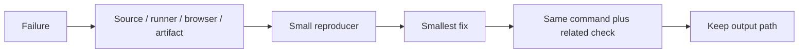

### Stop conditions

- Stop changing source when the failure is a missing runtime dependency.
- Stop updating snapshots when the diff has an unexplained content change.
- Stop widening types when the input has no runtime guard.
- Stop adding waits when the test has an ownership or cleanup bug.
- Stop after the requested behavior and rollback path have a passing check.

<a id="18--skill-linked-project-rail"></a>
<h1 align="center">
   Skill-linked project rail
</h1>

The About page keeps expertise data and project data in one browser flow. A skill pill sends its display label to the page, the matcher checks repository metadata, and the page reveals a horizontal project rail before scrolling it into view.

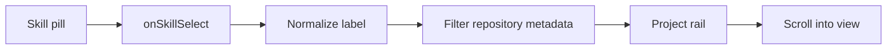

### How it works

1. `InteractiveExpertiseGrid` renders each skill as a button with `aria-pressed`.
2. `AboutPage` stores `selectedSkill` and keeps the selected button visible.
3. `filterProjectsBySkill` compares language, all languages, topics, tech stack, name, and description.
4. The page renders only matching cards inside a keyboard-focusable `overflow-x-auto` rail.
5. A zero-delay timer waits for the new section to commit, then calls `scrollIntoView`.

### Project reading

- **Owner:** `src/app/[locale]/about/page.tsx` owns selection, fetch state, and scrolling.
- **Boundary:** `src/components/about/InteractiveExpertiseGrid.tsx` emits intent; it does not fetch repositories.
- **Matcher:** `src/lib/profile/matchProjectsToSkill.ts` keeps normalization and matching out of JSX.
- **Card:** `SoloLevelingProjectCard` remains the visual contract for each matched repository.

### Example

```tsx
const handleSkillSelect = (skill: string) => {
  setSelectedSkill(skill);
  window.setTimeout(() => {
    skillProjectsRef.current?.scrollIntoView({ behavior: 'smooth', block: 'start' });
  }, 0);
};
```

### Decision table

| Input | Owner | Result |
|---|---|---|
| Skill button | Expertise grid | Emits one display label. |
| Repository response | About page | Stores typed project data. |
| Selected label | Matcher | Returns matching repositories. |
| Empty result | Rail section | Shows localized empty state. |
| Matching result | Rail section | Shows snap-scrolling project cards. |

### Checks

- Render the grid and click a skill button.
- Assert callback value and `aria-pressed` state.
- Test language, topic, tech stack, name, and empty matches.
- Run the About browser path and confirm the rail receives focus and scrolls into view.

<a id="19--hydration-and-external-dom-changes"></a>
<h1 align="center">
   Hydration and external DOM changes
</h1>

React hydration expects the browser DOM to still match server HTML. Theme extensions and translation tools can rewrite attributes, styles, or text nodes before React commits an update. A later React deletion can then target a node that has already moved or been removed.

```mermaid
flowchart LR
    S[Server HTML] --> H[Hydration]
    T[Theme or translation extension] --> D[DOM rewrite]
    D --> W[Hydration mismatch]
    W --> R[Reconciler removal error]
    F[Stable first render] --> H
    L[Extension lock] --> D
```

### How it works

- `Navigation` uses the server-safe dark fallback until `useHydrated()` reports a client snapshot.
- `ThemeToggle` and other client-only theme details appear after hydration instead of changing the initial tree.
- The locale layout emits the standard `darkreader-lock` meta tag because this site already owns its dark/light theme.
- `suppressHydrationWarning` remains a narrow diagnostic escape hatch; it does not repair a DOM node removed by another actor.

### Project reading

| Signal | Owner | Expected result |
|---|---|---|
| Server theme is unknown | `Navigation` | First client render uses dark values. |
| Theme resolves to light | `useHydrated` update | Navigation changes after hydration. |
| Dark Reader sees lock | Locale layout | Extension leaves React-managed DOM alone. |
| Route transition unmounts | React reconciler | Child still has its React-owned parent. |

### Checks

- Run shell tests to verify the lock meta tag.
- Run production Chromium smoke tests with console and page-error capture.
- Reproduce with extensions disabled, then reload after enabling one extension at a time.
- Inspect first render before changing theme; hydration fixes start there.

<a id="20--gif-and-video-panel-media"></a>
<h1 align="center">
   GIF and video panel media
</h1>

The monocolor route transition renders six panels. Each pass uses three MP4 assets and three animated GIF assets. This keeps the existing video treatment while making files from `public/images/gifs/` part of the same visual effect.

```mermaid
flowchart LR
    C[Transition config] --> V[Rotate video list]
    C --> G[Rotate GIF list]
    V --> P[Panels 0, 2, 4]
    G --> P2[Panels 1, 3, 5]
    P --> R[Render video]
    P2 --> I[Render native image]
```

### How it works

- `MOSAIC_VIDEOS` keeps the existing MP4 paths.
- `MOSAIC_GIFS` lists GIF paths under `public/images/gifs/`.
- `getMosaicMedia(seed)` rotates both lists with the transition seed, then alternates their entries across six panels.
- MP4 entries render as muted looping `<video>` elements with `preload="auto"`.
- GIF entries render as native `` elements so the browser keeps their animation frames.
- The shared panel class applies the same border and panel animation to both media types.
- Video panels use crop fill; GIF panels use contain fill so square and extra-wide files keep their original ratio.

### Checks

- Confirm six manga panels mount for `/about`.
- Assert three `<video>` and three `` elements in the transition test.
- Verify every GIF path starts with `/images/gifs/` and ends with `.gif`.
- Run production Chromium smoke after changing an asset path.

<a id="references"></a>
<h1 align="center">
   References
</h1>

- https://react.dev/learn
- https://react.dev/reference/react
- https://nextjs.org/docs/app
- [Project README](../README.md)
- [Package scripts](../package.json)
- [GitHub Actions workflows](../.github/workflows/)

<details>
  <summary>Review checklist</summary>

- [ ] Source owner is named.
- [ ] Runtime boundary is named.
- [ ] Success and failure states are described.
- [ ] Example matches current project syntax.
- [ ] Focused check ran.
- [ ] Related browser or quality check ran.
- [ ] Evidence path is recorded.
- [ ] README link resolves.

</details>

---
