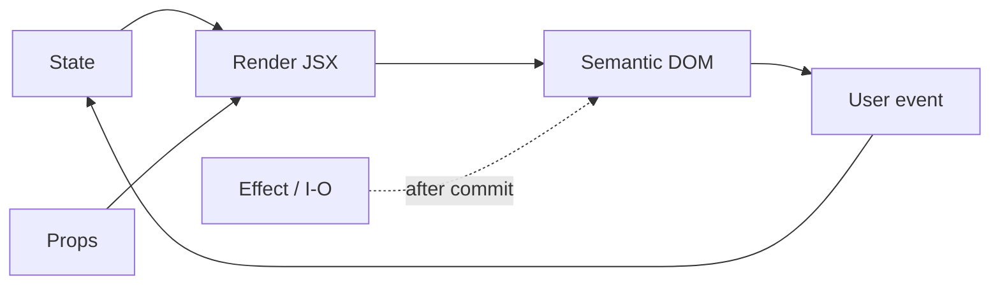
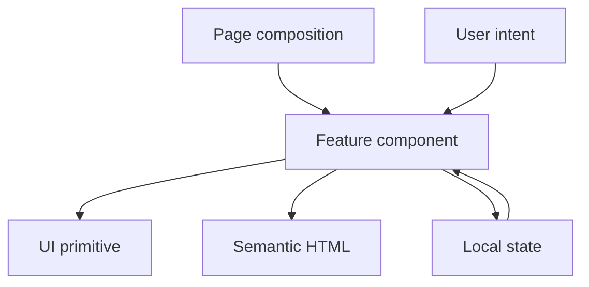

<div align="center">

<h1 align="center">
  
  React / Field Notes
</h1>

Component composition, state ownership, and semantic HTML for this portfolio.

<a href="./typescript.md">TypeScript docs</a> · <a href="../README.md">README</a> · <a href="../src/components/">components</a>

</div>

---

<p align="center">
  
  
  
  
</p>

<table>
  <thead>
    <tr><th>Topic</th><th>Project baseline</th><th>Use it for</th></tr>
  </thead>
  <tbody>
    <tr><td>Runtime</td><td>React 19.x</td><td>Describe UI as a function of current inputs.</td></tr>
    <tr><td>Framework</td><td>Next.js 16.x App Router</td><td>Route-level composition and server/client boundaries.</td></tr>
    <tr><td>Component contract</td><td>Typed props + semantic HTML</td><td>Keep reuse clear at the call site and in the DOM.</td></tr>
    <tr><td>Motion</td><td>Framer Motion</td><td>Animate state transitions; keep page meaning in the component.</td></tr>
  </tbody>
</table>

## Contents

- [01 / Render loop](#01--render-loop)
- [02 / Component contract](#02--component-contract)
- [03 / Composition seam](#03--composition-seam)
- [Repository map](#repository-map)
- [Checks](#checks)

## 01 / Render loop

React keeps one central loop: state changes, a render describes the next tree, and reconciliation updates the DOM. Event handlers are the path back into state.



### Render rules

- Keep render functions pure: same inputs, same description.
- Derive values during render instead of mirroring them in state.
- Use effects for synchronization with systems outside React.
- Keep event handlers about intent: select, close, retry, submit.

### HTML remains the surface

<article aria-labelledby="status-title">
  <header>
    <span>COMPONENT / STATUS CARD</span>
    <strong>READY</strong>
  </header>
  <h2 id="status-title">Build status</h2>
  <p>Semantic markup survives before and after hydration.</p>
</article>

The component controls data and timing, but the browser still gets headings, labels, buttons, lists, and landmarks.

## 02 / Component contract

Keep each component responsible for one visual decision. Type its inputs, keep its markup close, and let the parent arrange the page-level layout.

```tsx
type StatusCardProps = {
  label: string;
  value: string;
  tone?: 'neutral' | 'ready';
};

export function StatusCard({ label, value, tone = 'neutral' }: StatusCardProps) {
  return (
    <article data-tone={tone}>
      <span>{label}</span>
      <strong>{value}</strong>
    </article>
  );
}
```

| Layer | Owns | Example |
| --- | --- | --- |
| Page | Fetching, route composition, section order | `src/app/[locale]/projects/page.tsx` |
| Feature | Domain interaction and visual behavior | `src/components/projects/` |
| UI primitive | Small reusable interaction | `src/components/ui/` |
| HTML | Meaning and browser affordances | `<nav>`, `<main>`, `<button>` |

## 03 / Composition seam

Composition connects layout and behavior. Use `children` when the caller owns content; lift state only to the nearest component that needs to coordinate it.



### A small panel

```tsx
type PanelProps = {
  title: string;
  children: React.ReactNode;
};

function Panel({ title, children }: PanelProps) {
  return (
    <section aria-labelledby="panel-title">
      <header><h2 id="panel-title">{title}</h2></header>
      <div>{children}</div>
    </section>
  );
}
```

<table>
  <thead>
    <tr><th>Decision</th><th>Good boundary</th><th>Warning</th></tr>
  </thead>
  <tbody>
    <tr><td>State owner</td><td>Nearest shared parent.</td><td>Global state for local hover.</td></tr>
    <tr><td>List identity</td><td>Stable domain key.</td><td>Array index for reorderable data.</td></tr>
    <tr><td>Markup</td><td>Native element with clear meaning.</td><td>Clickable <code>div</code> with missing keyboard behavior.</td></tr>
    <tr><td>Motion</td><td>Respect reduced-motion preference.</td><td>Animation required to understand content.</td></tr>
  </tbody>
</table>

## Repository map

| Path | Role |
| --- | --- |
| [`src/app/[locale]/`](../src/app/%5Blocale%5D/) | Route composition and localized pages. |
| [`src/components/home/`](../src/components/home/) | Hero, skills, metrics, and stack surfaces. |
| [`src/components/projects/`](../src/components/projects/) | Project cards, previews, and repository views. |
| [`src/components/ui/`](../src/components/ui/) | Small interactive primitives. |
| [`src/hooks/`](../src/hooks/) | Browser and interaction behavior. |

## Checks

| Command | Result |
| --- | --- |
| `pnpm run lint` | React and TypeScript checks. |
| `pnpm run test:jest` | Component behavior in jsdom. |
| `pnpm run test:browser` | Focused browser DOM behavior. |
| `pnpm run test:e2e` | Route, responsive, and interaction checks. |
| `pnpm run build` | App Router production integration. |

<details>
  <summary><strong>Review checklist</strong></summary>

- [ ] Render is pure and derived values stay derived.
- [ ] Effects synchronize with an external system, not ordinary state.
- [ ] Props name user intent and have a small surface.
- [ ] Interactive elements have native semantics or complete keyboard behavior.
- [ ] Reduced motion leaves content understandable.
</details>

## References

- [React Learn](https://react.dev/learn)
- [React Reference](https://react.dev/reference/react)
- [Next.js App Router](https://nextjs.org/docs/app)
