<div align="center">

<h1 align="center">
  
  Test matrix / Field Notes
</h1>

Complete map of test files, commands, runtimes, outputs, and release checks.

<a href="testing.md">Testing docs</a>  <a href="qa.md">QA docs</a>  <a href="ci.md">CI docs</a>  <a href="../README.md">README</a>

</div>

---

<p align="center">
  
  
  
  
  
</p>

<table>
  <thead>
    <tr><th>Topic</th><th>Project baseline</th><th>Use it for</th></tr>
  </thead>
  <tbody>
    <tr><td>Discovery</td><td>paths + configs</td><td>Each runner owns a known file pattern.</td></tr>
    <tr><td>Runtime</td><td>jsdom + browsers</td><td>Use real browser layers where the browser owns the result.</td></tr>
    <tr><td>Output</td><td>reports + artifacts</td><td>Keep test, visual, audit, and video evidence findable.</td></tr>
    <tr><td>Release</td><td>quality:full + audits</td><td>Expand from narrow behavior checks to delivery gates.</td></tr>
  </tbody>
</table>

## Contents

- [01 / Test index](#01--test-index)
- [02 / Repository inventory](#02--repository-inventory)
- [03 / Jest cases](#03--jest-cases)
- [04 / Vitest cases](#04--vitest-cases)
- [05 / Browser component case](#05--browser-component-case)
- [06 / Playwright E2E](#06--playwright-e2e)
- [07 / Accessibility cases](#07--accessibility-cases)
- [08 / Visual cases](#08--visual-cases)
- [09 / Video case](#09--video-case)
- [10 / API route cases](#10--api-route-cases)
- [11 / Component cases](#11--component-cases)
- [12 / Script cases](#12--script-cases)
- [13 / Quality output](#13--quality-output)
- [14 / Command matrix](#14--command-matrix)
- [15 / Config reading](#15--config-reading)
- [16 / Known boundaries](#16--known-boundaries)
- [17 / Release checklist](#17--release-checklist)
- [Repository map](#repository-map)
- [Command matrix](#command-matrix)
- [Evidence and troubleshooting](#evidence-and-troubleshooting)
- [References](#references)

<h1 align="center">
   Operating model
</h1>

This guide explains **Test matrix / Field Notes** through the source tree, the runtime boundary, the smallest useful test, and the evidence a reviewer can inspect.

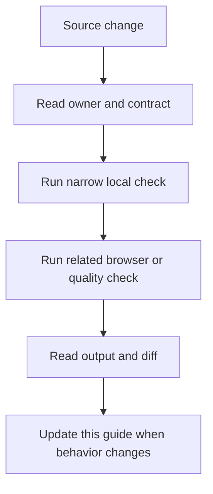

### Reading order

- Start at the section for the changed file or runtime.
- Copy the narrow command before running the broad suite.
- Check the failure branch and the evidence path.
- Compare README links after editing any docs entry point.

<a id="01--test-index"></a>
## 01 / Test index

This report maps every test family, its command, its runtime, and the evidence it leaves behind.

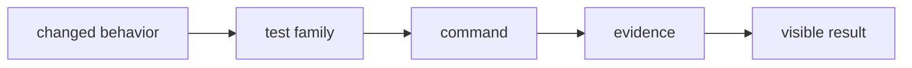

### How it works

1. `changed behavior` enters **Test index** as the value, event, file, or runtime that needs a decision.
2. `test family` applies the rule owned by this section; keep that decision close to its source boundary.
3. `command` carries the checked result to the next consumer instead of exposing private setup.
4. `evidence` receives the result and makes it visible through markup, output, or an exit code.
5. Exercise the normal path and the failure path at the runtime named by the example.

### Project reading

- **Rule:** Start with the file path that owns the behavior, then choose the runner from this index.
- **Failure to catch:** A test exists but the documented command never includes its directory.
- **Evidence:** The matrix row and its last run.
- **Owner:** `Test matrix / Field Notes` documents the contract; source files and tests remain the executable reference.
- **Scope:** Read this section with the linked source path in the repository catalog below.

### Example

```ts
const matrix = {
  jest: 'tests/**/*.test.[jt]s?(x)',
  vitest: 'tests/vitest/**/*.spec.{ts,tsx}',
  browser: 'tests/browser/**/*.spec.{ts,tsx}',
};
```

### Decision table

<table>
  <thead>
    <tr><th>Input</th><th>Project decision</th><th>Check</th></tr>
  </thead>
  <tbody>
    <tr><td>changed behavior</td><td>Keep it at the boundary named by the section.</td><td>A focused test or source inspection.</td></tr>
    <tr><td>test family</td><td>Use the smallest rule that explains the branch.</td><td>Lint, type check, or browser assertion.</td></tr>
    <tr><td>command</td><td>Return a readable value or state.</td><td>Success and failure cases.</td></tr>
    <tr><td>evidence</td><td>Expose a semantic or reviewable consumer.</td><td>Role, report, screenshot, or exit code.</td></tr>
  </tbody>
</table>

### Checks

- Inspect the owner for `test family` before editing the consumer.
- Assert the successful `command` result through the public surface.
- Force the failure branch and confirm it reaches `evidence`.
- Record the command and artifact path shown in this guide.

<a id="02--repository-inventory"></a>
## 02 / Repository inventory

Tests live under tests, beside API routes, beside components, and beside selected hooks, i18n, and library modules.

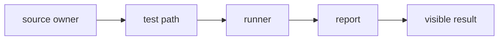

### How it works

1. `source owner` enters **Repository inventory** as the value, event, file, or runtime that needs a decision.
2. `test path` applies the rule owned by this section; keep that decision close to its source boundary.
3. `runner` carries the checked result to the next consumer instead of exposing private setup.
4. `report` receives the result and makes it visible through markup, output, or an exit code.
5. Exercise the normal path and the failure path at the runtime named by the example.

### Project reading

- **Rule:** Place a test near its responsibility when the existing directory pattern supports it.
- **Failure to catch:** A test is hidden in a broad file and the next change misses the relevant case.
- **Evidence:** File path, runner, and test title.
- **Owner:** `Test matrix / Field Notes` documents the contract; source files and tests remain the executable reference.
- **Scope:** Read this section with the linked source path in the repository catalog below.

### Example

```text
tests/
  api/
  browser/
  e2e/
  accessibility/
  visual/
  vitest/
src/**/tests/
```

### Decision table

<table>
  <thead>
    <tr><th>Input</th><th>Project decision</th><th>Check</th></tr>
  </thead>
  <tbody>
    <tr><td>source owner</td><td>Keep it at the boundary named by the section.</td><td>A focused test or source inspection.</td></tr>
    <tr><td>test path</td><td>Use the smallest rule that explains the branch.</td><td>Lint, type check, or browser assertion.</td></tr>
    <tr><td>runner</td><td>Return a readable value or state.</td><td>Success and failure cases.</td></tr>
    <tr><td>report</td><td>Expose a semantic or reviewable consumer.</td><td>Role, report, screenshot, or exit code.</td></tr>
  </tbody>
</table>

### Checks

- Inspect the owner for `test path` before editing the consumer.
- Assert the successful `runner` result through the public surface.
- Force the failure branch and confirm it reaches `report`.
- Record the command and artifact path shown in this guide.

<a id="03--jest-cases"></a>
## 03 / Jest cases

Jest covers component, route, hook, utility, integration, shell, and coverage-heavy visual branches in jsdom.

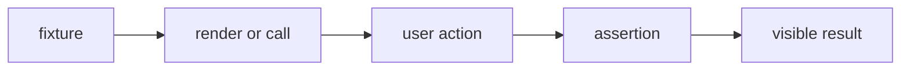

### How it works

1. `fixture` enters **Jest cases** as the value, event, file, or runtime that needs a decision.
2. `render or call` applies the rule owned by this section; keep that decision close to its source boundary.
3. `user action` carries the checked result to the next consumer instead of exposing private setup.
4. `assertion` receives the result and makes it visible through markup, output, or an exit code.
5. Exercise the normal path and the failure path at the runtime named by the example.

### Project reading

- **Rule:** Read the describe or test title to see which branch the file protects.
- **Failure to catch:** A mount-only test is counted as coverage for an interaction it never performs.
- **Evidence:** reports/junit.xml, coverage, and terminal summary.
- **Owner:** `Test matrix / Field Notes` documents the contract; source files and tests remain the executable reference.
- **Scope:** Read this section with the linked source path in the repository catalog below.

### Example

```bash
pnpm run test:jest
pnpm run test:coverage
```

### Decision table

<table>
  <thead>
    <tr><th>Input</th><th>Project decision</th><th>Check</th></tr>
  </thead>
  <tbody>
    <tr><td>fixture</td><td>Keep it at the boundary named by the section.</td><td>A focused test or source inspection.</td></tr>
    <tr><td>render or call</td><td>Use the smallest rule that explains the branch.</td><td>Lint, type check, or browser assertion.</td></tr>
    <tr><td>user action</td><td>Return a readable value or state.</td><td>Success and failure cases.</td></tr>
    <tr><td>assertion</td><td>Expose a semantic or reviewable consumer.</td><td>Role, report, screenshot, or exit code.</td></tr>
  </tbody>
</table>

### Checks

- Inspect the owner for `render or call` before editing the consumer.
- Assert the successful `user action` result through the public surface.
- Force the failure branch and confirm it reaches `assertion`.
- Record the command and artifact path shown in this guide.

<a id="04--vitest-cases"></a>
## 04 / Vitest cases

Vitest specs focus on pages and ContactCommandForm behavior with the Vite React plugin and jsdom.

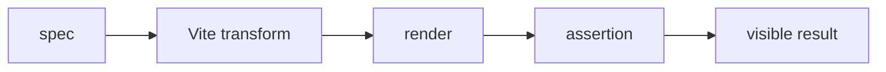

### How it works

1. `spec` enters **Vitest cases** as the value, event, file, or runtime that needs a decision.
2. `Vite transform` applies the rule owned by this section; keep that decision close to its source boundary.
3. `render` carries the checked result to the next consumer instead of exposing private setup.
4. `assertion` receives the result and makes it visible through markup, output, or an exit code.
5. Exercise the normal path and the failure path at the runtime named by the example.

### Project reading

- **Rule:** Keep focused specs small and close to one interaction or page branch.
- **Failure to catch:** The spec grows into a second suite with different setup assumptions.
- **Evidence:** Vitest output and spec path.
- **Owner:** `Test matrix / Field Notes` documents the contract; source files and tests remain the executable reference.
- **Scope:** Read this section with the linked source path in the repository catalog below.

### Example

```bash
pnpm run test:vitest
# tests/vitest/pages.spec.tsx
# tests/vitest/contact-command-form.spec.tsx
```

### Decision table

<table>
  <thead>
    <tr><th>Input</th><th>Project decision</th><th>Check</th></tr>
  </thead>
  <tbody>
    <tr><td>spec</td><td>Keep it at the boundary named by the section.</td><td>A focused test or source inspection.</td></tr>
    <tr><td>Vite transform</td><td>Use the smallest rule that explains the branch.</td><td>Lint, type check, or browser assertion.</td></tr>
    <tr><td>render</td><td>Return a readable value or state.</td><td>Success and failure cases.</td></tr>
    <tr><td>assertion</td><td>Expose a semantic or reviewable consumer.</td><td>Role, report, screenshot, or exit code.</td></tr>
  </tbody>
</table>

### Checks

- Inspect the owner for `Vite transform` before editing the consumer.
- Assert the successful `render` result through the public surface.
- Force the failure branch and confirm it reaches `assertion`.
- Record the command and artifact path shown in this guide.

<a id="05--browser-component-case"></a>
## 05 / Browser component case

The Browser Mode spec checks ProjectCardPreview in Chromium where a real DOM can expose browser differences.

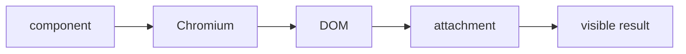

### How it works

1. `component` enters **Browser component case** as the value, event, file, or runtime that needs a decision.
2. `Chromium` applies the rule owned by this section; keep that decision close to its source boundary.
3. `DOM` carries the checked result to the next consumer instead of exposing private setup.
4. `attachment` receives the result and makes it visible through markup, output, or an exit code.
5. Exercise the normal path and the failure path at the runtime named by the example.

### Project reading

- **Rule:** Use Browser Mode for component behavior that depends on real browser execution.
- **Failure to catch:** A jsdom-only test misses CSS or browser event behavior.
- **Evidence:** Vitest attachment and browser output.
- **Owner:** `Test matrix / Field Notes` documents the contract; source files and tests remain the executable reference.
- **Scope:** Read this section with the linked source path in the repository catalog below.

### Example

```bash
pnpm run test:browser
# tests/browser/project-card-preview.spec.tsx
```

### Decision table

<table>
  <thead>
    <tr><th>Input</th><th>Project decision</th><th>Check</th></tr>
  </thead>
  <tbody>
    <tr><td>component</td><td>Keep it at the boundary named by the section.</td><td>A focused test or source inspection.</td></tr>
    <tr><td>Chromium</td><td>Use the smallest rule that explains the branch.</td><td>Lint, type check, or browser assertion.</td></tr>
    <tr><td>DOM</td><td>Return a readable value or state.</td><td>Success and failure cases.</td></tr>
    <tr><td>attachment</td><td>Expose a semantic or reviewable consumer.</td><td>Role, report, screenshot, or exit code.</td></tr>
  </tbody>
</table>

### Checks

- Inspect the owner for `Chromium` before editing the consumer.
- Assert the successful `DOM` result through the public surface.
- Force the failure branch and confirm it reaches `attachment`.
- Record the command and artifact path shown in this guide.

<a id="06--playwright-e2e"></a>
## 06 / Playwright E2E

E2E specs cover navigation, projects, responsive layouts, and smoke startup across configured browser projects.

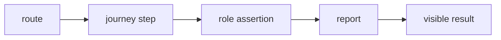

### How it works

1. `route` enters **Playwright E2E** as the value, event, file, or runtime that needs a decision.
2. `journey step` applies the rule owned by this section; keep that decision close to its source boundary.
3. `role assertion` carries the checked result to the next consumer instead of exposing private setup.
4. `report` receives the result and makes it visible through markup, output, or an exit code.
5. Exercise the normal path and the failure path at the runtime named by the example.

### Project reading

- **Rule:** Name the user path in the test and assert the page users see.
- **Failure to catch:** The test only checks a URL and misses a broken heading, menu, or action.
- **Evidence:** playwright-report and test-results.
- **Owner:** `Test matrix / Field Notes` documents the contract; source files and tests remain the executable reference.
- **Scope:** Read this section with the linked source path in the repository catalog below.

### Example

```bash
pnpm run test:e2e
pnpm run test:playwright:all
```

### Decision table

<table>
  <thead>
    <tr><th>Input</th><th>Project decision</th><th>Check</th></tr>
  </thead>
  <tbody>
    <tr><td>route</td><td>Keep it at the boundary named by the section.</td><td>A focused test or source inspection.</td></tr>
    <tr><td>journey step</td><td>Use the smallest rule that explains the branch.</td><td>Lint, type check, or browser assertion.</td></tr>
    <tr><td>role assertion</td><td>Return a readable value or state.</td><td>Success and failure cases.</td></tr>
    <tr><td>report</td><td>Expose a semantic or reviewable consumer.</td><td>Role, report, screenshot, or exit code.</td></tr>
  </tbody>
</table>

### Checks

- Inspect the owner for `journey step` before editing the consumer.
- Assert the successful `role assertion` result through the public surface.
- Force the failure branch and confirm it reaches `report`.
- Record the command and artifact path shown in this guide.

<a id="07--accessibility-cases"></a>
## 07 / Accessibility cases

The accessibility spec runs axe against the page set and the E2E suite checks keyboard and semantic surfaces.

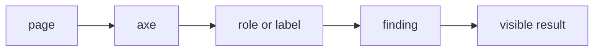

### How it works

1. `page` enters **Accessibility cases** as the value, event, file, or runtime that needs a decision.
2. `axe` applies the rule owned by this section; keep that decision close to its source boundary.
3. `role or label` carries the checked result to the next consumer instead of exposing private setup.
4. `finding` receives the result and makes it visible through markup, output, or an exit code.
5. Exercise the normal path and the failure path at the runtime named by the example.

### Project reading

- **Rule:** Fix semantics in source and keep a direct assertion for the interaction path.
- **Failure to catch:** An axe scan passes while a custom dialog cannot close with Escape.
- **Evidence:** Axe output and Playwright report.
- **Owner:** `Test matrix / Field Notes` documents the contract; source files and tests remain the executable reference.
- **Scope:** Read this section with the linked source path in the repository catalog below.

### Example

```bash
pnpm run test:accessibility
# tests/accessibility/pages.a11y.spec.ts
```

### Decision table

<table>
  <thead>
    <tr><th>Input</th><th>Project decision</th><th>Check</th></tr>
  </thead>
  <tbody>
    <tr><td>page</td><td>Keep it at the boundary named by the section.</td><td>A focused test or source inspection.</td></tr>
    <tr><td>axe</td><td>Use the smallest rule that explains the branch.</td><td>Lint, type check, or browser assertion.</td></tr>
    <tr><td>role or label</td><td>Return a readable value or state.</td><td>Success and failure cases.</td></tr>
    <tr><td>finding</td><td>Expose a semantic or reviewable consumer.</td><td>Role, report, screenshot, or exit code.</td></tr>
  </tbody>
</table>

### Checks

- Inspect the owner for `axe` before editing the consumer.
- Assert the successful `role or label` result through the public surface.
- Force the failure branch and confirm it reaches `finding`.
- Record the command and artifact path shown in this guide.

<a id="08--visual-cases"></a>
## 08 / Visual cases

The visual spec captures home, about, certifications, contact, projects, navigation, and project-card states.

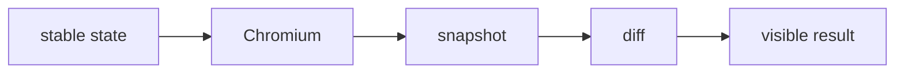

### How it works

1. `stable state` enters **Visual cases** as the value, event, file, or runtime that needs a decision.
2. `Chromium` applies the rule owned by this section; keep that decision close to its source boundary.
3. `snapshot` carries the checked result to the next consumer instead of exposing private setup.
4. `diff` receives the result and makes it visible through markup, output, or an exit code.
5. Exercise the normal path and the failure path at the runtime named by the example.

### Project reading

- **Rule:** Keep animated decoration controlled or masked only when the content and dimensions remain tested elsewhere.
- **Failure to catch:** A broad mask hides a missing component or layout change.
- **Evidence:** tests/visual/*-snapshots and diff images.
- **Owner:** `Test matrix / Field Notes` documents the contract; source files and tests remain the executable reference.
- **Scope:** Read this section with the linked source path in the repository catalog below.

### Example

```bash
pnpm run test:visual
pnpm run test:visual:update
```

### Decision table

<table>
  <thead>
    <tr><th>Input</th><th>Project decision</th><th>Check</th></tr>
  </thead>
  <tbody>
    <tr><td>stable state</td><td>Keep it at the boundary named by the section.</td><td>A focused test or source inspection.</td></tr>
    <tr><td>Chromium</td><td>Use the smallest rule that explains the branch.</td><td>Lint, type check, or browser assertion.</td></tr>
    <tr><td>snapshot</td><td>Return a readable value or state.</td><td>Success and failure cases.</td></tr>
    <tr><td>diff</td><td>Expose a semantic or reviewable consumer.</td><td>Role, report, screenshot, or exit code.</td></tr>
  </tbody>
</table>

### Checks

- Inspect the owner for `Chromium` before editing the consumer.
- Assert the successful `snapshot` result through the public surface.
- Force the failure branch and confirm it reaches `diff`.
- Record the command and artifact path shown in this guide.

<a id="09--video-case"></a>
## 09 / Video case

The video journey follows a desktop path and converts the recorded browser output into a reviewable MP4.

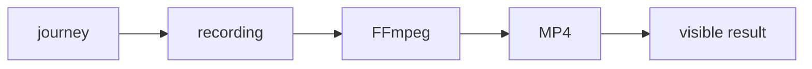

### How it works

1. `journey` enters **Video case** as the value, event, file, or runtime that needs a decision.
2. `recording` applies the rule owned by this section; keep that decision close to its source boundary.
3. `FFmpeg` carries the checked result to the next consumer instead of exposing private setup.
4. `MP4` receives the result and makes it visible through markup, output, or an exit code.
5. Exercise the normal path and the failure path at the runtime named by the example.

### Project reading

- **Rule:** Use the video to review pacing and transitions, not as the only functional assertion.
- **Failure to catch:** The recording is missing or conversion runs against the wrong test-results folder.
- **Evidence:** test-results/user-journey.mp4.
- **Owner:** `Test matrix / Field Notes` documents the contract; source files and tests remain the executable reference.
- **Scope:** Read this section with the linked source path in the repository catalog below.

### Example

```bash
pnpm run test:video
pnpm run convert:video
```

### Decision table

<table>
  <thead>
    <tr><th>Input</th><th>Project decision</th><th>Check</th></tr>
  </thead>
  <tbody>
    <tr><td>journey</td><td>Keep it at the boundary named by the section.</td><td>A focused test or source inspection.</td></tr>
    <tr><td>recording</td><td>Use the smallest rule that explains the branch.</td><td>Lint, type check, or browser assertion.</td></tr>
    <tr><td>FFmpeg</td><td>Return a readable value or state.</td><td>Success and failure cases.</td></tr>
    <tr><td>MP4</td><td>Expose a semantic or reviewable consumer.</td><td>Role, report, screenshot, or exit code.</td></tr>
  </tbody>
</table>

### Checks

- Inspect the owner for `recording` before editing the consumer.
- Assert the successful `FFmpeg` result through the public surface.
- Force the failure branch and confirm it reaches `MP4`.
- Record the command and artifact path shown in this guide.

<a id="10--api-route-cases"></a>
## 10 / API route cases

API tests cover health, GitHub repositories and README data, chat, visitors, YouTube configuration, stats, and uploads.

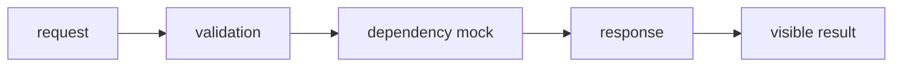

### How it works

1. `request` enters **API route cases** as the value, event, file, or runtime that needs a decision.
2. `validation` applies the rule owned by this section; keep that decision close to its source boundary.
3. `dependency mock` carries the checked result to the next consumer instead of exposing private setup.
4. `response` receives the result and makes it visible through markup, output, or an exit code.
5. Exercise the normal path and the failure path at the runtime named by the example.

### Project reading

- **Rule:** Test invalid input, upstream failure, and valid output for each route boundary.
- **Failure to catch:** A route returns a 500 for a bad request or leaks an upstream response shape.
- **Evidence:** Route test file and response assertion.
- **Owner:** `Test matrix / Field Notes` documents the contract; source files and tests remain the executable reference.
- **Scope:** Read this section with the linked source path in the repository catalog below.

### Example

```bash
pnpm run test:jest
# src/app/api/**/tests
# tests/api/health.test.ts
```

### Decision table

<table>
  <thead>
    <tr><th>Input</th><th>Project decision</th><th>Check</th></tr>
  </thead>
  <tbody>
    <tr><td>request</td><td>Keep it at the boundary named by the section.</td><td>A focused test or source inspection.</td></tr>
    <tr><td>validation</td><td>Use the smallest rule that explains the branch.</td><td>Lint, type check, or browser assertion.</td></tr>
    <tr><td>dependency mock</td><td>Return a readable value or state.</td><td>Success and failure cases.</td></tr>
    <tr><td>response</td><td>Expose a semantic or reviewable consumer.</td><td>Role, report, screenshot, or exit code.</td></tr>
  </tbody>
</table>

### Checks

- Inspect the owner for `validation` before editing the consumer.
- Assert the successful `dependency mock` result through the public surface.
- Force the failure branch and confirm it reaches `response`.
- Record the command and artifact path shown in this guide.

<a id="11--component-cases"></a>
## 11 / Component cases

Component tests cover navigation, project cards, README modal, chat, effects, forms, maps, and visual modules.

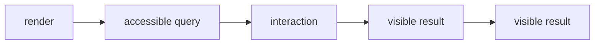

### How it works

1. `render` enters **Component cases** as the value, event, file, or runtime that needs a decision.
2. `accessible query` applies the rule owned by this section; keep that decision close to its source boundary.
3. `interaction` carries the checked result to the next consumer instead of exposing private setup.
4. `visible result` receives the result and makes it visible through markup, output, or an exit code.
5. Exercise the normal path and the failure path at the runtime named by the example.

### Project reading

- **Rule:** Read the component through its public props and DOM contract.
- **Failure to catch:** A test reaches private state and misses the user-visible result.
- **Evidence:** Jest test name and assertion.
- **Owner:** `Test matrix / Field Notes` documents the contract; source files and tests remain the executable reference.
- **Scope:** Read this section with the linked source path in the repository catalog below.

### Example

```bash
pnpm run test:jest
# src/components/tests/*.test.tsx
```

### Decision table

<table>
  <thead>
    <tr><th>Input</th><th>Project decision</th><th>Check</th></tr>
  </thead>
  <tbody>
    <tr><td>render</td><td>Keep it at the boundary named by the section.</td><td>A focused test or source inspection.</td></tr>
    <tr><td>accessible query</td><td>Use the smallest rule that explains the branch.</td><td>Lint, type check, or browser assertion.</td></tr>
    <tr><td>interaction</td><td>Return a readable value or state.</td><td>Success and failure cases.</td></tr>
    <tr><td>visible result</td><td>Expose a semantic or reviewable consumer.</td><td>Role, report, screenshot, or exit code.</td></tr>
  </tbody>
</table>

### Checks

- Inspect the owner for `accessible query` before editing the consumer.
- Assert the successful `interaction` result through the public surface.
- Force the failure branch and confirm it reaches `visible result`.
- Record the command and artifact path shown in this guide.

<a id="12--script-cases"></a>
## 12 / Script cases

Node test files cover benchmark parsing, file sizes, JSCPD arguments, metrics, quality policy, and report formatting.

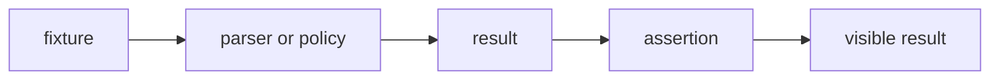

### How it works

1. `fixture` enters **Script cases** as the value, event, file, or runtime that needs a decision.
2. `parser or policy` applies the rule owned by this section; keep that decision close to its source boundary.
3. `result` carries the checked result to the next consumer instead of exposing private setup.
4. `assertion` receives the result and makes it visible through markup, output, or an exit code.
5. Exercise the normal path and the failure path at the runtime named by the example.

### Project reading

- **Rule:** Keep script cases deterministic and exercise empty, malformed, and passing inputs.
- **Failure to catch:** A CLI change changes the report without a parser test catching it.
- **Evidence:** Node test output and generated report fixture.
- **Owner:** `Test matrix / Field Notes` documents the contract; source files and tests remain the executable reference.
- **Scope:** Read this section with the linked source path in the repository catalog below.

### Example

```bash
pnpm run test:scripts
# scripts/tests/*.node-test.mjs
```

### Decision table

<table>
  <thead>
    <tr><th>Input</th><th>Project decision</th><th>Check</th></tr>
  </thead>
  <tbody>
    <tr><td>fixture</td><td>Keep it at the boundary named by the section.</td><td>A focused test or source inspection.</td></tr>
    <tr><td>parser or policy</td><td>Use the smallest rule that explains the branch.</td><td>Lint, type check, or browser assertion.</td></tr>
    <tr><td>result</td><td>Return a readable value or state.</td><td>Success and failure cases.</td></tr>
    <tr><td>assertion</td><td>Expose a semantic or reviewable consumer.</td><td>Role, report, screenshot, or exit code.</td></tr>
  </tbody>
</table>

### Checks

- Inspect the owner for `parser or policy` before editing the consumer.
- Assert the successful `result` result through the public surface.
- Force the failure branch and confirm it reaches `assertion`.
- Record the command and artifact path shown in this guide.

<a id="13--quality-output"></a>
## 13 / Quality output

Quality commands write coverage, JUnit, duplication, Lighthouse, visual, Playwright, and Storybook outputs to known paths.

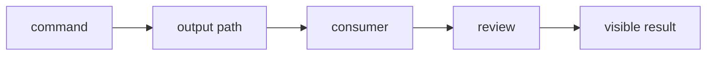

### How it works

1. `command` enters **Quality output** as the value, event, file, or runtime that needs a decision.
2. `output path` applies the rule owned by this section; keep that decision close to its source boundary.
3. `consumer` carries the checked result to the next consumer instead of exposing private setup.
4. `review` receives the result and makes it visible through markup, output, or an exit code.
5. Exercise the normal path and the failure path at the runtime named by the example.

### Project reading

- **Rule:** Document each output next to the command that creates it.
- **Failure to catch:** A reviewer sees a passing command but cannot find the artifact.
- **Evidence:** Path listing and report timestamp.
- **Owner:** `Test matrix / Field Notes` documents the contract; source files and tests remain the executable reference.
- **Scope:** Read this section with the linked source path in the repository catalog below.

### Example

```text
coverage/
reports/
.lighthouseci/
playwright-report/
test-results/
```

### Decision table

<table>
  <thead>
    <tr><th>Input</th><th>Project decision</th><th>Check</th></tr>
  </thead>
  <tbody>
    <tr><td>command</td><td>Keep it at the boundary named by the section.</td><td>A focused test or source inspection.</td></tr>
    <tr><td>output path</td><td>Use the smallest rule that explains the branch.</td><td>Lint, type check, or browser assertion.</td></tr>
    <tr><td>consumer</td><td>Return a readable value or state.</td><td>Success and failure cases.</td></tr>
    <tr><td>review</td><td>Expose a semantic or reviewable consumer.</td><td>Role, report, screenshot, or exit code.</td></tr>
  </tbody>
</table>

### Checks

- Inspect the owner for `output path` before editing the consumer.
- Assert the successful `consumer` result through the public surface.
- Force the failure branch and confirm it reaches `review`.
- Record the command and artifact path shown in this guide.

<a id="14--command-matrix"></a>
## 14 / Command matrix

Package scripts range from one runner to full:tests and quality:full, with explicit visual and Lighthouse commands.

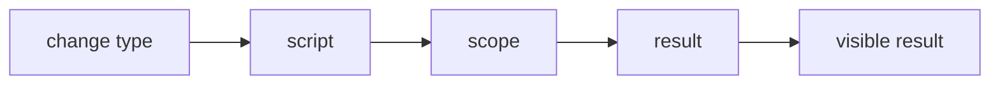

### How it works

1. `change type` enters **Command matrix** as the value, event, file, or runtime that needs a decision.
2. `script` applies the rule owned by this section; keep that decision close to its source boundary.
3. `scope` carries the checked result to the next consumer instead of exposing private setup.
4. `result` receives the result and makes it visible through markup, output, or an exit code.
5. Exercise the normal path and the failure path at the runtime named by the example.

### Project reading

- **Rule:** Run narrow first, then expand to the suite named by the risk.
- **Failure to catch:** A page change skips visual or browser checks because test was treated as sufficient.
- **Evidence:** Commands recorded in the change note.
- **Owner:** `Test matrix / Field Notes` documents the contract; source files and tests remain the executable reference.
- **Scope:** Read this section with the linked source path in the repository catalog below.

### Example

```bash
pnpm run test
pnpm run full:tests
pnpm run quality:full
```

### Decision table

<table>
  <thead>
    <tr><th>Input</th><th>Project decision</th><th>Check</th></tr>
  </thead>
  <tbody>
    <tr><td>change type</td><td>Keep it at the boundary named by the section.</td><td>A focused test or source inspection.</td></tr>
    <tr><td>script</td><td>Use the smallest rule that explains the branch.</td><td>Lint, type check, or browser assertion.</td></tr>
    <tr><td>scope</td><td>Return a readable value or state.</td><td>Success and failure cases.</td></tr>
    <tr><td>result</td><td>Expose a semantic or reviewable consumer.</td><td>Role, report, screenshot, or exit code.</td></tr>
  </tbody>
</table>

### Checks

- Inspect the owner for `script` before editing the consumer.
- Assert the successful `scope` result through the public surface.
- Force the failure branch and confirm it reaches `result`.
- Record the command and artifact path shown in this guide.

<a id="15--config-reading"></a>
## 15 / Config reading

Jest, Vitest, Browser Mode, Playwright, Lighthouse, and Storybook config files define inclusion and environment rules.

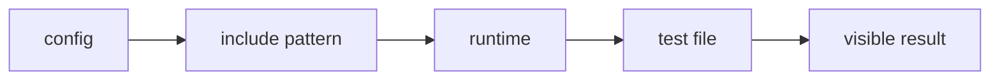

### How it works

1. `config` enters **Config reading** as the value, event, file, or runtime that needs a decision.
2. `include pattern` applies the rule owned by this section; keep that decision close to its source boundary.
3. `runtime` carries the checked result to the next consumer instead of exposing private setup.
4. `test file` receives the result and makes it visible through markup, output, or an exit code.
5. Exercise the normal path and the failure path at the runtime named by the example.

### Project reading

- **Rule:** When a test is skipped, read the config before changing the test path.
- **Failure to catch:** A new spec is green because no runner discovered it.
- **Evidence:** Discovery output or config line.
- **Owner:** `Test matrix / Field Notes` documents the contract; source files and tests remain the executable reference.
- **Scope:** Read this section with the linked source path in the repository catalog below.

### Example

```text
jest.config.js
vitest.config.mts
vitest.browser.config.mts
playwright.config.ts
lighthouserc.js
```

### Decision table

<table>
  <thead>
    <tr><th>Input</th><th>Project decision</th><th>Check</th></tr>
  </thead>
  <tbody>
    <tr><td>config</td><td>Keep it at the boundary named by the section.</td><td>A focused test or source inspection.</td></tr>
    <tr><td>include pattern</td><td>Use the smallest rule that explains the branch.</td><td>Lint, type check, or browser assertion.</td></tr>
    <tr><td>runtime</td><td>Return a readable value or state.</td><td>Success and failure cases.</td></tr>
    <tr><td>test file</td><td>Expose a semantic or reviewable consumer.</td><td>Role, report, screenshot, or exit code.</td></tr>
  </tbody>
</table>

### Checks

- Inspect the owner for `include pattern` before editing the consumer.
- Assert the successful `runtime` result through the public surface.
- Force the failure branch and confirm it reaches `test file`.
- Record the command and artifact path shown in this guide.

<a id="16--known-boundaries"></a>
## 16 / Known boundaries

Some checks need installed browsers, FFmpeg, a built server, environment values, or stable external response fixtures.

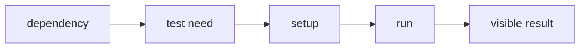

### How it works

1. `dependency` enters **Known boundaries** as the value, event, file, or runtime that needs a decision.
2. `test need` applies the rule owned by this section; keep that decision close to its source boundary.
3. `setup` carries the checked result to the next consumer instead of exposing private setup.
4. `run` receives the result and makes it visible through markup, output, or an exit code.
5. Exercise the normal path and the failure path at the runtime named by the example.

### Project reading

- **Rule:** Call out environment needs in the command section instead of hiding them in a failure.
- **Failure to catch:** A local failure is blamed on source when the required runtime dependency is absent.
- **Evidence:** Setup command and failure category.
- **Owner:** `Test matrix / Field Notes` documents the contract; source files and tests remain the executable reference.
- **Scope:** Read this section with the linked source path in the repository catalog below.

### Example

```bash
pnpm exec playwright install --with-deps chromium chromium-headless-shell firefox webkit
ffmpeg -version
```

### Decision table

<table>
  <thead>
    <tr><th>Input</th><th>Project decision</th><th>Check</th></tr>
  </thead>
  <tbody>
    <tr><td>dependency</td><td>Keep it at the boundary named by the section.</td><td>A focused test or source inspection.</td></tr>
    <tr><td>test need</td><td>Use the smallest rule that explains the branch.</td><td>Lint, type check, or browser assertion.</td></tr>
    <tr><td>setup</td><td>Return a readable value or state.</td><td>Success and failure cases.</td></tr>
    <tr><td>run</td><td>Expose a semantic or reviewable consumer.</td><td>Role, report, screenshot, or exit code.</td></tr>
  </tbody>
</table>

### Checks

- Inspect the owner for `test need` before editing the consumer.
- Assert the successful `setup` result through the public surface.
- Force the failure branch and confirm it reaches `run`.
- Record the command and artifact path shown in this guide.

<a id="17--release-checklist"></a>
## 17 / Release checklist

A release pass runs static checks, all test runners, QA scripts, build, browser evidence, audit, and artifact review.

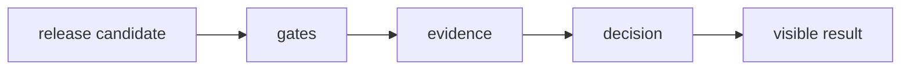

### How it works

1. `release candidate` enters **Release checklist** as the value, event, file, or runtime that needs a decision.
2. `gates` applies the rule owned by this section; keep that decision close to its source boundary.
3. `evidence` carries the checked result to the next consumer instead of exposing private setup.
4. `decision` receives the result and makes it visible through markup, output, or an exit code.
5. Exercise the normal path and the failure path at the runtime named by the example.

### Project reading

- **Rule:** Keep the release command list copyable and record skipped checks with a reason.
- **Failure to catch:** A release is marked green from a partial local command.
- **Evidence:** Command log and artifact paths.
- **Owner:** `Test matrix / Field Notes` documents the contract; source files and tests remain the executable reference.
- **Scope:** Read this section with the linked source path in the repository catalog below.

### Example

```bash
pnpm run quality:full
pnpm run test:playwright:all
pnpm run test:lighthouse
```

### Decision table

<table>
  <thead>
    <tr><th>Input</th><th>Project decision</th><th>Check</th></tr>
  </thead>
  <tbody>
    <tr><td>release candidate</td><td>Keep it at the boundary named by the section.</td><td>A focused test or source inspection.</td></tr>
    <tr><td>gates</td><td>Use the smallest rule that explains the branch.</td><td>Lint, type check, or browser assertion.</td></tr>
    <tr><td>evidence</td><td>Return a readable value or state.</td><td>Success and failure cases.</td></tr>
    <tr><td>decision</td><td>Expose a semantic or reviewable consumer.</td><td>Role, report, screenshot, or exit code.</td></tr>
  </tbody>
</table>

### Checks

- Inspect the owner for `gates` before editing the consumer.
- Assert the successful `evidence` result through the public surface.
- Force the failure branch and confirm it reaches `decision`.
- Record the command and artifact path shown in this guide.

<a id="repository-map"></a>
<h1 align="center">
   Repository map
</h1>

The catalog is intentionally concrete. Use it to jump from a concept to the source or test that implements it.

<table>
  <thead>
    <tr><th>Area</th><th>Paths</th><th>Read for</th></tr>
  </thead>
  <tbody>
    <tr><td>Application</td><td>`src/app/`</td><td>Routes, layouts, metadata, and API handlers.</td></tr>
    <tr><td>Components</td><td>`src/components/`</td><td>React composition, effects, UI, and project surfaces.</td></tr>
    <tr><td>Tests</td><td>`tests/` and `src/**/tests/`</td><td>Runner-specific behavior and boundary cases.</td></tr>
    <tr><td>Scripts</td><td>`scripts/tests/` and `scripts/qa/`</td><td>Quality reports, server startup, screenshots, and video conversion.</td></tr>
    <tr><td>Automation</td><td>`.github/workflows/`</td><td>CI triggers, jobs, artifacts, and delivery.</td></tr>
  </tbody>
</table>


<table>
  <thead>
    <tr><th>Path</th><th>Relation to this guide</th><th>Open with</th></tr>
  </thead>
  <tbody>
    <tr><td><code>.github/workflows/ci.yml</code></td><td>Automation or delivery boundary.</td><td>`ci.md` or the workflow job log.</td></tr>
    <tr><td><code>.github/workflows/codeql.yml</code></td><td>Automation or delivery boundary.</td><td>`ci.md` or the workflow job log.</td></tr>
    <tr><td><code>.github/workflows/dependencies.yml</code></td><td>Automation or delivery boundary.</td><td>`ci.md` or the workflow job log.</td></tr>
    <tr><td><code>.github/workflows/deploy.yml</code></td><td>Automation or delivery boundary.</td><td>`ci.md` or the workflow job log.</td></tr>
    <tr><td><code>.github/workflows/docker.yml</code></td><td>Automation or delivery boundary.</td><td>`ci.md` or the workflow job log.</td></tr>
    <tr><td><code>.github/workflows/frontend-qa.yml</code></td><td>Automation or delivery boundary.</td><td>`ci.md` or the workflow job log.</td></tr>
    <tr><td><code>.storybook/main.ts</code></td><td>Application source, typed component, or style rule.</td><td>The nearest test and route.</td></tr>
    <tr><td><code>README.md</code></td><td>Project configuration or documentation entry point.</td><td>The command that consumes it.</td></tr>
    <tr><td><code>jest.config.js</code></td><td>Project configuration or documentation entry point.</td><td>The command that consumes it.</td></tr>
    <tr><td><code>lighthouserc.js</code></td><td>Project configuration or documentation entry point.</td><td>The command that consumes it.</td></tr>
    <tr><td><code>package.json</code></td><td>Project configuration or documentation entry point.</td><td>The command that consumes it.</td></tr>
    <tr><td><code>playwright.config.ts</code></td><td>Application source, typed component, or style rule.</td><td>The nearest test and route.</td></tr>
    <tr><td><code>scripts/qa/capture-lighthouse-screenshots.mjs</code></td><td>QA runtime helper or evidence producer.</td><td>`testing.md` or `qa.md`.</td></tr>
    <tr><td><code>scripts/qa/convert-playwright-video.mjs</code></td><td>QA runtime helper or evidence producer.</td><td>`testing.md` or `qa.md`.</td></tr>
    <tr><td><code>scripts/qa/start-production.mjs</code></td><td>QA runtime helper or evidence producer.</td><td>`testing.md` or `qa.md`.</td></tr>
    <tr><td><code>scripts/tests/benchmark.mjs</code></td><td>Behavior check or test fixture.</td><td>The related source module.</td></tr>
    <tr><td><code>scripts/tests/benchmark.node-test.mjs</code></td><td>Behavior check or test fixture.</td><td>The related source module.</td></tr>
    <tr><td><code>scripts/tests/check-file-size.mjs</code></td><td>Behavior check or test fixture.</td><td>The related source module.</td></tr>
    <tr><td><code>scripts/tests/check-file-size.node-test.mjs</code></td><td>Behavior check or test fixture.</td><td>The related source module.</td></tr>
    <tr><td><code>scripts/tests/file-size-policy.mjs</code></td><td>Behavior check or test fixture.</td><td>The related source module.</td></tr>
    <tr><td><code>scripts/tests/jscpd.mjs</code></td><td>Behavior check or test fixture.</td><td>The related source module.</td></tr>
    <tr><td><code>scripts/tests/jscpd.node-test.mjs</code></td><td>Behavior check or test fixture.</td><td>The related source module.</td></tr>
    <tr><td><code>scripts/tests/quality-metrics.mjs</code></td><td>Behavior check or test fixture.</td><td>The related source module.</td></tr>
    <tr><td><code>scripts/tests/quality-metrics.node-test.mjs</code></td><td>Behavior check or test fixture.</td><td>The related source module.</td></tr>
    <tr><td><code>scripts/tests/quality-policy.mjs</code></td><td>Behavior check or test fixture.</td><td>The related source module.</td></tr>
    <tr><td><code>scripts/tests/quality-report.mjs</code></td><td>Behavior check or test fixture.</td><td>The related source module.</td></tr>
    <tr><td><code>scripts/tests/quality-report.node-test.mjs</code></td><td>Behavior check or test fixture.</td><td>The related source module.</td></tr>
    <tr><td><code>scripts/tests/quality-review.mjs</code></td><td>Behavior check or test fixture.</td><td>The related source module.</td></tr>
    <tr><td><code>scripts/tests/quality-review.node-test.mjs</code></td><td>Behavior check or test fixture.</td><td>The related source module.</td></tr>
    <tr><td><code>scripts/tests/quality-security.mjs</code></td><td>Behavior check or test fixture.</td><td>The related source module.</td></tr>
    <tr><td><code>src/app/[locale]/[...not-found]/page.tsx</code></td><td>Application source, typed component, or style rule.</td><td>The nearest test and route.</td></tr>
    <tr><td><code>src/app/[locale]/about/layout.tsx</code></td><td>Application source, typed component, or style rule.</td><td>The nearest test and route.</td></tr>
    <tr><td><code>src/app/[locale]/about/page.tsx</code></td><td>Application source, typed component, or style rule.</td><td>The nearest test and route.</td></tr>
    <tr><td><code>src/app/[locale]/certifications/layout.tsx</code></td><td>Application source, typed component, or style rule.</td><td>The nearest test and route.</td></tr>
    <tr><td><code>src/app/[locale]/certifications/page.tsx</code></td><td>Application source, typed component, or style rule.</td><td>The nearest test and route.</td></tr>
    <tr><td><code>src/app/[locale]/chat/layout.tsx</code></td><td>Application source, typed component, or style rule.</td><td>The nearest test and route.</td></tr>
    <tr><td><code>src/app/[locale]/chat/page.tsx</code></td><td>Application source, typed component, or style rule.</td><td>The nearest test and route.</td></tr>
    <tr><td><code>src/app/[locale]/contact/layout.tsx</code></td><td>Application source, typed component, or style rule.</td><td>The nearest test and route.</td></tr>
    <tr><td><code>src/app/[locale]/contact/page.tsx</code></td><td>Application source, typed component, or style rule.</td><td>The nearest test and route.</td></tr>
    <tr><td><code>src/app/[locale]/layout.tsx</code></td><td>Application source, typed component, or style rule.</td><td>The nearest test and route.</td></tr>
    <tr><td><code>src/app/[locale]/not-found.tsx</code></td><td>Application source, typed component, or style rule.</td><td>The nearest test and route.</td></tr>
    <tr><td><code>src/app/[locale]/page.tsx</code></td><td>Application source, typed component, or style rule.</td><td>The nearest test and route.</td></tr>
    <tr><td><code>src/app/[locale]/projects/layout.tsx</code></td><td>Application source, typed component, or style rule.</td><td>The nearest test and route.</td></tr>
    <tr><td><code>src/app/[locale]/projects/page.tsx</code></td><td>Application source, typed component, or style rule.</td><td>The nearest test and route.</td></tr>
    <tr><td><code>src/app/[locale]/tests/pages.test.tsx</code></td><td>Behavior check or test fixture.</td><td>The related source module.</td></tr>
    <tr><td><code>src/app/api/auth/[...nextauth]/route.ts</code></td><td>Application source, typed component, or style rule.</td><td>The nearest test and route.</td></tr>
    <tr><td><code>src/app/api/chat/messages/route.ts</code></td><td>Application source, typed component, or style rule.</td><td>The nearest test and route.</td></tr>
    <tr><td><code>src/app/api/github/repos/[owner]/[repo]/readme/route.ts</code></td><td>Application source, typed component, or style rule.</td><td>The nearest test and route.</td></tr>
    <tr><td><code>src/app/api/github/repos/[owner]/[repo]/readme/tests/route.test.ts</code></td><td>Behavior check or test fixture.</td><td>The related source module.</td></tr>
    <tr><td><code>src/app/api/github/repos/route.ts</code></td><td>Application source, typed component, or style rule.</td><td>The nearest test and route.</td></tr>
    <tr><td><code>src/app/api/github/repos/tests/route-branches.test.ts</code></td><td>Behavior check or test fixture.</td><td>The related source module.</td></tr>
    <tr><td><code>src/app/api/github/repos/tests/route.test.ts</code></td><td>Behavior check or test fixture.</td><td>The related source module.</td></tr>
    <tr><td><code>src/app/api/github/stats/route.ts</code></td><td>Application source, typed component, or style rule.</td><td>The nearest test and route.</td></tr>
    <tr><td><code>src/app/api/health/route.ts</code></td><td>Application source, typed component, or style rule.</td><td>The nearest test and route.</td></tr>
    <tr><td><code>src/app/api/tests/uncovered-routes.test.ts</code></td><td>Behavior check or test fixture.</td><td>The related source module.</td></tr>
    <tr><td><code>src/app/api/upload/route.ts</code></td><td>Application source, typed component, or style rule.</td><td>The nearest test and route.</td></tr>
    <tr><td><code>src/app/api/visitors/route.ts</code></td><td>Application source, typed component, or style rule.</td><td>The nearest test and route.</td></tr>
    <tr><td><code>src/app/api/youtube/config/route.ts</code></td><td>Application source, typed component, or style rule.</td><td>The nearest test and route.</td></tr>
    <tr><td><code>src/app/globals.css</code></td><td>Application source, typed component, or style rule.</td><td>The nearest test and route.</td></tr>
    <tr><td><code>src/app/layout.tsx</code></td><td>Application source, typed component, or style rule.</td><td>The nearest test and route.</td></tr>
    <tr><td><code>src/app/page.tsx</code></td><td>Application source, typed component, or style rule.</td><td>The nearest test and route.</td></tr>
    <tr><td><code>src/app/robots.ts</code></td><td>Application source, typed component, or style rule.</td><td>The nearest test and route.</td></tr>
    <tr><td><code>src/app/sitemap.ts</code></td><td>Application source, typed component, or style rule.</td><td>The nearest test and route.</td></tr>
    <tr><td><code>src/app/tests/shell.test.tsx</code></td><td>Behavior check or test fixture.</td><td>The related source module.</td></tr>
    <tr><td><code>src/components/about/AboutParticleField.tsx</code></td><td>Application source, typed component, or style rule.</td><td>The nearest test and route.</td></tr>
    <tr><td><code>src/components/about/AboutScrollStory.tsx</code></td><td>Application source, typed component, or style rule.</td><td>The nearest test and route.</td></tr>
    <tr><td><code>src/components/about/InteractiveExpertiseGrid.tsx</code></td><td>Application source, typed component, or style rule.</td><td>The nearest test and route.</td></tr>
    <tr><td><code>src/components/chat/ChatEffects.tsx</code></td><td>Application source, typed component, or style rule.</td><td>The nearest test and route.</td></tr>
    <tr><td><code>src/components/chat/ChatRoom.tsx</code></td><td>Application source, typed component, or style rule.</td><td>The nearest test and route.</td></tr>
    <tr><td><code>src/components/contact/ClickSpark.tsx</code></td><td>Application source, typed component, or style rule.</td><td>The nearest test and route.</td></tr>
    <tr><td><code>src/components/contact/Contact.tsx</code></td><td>Application source, typed component, or style rule.</td><td>The nearest test and route.</td></tr>
    <tr><td><code>src/components/contact/ContactCommandForm.tsx</code></td><td>Application source, typed component, or style rule.</td><td>The nearest test and route.</td></tr>
    <tr><td><code>src/components/effects/HexagonGrid.tsx</code></td><td>Application source, typed component, or style rule.</td><td>The nearest test and route.</td></tr>
    <tr><td><code>src/components/effects/LetterGlitch.tsx</code></td><td>Application source, typed component, or style rule.</td><td>The nearest test and route.</td></tr>
    <tr><td><code>src/components/effects/MatrixBackground.tsx</code></td><td>Application source, typed component, or style rule.</td><td>The nearest test and route.</td></tr>
    <tr><td><code>src/components/effects/ParticleBackground.tsx</code></td><td>Application source, typed component, or style rule.</td><td>The nearest test and route.</td></tr>
    <tr><td><code>src/components/effects/ScrollEffect.tsx</code></td><td>Application source, typed component, or style rule.</td><td>The nearest test and route.</td></tr>
    <tr><td><code>src/components/effects/ScrollProgress.tsx</code></td><td>Application source, typed component, or style rule.</td><td>The nearest test and route.</td></tr>
    <tr><td><code>src/components/effects/ScrollReveal.tsx</code></td><td>Application source, typed component, or style rule.</td><td>The nearest test and route.</td></tr>
    <tr><td><code>src/components/effects/ScrollVelocityRibbon.tsx</code></td><td>Application source, typed component, or style rule.</td><td>The nearest test and route.</td></tr>
    <tr><td><code>src/components/home/BongoCat.tsx</code></td><td>Application source, typed component, or style rule.</td><td>The nearest test and route.</td></tr>
    <tr><td><code>src/components/home/CapabilityRail.tsx</code></td><td>Application source, typed component, or style rule.</td><td>The nearest test and route.</td></tr>
    <tr><td><code>src/components/home/Hero.tsx</code></td><td>Application source, typed component, or style rule.</td><td>The nearest test and route.</td></tr>
    <tr><td><code>src/components/home/MetricsTicker.tsx</code></td><td>Application source, typed component, or style rule.</td><td>The nearest test and route.</td></tr>
    <tr><td><code>src/components/home/Skills.tsx</code></td><td>Application source, typed component, or style rule.</td><td>The nearest test and route.</td></tr>
    <tr><td><code>src/components/home/TechCarousel.tsx</code></td><td>Application source, typed component, or style rule.</td><td>The nearest test and route.</td></tr>
    <tr><td><code>src/components/home/bongo-cat-styles.ts</code></td><td>Application source, typed component, or style rule.</td><td>The nearest test and route.</td></tr>
    <tr><td><code>src/components/layout/DynamicFavicon.tsx</code></td><td>Application source, typed component, or style rule.</td><td>The nearest test and route.</td></tr>
    <tr><td><code>src/components/layout/LanguageSwitcher.tsx</code></td><td>Application source, typed component, or style rule.</td><td>The nearest test and route.</td></tr>
    <tr><td><code>src/components/layout/Navigation.tsx</code></td><td>Application source, typed component, or style rule.</td><td>The nearest test and route.</td></tr>
    <tr><td><code>src/components/layout/PageTransition.tsx</code></td><td>Application source, typed component, or style rule.</td><td>The nearest test and route.</td></tr>
    <tr><td><code>src/components/layout/PageTransitionOverlay.tsx</code></td><td>Application source, typed component, or style rule.</td><td>The nearest test and route.</td></tr>
    <tr><td><code>src/components/layout/ThemeProvider.tsx</code></td><td>Application source, typed component, or style rule.</td><td>The nearest test and route.</td></tr>
    <tr><td><code>src/components/layout/ThemeToggle.tsx</code></td><td>Application source, typed component, or style rule.</td><td>The nearest test and route.</td></tr>
    <tr><td><code>src/components/layout/page-transition-config.ts</code></td><td>Application source, typed component, or style rule.</td><td>The nearest test and route.</td></tr>
    <tr><td><code>src/components/loading-screen/GameLoadingScreen.css</code></td><td>Application source, typed component, or style rule.</td><td>The nearest test and route.</td></tr>
    <tr><td><code>src/components/loading-screen/GameLoadingScreen.tsx</code></td><td>Application source, typed component, or style rule.</td><td>The nearest test and route.</td></tr>
    <tr><td><code>src/components/loading-screen/LoadingScreenDemo.tsx</code></td><td>Application source, typed component, or style rule.</td><td>The nearest test and route.</td></tr>
    <tr><td><code>src/components/loading-screen/MatrixRain.tsx</code></td><td>Application source, typed component, or style rule.</td><td>The nearest test and route.</td></tr>
    <tr><td><code>src/components/loading-screen/SoloLevelingBoot.tsx</code></td><td>Application source, typed component, or style rule.</td><td>The nearest test and route.</td></tr>
    <tr><td><code>src/components/loading-screen/loadingMessages.ts</code></td><td>Application source, typed component, or style rule.</td><td>The nearest test and route.</td></tr>
    <tr><td><code>src/components/loading-screen/solo-leveling-boot-styles.ts</code></td><td>Application source, typed component, or style rule.</td><td>The nearest test and route.</td></tr>
    <tr><td><code>src/components/media/BackgroundMusic.tsx</code></td><td>Application source, typed component, or style rule.</td><td>The nearest test and route.</td></tr>
    <tr><td><code>src/components/projects/CityMap.tsx</code></td><td>Application source, typed component, or style rule.</td><td>The nearest test and route.</td></tr>
    <tr><td><code>src/components/projects/GitHubProjects.tsx</code></td><td>Application source, typed component, or style rule.</td><td>The nearest test and route.</td></tr>
    <tr><td><code>src/components/projects/ImageSlideshow.tsx</code></td><td>Application source, typed component, or style rule.</td><td>The nearest test and route.</td></tr>
    <tr><td><code>src/components/projects/LivePreview.tsx</code></td><td>Application source, typed component, or style rule.</td><td>The nearest test and route.</td></tr>
    <tr><td><code>src/components/projects/ProjectCardParts.tsx</code></td><td>Application source, typed component, or style rule.</td><td>The nearest test and route.</td></tr>
    <tr><td><code>src/components/projects/ProjectReadmeModal.tsx</code></td><td>Application source, typed component, or style rule.</td><td>The nearest test and route.</td></tr>
    <tr><td><code>src/components/projects/SoloLevelingProjectCard.tsx</code></td><td>Application source, typed component, or style rule.</td><td>The nearest test and route.</td></tr>
  </tbody>
</table>

<a id="command-matrix"></a>
<h1 align="center">
   Command matrix
</h1>

<table>
  <thead>
    <tr><th>Command</th><th>Script</th><th>Proof</th></tr>
  </thead>
  <tbody>
    <tr><td>Jest</td><td>`pnpm run test:jest`</td><td>Component, API, and route tests</td></tr>
    <tr><td>Vitest</td><td>`pnpm run test:vitest`</td><td>Focused specs</td></tr>
    <tr><td>Browser</td><td>`pnpm run test:browser`</td><td>Chromium component spec</td></tr>
    <tr><td>Release</td><td>`pnpm run full:tests`</td><td>All tests and video</td></tr>
  </tbody>
</table>

### Command rules

- Use `pnpm` locally when the change is covered by the pnpm lockfile.
- Run `pnpm run docs:check` after changing any guide or README link.
- Use the exact workflow command when reproducing CI.
- Keep snapshot updates explicit and review the diff.
- Run the build before browser checks that depend on production output.
- Record failures with the exit code and artifact path.

<a id="evidence-and-troubleshooting"></a>
<h1 align="center">
   Evidence and troubleshooting
</h1>

<table>
  <thead>
    <tr><th>Symptom</th><th>First inspection</th><th>Next command</th></tr>
  </thead>
  <tbody>
    <tr><td>Compiler error</td><td>`tsconfig.json` and the first diagnostic</td><td>`pnpm exec tsc --noEmit`</td></tr>
    <tr><td>Test not found</td><td>Runner include pattern and test path</td><td>`pnpm run test:scripts` or the runner command</td></tr>
    <tr><td>Browser startup</td><td>Installed browser and server URL</td><td>`pnpm exec playwright install --with-deps chromium`</td></tr>
    <tr><td>Visual diff</td><td>Font, viewport, theme, and animated layer</td><td>`pnpm run test:visual`</td></tr>
    <tr><td>Missing report</td><td>Output path and upload step</td><td>`find reports coverage playwright-report test-results .lighthouseci -maxdepth 2 -type f`</td></tr>
    <tr><td>CI-only failure</td><td>Node, package manager, env, and browser matrix</td><td>Copy the workflow command locally</td></tr>
  </tbody>
</table>

### Evidence record

- Command: `<exact command>`
- Input: `<changed path or fixture>`
- Result: `<literal summary>`
- Exit code: `<0 or failure code>`
- Artifact: `<path or none>`
- Follow-up: `<source fix, test fix, or environment fix>`

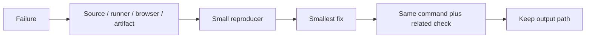

### Stop conditions

- Stop changing source when the failure is a missing runtime dependency.
- Stop updating snapshots when the diff has an unexplained content change.
- Stop widening types when the input has no runtime guard.
- Stop adding waits when the test has an ownership or cleanup bug.
- Stop after the requested behavior and rollback path have a passing check.

<a id="references"></a>
<h1 align="center">
   References
</h1>

- https://jestjs.io/docs/getting-started
- https://vitest.dev/guide/browser/
- https://playwright.dev/docs/test-reporters
- https://nodejs.org/api/test.html
- [Project README](../README.md)
- [Package scripts](../package.json)
- [GitHub Actions workflows](../.github/workflows/)

<details>
  <summary>Review checklist</summary>

- [ ] Source owner is named.
- [ ] Runtime boundary is named.
- [ ] Success and failure states are described.
- [ ] Example matches current project syntax.
- [ ] Focused check ran.
- [ ] Related browser or quality check ran.
- [ ] Evidence path is recorded.
- [ ] README link resolves.

</details>

---

