<div align="center">

<h1 align="center">
  
  Frontend testing / Field Notes
</h1>

Runner selection, local commands, browser coverage, and evidence paths.

<a href="test.md">Full test matrix</a>  <a href="qa.md">QA docs</a>  <a href="ci.md">CI docs</a>  <a href="../README.md">README</a>

</div>

---
<p align="center">
  
  
  
  
  
</p>

<table>
  <thead>
    <tr><th>Topic</th><th>Project baseline</th><th>Use it for</th></tr>
  </thead>
  <tbody>
    <tr><td>Unit</td><td>Jest + jsdom</td><td>Broad component, route, hook, and utility checks.</td></tr>
    <tr><td>Focused</td><td>Vitest</td><td>Small React behavior in jsdom.</td></tr>
    <tr><td>Browser</td><td>Vitest Browser + Playwright</td><td>Real DOM, navigation, responsive, and visual checks.</td></tr>
    <tr><td>Evidence</td><td>reports + artifacts</td><td>JUnit, coverage, traces, screenshots, video, and audits.</td></tr>
  </tbody>
</table>

## Contents

- [01 / Test layers](#01--test-layers)
- [02 / Jest suite](#02--jest-suite)
- [03 / Vitest jsdom](#03--vitest-jsdom)
- [04 / Vitest Browser Mode](#04--vitest-browser-mode)
- [05 / Playwright projects](#05--playwright-projects)
- [06 / End-to-end paths](#06--end-to-end-paths)
- [07 / Accessibility checks](#07--accessibility-checks)
- [08 / Visual snapshots](#08--visual-snapshots)
- [09 / Video journey](#09--video-journey)
- [10 / Node QA tests](#10--node-qa-tests)
- [11 / Coverage](#11--coverage)
- [12 / Fixtures and mocks](#12--fixtures-and-mocks)
- [13 / Command selection](#13--command-selection)
- [14 / Local and CI parity](#14--local-and-ci-parity)
- [15 / Artifacts](#15--artifacts)
- [16 / Flaky test triage](#16--flaky-test-triage)
- [17 / Skill and media regressions](#17--skill-and-media-regressions)
- [17 / Test review checklist](#17--test-review-checklist)
- [18 / Hydration regression checks](#18--hydration-regression-checks)
- [19 / GIF and video transition checks](#19--gif-and-video-transition-checks)
- [Repository map](#repository-map)
- [Command matrix](#command-matrix)
- [Evidence and troubleshooting](#evidence-and-troubleshooting)
- [References](#references)

<h1 align="center">
   Operating model
</h1>

This guide explains **Frontend testing / Field Notes** through the source tree, the runtime boundary, the smallest useful test, and the evidence a reviewer can inspect.

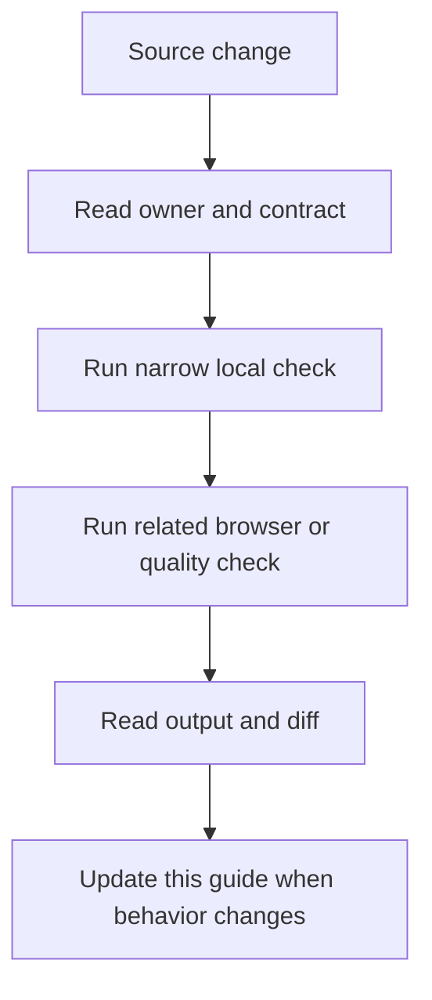

### Reading order

- Start at the section for the changed file or runtime.
- Copy the narrow command before running the broad suite.
- Check the failure branch and the evidence path.
- Compare README links after editing any docs entry point.

<a id="01--test-layers"></a>
## 01 / Test layers

The repository assigns each behavior to the cheapest test environment that can observe it correctly.

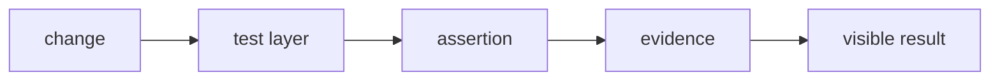

### How it works

1. `change` enters **Test layers** as the value, event, file, or runtime that needs a decision.
2. `test layer` applies the rule owned by this section; keep that decision close to its source boundary.
3. `assertion` carries the checked result to the next consumer instead of exposing private setup.
4. `evidence` receives the result and makes it visible through markup, output, or an exit code.
5. Exercise the normal path and the failure path at the runtime named by the example.

### Project reading

- **Rule:** Use Jest or Vitest for component logic, Browser Mode for browser DOM, and Playwright for page behavior.
- **Failure to catch:** A fast unit test gives confidence about a behavior the real browser owns.
- **Evidence:** The command, test path, and report artifact.
- **Owner:** `Frontend testing / Field Notes` documents the contract; source files and tests remain the executable reference.
- **Scope:** Read this section with the linked source path in the repository catalog below.

### Example

```bash
pnpm run test:jest
pnpm run test:vitest
pnpm run test:browser
pnpm run test:playwright
```

### Decision table

<table>
  <thead>
    <tr><th>Input</th><th>Project decision</th><th>Check</th></tr>
  </thead>
  <tbody>
    <tr><td>change</td><td>Keep it at the boundary named by the section.</td><td>A focused test or source inspection.</td></tr>
    <tr><td>test layer</td><td>Use the smallest rule that explains the branch.</td><td>Lint, type check, or browser assertion.</td></tr>
    <tr><td>assertion</td><td>Return a readable value or state.</td><td>Success and failure cases.</td></tr>
    <tr><td>evidence</td><td>Expose a semantic or reviewable consumer.</td><td>Role, report, screenshot, or exit code.</td></tr>
  </tbody>
</table>

### Checks

- Inspect the owner for `test layer` before editing the consumer.
- Assert the successful `assertion` result through the public surface.
- Force the failure branch and confirm it reaches `evidence`.
- Record the command and artifact path shown in this guide.

<a id="02--jest-suite"></a>
## 02 / Jest suite

Jest runs tests matching tests/**/*.test.[jt]s?(x) with Next-aware transforms, jsdom, and JUnit output.

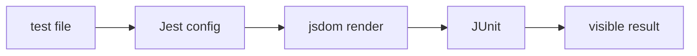

### How it works

1. `test file` enters **Jest suite** as the value, event, file, or runtime that needs a decision.
2. `Jest config` applies the rule owned by this section; keep that decision close to its source boundary.
3. `jsdom render` carries the checked result to the next consumer instead of exposing private setup.
4. `JUnit` receives the result and makes it visible through markup, output, or an exit code.
5. Exercise the normal path and the failure path at the runtime named by the example.

### Project reading

- **Rule:** Keep broad existing component, hook, utility, and route behavior in the Jest layer.
- **Failure to catch:** A test sits outside testMatch or depends on a browser API with no mock.
- **Evidence:** reports/junit.xml and terminal result.
- **Owner:** `Frontend testing / Field Notes` documents the contract; source files and tests remain the executable reference.
- **Scope:** Read this section with the linked source path in the repository catalog below.

### Example

```bash
pnpm run test:jest
pnpm run test:coverage
```

### Decision table

<table>
  <thead>
    <tr><th>Input</th><th>Project decision</th><th>Check</th></tr>
  </thead>
  <tbody>
    <tr><td>test file</td><td>Keep it at the boundary named by the section.</td><td>A focused test or source inspection.</td></tr>
    <tr><td>Jest config</td><td>Use the smallest rule that explains the branch.</td><td>Lint, type check, or browser assertion.</td></tr>
    <tr><td>jsdom render</td><td>Return a readable value or state.</td><td>Success and failure cases.</td></tr>
    <tr><td>JUnit</td><td>Expose a semantic or reviewable consumer.</td><td>Role, report, screenshot, or exit code.</td></tr>
  </tbody>
</table>

### Checks

- Inspect the owner for `Jest config` before editing the consumer.
- Assert the successful `jsdom render` result through the public surface.
- Force the failure branch and confirm it reaches `JUnit`.
- Record the command and artifact path shown in this guide.

<a id="03--vitest-jsdom"></a>
## 03 / Vitest jsdom

Vitest owns focused React tests under tests/vitest with a Vite React plugin and shared setup.

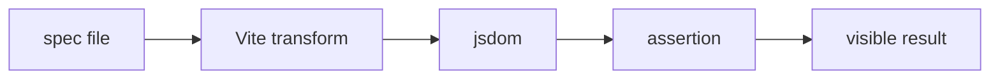

### How it works

1. `spec file` enters **Vitest jsdom** as the value, event, file, or runtime that needs a decision.
2. `Vite transform` applies the rule owned by this section; keep that decision close to its source boundary.
3. `jsdom` carries the checked result to the next consumer instead of exposing private setup.
4. `assertion` receives the result and makes it visible through markup, output, or an exit code.
5. Exercise the normal path and the failure path at the runtime named by the example.

### Project reading

- **Rule:** Use this runner for small focused behavior that benefits from fast Vite startup.
- **Failure to catch:** A focused spec is placed in a directory the config does not include.
- **Evidence:** Vitest terminal output and the spec path.
- **Owner:** `Frontend testing / Field Notes` documents the contract; source files and tests remain the executable reference.
- **Scope:** Read this section with the linked source path in the repository catalog below.

### Example

```bash
pnpm run test:vitest
# tests/vitest/**/*.spec.{ts,tsx}
```

### Decision table

<table>
  <thead>
    <tr><th>Input</th><th>Project decision</th><th>Check</th></tr>
  </thead>
  <tbody>
    <tr><td>spec file</td><td>Keep it at the boundary named by the section.</td><td>A focused test or source inspection.</td></tr>
    <tr><td>Vite transform</td><td>Use the smallest rule that explains the branch.</td><td>Lint, type check, or browser assertion.</td></tr>
    <tr><td>jsdom</td><td>Return a readable value or state.</td><td>Success and failure cases.</td></tr>
    <tr><td>assertion</td><td>Expose a semantic or reviewable consumer.</td><td>Role, report, screenshot, or exit code.</td></tr>
  </tbody>
</table>

### Checks

- Inspect the owner for `Vite transform` before editing the consumer.
- Assert the successful `jsdom` result through the public surface.
- Force the failure branch and confirm it reaches `assertion`.
- Record the command and artifact path shown in this guide.

<a id="04--vitest-browser-mode"></a>
## 04 / Vitest Browser Mode

Browser Mode runs the focused component spec in Chromium through Playwright.

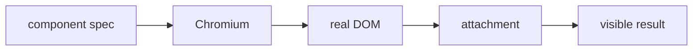

### How it works

1. `component spec` enters **Vitest Browser Mode** as the value, event, file, or runtime that needs a decision.
2. `Chromium` applies the rule owned by this section; keep that decision close to its source boundary.
3. `real DOM` carries the checked result to the next consumer instead of exposing private setup.
4. `attachment` receives the result and makes it visible through markup, output, or an exit code.
5. Exercise the normal path and the failure path at the runtime named by the example.

### Project reading

- **Rule:** Use it when layout, focus, native browser APIs, or CSS behavior matters to the component.
- **Failure to catch:** jsdom hides a browser difference and the component fails only after hydration.
- **Evidence:** A Browser Mode result or .vitest-attachments image.
- **Owner:** `Frontend testing / Field Notes` documents the contract; source files and tests remain the executable reference.
- **Scope:** Read this section with the linked source path in the repository catalog below.

### Example

```bash
pnpm run test:browser
# tests/browser/**/*.spec.{ts,tsx}
```

### Decision table

<table>
  <thead>
    <tr><th>Input</th><th>Project decision</th><th>Check</th></tr>
  </thead>
  <tbody>
    <tr><td>component spec</td><td>Keep it at the boundary named by the section.</td><td>A focused test or source inspection.</td></tr>
    <tr><td>Chromium</td><td>Use the smallest rule that explains the branch.</td><td>Lint, type check, or browser assertion.</td></tr>
    <tr><td>real DOM</td><td>Return a readable value or state.</td><td>Success and failure cases.</td></tr>
    <tr><td>attachment</td><td>Expose a semantic or reviewable consumer.</td><td>Role, report, screenshot, or exit code.</td></tr>
  </tbody>
</table>

### Checks

- Inspect the owner for `Chromium` before editing the consumer.
- Assert the successful `real DOM` result through the public surface.
- Force the failure branch and confirm it reaches `attachment`.
- Record the command and artifact path shown in this guide.

<a id="05--playwright-projects"></a>
## 05 / Playwright projects

Playwright separates visual, E2E, accessibility, video, and browser projects by testMatch and device settings.

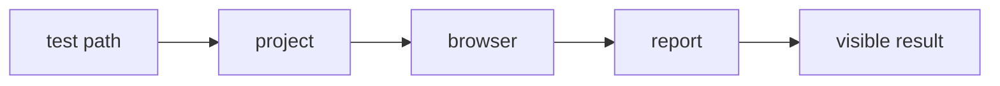

### How it works

1. `test path` enters **Playwright projects** as the value, event, file, or runtime that needs a decision.
2. `project` applies the rule owned by this section; keep that decision close to its source boundary.
3. `browser` carries the checked result to the next consumer instead of exposing private setup.
4. `report` receives the result and makes it visible through markup, output, or an exit code.
5. Exercise the normal path and the failure path at the runtime named by the example.

### Project reading

- **Rule:** Select the narrow project during development; run all projects before a release check.
- **Failure to catch:** A command skips a directory because the project pattern does not match it.
- **Evidence:** HTML report, screenshot, trace, or video.
- **Owner:** `Frontend testing / Field Notes` documents the contract; source files and tests remain the executable reference.
- **Scope:** Read this section with the linked source path in the repository catalog below.

### Example

```bash
pnpm run test:playwright
pnpm run test:playwright:all
```

### Decision table

<table>
  <thead>
    <tr><th>Input</th><th>Project decision</th><th>Check</th></tr>
  </thead>
  <tbody>
    <tr><td>test path</td><td>Keep it at the boundary named by the section.</td><td>A focused test or source inspection.</td></tr>
    <tr><td>project</td><td>Use the smallest rule that explains the branch.</td><td>Lint, type check, or browser assertion.</td></tr>
    <tr><td>browser</td><td>Return a readable value or state.</td><td>Success and failure cases.</td></tr>
    <tr><td>report</td><td>Expose a semantic or reviewable consumer.</td><td>Role, report, screenshot, or exit code.</td></tr>
  </tbody>
</table>

### Checks

- Inspect the owner for `project` before editing the consumer.
- Assert the successful `browser` result through the public surface.
- Force the failure branch and confirm it reaches `report`.
- Record the command and artifact path shown in this guide.

<a id="06--end-to-end-paths"></a>
## 06 / End-to-end paths

E2E specs cover smoke startup, navigation, project interactions, and responsive behavior across Chromium and Firefox.

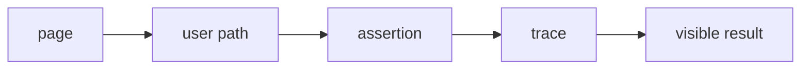

### How it works

1. `page` enters **End-to-end paths** as the value, event, file, or runtime that needs a decision.
2. `user path` applies the rule owned by this section; keep that decision close to its source boundary.
3. `assertion` carries the checked result to the next consumer instead of exposing private setup.
4. `trace` receives the result and makes it visible through markup, output, or an exit code.
5. Exercise the normal path and the failure path at the runtime named by the example.

### Project reading

- **Rule:** Start from a stable URL and assert visible roles rather than internal selectors.
- **Failure to catch:** The test passes against an old page state or fails because external data was not controlled.
- **Evidence:** playwright-report and test-results entries.
- **Owner:** `Frontend testing / Field Notes` documents the contract; source files and tests remain the executable reference.
- **Scope:** Read this section with the linked source path in the repository catalog below.

### Example

```bash
pnpm run test:e2e
pnpm run test:e2e:all
```

### Decision table

<table>
  <thead>
    <tr><th>Input</th><th>Project decision</th><th>Check</th></tr>
  </thead>
  <tbody>
    <tr><td>page</td><td>Keep it at the boundary named by the section.</td><td>A focused test or source inspection.</td></tr>
    <tr><td>user path</td><td>Use the smallest rule that explains the branch.</td><td>Lint, type check, or browser assertion.</td></tr>
    <tr><td>assertion</td><td>Return a readable value or state.</td><td>Success and failure cases.</td></tr>
    <tr><td>trace</td><td>Expose a semantic or reviewable consumer.</td><td>Role, report, screenshot, or exit code.</td></tr>
  </tbody>
</table>

### Checks

- Inspect the owner for `user path` before editing the consumer.
- Assert the successful `assertion` result through the public surface.
- Force the failure branch and confirm it reaches `trace`.
- Record the command and artifact path shown in this guide.

<a id="07--accessibility-checks"></a>
## 07 / Accessibility checks

The accessibility spec runs axe against rendered pages, while other specs assert names, roles, labels, and keyboard paths.

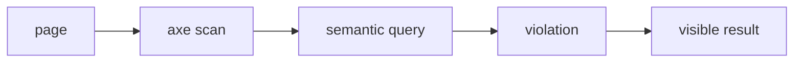

### How it works

1. `page` enters **Accessibility checks** as the value, event, file, or runtime that needs a decision.
2. `axe scan` applies the rule owned by this section; keep that decision close to its source boundary.
3. `semantic query` carries the checked result to the next consumer instead of exposing private setup.
4. `violation` receives the result and makes it visible through markup, output, or an exit code.
5. Exercise the normal path and the failure path at the runtime named by the example.

### Project reading

- **Rule:** Treat automated findings as a starting point and inspect the user path that created the node.
- **Failure to catch:** A scan is green while a custom interaction has no keyboard route.
- **Evidence:** Axe result plus semantic assertions.
- **Owner:** `Frontend testing / Field Notes` documents the contract; source files and tests remain the executable reference.
- **Scope:** Read this section with the linked source path in the repository catalog below.

### Example

```bash
pnpm run test:accessibility
# tests/accessibility/pages.a11y.spec.ts
```

### Decision table

<table>
  <thead>
    <tr><th>Input</th><th>Project decision</th><th>Check</th></tr>
  </thead>
  <tbody>
    <tr><td>page</td><td>Keep it at the boundary named by the section.</td><td>A focused test or source inspection.</td></tr>
    <tr><td>axe scan</td><td>Use the smallest rule that explains the branch.</td><td>Lint, type check, or browser assertion.</td></tr>
    <tr><td>semantic query</td><td>Return a readable value or state.</td><td>Success and failure cases.</td></tr>
    <tr><td>violation</td><td>Expose a semantic or reviewable consumer.</td><td>Role, report, screenshot, or exit code.</td></tr>
  </tbody>
</table>

### Checks

- Inspect the owner for `axe scan` before editing the consumer.
- Assert the successful `semantic query` result through the public surface.
- Force the failure branch and confirm it reaches `violation`.
- Record the command and artifact path shown in this guide.

<a id="08--visual-snapshots"></a>
## 08 / Visual snapshots

Visual specs compare stable pages and regions in Chromium with named baseline files.

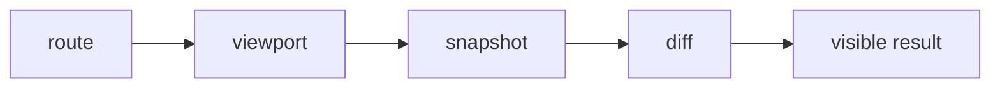

### How it works

1. `route` enters **Visual snapshots** as the value, event, file, or runtime that needs a decision.
2. `viewport` applies the rule owned by this section; keep that decision close to its source boundary.
3. `snapshot` carries the checked result to the next consumer instead of exposing private setup.
4. `diff` receives the result and makes it visible through markup, output, or an exit code.
5. Exercise the normal path and the failure path at the runtime named by the example.

### Project reading

- **Rule:** Read every diff; update snapshots only for an intentional visual change.
- **Failure to catch:** A baseline update hides layout drift, font fallback, or a missing image.
- **Evidence:** tests/visual/*-snapshots and the diff report.
- **Owner:** `Frontend testing / Field Notes` documents the contract; source files and tests remain the executable reference.
- **Scope:** Read this section with the linked source path in the repository catalog below.

### Example

```bash
pnpm run test:visual
pnpm run test:visual:update
```

### Decision table

<table>
  <thead>
    <tr><th>Input</th><th>Project decision</th><th>Check</th></tr>
  </thead>
  <tbody>
    <tr><td>route</td><td>Keep it at the boundary named by the section.</td><td>A focused test or source inspection.</td></tr>
    <tr><td>viewport</td><td>Use the smallest rule that explains the branch.</td><td>Lint, type check, or browser assertion.</td></tr>
    <tr><td>snapshot</td><td>Return a readable value or state.</td><td>Success and failure cases.</td></tr>
    <tr><td>diff</td><td>Expose a semantic or reviewable consumer.</td><td>Role, report, screenshot, or exit code.</td></tr>
  </tbody>
</table>

### Checks

- Inspect the owner for `viewport` before editing the consumer.
- Assert the successful `snapshot` result through the public surface.
- Force the failure branch and confirm it reaches `diff`.
- Record the command and artifact path shown in this guide.

<a id="09--video-journey"></a>
## 09 / Video journey

The video spec records a user journey, then FFmpeg converts the result to an MP4 for review.

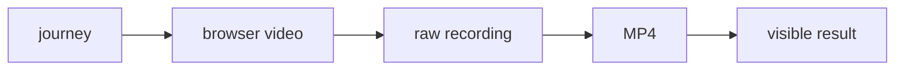

### How it works

1. `journey` enters **Video journey** as the value, event, file, or runtime that needs a decision.
2. `browser video` applies the rule owned by this section; keep that decision close to its source boundary.
3. `raw recording` carries the checked result to the next consumer instead of exposing private setup.
4. `MP4` receives the result and makes it visible through markup, output, or an exit code.
5. Exercise the normal path and the failure path at the runtime named by the example.

### Project reading

- **Rule:** Keep video as review evidence; use assertions for pass or fail decisions.
- **Failure to catch:** A missing FFmpeg binary leaves the test green but the requested artifact absent.
- **Evidence:** test-results/user-journey.mp4.
- **Owner:** `Frontend testing / Field Notes` documents the contract; source files and tests remain the executable reference.
- **Scope:** Read this section with the linked source path in the repository catalog below.

### Example

```bash
pnpm run test:video
pnpm run convert:video
```

### Decision table

<table>
  <thead>
    <tr><th>Input</th><th>Project decision</th><th>Check</th></tr>
  </thead>
  <tbody>
    <tr><td>journey</td><td>Keep it at the boundary named by the section.</td><td>A focused test or source inspection.</td></tr>
    <tr><td>browser video</td><td>Use the smallest rule that explains the branch.</td><td>Lint, type check, or browser assertion.</td></tr>
    <tr><td>raw recording</td><td>Return a readable value or state.</td><td>Success and failure cases.</td></tr>
    <tr><td>MP4</td><td>Expose a semantic or reviewable consumer.</td><td>Role, report, screenshot, or exit code.</td></tr>
  </tbody>
</table>

### Checks

- Inspect the owner for `browser video` before editing the consumer.
- Assert the successful `raw recording` result through the public surface.
- Force the failure branch and confirm it reaches `MP4`.
- Record the command and artifact path shown in this guide.

<a id="10--node-qa-tests"></a>
## 10 / Node QA tests

Node test files exercise file-size, duplication, metric, report, benchmark, and policy scripts without a browser.

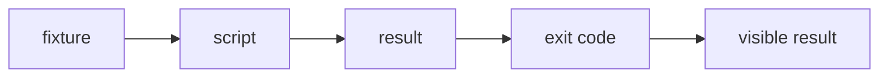

### How it works

1. `fixture` enters **Node QA tests** as the value, event, file, or runtime that needs a decision.
2. `script` applies the rule owned by this section; keep that decision close to its source boundary.
3. `result` carries the checked result to the next consumer instead of exposing private setup.
4. `exit code` receives the result and makes it visible through markup, output, or an exit code.
5. Exercise the normal path and the failure path at the runtime named by the example.

### Project reading

- **Rule:** Test the parser and policy decision separately from the CLI process.
- **Failure to catch:** A report looks right for one fixture but fails on empty, malformed, or missing input.
- **Evidence:** scripts/tests/*.node-test.mjs output.
- **Owner:** `Frontend testing / Field Notes` documents the contract; source files and tests remain the executable reference.
- **Scope:** Read this section with the linked source path in the repository catalog below.

### Example

```bash
pnpm run test:scripts
node --test "scripts/tests/*.node-test.mjs"
```

### Decision table

<table>
  <thead>
    <tr><th>Input</th><th>Project decision</th><th>Check</th></tr>
  </thead>
  <tbody>
    <tr><td>fixture</td><td>Keep it at the boundary named by the section.</td><td>A focused test or source inspection.</td></tr>
    <tr><td>script</td><td>Use the smallest rule that explains the branch.</td><td>Lint, type check, or browser assertion.</td></tr>
    <tr><td>result</td><td>Return a readable value or state.</td><td>Success and failure cases.</td></tr>
    <tr><td>exit code</td><td>Expose a semantic or reviewable consumer.</td><td>Role, report, screenshot, or exit code.</td></tr>
  </tbody>
</table>

### Checks

- Inspect the owner for `script` before editing the consumer.
- Assert the successful `result` result through the public surface.
- Force the failure branch and confirm it reaches `exit code`.
- Record the command and artifact path shown in this guide.

<a id="11--coverage"></a>
## 11 / Coverage

Jest writes text, LCOV, and JSON summary output with a global line threshold of 90 percent.

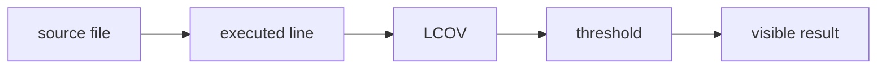

### How it works

1. `source file` enters **Coverage** as the value, event, file, or runtime that needs a decision.
2. `executed line` applies the rule owned by this section; keep that decision close to its source boundary.
3. `LCOV` carries the checked result to the next consumer instead of exposing private setup.
4. `threshold` receives the result and makes it visible through markup, output, or an exit code.
5. Exercise the normal path and the failure path at the runtime named by the example.

### Project reading

- **Rule:** Read missing coverage as a behavior gap, then add a test around the public branch.
- **Failure to catch:** A high percentage leaves an untested error path or a test only checks that a component mounts.
- **Evidence:** coverage/lcov.info and coverage-summary.json.
- **Owner:** `Frontend testing / Field Notes` documents the contract; source files and tests remain the executable reference.
- **Scope:** Read this section with the linked source path in the repository catalog below.

### Example

```bash
pnpm run test:coverage
# coverage/lcov.info
# coverage/coverage-summary.json
```

### Decision table

<table>
  <thead>
    <tr><th>Input</th><th>Project decision</th><th>Check</th></tr>
  </thead>
  <tbody>
    <tr><td>source file</td><td>Keep it at the boundary named by the section.</td><td>A focused test or source inspection.</td></tr>
    <tr><td>executed line</td><td>Use the smallest rule that explains the branch.</td><td>Lint, type check, or browser assertion.</td></tr>
    <tr><td>LCOV</td><td>Return a readable value or state.</td><td>Success and failure cases.</td></tr>
    <tr><td>threshold</td><td>Expose a semantic or reviewable consumer.</td><td>Role, report, screenshot, or exit code.</td></tr>
  </tbody>
</table>

### Checks

- Inspect the owner for `executed line` before editing the consumer.
- Assert the successful `LCOV` result through the public surface.
- Force the failure branch and confirm it reaches `threshold`.
- Record the command and artifact path shown in this guide.

<a id="12--fixtures-and-mocks"></a>
## 12 / Fixtures and mocks

Fixtures make external responses, sessions, timers, and browser APIs repeatable at the test boundary.

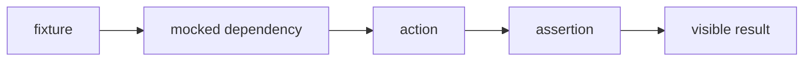

### How it works

1. `fixture` enters **Fixtures and mocks** as the value, event, file, or runtime that needs a decision.
2. `mocked dependency` applies the rule owned by this section; keep that decision close to its source boundary.
3. `action` carries the checked result to the next consumer instead of exposing private setup.
4. `assertion` receives the result and makes it visible through markup, output, or an exit code.
5. Exercise the normal path and the failure path at the runtime named by the example.

### Project reading

- **Rule:** Mock the outside system, not the implementation branch you want to verify.
- **Failure to catch:** A mock returns the answer the component calculates, so the test proves little.
- **Evidence:** Fixture name, mock scope, and cleanup path.
- **Owner:** `Frontend testing / Field Notes` documents the contract; source files and tests remain the executable reference.
- **Scope:** Read this section with the linked source path in the repository catalog below.

### Example

```ts
const response = new Response(JSON.stringify({ status: 'ok' }), {
  status: 200,
  headers: { 'content-type': 'application/json' },
});
```

### Decision table

<table>
  <thead>
    <tr><th>Input</th><th>Project decision</th><th>Check</th></tr>
  </thead>
  <tbody>
    <tr><td>fixture</td><td>Keep it at the boundary named by the section.</td><td>A focused test or source inspection.</td></tr>
    <tr><td>mocked dependency</td><td>Use the smallest rule that explains the branch.</td><td>Lint, type check, or browser assertion.</td></tr>
    <tr><td>action</td><td>Return a readable value or state.</td><td>Success and failure cases.</td></tr>
    <tr><td>assertion</td><td>Expose a semantic or reviewable consumer.</td><td>Role, report, screenshot, or exit code.</td></tr>
  </tbody>
</table>

### Checks

- Inspect the owner for `mocked dependency` before editing the consumer.
- Assert the successful `action` result through the public surface.
- Force the failure branch and confirm it reaches `assertion`.
- Record the command and artifact path shown in this guide.

<a id="13--command-selection"></a>
## 13 / Command selection

The package scripts provide narrow checks, combined suites, coverage, browser matrices, and full release-style runs.

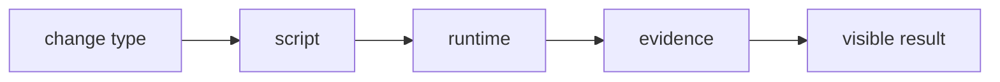

### How it works

1. `change type` enters **Command selection** as the value, event, file, or runtime that needs a decision.
2. `script` applies the rule owned by this section; keep that decision close to its source boundary.
3. `runtime` carries the checked result to the next consumer instead of exposing private setup.
4. `evidence` receives the result and makes it visible through markup, output, or an exit code.
5. Exercise the normal path and the failure path at the runtime named by the example.

### Project reading

- **Rule:** Choose the narrowest command that proves the changed behavior, then expand before merge.
- **Failure to catch:** Every small change runs the slowest command and still misses the relevant browser check.
- **Evidence:** Command recorded in the change note.
- **Owner:** `Frontend testing / Field Notes` documents the contract; source files and tests remain the executable reference.
- **Scope:** Read this section with the linked source path in the repository catalog below.

### Example

```bash
pnpm run test:jest
pnpm run test:vitest
pnpm run test:e2e
pnpm run quality:full
```

### Decision table

<table>
  <thead>
    <tr><th>Input</th><th>Project decision</th><th>Check</th></tr>
  </thead>
  <tbody>
    <tr><td>change type</td><td>Keep it at the boundary named by the section.</td><td>A focused test or source inspection.</td></tr>
    <tr><td>script</td><td>Use the smallest rule that explains the branch.</td><td>Lint, type check, or browser assertion.</td></tr>
    <tr><td>runtime</td><td>Return a readable value or state.</td><td>Success and failure cases.</td></tr>
    <tr><td>evidence</td><td>Expose a semantic or reviewable consumer.</td><td>Role, report, screenshot, or exit code.</td></tr>
  </tbody>
</table>

### Checks

- Inspect the owner for `script` before editing the consumer.
- Assert the successful `runtime` result through the public surface.
- Force the failure branch and confirm it reaches `evidence`.
- Record the command and artifact path shown in this guide.

<a id="14--local-and-ci-parity"></a>
## 14 / Local and CI parity

Frontend QA uses pnpm frozen installs, Node 24, installed browsers, FFmpeg, build, browser suites, Storybook, and Lighthouse. Blog E2E coverage also checks locale-aware post rendering, tag navigation, MDX hydration, and missing-article handling; external media requests are blocked in tests so CI 403s do not become false browser failures.

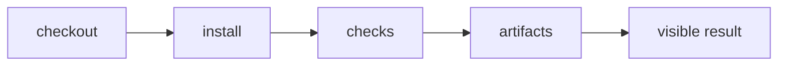

### How it works

1. `checkout` enters **Local and CI parity** as the value, event, file, or runtime that needs a decision.
2. `install` applies the rule owned by this section; keep that decision close to its source boundary.
3. `checks` carries the checked result to the next consumer instead of exposing private setup.
4. `artifacts` receives the result and makes it visible through markup, output, or an exit code.
5. Exercise the normal path and the failure path at the runtime named by the example.

### Project reading

- **Rule:** Use the same runtime and package manager when reproducing a CI failure.
- **Failure to catch:** npm and pnpm resolve different lockfiles or a local browser is missing a CI dependency.
- **Evidence:** Workflow step, local command, and exit code.
- **Owner:** `Frontend testing / Field Notes` documents the contract; source files and tests remain the executable reference.
- **Scope:** Read this section with the linked source path in the repository catalog below.

### Example

```bash
pnpm install --frozen-lockfile
pnpm exec playwright install --with-deps chromium chromium-headless-shell firefox webkit
```

### Decision table

<table>
  <thead>
    <tr><th>Input</th><th>Project decision</th><th>Check</th></tr>
  </thead>
  <tbody>
    <tr><td>checkout</td><td>Keep it at the boundary named by the section.</td><td>A focused test or source inspection.</td></tr>
    <tr><td>install</td><td>Use the smallest rule that explains the branch.</td><td>Lint, type check, or browser assertion.</td></tr>
    <tr><td>checks</td><td>Return a readable value or state.</td><td>Success and failure cases.</td></tr>
    <tr><td>artifacts</td><td>Expose a semantic or reviewable consumer.</td><td>Role, report, screenshot, or exit code.</td></tr>
  </tbody>
</table>

### Checks

- Inspect the owner for `install` before editing the consumer.
- Assert the successful `checks` result through the public surface.
- Force the failure branch and confirm it reaches `artifacts`.
- Record the command and artifact path shown in this guide.

<a id="15--artifacts"></a>
## 15 / Artifacts

Reports make a test result inspectable after the command exits.

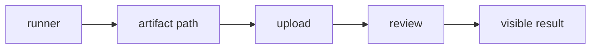

### How it works

1. `runner` enters **Artifacts** as the value, event, file, or runtime that needs a decision.
2. `artifact path` applies the rule owned by this section; keep that decision close to its source boundary.
3. `upload` carries the checked result to the next consumer instead of exposing private setup.
4. `review` receives the result and makes it visible through markup, output, or an exit code.
5. Exercise the normal path and the failure path at the runtime named by the example.

### Project reading

- **Rule:** Name the path before running the check so a missing artifact is a visible failure.
- **Failure to catch:** The command passes but nobody can inspect the failure or visual diff later.
- **Evidence:** JUnit, coverage, Playwright, Lighthouse, Storybook, and video paths.
- **Owner:** `Frontend testing / Field Notes` documents the contract; source files and tests remain the executable reference.
- **Scope:** Read this section with the linked source path in the repository catalog below.

### Example

```text
reports/junit.xml
coverage/
playwright-report/
test-results/
.lighthouseci/
```

### Decision table

<table>
  <thead>
    <tr><th>Input</th><th>Project decision</th><th>Check</th></tr>
  </thead>
  <tbody>
    <tr><td>runner</td><td>Keep it at the boundary named by the section.</td><td>A focused test or source inspection.</td></tr>
    <tr><td>artifact path</td><td>Use the smallest rule that explains the branch.</td><td>Lint, type check, or browser assertion.</td></tr>
    <tr><td>upload</td><td>Return a readable value or state.</td><td>Success and failure cases.</td></tr>
    <tr><td>review</td><td>Expose a semantic or reviewable consumer.</td><td>Role, report, screenshot, or exit code.</td></tr>
  </tbody>
</table>

### Checks

- Inspect the owner for `artifact path` before editing the consumer.
- Assert the successful `upload` result through the public surface.
- Force the failure branch and confirm it reaches `review`.
- Record the command and artifact path shown in this guide.

<a id="16--flaky-test-triage"></a>
## 16 / Flaky test triage

A flaky test needs a reproducible trigger, a controlled dependency, and evidence from the failed run.

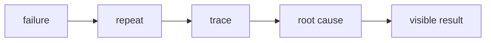

### How it works

1. `failure` enters **Flaky test triage** as the value, event, file, or runtime that needs a decision.
2. `repeat` applies the rule owned by this section; keep that decision close to its source boundary.
3. `trace` carries the checked result to the next consumer instead of exposing private setup.
4. `root cause` receives the result and makes it visible through markup, output, or an exit code.
5. Exercise the normal path and the failure path at the runtime named by the example.

### Project reading

- **Rule:** Fix timing, ownership, or data control instead of adding an unbounded wait.
- **Failure to catch:** Retries turn an intermittent failure green without explaining it.
- **Evidence:** Trace, screenshot, video, repeat count, and smallest reproducer.
- **Owner:** `Frontend testing / Field Notes` documents the contract; source files and tests remain the executable reference.
- **Scope:** Read this section with the linked source path in the repository catalog below.

### Example

```bash
pnpm exec playwright test tests/e2e/navigation.spec.ts --project=chromium-e2e --repeat-each=3
```

### Decision table

<table>
  <thead>
    <tr><th>Input</th><th>Project decision</th><th>Check</th></tr>
  </thead>
  <tbody>
    <tr><td>failure</td><td>Keep it at the boundary named by the section.</td><td>A focused test or source inspection.</td></tr>
    <tr><td>repeat</td><td>Use the smallest rule that explains the branch.</td><td>Lint, type check, or browser assertion.</td></tr>
    <tr><td>trace</td><td>Return a readable value or state.</td><td>Success and failure cases.</td></tr>
    <tr><td>root cause</td><td>Expose a semantic or reviewable consumer.</td><td>Role, report, screenshot, or exit code.</td></tr>
  </tbody>
</table>

### Checks

- Inspect the owner for `repeat` before editing the consumer.
- Assert the successful `trace` result through the public surface.
- Force the failure branch and confirm it reaches `root cause`.
- Record the command and artifact path shown in this guide.

<a id="17--test-review-checklist"></a>
## 17 / Test review checklist

Review tests for behavior, boundary choice, cleanup, deterministic data, and readable evidence.

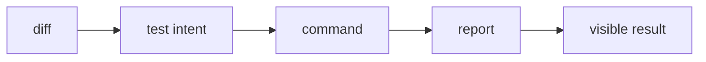

### How it works

1. `diff` enters **Test review checklist** as the value, event, file, or runtime that needs a decision.
2. `test intent` applies the rule owned by this section; keep that decision close to its source boundary.
3. `command` carries the checked result to the next consumer instead of exposing private setup.
4. `report` receives the result and makes it visible through markup, output, or an exit code.
5. Exercise the normal path and the failure path at the runtime named by the example.

### Project reading

- **Rule:** A test name should tell the reader which user-visible contract it protects.
- **Failure to catch:** A test has high line coverage but no clear assertion about the change.
- **Evidence:** Checklist plus the fastest passing command.
- **Owner:** `Frontend testing / Field Notes` documents the contract; source files and tests remain the executable reference.
- **Scope:** Read this section with the linked source path in the repository catalog below.

### Example

```ts
const testReview = ['intent', 'boundary', 'action', 'assertion', 'cleanup'];
```

### Decision table

<table>
  <thead>
    <tr><th>Input</th><th>Project decision</th><th>Check</th></tr>
  </thead>
  <tbody>
    <tr><td>diff</td><td>Keep it at the boundary named by the section.</td><td>A focused test or source inspection.</td></tr>
    <tr><td>test intent</td><td>Use the smallest rule that explains the branch.</td><td>Lint, type check, or browser assertion.</td></tr>
    <tr><td>command</td><td>Return a readable value or state.</td><td>Success and failure cases.</td></tr>
    <tr><td>report</td><td>Expose a semantic or reviewable consumer.</td><td>Role, report, screenshot, or exit code.</td></tr>
  </tbody>
</table>

### Checks

- Inspect the owner for `test intent` before editing the consumer.
- Assert the successful `command` result through the public surface.
- Force the failure branch and confirm it reaches `report`.
- Record the command and artifact path shown in this guide.

<a id="repository-map"></a>
<h1 align="center">
   Repository map
</h1>

The catalog is intentionally concrete. Use it to jump from a concept to the source or test that implements it.

<table>
  <thead>
    <tr><th>Area</th><th>Paths</th><th>Read for</th></tr>
  </thead>
  <tbody>
    <tr><td>Application</td><td>`src/app/`</td><td>Routes, layouts, metadata, and API handlers.</td></tr>
    <tr><td>Components</td><td>`src/components/`</td><td>React composition, effects, UI, and project surfaces.</td></tr>
    <tr><td>Tests</td><td>`tests/` and `src/**/tests/`</td><td>Runner-specific behavior and boundary cases.</td></tr>
    <tr><td>Scripts</td><td>`scripts/tests/` and `scripts/qa/`</td><td>Quality reports, server startup, screenshots, and video conversion.</td></tr>
    <tr><td>Automation</td><td>`.github/workflows/`</td><td>CI triggers, jobs, artifacts, and delivery.</td></tr>
  </tbody>
</table>


<table>
  <thead>
    <tr><th>Path</th><th>Relation to this guide</th><th>Open with</th></tr>
  </thead>
  <tbody>
    <tr><td><code>.github/workflows/ci.yml</code></td><td>Automation or delivery boundary.</td><td>`ci.md` or the workflow job log.</td></tr>
    <tr><td><code>.github/workflows/codeql.yml</code></td><td>Automation or delivery boundary.</td><td>`ci.md` or the workflow job log.</td></tr>
    <tr><td><code>.github/workflows/dependencies.yml</code></td><td>Automation or delivery boundary.</td><td>`ci.md` or the workflow job log.</td></tr>
    <tr><td><code>.github/workflows/deploy.yml</code></td><td>Automation or delivery boundary.</td><td>`ci.md` or the workflow job log.</td></tr>
    <tr><td><code>.github/workflows/docker.yml</code></td><td>Automation or delivery boundary.</td><td>`ci.md` or the workflow job log.</td></tr>
    <tr><td><code>.github/workflows/frontend-qa.yml</code></td><td>Automation or delivery boundary.</td><td>`ci.md` or the workflow job log.</td></tr>
    <tr><td><code>.storybook/main.ts</code></td><td>Application source, typed component, or style rule.</td><td>The nearest test and route.</td></tr>
    <tr><td><code>README.md</code></td><td>Project configuration or documentation entry point.</td><td>The command that consumes it.</td></tr>
    <tr><td><code>jest.config.js</code></td><td>Project configuration or documentation entry point.</td><td>The command that consumes it.</td></tr>
    <tr><td><code>lighthouserc.js</code></td><td>Project configuration or documentation entry point.</td><td>The command that consumes it.</td></tr>
    <tr><td><code>package.json</code></td><td>Project configuration or documentation entry point.</td><td>The command that consumes it.</td></tr>
    <tr><td><code>playwright.config.ts</code></td><td>Application source, typed component, or style rule.</td><td>The nearest test and route.</td></tr>
    <tr><td><code>scripts/qa/capture-lighthouse-screenshots.mjs</code></td><td>QA runtime helper or evidence producer.</td><td>`testing.md` or `qa.md`.</td></tr>
    <tr><td><code>scripts/qa/convert-playwright-video.mjs</code></td><td>QA runtime helper or evidence producer.</td><td>`testing.md` or `qa.md`.</td></tr>
    <tr><td><code>scripts/qa/start-production.mjs</code></td><td>QA runtime helper or evidence producer.</td><td>`testing.md` or `qa.md`.</td></tr>
    <tr><td><code>scripts/tests/benchmark.mjs</code></td><td>Behavior check or test fixture.</td><td>The related source module.</td></tr>
    <tr><td><code>scripts/tests/benchmark.node-test.mjs</code></td><td>Behavior check or test fixture.</td><td>The related source module.</td></tr>
    <tr><td><code>scripts/tests/check-file-size.mjs</code></td><td>Behavior check or test fixture.</td><td>The related source module.</td></tr>
    <tr><td><code>scripts/tests/check-file-size.node-test.mjs</code></td><td>Behavior check or test fixture.</td><td>The related source module.</td></tr>
    <tr><td><code>scripts/tests/file-size-policy.mjs</code></td><td>Behavior check or test fixture.</td><td>The related source module.</td></tr>
    <tr><td><code>scripts/tests/jscpd.mjs</code></td><td>Behavior check or test fixture.</td><td>The related source module.</td></tr>
    <tr><td><code>scripts/tests/jscpd.node-test.mjs</code></td><td>Behavior check or test fixture.</td><td>The related source module.</td></tr>
    <tr><td><code>scripts/tests/quality-metrics.mjs</code></td><td>Behavior check or test fixture.</td><td>The related source module.</td></tr>
    <tr><td><code>scripts/tests/quality-metrics.node-test.mjs</code></td><td>Behavior check or test fixture.</td><td>The related source module.</td></tr>
    <tr><td><code>scripts/tests/quality-policy.mjs</code></td><td>Behavior check or test fixture.</td><td>The related source module.</td></tr>
    <tr><td><code>scripts/tests/quality-report.mjs</code></td><td>Behavior check or test fixture.</td><td>The related source module.</td></tr>
    <tr><td><code>scripts/tests/quality-report.node-test.mjs</code></td><td>Behavior check or test fixture.</td><td>The related source module.</td></tr>
    <tr><td><code>scripts/tests/quality-review.mjs</code></td><td>Behavior check or test fixture.</td><td>The related source module.</td></tr>
    <tr><td><code>scripts/tests/quality-review.node-test.mjs</code></td><td>Behavior check or test fixture.</td><td>The related source module.</td></tr>
    <tr><td><code>scripts/tests/quality-security.mjs</code></td><td>Behavior check or test fixture.</td><td>The related source module.</td></tr>
    <tr><td><code>src/app/[locale]/[...not-found]/page.tsx</code></td><td>Application source, typed component, or style rule.</td><td>The nearest test and route.</td></tr>
    <tr><td><code>src/app/[locale]/about/layout.tsx</code></td><td>Application source, typed component, or style rule.</td><td>The nearest test and route.</td></tr>
    <tr><td><code>src/app/[locale]/about/page.tsx</code></td><td>Application source, typed component, or style rule.</td><td>The nearest test and route.</td></tr>
    <tr><td><code>src/app/[locale]/certifications/layout.tsx</code></td><td>Application source, typed component, or style rule.</td><td>The nearest test and route.</td></tr>
    <tr><td><code>src/app/[locale]/certifications/page.tsx</code></td><td>Application source, typed component, or style rule.</td><td>The nearest test and route.</td></tr>
    <tr><td><code>src/app/[locale]/chat/layout.tsx</code></td><td>Application source, typed component, or style rule.</td><td>The nearest test and route.</td></tr>
    <tr><td><code>src/app/[locale]/chat/page.tsx</code></td><td>Application source, typed component, or style rule.</td><td>The nearest test and route.</td></tr>
    <tr><td><code>src/app/[locale]/contact/layout.tsx</code></td><td>Application source, typed component, or style rule.</td><td>The nearest test and route.</td></tr>
    <tr><td><code>src/app/[locale]/contact/page.tsx</code></td><td>Application source, typed component, or style rule.</td><td>The nearest test and route.</td></tr>
    <tr><td><code>src/app/[locale]/layout.tsx</code></td><td>Application source, typed component, or style rule.</td><td>The nearest test and route.</td></tr>
    <tr><td><code>src/app/[locale]/not-found.tsx</code></td><td>Application source, typed component, or style rule.</td><td>The nearest test and route.</td></tr>
    <tr><td><code>src/app/[locale]/page.tsx</code></td><td>Application source, typed component, or style rule.</td><td>The nearest test and route.</td></tr>
    <tr><td><code>src/app/[locale]/projects/layout.tsx</code></td><td>Application source, typed component, or style rule.</td><td>The nearest test and route.</td></tr>
    <tr><td><code>src/app/[locale]/projects/page.tsx</code></td><td>Application source, typed component, or style rule.</td><td>The nearest test and route.</td></tr>
    <tr><td><code>src/app/[locale]/tests/pages.test.tsx</code></td><td>Behavior check or test fixture.</td><td>The related source module.</td></tr>
    <tr><td><code>src/app/api/auth/[...nextauth]/route.ts</code></td><td>Application source, typed component, or style rule.</td><td>The nearest test and route.</td></tr>
    <tr><td><code>src/app/api/chat/messages/route.ts</code></td><td>Application source, typed component, or style rule.</td><td>The nearest test and route.</td></tr>
    <tr><td><code>src/app/api/github/repos/[owner]/[repo]/readme/route.ts</code></td><td>Application source, typed component, or style rule.</td><td>The nearest test and route.</td></tr>
    <tr><td><code>src/app/api/github/repos/[owner]/[repo]/readme/tests/route.test.ts</code></td><td>Behavior check or test fixture.</td><td>The related source module.</td></tr>
    <tr><td><code>src/app/api/github/repos/route.ts</code></td><td>Application source, typed component, or style rule.</td><td>The nearest test and route.</td></tr>
    <tr><td><code>src/app/api/github/repos/tests/route-branches.test.ts</code></td><td>Behavior check or test fixture.</td><td>The related source module.</td></tr>
    <tr><td><code>src/app/api/github/repos/tests/route.test.ts</code></td><td>Behavior check or test fixture.</td><td>The related source module.</td></tr>
    <tr><td><code>src/app/api/github/stats/route.ts</code></td><td>Application source, typed component, or style rule.</td><td>The nearest test and route.</td></tr>
    <tr><td><code>src/app/api/health/route.ts</code></td><td>Application source, typed component, or style rule.</td><td>The nearest test and route.</td></tr>
    <tr><td><code>src/app/api/tests/uncovered-routes.test.ts</code></td><td>Behavior check or test fixture.</td><td>The related source module.</td></tr>
    <tr><td><code>src/app/api/upload/route.ts</code></td><td>Application source, typed component, or style rule.</td><td>The nearest test and route.</td></tr>
    <tr><td><code>src/app/api/visitors/route.ts</code></td><td>Application source, typed component, or style rule.</td><td>The nearest test and route.</td></tr>
    <tr><td><code>src/app/api/youtube/config/route.ts</code></td><td>Application source, typed component, or style rule.</td><td>The nearest test and route.</td></tr>
    <tr><td><code>src/app/globals.css</code></td><td>Application source, typed component, or style rule.</td><td>The nearest test and route.</td></tr>
    <tr><td><code>src/app/layout.tsx</code></td><td>Application source, typed component, or style rule.</td><td>The nearest test and route.</td></tr>
    <tr><td><code>src/app/page.tsx</code></td><td>Application source, typed component, or style rule.</td><td>The nearest test and route.</td></tr>
    <tr><td><code>src/app/robots.ts</code></td><td>Application source, typed component, or style rule.</td><td>The nearest test and route.</td></tr>
    <tr><td><code>src/app/sitemap.ts</code></td><td>Application source, typed component, or style rule.</td><td>The nearest test and route.</td></tr>
    <tr><td><code>src/app/tests/shell.test.tsx</code></td><td>Behavior check or test fixture.</td><td>The related source module.</td></tr>
    <tr><td><code>src/components/about/AboutParticleField.tsx</code></td><td>Application source, typed component, or style rule.</td><td>The nearest test and route.</td></tr>
    <tr><td><code>src/components/about/AboutScrollStory.tsx</code></td><td>Application source, typed component, or style rule.</td><td>The nearest test and route.</td></tr>
    <tr><td><code>src/components/about/InteractiveExpertiseGrid.tsx</code></td><td>Application source, typed component, or style rule.</td><td>The nearest test and route.</td></tr>
    <tr><td><code>src/components/chat/ChatEffects.tsx</code></td><td>Application source, typed component, or style rule.</td><td>The nearest test and route.</td></tr>
    <tr><td><code>src/components/chat/ChatRoom.tsx</code></td><td>Application source, typed component, or style rule.</td><td>The nearest test and route.</td></tr>
    <tr><td><code>src/components/contact/ClickSpark.tsx</code></td><td>Application source, typed component, or style rule.</td><td>The nearest test and route.</td></tr>
    <tr><td><code>src/components/contact/Contact.tsx</code></td><td>Application source, typed component, or style rule.</td><td>The nearest test and route.</td></tr>
    <tr><td><code>src/components/contact/ContactCommandForm.tsx</code></td><td>Application source, typed component, or style rule.</td><td>The nearest test and route.</td></tr>
    <tr><td><code>src/components/effects/HexagonGrid.tsx</code></td><td>Application source, typed component, or style rule.</td><td>The nearest test and route.</td></tr>
    <tr><td><code>src/components/effects/LetterGlitch.tsx</code></td><td>Application source, typed component, or style rule.</td><td>The nearest test and route.</td></tr>
    <tr><td><code>src/components/effects/MatrixBackground.tsx</code></td><td>Application source, typed component, or style rule.</td><td>The nearest test and route.</td></tr>
    <tr><td><code>src/components/effects/ParticleBackground.tsx</code></td><td>Application source, typed component, or style rule.</td><td>The nearest test and route.</td></tr>
    <tr><td><code>src/components/effects/ScrollEffect.tsx</code></td><td>Application source, typed component, or style rule.</td><td>The nearest test and route.</td></tr>
    <tr><td><code>src/components/effects/ScrollProgress.tsx</code></td><td>Application source, typed component, or style rule.</td><td>The nearest test and route.</td></tr>
    <tr><td><code>src/components/effects/ScrollReveal.tsx</code></td><td>Application source, typed component, or style rule.</td><td>The nearest test and route.</td></tr>
    <tr><td><code>src/components/effects/ScrollVelocityRibbon.tsx</code></td><td>Application source, typed component, or style rule.</td><td>The nearest test and route.</td></tr>
    <tr><td><code>src/components/home/BongoCat.tsx</code></td><td>Application source, typed component, or style rule.</td><td>The nearest test and route.</td></tr>
    <tr><td><code>src/components/home/CapabilityRail.tsx</code></td><td>Application source, typed component, or style rule.</td><td>The nearest test and route.</td></tr>
    <tr><td><code>src/components/home/Hero.tsx</code></td><td>Application source, typed component, or style rule.</td><td>The nearest test and route.</td></tr>
    <tr><td><code>src/components/home/MetricsTicker.tsx</code></td><td>Application source, typed component, or style rule.</td><td>The nearest test and route.</td></tr>
    <tr><td><code>src/components/home/Skills.tsx</code></td><td>Application source, typed component, or style rule.</td><td>The nearest test and route.</td></tr>
    <tr><td><code>src/components/home/TechCarousel.tsx</code></td><td>Application source, typed component, or style rule.</td><td>The nearest test and route.</td></tr>
    <tr><td><code>src/components/home/bongo-cat-styles.ts</code></td><td>Application source, typed component, or style rule.</td><td>The nearest test and route.</td></tr>
    <tr><td><code>src/components/layout/DynamicFavicon.tsx</code></td><td>Application source, typed component, or style rule.</td><td>The nearest test and route.</td></tr>
    <tr><td><code>src/components/layout/LanguageSwitcher.tsx</code></td><td>Application source, typed component, or style rule.</td><td>The nearest test and route.</td></tr>
    <tr><td><code>src/components/layout/Navigation.tsx</code></td><td>Application source, typed component, or style rule.</td><td>The nearest test and route.</td></tr>
    <tr><td><code>src/components/layout/PageTransition.tsx</code></td><td>Application source, typed component, or style rule.</td><td>The nearest test and route.</td></tr>
    <tr><td><code>src/components/layout/PageTransitionOverlay.tsx</code></td><td>Application source, typed component, or style rule.</td><td>The nearest test and route.</td></tr>
    <tr><td><code>src/components/layout/ThemeProvider.tsx</code></td><td>Application source, typed component, or style rule.</td><td>The nearest test and route.</td></tr>
    <tr><td><code>src/components/layout/ThemeToggle.tsx</code></td><td>Application source, typed component, or style rule.</td><td>The nearest test and route.</td></tr>
    <tr><td><code>src/components/layout/page-transition-config.ts</code></td><td>Application source, typed component, or style rule.</td><td>The nearest test and route.</td></tr>
    <tr><td><code>src/components/loading-screen/GameLoadingScreen.css</code></td><td>Application source, typed component, or style rule.</td><td>The nearest test and route.</td></tr>
    <tr><td><code>src/components/loading-screen/GameLoadingScreen.tsx</code></td><td>Application source, typed component, or style rule.</td><td>The nearest test and route.</td></tr>
    <tr><td><code>src/components/loading-screen/LoadingScreenDemo.tsx</code></td><td>Application source, typed component, or style rule.</td><td>The nearest test and route.</td></tr>
    <tr><td><code>src/components/loading-screen/MatrixRain.tsx</code></td><td>Application source, typed component, or style rule.</td><td>The nearest test and route.</td></tr>
    <tr><td><code>src/components/loading-screen/SoloLevelingBoot.tsx</code></td><td>Application source, typed component, or style rule.</td><td>The nearest test and route.</td></tr>
    <tr><td><code>src/components/loading-screen/loadingMessages.ts</code></td><td>Application source, typed component, or style rule.</td><td>The nearest test and route.</td></tr>
    <tr><td><code>src/components/loading-screen/solo-leveling-boot-styles.ts</code></td><td>Application source, typed component, or style rule.</td><td>The nearest test and route.</td></tr>
    <tr><td><code>src/components/media/BackgroundMusic.tsx</code></td><td>Application source, typed component, or style rule.</td><td>The nearest test and route.</td></tr>
    <tr><td><code>src/components/projects/CityMap.tsx</code></td><td>Application source, typed component, or style rule.</td><td>The nearest test and route.</td></tr>
    <tr><td><code>src/components/projects/GitHubProjects.tsx</code></td><td>Application source, typed component, or style rule.</td><td>The nearest test and route.</td></tr>
    <tr><td><code>src/components/projects/ImageSlideshow.tsx</code></td><td>Application source, typed component, or style rule.</td><td>The nearest test and route.</td></tr>
    <tr><td><code>src/components/projects/LivePreview.tsx</code></td><td>Application source, typed component, or style rule.</td><td>The nearest test and route.</td></tr>
    <tr><td><code>src/components/projects/ProjectCardParts.tsx</code></td><td>Application source, typed component, or style rule.</td><td>The nearest test and route.</td></tr>
    <tr><td><code>src/components/projects/ProjectReadmeModal.tsx</code></td><td>Application source, typed component, or style rule.</td><td>The nearest test and route.</td></tr>
    <tr><td><code>src/components/projects/SoloLevelingProjectCard.tsx</code></td><td>Application source, typed component, or style rule.</td><td>The nearest test and route.</td></tr>
  </tbody>
</table>

<a id="command-matrix"></a>
<h1 align="center">
   Command matrix
</h1>

<table>
  <thead>
    <tr><th>Command</th><th>Script</th><th>Proof</th></tr>
  </thead>
  <tbody>
    <tr><td>Suite</td><td>`pnpm test`</td><td>Jest, Vitest, Browser Mode, Playwright</td></tr>
    <tr><td>Full</td><td>`pnpm run full:tests`</td><td>Suite, scripts, video</td></tr>
    <tr><td>Coverage</td><td>`pnpm run test:coverage`</td><td>LCOV and JUnit</td></tr>
    <tr><td>Release</td><td>`pnpm run quality:full`</td><td>Static, tests, quality, build</td></tr>
  </tbody>
</table>

### Command rules

- Use `pnpm` locally when the change is covered by the pnpm lockfile.
- Run `pnpm run docs:check` after changing any guide or README link.
- Use the exact workflow command when reproducing CI.
- Keep snapshot updates explicit and review the diff.
- Run the build before browser checks that depend on production output.
- Record failures with the exit code and artifact path.

<a id="evidence-and-troubleshooting"></a>
<h1 align="center">
   Evidence and troubleshooting
</h1>

<table>
  <thead>
    <tr><th>Symptom</th><th>First inspection</th><th>Next command</th></tr>
  </thead>
  <tbody>
    <tr><td>Compiler error</td><td>`tsconfig.json` and the first diagnostic</td><td>`pnpm exec tsc --noEmit`</td></tr>
    <tr><td>Test not found</td><td>Runner include pattern and test path</td><td>`pnpm run test:scripts` or the runner command</td></tr>
    <tr><td>Browser startup</td><td>Installed browser and server URL</td><td>`pnpm exec playwright install --with-deps chromium`</td></tr>
    <tr><td>Visual diff</td><td>Font, viewport, theme, and animated layer</td><td>`pnpm run test:visual`</td></tr>
    <tr><td>Missing report</td><td>Output path and upload step</td><td>`find reports coverage playwright-report test-results .lighthouseci -maxdepth 2 -type f`</td></tr>
    <tr><td>CI-only failure</td><td>Node, package manager, env, and browser matrix</td><td>Copy the workflow command locally</td></tr>
  </tbody>
</table>

### Evidence record

- Command: `<exact command>`
- Input: `<changed path or fixture>`
- Result: `<literal summary>`
- Exit code: `<0 or failure code>`
- Artifact: `<path or none>`
- Follow-up: `<source fix, test fix, or environment fix>`

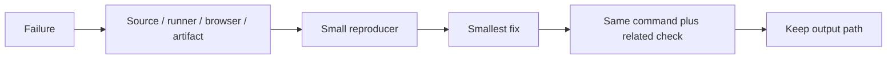

### Stop conditions

- Stop changing source when the failure is a missing runtime dependency.
- Stop updating snapshots when the diff has an unexplained content change.
- Stop widening types when the input has no runtime guard.
- Stop adding waits when the test has an ownership or cleanup bug.
- Stop after the requested behavior and rollback path have a passing check.

<a id="17--skill-and-media-regressions"></a>
<h1 align="center">
   Skill and media regressions
</h1>

The new behavior crosses a button, a fetch result, a matcher, a scroll container, and three preview surfaces. Tests keep each decision close to its failure mode.

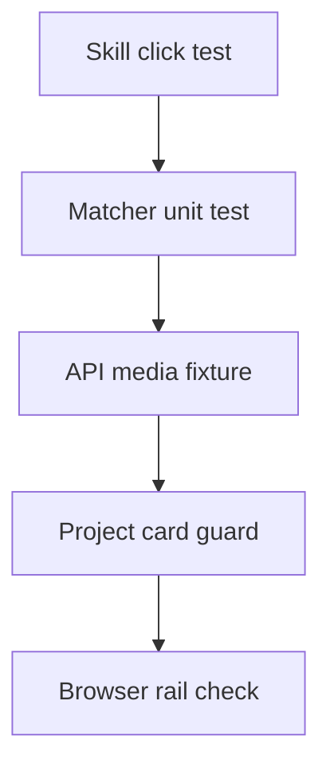

### How it works

- Jest checks the expertise button emits the selected label.
- Matcher tests cover aliases, metadata, and empty results without rendering React.
- Route tests use README fixtures labelled `Demonstration` and `Demonstração` with image extensions.
- Project card tests pass stale `isVideo: true` metadata with `.png` and assert image rendering.
- Browser checks confirm the rail exists after a skill selection and remains keyboard-focusable.

### Project reading

| Failure | Smallest check |
|---|---|
| Button stops emitting | `InteractiveExpertiseGrid.test.tsx` |
| Wrong project set | `matchProjectsToSkill.test.ts` |
| Image becomes video | `route-branches.test.ts` and `component-depth.test.tsx` |
| Rail does not appear | About browser flow |

### Checks

- Run `pnpm exec jest --runInBand`.
- Run `pnpm run test:vitest` and `pnpm run test:browser`.
- Run the project route tests after changing media regexes.
- Run a production browser smoke check after changing dynamic imports.
- Record the selected skill, matched names, media element, and exit code.

<a id="18--hydration-regression-checks"></a>
<h1 align="center">
   Hydration regression checks
</h1>

Hydration tests target the first client render. They verify deterministic theme output, extension protection, and clean route teardown instead of asserting only that a page eventually becomes visible.

```mermaid
flowchart LR
    SSR[Server markup] --> FIRST[First client render]
    FIRST --> THEME[Hydrated theme update]
    FIRST --> LOCK[Extension lock present]
    THEME --> SMOKE[Browser smoke]
    LOCK --> SMOKE
    SMOKE --> CLEAN[No console or page errors]
```

### How it works

- Shell tests assert the locale layout includes `darkreader-lock`.
- Navigation tests cover rendered links after the hydration snapshot is available.
- Chromium smoke tests capture both console errors and uncaught page errors.
- A `finishedRoot.parentNode` failure requires a DOM mutation audit before adding waits or suppressing warnings.

### Checks

- Run `npx jest src/app/tests/shell.test.tsx src/components/tests/Navigation.test.tsx --runInBand`.
- Run `npx playwright test tests/e2e/smoke.spec.ts --project=chromium-e2e`.
- Test with the theme extension disabled, then reload with the standard lock present.
- Treat a clean build plus clean browser console as the acceptance pair.

<a id="19--gif-and-video-transition-checks"></a>
<h1 align="center">
   GIF and video transition checks
</h1>

The manga transition test covers both media branches. It starts `/about`, waits for the cover overlay, then counts three video nodes and three GIF image nodes inside the six panel wrappers.

```mermaid
flowchart LR
    CLICK[Click /about] --> OVERLAY[Cover overlay]
    OVERLAY --> COUNT[Count six panels]
    COUNT --> MP4[Count three video nodes]
    COUNT --> GIF[Count three image nodes]
    MP4 --> PASS[Pass]
    GIF --> PASS
```

### Test contract

- `MOSAIC_VIDEOS` must contain at least one MP4 path.
- `MOSAIC_GIFS` must contain at least one `.gif` path under `/images/gifs/`.
- The overlay must keep six panels and alternate video/GIF media.
- GIF panels use native ``; video panels keep autoplay, mute, loop, inline playback, and eager preload.
- CSS and route timing stay outside the media assertion, so a timing failure remains easy to identify.

### Commands

```bash
npx jest src/components/tests/page-transition.test.tsx --runInBand
npx tsc --noEmit
pnpm run lint
```

Run the production smoke test after changing public asset names. A passing jsdom test proves element selection; browser smoke proves requests and runtime paint.

<a id="references"></a>
<h1 align="center">
   References
</h1>

- https://jestjs.io/docs/getting-started
- https://testing-library.com/docs/react-testing-library/intro/
- https://vitest.dev/guide/
- https://playwright.dev/docs/intro
- [Project README](../README.md)
- [Package scripts](../package.json)
- [GitHub Actions workflows](../.github/workflows/)

<details>
  <summary>Review checklist</summary>

- [ ] Source owner is named.
- [ ] Runtime boundary is named.
- [ ] Success and failure states are described.
- [ ] Example matches current project syntax.
- [ ] Focused check ran.
- [ ] Related browser or quality check ran.
- [ ] Evidence path is recorded.
- [ ] README link resolves.

</details>

---
