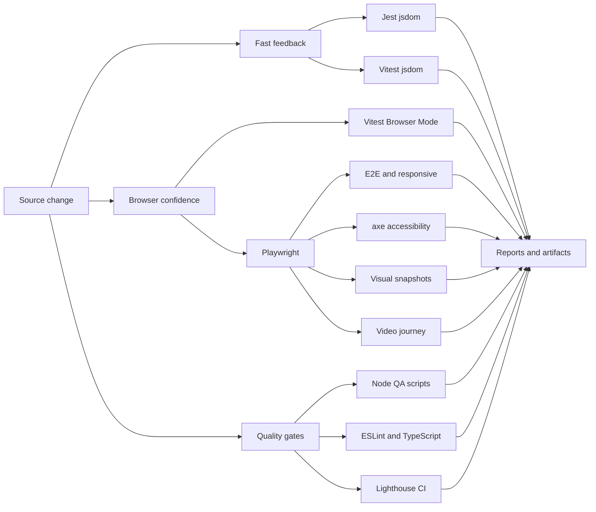

<div align="center">

<h1 align="center">
  
  Frontend QA
</h1>

Practical guide to the portfolio test stack, local commands, CI parity, and reviewable evidence.

<a href="../README.md">README</a> · <a href="../test.md">Full test report</a> · <a href="../package.json">Scripts</a>

</div>

---

<h1 align="center">
   Test Stack
</h1>

<p align="center">
  
</p>

<table>
  <thead>
    <tr><th>Tool</th><th>What we use it for</th><th>Primary input</th></tr>
  </thead>
  <tbody>
    <tr><td>Jest + React Testing Library</td><td>Existing component, hook, route, and utility behavior in jsdom.</td><td><code>tests/**/*.test.[jt]s?(x)</code></td></tr>
    <tr><td>Vitest</td><td>Focused React behavior with a fast Vite-powered jsdom runner.</td><td><code>tests/vitest/**/*.spec.{ts,tsx}</code></td></tr>
    <tr><td>Vitest Browser Mode</td><td>One focused component check against real Chromium DOM behavior.</td><td><code>tests/browser/**/*.spec.{ts,tsx}</code></td></tr>
    <tr><td>Playwright</td><td>Real-browser E2E, responsive, accessibility, visual, and video checks.</td><td><code>tests/{e2e,accessibility,visual,video}/</code></td></tr>
    <tr><td>Node test runner</td><td>QA and quality-script behavior without a browser.</td><td><code>scripts/tests/*.node-test.mjs</code></td></tr>
    <tr><td>Storybook + axe</td><td>Inspectable component states and manual accessibility review.</td><td><code>.storybook/</code> and stories</td></tr>
    <tr><td>Lighthouse CI</td><td>Built-app performance, accessibility, best-practice, and SEO audit.</td><td><code>lighthouserc.js</code></td></tr>
  </tbody>
</table>

<p>
  Jest remains the broad repository suite. Vitest owns new focused tests. Playwright owns behavior that needs a real browser, stable page states, or visual evidence. This split keeps fast feedback local while reserving browser cost for user-visible behavior.
</p>

<h1 align="center">
   Version Baseline
</h1>

Versions come from <a href="../package.json"><code>package.json</code></a> and <a href="../pnpm-lock.yaml"><code>pnpm-lock.yaml</code></a>. CI runtime values come from <a href="../.github/workflows/frontend-qa.yml"><code>frontend-qa.yml</code></a>.

<table>
  <thead>
    <tr><th>Area</th><th>Version</th><th>Source</th></tr>
  </thead>
  <tbody>
    <tr><td>Package manager</td><td>pnpm 11.9.0</td><td><code>packageManager</code> and CI setup</td></tr>
    <tr><td>CI runtime</td><td>Node.js 24</td><td>Frontend QA and main CI workflows</td></tr>
    <tr><td>Application</td><td>Next.js 16.3.3 · React 19.2.8</td><td>Production dependencies</td></tr>
    <tr><td>Unit / component</td><td>Jest 30.5.0 · Testing Library 16.3.3</td><td>Dev dependencies</td></tr>
    <tr><td>Focused / browser</td><td>Vitest 4.1.11 · Playwright 1.62.1</td><td>Dev dependencies</td></tr>
    <tr><td>Accessibility</td><td>@axe-core/playwright 4.13.0</td><td>Dev dependency</td></tr>
    <tr><td>Component review</td><td>Storybook 10.5.10</td><td>Dev dependencies</td></tr>
    <tr><td>Static quality</td><td>TypeScript 5.9.3 · ESLint 10.9.1</td><td>Dev dependencies</td></tr>
  </tbody>
</table>

<h1 align="center">
   Test Flow
</h1>



<h1 align="center">
   Commands
</h1>

<table>
  <thead>
    <tr><th>Command</th><th>Runs</th><th>Use when</th></tr>
  </thead>
  <tbody>
    <tr><td><code>pnpm test</code></td><td>Jest, Vitest, Browser Mode, local Playwright matrix</td><td>Normal local change validation</td></tr>
    <tr><td><code>pnpm full:tests</code></td><td><code>pnpm test</code> + Node QA + video conversion</td><td>Release-style local evidence</td></tr>
    <tr><td><code>pnpm run test:jest</code></td><td>Jest in band</td><td>Components, hooks, routes, utilities</td></tr>
    <tr><td><code>pnpm run test:vitest</code></td><td>Vitest jsdom suite</td><td>Focused React behavior</td></tr>
    <tr><td><code>pnpm run test:browser</code></td><td>Vitest Browser Mode in Chromium</td><td>Browser-only DOM behavior</td></tr>
    <tr><td><code>pnpm run test:e2e</code></td><td>Chromium, mobile Chromium, Firefox</td><td>Navigation, smoke, projects, responsive paths</td></tr>
    <tr><td><code>pnpm run test:accessibility</code></td><td>axe checks in Chromium</td><td>Accessibility regression checks</td></tr>
    <tr><td><code>pnpm run test:visual</code></td><td>Chromium visual snapshots</td><td>Compare stable page and region states</td></tr>
    <tr><td><code>pnpm run test:visual:update</code></td><td>Regenerates Chromium baselines</td><td>Intentional visual change after diff review</td></tr>
    <tr><td><code>pnpm run test:playwright:all</code></td><td>All configured Playwright projects, including WebKit and video</td><td>CI-equivalent browser coverage</td></tr>
    <tr><td><code>pnpm run test:lighthouse</code></td><td>Production build + Lighthouse CI</td><td>Performance and web-quality audit</td></tr>
  </tbody>
</table>

`pnpm run test:visual:update` is the only snapshot-update command. Normal test runs do not rewrite baselines.

<blockquote>
  <strong>Lighthouse is a separate audit.</strong> <code>package.json</code> defines <code>test:lighthouse</code> as <code>pnpm run build &amp;&amp; lhci autorun</code>. It is not included in <code>test</code> or <code>full:tests</code>; run it explicitly when the production build needs performance, accessibility, best-practice, or SEO verification. CI runs the same audit after its build step.
</blockquote>

<h1 align="center">
   Browser Configuration
</h1>

- Desktop viewport: `1366 × 768`.
- Mobile viewport: `390 × 844` using the Pixel 5 device profile.
- Browser locale: `en-US`; timezone: `UTC`; color scheme: dark.
- Service workers are blocked for deterministic test runs.
- Screenshots are captured on failure. CI keeps first-retry traces and failure video.
- CI installs Chromium, Firefox, WebKit, and FFmpeg. Local runs need FFmpeg only for `test:video`.

<details>
  <summary><strong>Test file layout</strong></summary>

```text
src/**/tests/                  Jest tests beside the owned source area
tests/vitest/                  Vitest jsdom component tests
tests/browser/                 Vitest Browser Mode tests
tests/e2e/                     Playwright user journeys
tests/accessibility/           Playwright + axe checks
tests/visual/                  Playwright page and region snapshots
tests/video/                   Recorded Playwright journey
scripts/tests/*.node-test.mjs  Node QA and quality-script tests
```
</details>

<h1 align="center">
   Evidence
</h1>

| Artifact | Contents |
| --- | --- |
| `reports/junit.xml` | Jest test results for CI and quality reporting |
| `coverage/` | Jest text, LCOV, and JSON coverage output |
| `playwright-report/` | HTML browser report |
| `test-results/` | Traces, screenshots, WebM, and MP4 journey output |
| `.vitest-attachments/` | Vitest Browser Mode screenshots |
| `docs/assets/testing/lighthouse/` | Full-page PNG screenshots of each Lighthouse HTML report |
| `storybook-static/` | Reproducible Storybook build |
| `.lighthouseci/` | Lighthouse CI reports |

Open browser reports with:

```bash
pnpm exec playwright show-report
pnpm exec playwright show-trace test-results/<trace>.zip
```

<h1 align="center">
   CI Parity
</h1>

The <a href="../.github/workflows/frontend-qa.yml">Frontend QA workflow</a> installs the frozen pnpm lockfile, Node.js 24, all Playwright browsers, and FFmpeg. It runs lint, type checking, Jest, Vitest, Browser Mode, the production build, the complete Playwright matrix, Storybook, and Lighthouse CI. After Lighthouse writes its HTML reports, CI captures those report pages and uploads browser, audit, and screenshot artifacts for seven days.

Screenshot the generated Lighthouse HTML reports for the same six endpoints:

```bash
pnpm run test:lighthouse
```

The command builds the app, runs Lighthouse, then opens the latest `.lighthouseci/*.report.html` file for each endpoint with Chromium and captures the whole report page. It writes `docs/assets/testing/lighthouse/*-full.png` plus `sources.json`. Use `pnpm run test:lighthouse:screenshots` only to recapture screenshots from an existing Lighthouse run.

The main CI workflow also runs npm-based lint, type checking, tests, and build jobs. Keep `package-lock.json` and `pnpm-lock.yaml` synchronized when dependencies change.

<h1 align="center">
   References
</h1>

- [Jest](https://jestjs.io/docs/getting-started) · [React Testing Library](https://testing-library.com/docs/react-testing-library/intro/)
- [Vitest](https://vitest.dev/guide/) · [Vitest Browser Mode](https://vitest.dev/guide/browser/)
- [Playwright](https://playwright.dev/docs/intro) · [Playwright accessibility testing](https://playwright.dev/docs/accessibility-testing)
- [Storybook testing](https://storybook.js.org/docs/writing-tests) · [Lighthouse CI](https://github.com/GoogleChrome/lighthouse-ci/blob/main/docs/getting-started.md)
- [Node.js test runner](https://nodejs.org/api/test.html) · [pnpm](https://pnpm.io/)

See [test.md](../test.md) for the full matrix, diagrams, screenshot evidence, recorded journey, and repository verification snapshot.
