<div align="center">

<h1 align="center">
  
  TypeScript / Field Notes
</h1>

Types, runtime boundaries, and typed source flow in this portfolio.

<a href="react.md">React docs</a>  <a href="jsx.md">JSX docs</a>  <a href="../README.md">README</a>  <a href="../tsconfig.json">tsconfig</a>

</div>

---
<p align="center">
  
  
  
  
  
</p>

<table>
  <thead>
    <tr><th>Topic</th><th>Project baseline</th><th>Use it for</th></tr>
  </thead>
  <tbody>
    <tr><td>Compiler</td><td>TypeScript 5.9.x</td><td>Strict checks before runtime.</td></tr>
    <tr><td>Mode</td><td>strict + noEmit</td><td>Types stay in source; build emits app output.</td></tr>
    <tr><td>Boundary</td><td>unknown + guards</td><td>External values become domain data after checks.</td></tr>
    <tr><td>Alias</td><td>@/* -> src/*</td><td>Imports remain stable across app and tests.</td></tr>
  </tbody>
</table>

## Contents

- [01 / Contract boundaries](#01--contract-boundaries)
- [02 / Compiler baseline](#02--compiler-baseline)
- [03 / State unions](#03--state-unions)
- [04 / Generics](#04--generics)
- [05 / Function contracts](#05--function-contracts)
- [06 / React props](#06--react-props)
- [07 / Route data](#07--route-data)
- [08 / Async errors](#08--async-errors)
- [09 / Readonly data](#09--readonly-data)
- [10 / Narrowing](#10--narrowing)
- [11 / Module boundaries](#11--module-boundaries)
- [12 / Internationalization types](#12--internationalization-types)
- [13 / Test types](#13--test-types)
- [14 / Lint and type checks](#14--lint-and-type-checks)
- [15 / Refactoring signals](#15--refactoring-signals)
- [16 / Troubleshooting types](#16--troubleshooting-types)
- [17 / Review checklist](#17--review-checklist)
- [18 / Type glossary](#18--type-glossary)
- [19 / Project matching contract](#19--project-matching-contract)
- [Repository map](#repository-map)
- [Command matrix](#command-matrix)
- [Evidence and troubleshooting](#evidence-and-troubleshooting)
- [References](#references)

<h1 align="center">
   Operating model
</h1>

This guide explains **TypeScript / Field Notes** through the source tree, the runtime boundary, the smallest useful test, and the evidence a reviewer can inspect.

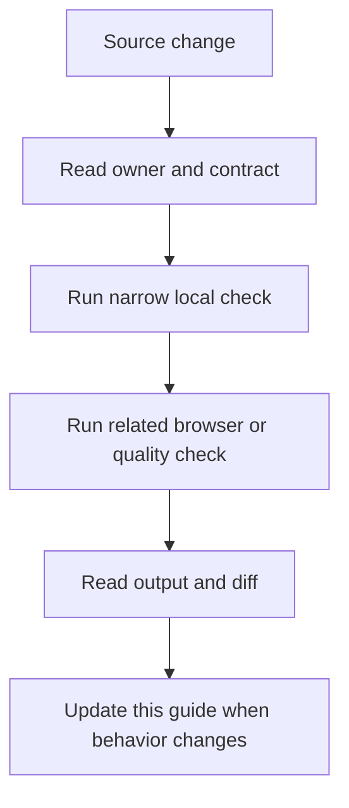

### Reading order

- Start at the section for the changed file or runtime.
- Copy the narrow command before running the broad suite.
- Check the failure branch and the evidence path.
- Compare README links after editing any docs entry point.

<a id="01--contract-boundaries"></a>
## 01 / Contract boundaries

TypeScript describes values as they move between files, browser APIs, route handlers, and components.

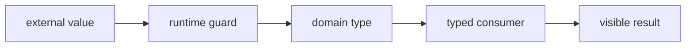

### How it works

1. `external value` enters **Contract boundaries** as the value, event, file, or runtime that needs a decision.
2. `runtime guard` applies the rule owned by this section; keep that decision close to its source boundary.
3. `domain type` carries the checked result to the next consumer instead of exposing private setup.
4. `typed consumer` receives the result and makes it visible through markup, output, or an exit code.
5. Exercise the normal path and the failure path at the runtime named by the example.

### Project reading

- **Rule:** Start external data as unknown and narrow it before domain code sees it.
- **Failure to catch:** An assertion hides an invalid response until a render or API branch fails.
- **Evidence:** A focused guard test and a named failure branch.
- **Owner:** `TypeScript / Field Notes` documents the contract; source files and tests remain the executable reference.
- **Scope:** Read this section with the linked source path in the repository catalog below.

### Example

```ts
type Repo = { name: string; html_url: string };
function isRepo(value: unknown): value is Repo {
  return typeof value === 'object' && value !== null
    && typeof (value as Record<string, unknown>).name === 'string'
    && typeof (value as Record<string, unknown>).html_url === 'string';
}
```

### Decision table

<table>
  <thead>
    <tr><th>Input</th><th>Project decision</th><th>Check</th></tr>
  </thead>
  <tbody>
    <tr><td>external value</td><td>Keep it at the boundary named by the section.</td><td>A focused test or source inspection.</td></tr>
    <tr><td>runtime guard</td><td>Use the smallest rule that explains the branch.</td><td>Lint, type check, or browser assertion.</td></tr>
    <tr><td>domain type</td><td>Return a readable value or state.</td><td>Success and failure cases.</td></tr>
    <tr><td>typed consumer</td><td>Expose a semantic or reviewable consumer.</td><td>Role, report, screenshot, or exit code.</td></tr>
  </tbody>
</table>

### Checks

- Inspect the owner for `runtime guard` before editing the consumer.
- Assert the successful `domain type` result through the public surface.
- Force the failure branch and confirm it reaches `typed consumer`.
- Record the command and artifact path shown in this guide.

<a id="02--compiler-baseline"></a>
## 02 / Compiler baseline

The repository uses strict checks, no emitted JavaScript, ES2022 syntax, bundler resolution, and the @/* source alias.

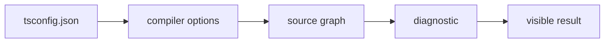

### How it works

1. `tsconfig.json` enters **Compiler baseline** as the value, event, file, or runtime that needs a decision.
2. `compiler options` applies the rule owned by this section; keep that decision close to its source boundary.
3. `source graph` carries the checked result to the next consumer instead of exposing private setup.
4. `diagnostic` receives the result and makes it visible through markup, output, or an exit code.
5. Exercise the normal path and the failure path at the runtime named by the example.

### Project reading

- **Rule:** Read tsconfig before adding a type pattern because compiler options decide which patterns are legal.
- **Failure to catch:** A file passes a local editor check but fails the project compiler or resolves an alias differently.
- **Evidence:** The exact tsc command, exit code, and changed file list.
- **Owner:** `TypeScript / Field Notes` documents the contract; source files and tests remain the executable reference.
- **Scope:** Read this section with the linked source path in the repository catalog below.

### Example

```ts
const options = {
  strict: true,
  noEmit: true,
  moduleResolution: 'bundler',
  jsx: 'react-jsx',
};
```

### Decision table

<table>
  <thead>
    <tr><th>Input</th><th>Project decision</th><th>Check</th></tr>
  </thead>
  <tbody>
    <tr><td>tsconfig.json</td><td>Keep it at the boundary named by the section.</td><td>A focused test or source inspection.</td></tr>
    <tr><td>compiler options</td><td>Use the smallest rule that explains the branch.</td><td>Lint, type check, or browser assertion.</td></tr>
    <tr><td>source graph</td><td>Return a readable value or state.</td><td>Success and failure cases.</td></tr>
    <tr><td>diagnostic</td><td>Expose a semantic or reviewable consumer.</td><td>Role, report, screenshot, or exit code.</td></tr>
  </tbody>
</table>

### Checks

- Inspect the owner for `compiler options` before editing the consumer.
- Assert the successful `source graph` result through the public surface.
- Force the failure branch and confirm it reaches `diagnostic`.
- Record the command and artifact path shown in this guide.

<a id="03--state-unions"></a>
## 03 / State unions

Finite state unions make loading, success, empty, and error branches visible to every caller.

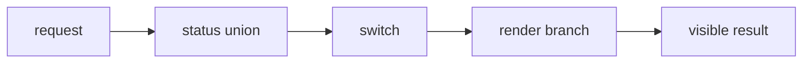

### How it works

1. `request` enters **State unions** as the value, event, file, or runtime that needs a decision.
2. `status union` applies the rule owned by this section; keep that decision close to its source boundary.
3. `switch` carries the checked result to the next consumer instead of exposing private setup.
4. `render branch` receives the result and makes it visible through markup, output, or an exit code.
5. Exercise the normal path and the failure path at the runtime named by the example.

### Project reading

- **Rule:** Use a discriminant such as status instead of several booleans that can disagree.
- **Failure to catch:** loading and error both render, or success renders with missing data.
- **Evidence:** A test for every discriminant plus an exhaustive switch.
- **Owner:** `TypeScript / Field Notes` documents the contract; source files and tests remain the executable reference.
- **Scope:** Read this section with the linked source path in the repository catalog below.

### Example

```ts
type LoadState<T> =
  | { status: 'idle' }
  | { status: 'loading' }
  | { status: 'success'; data: T }
  | { status: 'error'; message: string };
```

### Decision table

<table>
  <thead>
    <tr><th>Input</th><th>Project decision</th><th>Check</th></tr>
  </thead>
  <tbody>
    <tr><td>request</td><td>Keep it at the boundary named by the section.</td><td>A focused test or source inspection.</td></tr>
    <tr><td>status union</td><td>Use the smallest rule that explains the branch.</td><td>Lint, type check, or browser assertion.</td></tr>
    <tr><td>switch</td><td>Return a readable value or state.</td><td>Success and failure cases.</td></tr>
    <tr><td>render branch</td><td>Expose a semantic or reviewable consumer.</td><td>Role, report, screenshot, or exit code.</td></tr>
  </tbody>
</table>

### Checks

- Inspect the owner for `status union` before editing the consumer.
- Assert the successful `switch` result through the public surface.
- Force the failure branch and confirm it reaches `render branch`.
- Record the command and artifact path shown in this guide.

<a id="04--generics"></a>
## 04 / Generics

Generics preserve a relationship between an input and its output without widening the result to any.

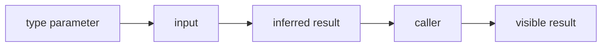

### How it works

1. `type parameter` enters **Generics** as the value, event, file, or runtime that needs a decision.
2. `input` applies the rule owned by this section; keep that decision close to its source boundary.
3. `inferred result` carries the checked result to the next consumer instead of exposing private setup.
4. `caller` receives the result and makes it visible through markup, output, or an exit code.
5. Exercise the normal path and the failure path at the runtime named by the example.

### Project reading

- **Rule:** Add a generic when the same operation keeps a value relationship across several data shapes.
- **Failure to catch:** A helper returns a broad type and every consumer adds a second assertion.
- **Evidence:** An inference test that checks both a valid and an invalid call.
- **Owner:** `TypeScript / Field Notes` documents the contract; source files and tests remain the executable reference.
- **Scope:** Read this section with the linked source path in the repository catalog below.

### Example

```ts
function first<T>(items: readonly T[]): T | undefined {
  return items[0];
}
const firstName = first(['home', 'projects']);
```

### Decision table

<table>
  <thead>
    <tr><th>Input</th><th>Project decision</th><th>Check</th></tr>
  </thead>
  <tbody>
    <tr><td>type parameter</td><td>Keep it at the boundary named by the section.</td><td>A focused test or source inspection.</td></tr>
    <tr><td>input</td><td>Use the smallest rule that explains the branch.</td><td>Lint, type check, or browser assertion.</td></tr>
    <tr><td>inferred result</td><td>Return a readable value or state.</td><td>Success and failure cases.</td></tr>
    <tr><td>caller</td><td>Expose a semantic or reviewable consumer.</td><td>Role, report, screenshot, or exit code.</td></tr>
  </tbody>
</table>

### Checks

- Inspect the owner for `input` before editing the consumer.
- Assert the successful `inferred result` result through the public surface.
- Force the failure branch and confirm it reaches `caller`.
- Record the command and artifact path shown in this guide.

<a id="05--function-contracts"></a>
## 05 / Function contracts

Explicit parameters, return values, and error behavior make helpers easy to call and easy to test.

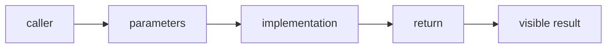

### How it works

1. `caller` enters **Function contracts** as the value, event, file, or runtime that needs a decision.
2. `parameters` applies the rule owned by this section; keep that decision close to its source boundary.
3. `implementation` carries the checked result to the next consumer instead of exposing private setup.
4. `return` receives the result and makes it visible through markup, output, or an exit code.
5. Exercise the normal path and the failure path at the runtime named by the example.

### Project reading

- **Rule:** Name the input and output at the function boundary; keep implementation details inside.
- **Failure to catch:** A caller depends on an accidental return shape or a thrown string.
- **Evidence:** A direct test for the happy path and the returned failure value.
- **Owner:** `TypeScript / Field Notes` documents the contract; source files and tests remain the executable reference.
- **Scope:** Read this section with the linked source path in the repository catalog below.

### Example

```ts
function labelCount(count: number): string {
  return count === 1 ? '1 item' : `${count} items`;
}
```

### Decision table

<table>
  <thead>
    <tr><th>Input</th><th>Project decision</th><th>Check</th></tr>
  </thead>
  <tbody>
    <tr><td>caller</td><td>Keep it at the boundary named by the section.</td><td>A focused test or source inspection.</td></tr>
    <tr><td>parameters</td><td>Use the smallest rule that explains the branch.</td><td>Lint, type check, or browser assertion.</td></tr>
    <tr><td>implementation</td><td>Return a readable value or state.</td><td>Success and failure cases.</td></tr>
    <tr><td>return</td><td>Expose a semantic or reviewable consumer.</td><td>Role, report, screenshot, or exit code.</td></tr>
  </tbody>
</table>

### Checks

- Inspect the owner for `parameters` before editing the consumer.
- Assert the successful `implementation` result through the public surface.
- Force the failure branch and confirm it reaches `return`.
- Record the command and artifact path shown in this guide.

<a id="06--react-props"></a>
## 06 / React props

Component props are public APIs. Type them around intent, children, optional variation, and event callbacks.

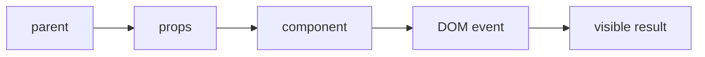

### How it works

1. `parent` enters **React props** as the value, event, file, or runtime that needs a decision.
2. `props` applies the rule owned by this section; keep that decision close to its source boundary.
3. `component` carries the checked result to the next consumer instead of exposing private setup.
4. `DOM event` receives the result and makes it visible through markup, output, or an exit code.
5. Exercise the normal path and the failure path at the runtime named by the example.

### Project reading

- **Rule:** Prefer onSelect, onClose, or onRetry over names that expose internal wiring.
- **Failure to catch:** A component needs a cast at each call site because its props hide required data.
- **Evidence:** A component test that calls the public prop through a user action.
- **Owner:** `TypeScript / Field Notes` documents the contract; source files and tests remain the executable reference.
- **Scope:** Read this section with the linked source path in the repository catalog below.

### Example

```tsx
type NoticeProps = {
  title: string;
  tone?: 'neutral' | 'ready';
  onClose?: () => void;
  children: React.ReactNode;
};
```

### Decision table

<table>
  <thead>
    <tr><th>Input</th><th>Project decision</th><th>Check</th></tr>
  </thead>
  <tbody>
    <tr><td>parent</td><td>Keep it at the boundary named by the section.</td><td>A focused test or source inspection.</td></tr>
    <tr><td>props</td><td>Use the smallest rule that explains the branch.</td><td>Lint, type check, or browser assertion.</td></tr>
    <tr><td>component</td><td>Return a readable value or state.</td><td>Success and failure cases.</td></tr>
    <tr><td>DOM event</td><td>Expose a semantic or reviewable consumer.</td><td>Role, report, screenshot, or exit code.</td></tr>
  </tbody>
</table>

### Checks

- Inspect the owner for `props` before editing the consumer.
- Assert the successful `component` result through the public surface.
- Force the failure branch and confirm it reaches `DOM event`.
- Record the command and artifact path shown in this guide.

<a id="07--route-data"></a>
## 07 / Route data

Next route handlers receive request data at a runtime boundary and return a response with a documented status.

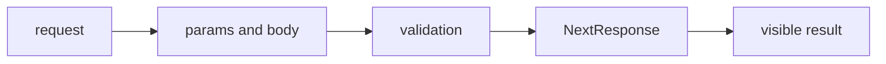

### How it works

1. `request` enters **Route data** as the value, event, file, or runtime that needs a decision.
2. `params and body` applies the rule owned by this section; keep that decision close to its source boundary.
3. `validation` carries the checked result to the next consumer instead of exposing private setup.
4. `NextResponse` receives the result and makes it visible through markup, output, or an exit code.
5. Exercise the normal path and the failure path at the runtime named by the example.

### Project reading

- **Rule:** Validate route params before building an upstream URL or reading a service value.
- **Failure to catch:** An unsafe slug reaches an upstream request or an upstream error becomes a false success.
- **Evidence:** Route tests for invalid input, upstream failure, and success.
- **Owner:** `TypeScript / Field Notes` documents the contract; source files and tests remain the executable reference.
- **Scope:** Read this section with the linked source path in the repository catalog below.

### Example

```ts
interface RouteContext {
  params: Promise<{ owner: string; repo: string }>;
}
export async function GET(_: Request, context: RouteContext) {
  const { owner, repo } = await context.params;
  return Response.json({ owner, repo });
}
```

### Decision table

<table>
  <thead>
    <tr><th>Input</th><th>Project decision</th><th>Check</th></tr>
  </thead>
  <tbody>
    <tr><td>request</td><td>Keep it at the boundary named by the section.</td><td>A focused test or source inspection.</td></tr>
    <tr><td>params and body</td><td>Use the smallest rule that explains the branch.</td><td>Lint, type check, or browser assertion.</td></tr>
    <tr><td>validation</td><td>Return a readable value or state.</td><td>Success and failure cases.</td></tr>
    <tr><td>NextResponse</td><td>Expose a semantic or reviewable consumer.</td><td>Role, report, screenshot, or exit code.</td></tr>
  </tbody>
</table>

### Checks

- Inspect the owner for `params and body` before editing the consumer.
- Assert the successful `validation` result through the public surface.
- Force the failure branch and confirm it reaches `NextResponse`.
- Record the command and artifact path shown in this guide.

<a id="08--async-errors"></a>
## 08 / Async errors

Promise code has two states at once: the value type and the failure path. Keep both visible.

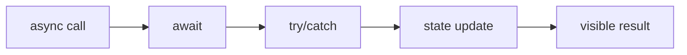

### How it works

1. `async call` enters **Async errors** as the value, event, file, or runtime that needs a decision.
2. `await` applies the rule owned by this section; keep that decision close to its source boundary.
3. `try/catch` carries the checked result to the next consumer instead of exposing private setup.
4. `state update` receives the result and makes it visible through markup, output, or an exit code.
5. Exercise the normal path and the failure path at the runtime named by the example.

### Project reading

- **Rule:** Catch unknown errors and turn them into the state or response the caller understands.
- **Failure to catch:** A rejected request leaves a spinner mounted or logs a raw unknown value as an Error.
- **Evidence:** A rejection test that checks visible state and cleanup.
- **Owner:** `TypeScript / Field Notes` documents the contract; source files and tests remain the executable reference.
- **Scope:** Read this section with the linked source path in the repository catalog below.

### Example

```ts
async function readHealth(): Promise<{ status: string }> {
  const response = await fetch('/api/health');
  if (!response.ok) throw new Error('health request failed');
  return response.json() as Promise<{ status: string }>;
}
```

### Decision table

<table>
  <thead>
    <tr><th>Input</th><th>Project decision</th><th>Check</th></tr>
  </thead>
  <tbody>
    <tr><td>async call</td><td>Keep it at the boundary named by the section.</td><td>A focused test or source inspection.</td></tr>
    <tr><td>await</td><td>Use the smallest rule that explains the branch.</td><td>Lint, type check, or browser assertion.</td></tr>
    <tr><td>try/catch</td><td>Return a readable value or state.</td><td>Success and failure cases.</td></tr>
    <tr><td>state update</td><td>Expose a semantic or reviewable consumer.</td><td>Role, report, screenshot, or exit code.</td></tr>
  </tbody>
</table>

### Checks

- Inspect the owner for `await` before editing the consumer.
- Assert the successful `try/catch` result through the public surface.
- Force the failure branch and confirm it reaches `state update`.
- Record the command and artifact path shown in this guide.

<a id="09--readonly-data"></a>
## 09 / Readonly data

Readonly arrays and objects mark values that a helper may inspect without mutating shared state.

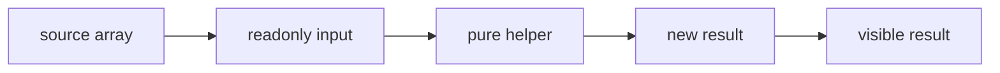

### How it works

1. `source array` enters **Readonly data** as the value, event, file, or runtime that needs a decision.
2. `readonly input` applies the rule owned by this section; keep that decision close to its source boundary.
3. `pure helper` carries the checked result to the next consumer instead of exposing private setup.
4. `new result` receives the result and makes it visible through markup, output, or an exit code.
5. Exercise the normal path and the failure path at the runtime named by the example.

### Project reading

- **Rule:** Use readonly at read-only boundaries, then create a new value when a change is required.
- **Failure to catch:** A filter helper mutates fetched data and a later render sees changed order.
- **Evidence:** A test that freezes input and asserts the returned collection.
- **Owner:** `TypeScript / Field Notes` documents the contract; source files and tests remain the executable reference.
- **Scope:** Read this section with the linked source path in the repository catalog below.

### Example

```ts
function names(values: readonly { name: string }[]): string[] {
  return values.map((value) => value.name);
}
```

### Decision table

<table>
  <thead>
    <tr><th>Input</th><th>Project decision</th><th>Check</th></tr>
  </thead>
  <tbody>
    <tr><td>source array</td><td>Keep it at the boundary named by the section.</td><td>A focused test or source inspection.</td></tr>
    <tr><td>readonly input</td><td>Use the smallest rule that explains the branch.</td><td>Lint, type check, or browser assertion.</td></tr>
    <tr><td>pure helper</td><td>Return a readable value or state.</td><td>Success and failure cases.</td></tr>
    <tr><td>new result</td><td>Expose a semantic or reviewable consumer.</td><td>Role, report, screenshot, or exit code.</td></tr>
  </tbody>
</table>

### Checks

- Inspect the owner for `readonly input` before editing the consumer.
- Assert the successful `pure helper` result through the public surface.
- Force the failure branch and confirm it reaches `new result`.
- Record the command and artifact path shown in this guide.

<a id="10--narrowing"></a>
## 10 / Narrowing

Narrowing turns a broad value into a usable type through checks the runtime can actually perform.

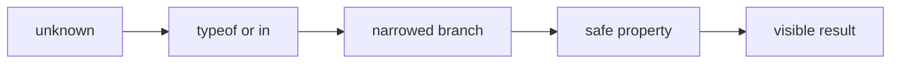

### How it works

1. `unknown` enters **Narrowing** as the value, event, file, or runtime that needs a decision.
2. `typeof or in` applies the rule owned by this section; keep that decision close to its source boundary.
3. `narrowed branch` carries the checked result to the next consumer instead of exposing private setup.
4. `safe property` receives the result and makes it visible through markup, output, or an exit code.
5. Exercise the normal path and the failure path at the runtime named by the example.

### Project reading

- **Rule:** Keep the check beside the code that relies on it; a distant cast loses the reason.
- **Failure to catch:** A property access throws because the value is null, an array, or a differently shaped object.
- **Evidence:** Cases for null, arrays, missing keys, and the valid object.
- **Owner:** `TypeScript / Field Notes` documents the contract; source files and tests remain the executable reference.
- **Scope:** Read this section with the linked source path in the repository catalog below.

### Example

```ts
function isRecord(value: unknown): value is Record<string, unknown> {
  return typeof value === 'object' && value !== null && !Array.isArray(value);
}
```

### Decision table

<table>
  <thead>
    <tr><th>Input</th><th>Project decision</th><th>Check</th></tr>
  </thead>
  <tbody>
    <tr><td>unknown</td><td>Keep it at the boundary named by the section.</td><td>A focused test or source inspection.</td></tr>
    <tr><td>typeof or in</td><td>Use the smallest rule that explains the branch.</td><td>Lint, type check, or browser assertion.</td></tr>
    <tr><td>narrowed branch</td><td>Return a readable value or state.</td><td>Success and failure cases.</td></tr>
    <tr><td>safe property</td><td>Expose a semantic or reviewable consumer.</td><td>Role, report, screenshot, or exit code.</td></tr>
  </tbody>
</table>

### Checks

- Inspect the owner for `typeof or in` before editing the consumer.
- Assert the successful `narrowed branch` result through the public surface.
- Force the failure branch and confirm it reaches `safe property`.
- Record the command and artifact path shown in this guide.

<a id="11--module-boundaries"></a>
## 11 / Module boundaries

Imports describe ownership. Path aliases keep source references stable while barrel files should stay small.

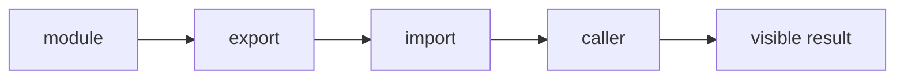

### How it works

1. `module` enters **Module boundaries** as the value, event, file, or runtime that needs a decision.
2. `export` applies the rule owned by this section; keep that decision close to its source boundary.
3. `import` carries the checked result to the next consumer instead of exposing private setup.
4. `caller` receives the result and makes it visible through markup, output, or an exit code.
5. Exercise the normal path and the failure path at the runtime named by the example.

### Project reading

- **Rule:** Export the smallest public surface that satisfies callers.
- **Failure to catch:** A convenience barrel creates a cycle or exposes an implementation detail.
- **Evidence:** The import graph, lint result, and one caller test.
- **Owner:** `TypeScript / Field Notes` documents the contract; source files and tests remain the executable reference.
- **Scope:** Read this section with the linked source path in the repository catalog below.

### Example

```ts
export type { Repo } from './repo';
export { formatRepoName } from './format-repo';
```

### Decision table

<table>
  <thead>
    <tr><th>Input</th><th>Project decision</th><th>Check</th></tr>
  </thead>
  <tbody>
    <tr><td>module</td><td>Keep it at the boundary named by the section.</td><td>A focused test or source inspection.</td></tr>
    <tr><td>export</td><td>Use the smallest rule that explains the branch.</td><td>Lint, type check, or browser assertion.</td></tr>
    <tr><td>import</td><td>Return a readable value or state.</td><td>Success and failure cases.</td></tr>
    <tr><td>caller</td><td>Expose a semantic or reviewable consumer.</td><td>Role, report, screenshot, or exit code.</td></tr>
  </tbody>
</table>

### Checks

- Inspect the owner for `export` before editing the consumer.
- Assert the successful `import` result through the public surface.
- Force the failure branch and confirm it reaches `caller`.
- Record the command and artifact path shown in this guide.

<a id="12--internationalization-types"></a>
## 12 / Internationalization types

Locale keys and translated values travel from configuration to layout and page components.

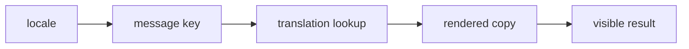

### How it works

1. `locale` enters **Internationalization types** as the value, event, file, or runtime that needs a decision.
2. `message key` applies the rule owned by this section; keep that decision close to its source boundary.
3. `translation lookup` carries the checked result to the next consumer instead of exposing private setup.
4. `rendered copy` receives the result and makes it visible through markup, output, or an exit code.
5. Exercise the normal path and the failure path at the runtime named by the example.

### Project reading

- **Rule:** Keep locale values finite and make missing keys visible during development.
- **Failure to catch:** A route accepts a locale with no messages or a component renders a key as user copy.
- **Evidence:** A valid locale test and an invalid locale fallback test.
- **Owner:** `TypeScript / Field Notes` documents the contract; source files and tests remain the executable reference.
- **Scope:** Read this section with the linked source path in the repository catalog below.

### Example

```ts
const locales = ['en', 'pt', 'es'] as const;
type Locale = typeof locales[number];
function isLocale(value: string): value is Locale {
  return (locales as readonly string[]).includes(value);
}
```

### Decision table

<table>
  <thead>
    <tr><th>Input</th><th>Project decision</th><th>Check</th></tr>
  </thead>
  <tbody>
    <tr><td>locale</td><td>Keep it at the boundary named by the section.</td><td>A focused test or source inspection.</td></tr>
    <tr><td>message key</td><td>Use the smallest rule that explains the branch.</td><td>Lint, type check, or browser assertion.</td></tr>
    <tr><td>translation lookup</td><td>Return a readable value or state.</td><td>Success and failure cases.</td></tr>
    <tr><td>rendered copy</td><td>Expose a semantic or reviewable consumer.</td><td>Role, report, screenshot, or exit code.</td></tr>
  </tbody>
</table>

### Checks

- Inspect the owner for `message key` before editing the consumer.
- Assert the successful `translation lookup` result through the public surface.
- Force the failure branch and confirm it reaches `rendered copy`.
- Record the command and artifact path shown in this guide.

<a id="13--test-types"></a>
## 13 / Test types

Tests need types for fixtures, mocks, route contexts, and browser helpers without masking the production contract.

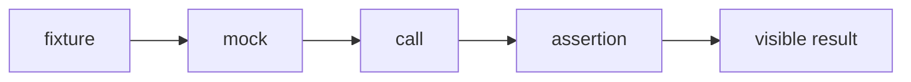

### How it works

1. `fixture` enters **Test types** as the value, event, file, or runtime that needs a decision.
2. `mock` applies the rule owned by this section; keep that decision close to its source boundary.
3. `call` carries the checked result to the next consumer instead of exposing private setup.
4. `assertion` receives the result and makes it visible through markup, output, or an exit code.
5. Exercise the normal path and the failure path at the runtime named by the example.

### Project reading

- **Rule:** Type the smallest fixture needed by the behavior under test and avoid any as a shortcut.
- **Failure to catch:** A mock accepts impossible data and the test passes while production code breaks.
- **Evidence:** A compile check plus a behavior assertion against the public surface.
- **Owner:** `TypeScript / Field Notes` documents the contract; source files and tests remain the executable reference.
- **Scope:** Read this section with the linked source path in the repository catalog below.

### Example

```ts
type RepoFixture = { name: string; language?: string; topics?: string[] };
const fixture: RepoFixture = { name: 'demo', topics: ['react'] };
```

### Decision table

<table>
  <thead>
    <tr><th>Input</th><th>Project decision</th><th>Check</th></tr>
  </thead>
  <tbody>
    <tr><td>fixture</td><td>Keep it at the boundary named by the section.</td><td>A focused test or source inspection.</td></tr>
    <tr><td>mock</td><td>Use the smallest rule that explains the branch.</td><td>Lint, type check, or browser assertion.</td></tr>
    <tr><td>call</td><td>Return a readable value or state.</td><td>Success and failure cases.</td></tr>
    <tr><td>assertion</td><td>Expose a semantic or reviewable consumer.</td><td>Role, report, screenshot, or exit code.</td></tr>
  </tbody>
</table>

### Checks

- Inspect the owner for `mock` before editing the consumer.
- Assert the successful `call` result through the public surface.
- Force the failure branch and confirm it reaches `assertion`.
- Record the command and artifact path shown in this guide.

<a id="14--lint-and-type-checks"></a>
## 14 / Lint and type checks

ESLint catches source patterns while tsc checks the whole typed graph; both answer different questions.

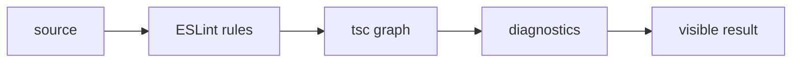

### How it works

1. `source` enters **Lint and type checks** as the value, event, file, or runtime that needs a decision.
2. `ESLint rules` applies the rule owned by this section; keep that decision close to its source boundary.
3. `tsc graph` carries the checked result to the next consumer instead of exposing private setup.
4. `diagnostics` receives the result and makes it visible through markup, output, or an exit code.
5. Exercise the normal path and the failure path at the runtime named by the example.

### Project reading

- **Rule:** Run lint and tsc separately when diagnosing because their errors point to different layers.
- **Failure to catch:** A clean lint result creates false confidence when the compiler still rejects a route or prop.
- **Evidence:** Command output with the command, exit code, and first useful diagnostic.
- **Owner:** `TypeScript / Field Notes` documents the contract; source files and tests remain the executable reference.
- **Scope:** Read this section with the linked source path in the repository catalog below.

### Example

```bash
pnpm run lint
pnpm exec tsc --noEmit
```

### Decision table

<table>
  <thead>
    <tr><th>Input</th><th>Project decision</th><th>Check</th></tr>
  </thead>
  <tbody>
    <tr><td>source</td><td>Keep it at the boundary named by the section.</td><td>A focused test or source inspection.</td></tr>
    <tr><td>ESLint rules</td><td>Use the smallest rule that explains the branch.</td><td>Lint, type check, or browser assertion.</td></tr>
    <tr><td>tsc graph</td><td>Return a readable value or state.</td><td>Success and failure cases.</td></tr>
    <tr><td>diagnostics</td><td>Expose a semantic or reviewable consumer.</td><td>Role, report, screenshot, or exit code.</td></tr>
  </tbody>
</table>

### Checks

- Inspect the owner for `ESLint rules` before editing the consumer.
- Assert the successful `tsc graph` result through the public surface.
- Force the failure branch and confirm it reaches `diagnostics`.
- Record the command and artifact path shown in this guide.

<a id="15--refactoring-signals"></a>
## 15 / Refactoring signals

A type error after a change names the contract that the change disturbed.

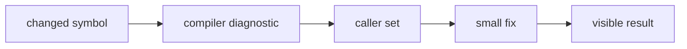

### How it works

1. `changed symbol` enters **Refactoring signals** as the value, event, file, or runtime that needs a decision.
2. `compiler diagnostic` applies the rule owned by this section; keep that decision close to its source boundary.
3. `caller set` carries the checked result to the next consumer instead of exposing private setup.
4. `small fix` receives the result and makes it visible through markup, output, or an exit code.
5. Exercise the normal path and the failure path at the runtime named by the example.

### Project reading

- **Rule:** Read the first diagnostic and inspect callers before widening the type.
- **Failure to catch:** A broad cast silences one error and creates a less visible bug downstream.
- **Evidence:** A before/after type check and the changed caller behavior.
- **Owner:** `TypeScript / Field Notes` documents the contract; source files and tests remain the executable reference.
- **Scope:** Read this section with the linked source path in the repository catalog below.

### Example

```tsx
type CardProps = { title: string; count: number };
function Card({ title, count }: CardProps) {
  return <span>{title}: {count}</span>;
}
```

### Decision table

<table>
  <thead>
    <tr><th>Input</th><th>Project decision</th><th>Check</th></tr>
  </thead>
  <tbody>
    <tr><td>changed symbol</td><td>Keep it at the boundary named by the section.</td><td>A focused test or source inspection.</td></tr>
    <tr><td>compiler diagnostic</td><td>Use the smallest rule that explains the branch.</td><td>Lint, type check, or browser assertion.</td></tr>
    <tr><td>caller set</td><td>Return a readable value or state.</td><td>Success and failure cases.</td></tr>
    <tr><td>small fix</td><td>Expose a semantic or reviewable consumer.</td><td>Role, report, screenshot, or exit code.</td></tr>
  </tbody>
</table>

### Checks

- Inspect the owner for `compiler diagnostic` before editing the consumer.
- Assert the successful `caller set` result through the public surface.
- Force the failure branch and confirm it reaches `small fix`.
- Record the command and artifact path shown in this guide.

<a id="16--troubleshooting-types"></a>
## 16 / Troubleshooting types

Type failures become faster to solve when the error, source option, and runtime boundary are separated.

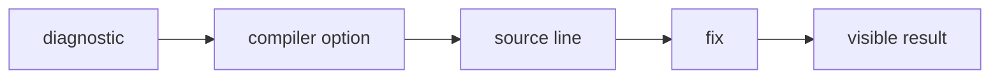

### How it works

1. `diagnostic` enters **Troubleshooting types** as the value, event, file, or runtime that needs a decision.
2. `compiler option` applies the rule owned by this section; keep that decision close to its source boundary.
3. `source line` carries the checked result to the next consumer instead of exposing private setup.
4. `fix` receives the result and makes it visible through markup, output, or an exit code.
5. Exercise the normal path and the failure path at the runtime named by the example.

### Project reading

- **Rule:** Classify the failure before changing code: missing type, bad narrowing, wrong import, or invalid state.
- **Failure to catch:** A guessed fix changes several files without explaining the original diagnostic.
- **Evidence:** The smallest reproducer and a passing command after the fix.
- **Owner:** `TypeScript / Field Notes` documents the contract; source files and tests remain the executable reference.
- **Scope:** Read this section with the linked source path in the repository catalog below.

### Example

```ts
function requireText(value: unknown): string {
  if (typeof value !== 'string') throw new TypeError('text required');
  return value;
}
```

### Decision table

<table>
  <thead>
    <tr><th>Input</th><th>Project decision</th><th>Check</th></tr>
  </thead>
  <tbody>
    <tr><td>diagnostic</td><td>Keep it at the boundary named by the section.</td><td>A focused test or source inspection.</td></tr>
    <tr><td>compiler option</td><td>Use the smallest rule that explains the branch.</td><td>Lint, type check, or browser assertion.</td></tr>
    <tr><td>source line</td><td>Return a readable value or state.</td><td>Success and failure cases.</td></tr>
    <tr><td>fix</td><td>Expose a semantic or reviewable consumer.</td><td>Role, report, screenshot, or exit code.</td></tr>
  </tbody>
</table>

### Checks

- Inspect the owner for `compiler option` before editing the consumer.
- Assert the successful `source line` result through the public surface.
- Force the failure branch and confirm it reaches `fix`.
- Record the command and artifact path shown in this guide.

<a id="17--review-checklist"></a>
## 17 / Review checklist

A type review should prove where data enters, where it narrows, and what each consumer can assume.

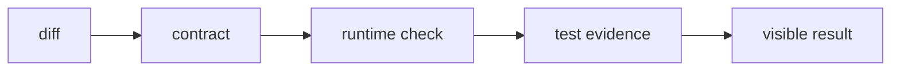

### How it works

1. `diff` enters **Review checklist** as the value, event, file, or runtime that needs a decision.
2. `contract` applies the rule owned by this section; keep that decision close to its source boundary.
3. `runtime check` carries the checked result to the next consumer instead of exposing private setup.
4. `test evidence` receives the result and makes it visible through markup, output, or an exit code.
5. Exercise the normal path and the failure path at the runtime named by the example.

### Project reading

- **Rule:** Review types with their callers and tests, not as isolated syntax.
- **Failure to catch:** A clean-looking type hides a boundary that has no runtime validation.
- **Evidence:** Checklist results in the pull request description.
- **Owner:** `TypeScript / Field Notes` documents the contract; source files and tests remain the executable reference.
- **Scope:** Read this section with the linked source path in the repository catalog below.

### Example

```ts
const review = [
  'external data starts unknown',
  'invalid state has a branch',
  'props state intent',
  'tests cover public behavior',
] as const;
```

### Decision table

<table>
  <thead>
    <tr><th>Input</th><th>Project decision</th><th>Check</th></tr>
  </thead>
  <tbody>
    <tr><td>diff</td><td>Keep it at the boundary named by the section.</td><td>A focused test or source inspection.</td></tr>
    <tr><td>contract</td><td>Use the smallest rule that explains the branch.</td><td>Lint, type check, or browser assertion.</td></tr>
    <tr><td>runtime check</td><td>Return a readable value or state.</td><td>Success and failure cases.</td></tr>
    <tr><td>test evidence</td><td>Expose a semantic or reviewable consumer.</td><td>Role, report, screenshot, or exit code.</td></tr>
  </tbody>
</table>

### Checks

- Inspect the owner for `contract` before editing the consumer.
- Assert the successful `runtime check` result through the public surface.
- Force the failure branch and confirm it reaches `test evidence`.
- Record the command and artifact path shown in this guide.

<a id="18--type-glossary"></a>
## 18 / Type glossary

A small shared vocabulary makes reviews shorter: unknown, union, generic, assertion, guard, and inferred type.

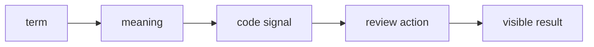

### How it works

1. `term` enters **Type glossary** as the value, event, file, or runtime that needs a decision.
2. `meaning` applies the rule owned by this section; keep that decision close to its source boundary.
3. `code signal` carries the checked result to the next consumer instead of exposing private setup.
4. `review action` receives the result and makes it visible through markup, output, or an exit code.
5. Exercise the normal path and the failure path at the runtime named by the example.

### Project reading

- **Rule:** Use the plain term that names the compiler behavior in question.
- **Failure to catch:** A vague phrase such as type issue sends the next person to the wrong file.
- **Evidence:** A linked section and a concrete snippet for the term.
- **Owner:** `TypeScript / Field Notes` documents the contract; source files and tests remain the executable reference.
- **Scope:** Read this section with the linked source path in the repository catalog below.

### Example

```ts
type Result<T> =
  | { ok: true; value: T }
  | { ok: false; error: string };
```

### Decision table

<table>
  <thead>
    <tr><th>Input</th><th>Project decision</th><th>Check</th></tr>
  </thead>
  <tbody>
    <tr><td>term</td><td>Keep it at the boundary named by the section.</td><td>A focused test or source inspection.</td></tr>
    <tr><td>meaning</td><td>Use the smallest rule that explains the branch.</td><td>Lint, type check, or browser assertion.</td></tr>
    <tr><td>code signal</td><td>Return a readable value or state.</td><td>Success and failure cases.</td></tr>
    <tr><td>review action</td><td>Expose a semantic or reviewable consumer.</td><td>Role, report, screenshot, or exit code.</td></tr>
  </tbody>
</table>

### Checks

- Inspect the owner for `meaning` before editing the consumer.
- Assert the successful `code signal` result through the public surface.
- Force the failure branch and confirm it reaches `review action`.
- Record the command and artifact path shown in this guide.

<a id="repository-map"></a>
<h1 align="center">
   Repository map
</h1>

The catalog is intentionally concrete. Use it to jump from a concept to the source or test that implements it.

<table>
  <thead>
    <tr><th>Area</th><th>Paths</th><th>Read for</th></tr>
  </thead>
  <tbody>
    <tr><td>Application</td><td>`src/app/`</td><td>Routes, layouts, metadata, and API handlers.</td></tr>
    <tr><td>Components</td><td>`src/components/`</td><td>React composition, effects, UI, and project surfaces.</td></tr>
    <tr><td>Tests</td><td>`tests/` and `src/**/tests/`</td><td>Runner-specific behavior and boundary cases.</td></tr>
    <tr><td>Scripts</td><td>`scripts/tests/` and `scripts/qa/`</td><td>Quality reports, server startup, screenshots, and video conversion.</td></tr>
    <tr><td>Automation</td><td>`.github/workflows/`</td><td>CI triggers, jobs, artifacts, and delivery.</td></tr>
  </tbody>
</table>


<table>
  <thead>
    <tr><th>Path</th><th>Relation to this guide</th><th>Open with</th></tr>
  </thead>
  <tbody>
    <tr><td><code>.github/workflows/ci.yml</code></td><td>Automation or delivery boundary.</td><td>`ci.md` or the workflow job log.</td></tr>
    <tr><td><code>.github/workflows/codeql.yml</code></td><td>Automation or delivery boundary.</td><td>`ci.md` or the workflow job log.</td></tr>
    <tr><td><code>.github/workflows/dependencies.yml</code></td><td>Automation or delivery boundary.</td><td>`ci.md` or the workflow job log.</td></tr>
    <tr><td><code>.github/workflows/deploy.yml</code></td><td>Automation or delivery boundary.</td><td>`ci.md` or the workflow job log.</td></tr>
    <tr><td><code>.github/workflows/docker.yml</code></td><td>Automation or delivery boundary.</td><td>`ci.md` or the workflow job log.</td></tr>
    <tr><td><code>.github/workflows/frontend-qa.yml</code></td><td>Automation or delivery boundary.</td><td>`ci.md` or the workflow job log.</td></tr>
    <tr><td><code>.storybook/main.ts</code></td><td>Application source, typed component, or style rule.</td><td>The nearest test and route.</td></tr>
    <tr><td><code>README.md</code></td><td>Project configuration or documentation entry point.</td><td>The command that consumes it.</td></tr>
    <tr><td><code>jest.config.js</code></td><td>Project configuration or documentation entry point.</td><td>The command that consumes it.</td></tr>
    <tr><td><code>lighthouserc.js</code></td><td>Project configuration or documentation entry point.</td><td>The command that consumes it.</td></tr>
    <tr><td><code>package.json</code></td><td>Project configuration or documentation entry point.</td><td>The command that consumes it.</td></tr>
    <tr><td><code>playwright.config.ts</code></td><td>Application source, typed component, or style rule.</td><td>The nearest test and route.</td></tr>
    <tr><td><code>scripts/qa/capture-lighthouse-screenshots.mjs</code></td><td>QA runtime helper or evidence producer.</td><td>`testing.md` or `qa.md`.</td></tr>
    <tr><td><code>scripts/qa/convert-playwright-video.mjs</code></td><td>QA runtime helper or evidence producer.</td><td>`testing.md` or `qa.md`.</td></tr>
    <tr><td><code>scripts/qa/start-production.mjs</code></td><td>QA runtime helper or evidence producer.</td><td>`testing.md` or `qa.md`.</td></tr>
    <tr><td><code>scripts/tests/benchmark.mjs</code></td><td>Behavior check or test fixture.</td><td>The related source module.</td></tr>
    <tr><td><code>scripts/tests/benchmark.node-test.mjs</code></td><td>Behavior check or test fixture.</td><td>The related source module.</td></tr>
    <tr><td><code>scripts/tests/check-file-size.mjs</code></td><td>Behavior check or test fixture.</td><td>The related source module.</td></tr>
    <tr><td><code>scripts/tests/check-file-size.node-test.mjs</code></td><td>Behavior check or test fixture.</td><td>The related source module.</td></tr>
    <tr><td><code>scripts/tests/file-size-policy.mjs</code></td><td>Behavior check or test fixture.</td><td>The related source module.</td></tr>
    <tr><td><code>scripts/tests/jscpd.mjs</code></td><td>Behavior check or test fixture.</td><td>The related source module.</td></tr>
    <tr><td><code>scripts/tests/jscpd.node-test.mjs</code></td><td>Behavior check or test fixture.</td><td>The related source module.</td></tr>
    <tr><td><code>scripts/tests/quality-metrics.mjs</code></td><td>Behavior check or test fixture.</td><td>The related source module.</td></tr>
    <tr><td><code>scripts/tests/quality-metrics.node-test.mjs</code></td><td>Behavior check or test fixture.</td><td>The related source module.</td></tr>
    <tr><td><code>scripts/tests/quality-policy.mjs</code></td><td>Behavior check or test fixture.</td><td>The related source module.</td></tr>
    <tr><td><code>scripts/tests/quality-report.mjs</code></td><td>Behavior check or test fixture.</td><td>The related source module.</td></tr>
    <tr><td><code>scripts/tests/quality-report.node-test.mjs</code></td><td>Behavior check or test fixture.</td><td>The related source module.</td></tr>
    <tr><td><code>scripts/tests/quality-review.mjs</code></td><td>Behavior check or test fixture.</td><td>The related source module.</td></tr>
    <tr><td><code>scripts/tests/quality-review.node-test.mjs</code></td><td>Behavior check or test fixture.</td><td>The related source module.</td></tr>
    <tr><td><code>scripts/tests/quality-security.mjs</code></td><td>Behavior check or test fixture.</td><td>The related source module.</td></tr>
    <tr><td><code>src/app/[locale]/[...not-found]/page.tsx</code></td><td>Application source, typed component, or style rule.</td><td>The nearest test and route.</td></tr>
    <tr><td><code>src/app/[locale]/about/layout.tsx</code></td><td>Application source, typed component, or style rule.</td><td>The nearest test and route.</td></tr>
    <tr><td><code>src/app/[locale]/about/page.tsx</code></td><td>Application source, typed component, or style rule.</td><td>The nearest test and route.</td></tr>
    <tr><td><code>src/app/[locale]/certifications/layout.tsx</code></td><td>Application source, typed component, or style rule.</td><td>The nearest test and route.</td></tr>
    <tr><td><code>src/app/[locale]/certifications/page.tsx</code></td><td>Application source, typed component, or style rule.</td><td>The nearest test and route.</td></tr>
    <tr><td><code>src/app/[locale]/chat/layout.tsx</code></td><td>Application source, typed component, or style rule.</td><td>The nearest test and route.</td></tr>
    <tr><td><code>src/app/[locale]/chat/page.tsx</code></td><td>Application source, typed component, or style rule.</td><td>The nearest test and route.</td></tr>
    <tr><td><code>src/app/[locale]/contact/layout.tsx</code></td><td>Application source, typed component, or style rule.</td><td>The nearest test and route.</td></tr>
    <tr><td><code>src/app/[locale]/contact/page.tsx</code></td><td>Application source, typed component, or style rule.</td><td>The nearest test and route.</td></tr>
    <tr><td><code>src/app/[locale]/layout.tsx</code></td><td>Application source, typed component, or style rule.</td><td>The nearest test and route.</td></tr>
    <tr><td><code>src/app/[locale]/not-found.tsx</code></td><td>Application source, typed component, or style rule.</td><td>The nearest test and route.</td></tr>
    <tr><td><code>src/app/[locale]/page.tsx</code></td><td>Application source, typed component, or style rule.</td><td>The nearest test and route.</td></tr>
    <tr><td><code>src/app/[locale]/projects/layout.tsx</code></td><td>Application source, typed component, or style rule.</td><td>The nearest test and route.</td></tr>
    <tr><td><code>src/app/[locale]/projects/page.tsx</code></td><td>Application source, typed component, or style rule.</td><td>The nearest test and route.</td></tr>
    <tr><td><code>src/app/[locale]/tests/pages.test.tsx</code></td><td>Behavior check or test fixture.</td><td>The related source module.</td></tr>
    <tr><td><code>src/app/api/auth/[...nextauth]/route.ts</code></td><td>Application source, typed component, or style rule.</td><td>The nearest test and route.</td></tr>
    <tr><td><code>src/app/api/chat/messages/route.ts</code></td><td>Application source, typed component, or style rule.</td><td>The nearest test and route.</td></tr>
    <tr><td><code>src/app/api/github/repos/[owner]/[repo]/readme/route.ts</code></td><td>Application source, typed component, or style rule.</td><td>The nearest test and route.</td></tr>
    <tr><td><code>src/app/api/github/repos/[owner]/[repo]/readme/tests/route.test.ts</code></td><td>Behavior check or test fixture.</td><td>The related source module.</td></tr>
    <tr><td><code>src/app/api/github/repos/route.ts</code></td><td>Application source, typed component, or style rule.</td><td>The nearest test and route.</td></tr>
    <tr><td><code>src/app/api/github/repos/tests/route-branches.test.ts</code></td><td>Behavior check or test fixture.</td><td>The related source module.</td></tr>
    <tr><td><code>src/app/api/github/repos/tests/route.test.ts</code></td><td>Behavior check or test fixture.</td><td>The related source module.</td></tr>
    <tr><td><code>src/app/api/github/stats/route.ts</code></td><td>Application source, typed component, or style rule.</td><td>The nearest test and route.</td></tr>
    <tr><td><code>src/app/api/health/route.ts</code></td><td>Application source, typed component, or style rule.</td><td>The nearest test and route.</td></tr>
    <tr><td><code>src/app/api/tests/uncovered-routes.test.ts</code></td><td>Behavior check or test fixture.</td><td>The related source module.</td></tr>
    <tr><td><code>src/app/api/upload/route.ts</code></td><td>Application source, typed component, or style rule.</td><td>The nearest test and route.</td></tr>
    <tr><td><code>src/app/api/visitors/route.ts</code></td><td>Application source, typed component, or style rule.</td><td>The nearest test and route.</td></tr>
    <tr><td><code>src/app/api/youtube/config/route.ts</code></td><td>Application source, typed component, or style rule.</td><td>The nearest test and route.</td></tr>
    <tr><td><code>src/app/globals.css</code></td><td>Application source, typed component, or style rule.</td><td>The nearest test and route.</td></tr>
    <tr><td><code>src/app/layout.tsx</code></td><td>Application source, typed component, or style rule.</td><td>The nearest test and route.</td></tr>
    <tr><td><code>src/app/page.tsx</code></td><td>Application source, typed component, or style rule.</td><td>The nearest test and route.</td></tr>
    <tr><td><code>src/app/robots.ts</code></td><td>Application source, typed component, or style rule.</td><td>The nearest test and route.</td></tr>
    <tr><td><code>src/app/sitemap.ts</code></td><td>Application source, typed component, or style rule.</td><td>The nearest test and route.</td></tr>
    <tr><td><code>src/app/tests/shell.test.tsx</code></td><td>Behavior check or test fixture.</td><td>The related source module.</td></tr>
    <tr><td><code>src/components/about/AboutParticleField.tsx</code></td><td>Application source, typed component, or style rule.</td><td>The nearest test and route.</td></tr>
    <tr><td><code>src/components/about/AboutScrollStory.tsx</code></td><td>Application source, typed component, or style rule.</td><td>The nearest test and route.</td></tr>
    <tr><td><code>src/components/about/InteractiveExpertiseGrid.tsx</code></td><td>Application source, typed component, or style rule.</td><td>The nearest test and route.</td></tr>
    <tr><td><code>src/components/chat/ChatEffects.tsx</code></td><td>Application source, typed component, or style rule.</td><td>The nearest test and route.</td></tr>
    <tr><td><code>src/components/chat/ChatRoom.tsx</code></td><td>Application source, typed component, or style rule.</td><td>The nearest test and route.</td></tr>
    <tr><td><code>src/components/contact/ClickSpark.tsx</code></td><td>Application source, typed component, or style rule.</td><td>The nearest test and route.</td></tr>
    <tr><td><code>src/components/contact/Contact.tsx</code></td><td>Application source, typed component, or style rule.</td><td>The nearest test and route.</td></tr>
    <tr><td><code>src/components/contact/ContactCommandForm.tsx</code></td><td>Application source, typed component, or style rule.</td><td>The nearest test and route.</td></tr>
    <tr><td><code>src/components/effects/HexagonGrid.tsx</code></td><td>Application source, typed component, or style rule.</td><td>The nearest test and route.</td></tr>
    <tr><td><code>src/components/effects/LetterGlitch.tsx</code></td><td>Application source, typed component, or style rule.</td><td>The nearest test and route.</td></tr>
    <tr><td><code>src/components/effects/MatrixBackground.tsx</code></td><td>Application source, typed component, or style rule.</td><td>The nearest test and route.</td></tr>
    <tr><td><code>src/components/effects/ParticleBackground.tsx</code></td><td>Application source, typed component, or style rule.</td><td>The nearest test and route.</td></tr>
    <tr><td><code>src/components/effects/ScrollEffect.tsx</code></td><td>Application source, typed component, or style rule.</td><td>The nearest test and route.</td></tr>
    <tr><td><code>src/components/effects/ScrollProgress.tsx</code></td><td>Application source, typed component, or style rule.</td><td>The nearest test and route.</td></tr>
    <tr><td><code>src/components/effects/ScrollReveal.tsx</code></td><td>Application source, typed component, or style rule.</td><td>The nearest test and route.</td></tr>
    <tr><td><code>src/components/effects/ScrollVelocityRibbon.tsx</code></td><td>Application source, typed component, or style rule.</td><td>The nearest test and route.</td></tr>
    <tr><td><code>src/components/home/BongoCat.tsx</code></td><td>Application source, typed component, or style rule.</td><td>The nearest test and route.</td></tr>
    <tr><td><code>src/components/home/CapabilityRail.tsx</code></td><td>Application source, typed component, or style rule.</td><td>The nearest test and route.</td></tr>
    <tr><td><code>src/components/home/Hero.tsx</code></td><td>Application source, typed component, or style rule.</td><td>The nearest test and route.</td></tr>
    <tr><td><code>src/components/home/MetricsTicker.tsx</code></td><td>Application source, typed component, or style rule.</td><td>The nearest test and route.</td></tr>
    <tr><td><code>src/components/home/Skills.tsx</code></td><td>Application source, typed component, or style rule.</td><td>The nearest test and route.</td></tr>
    <tr><td><code>src/components/home/TechCarousel.tsx</code></td><td>Application source, typed component, or style rule.</td><td>The nearest test and route.</td></tr>
    <tr><td><code>src/components/home/bongo-cat-styles.ts</code></td><td>Application source, typed component, or style rule.</td><td>The nearest test and route.</td></tr>
    <tr><td><code>src/components/layout/DynamicFavicon.tsx</code></td><td>Application source, typed component, or style rule.</td><td>The nearest test and route.</td></tr>
    <tr><td><code>src/components/layout/LanguageSwitcher.tsx</code></td><td>Application source, typed component, or style rule.</td><td>The nearest test and route.</td></tr>
    <tr><td><code>src/components/layout/Navigation.tsx</code></td><td>Application source, typed component, or style rule.</td><td>The nearest test and route.</td></tr>
    <tr><td><code>src/components/layout/PageTransition.tsx</code></td><td>Application source, typed component, or style rule.</td><td>The nearest test and route.</td></tr>
    <tr><td><code>src/components/layout/PageTransitionOverlay.tsx</code></td><td>Application source, typed component, or style rule.</td><td>The nearest test and route.</td></tr>
    <tr><td><code>src/components/layout/ThemeProvider.tsx</code></td><td>Application source, typed component, or style rule.</td><td>The nearest test and route.</td></tr>
    <tr><td><code>src/components/layout/ThemeToggle.tsx</code></td><td>Application source, typed component, or style rule.</td><td>The nearest test and route.</td></tr>
    <tr><td><code>src/components/layout/page-transition-config.ts</code></td><td>Application source, typed component, or style rule.</td><td>The nearest test and route.</td></tr>
    <tr><td><code>src/components/loading-screen/GameLoadingScreen.css</code></td><td>Application source, typed component, or style rule.</td><td>The nearest test and route.</td></tr>
    <tr><td><code>src/components/loading-screen/GameLoadingScreen.tsx</code></td><td>Application source, typed component, or style rule.</td><td>The nearest test and route.</td></tr>
    <tr><td><code>src/components/loading-screen/LoadingScreenDemo.tsx</code></td><td>Application source, typed component, or style rule.</td><td>The nearest test and route.</td></tr>
    <tr><td><code>src/components/loading-screen/MatrixRain.tsx</code></td><td>Application source, typed component, or style rule.</td><td>The nearest test and route.</td></tr>
    <tr><td><code>src/components/loading-screen/SoloLevelingBoot.tsx</code></td><td>Application source, typed component, or style rule.</td><td>The nearest test and route.</td></tr>
    <tr><td><code>src/components/loading-screen/loadingMessages.ts</code></td><td>Application source, typed component, or style rule.</td><td>The nearest test and route.</td></tr>
    <tr><td><code>src/components/loading-screen/solo-leveling-boot-styles.ts</code></td><td>Application source, typed component, or style rule.</td><td>The nearest test and route.</td></tr>
    <tr><td><code>src/components/media/BackgroundMusic.tsx</code></td><td>Application source, typed component, or style rule.</td><td>The nearest test and route.</td></tr>
    <tr><td><code>src/components/projects/CityMap.tsx</code></td><td>Application source, typed component, or style rule.</td><td>The nearest test and route.</td></tr>
    <tr><td><code>src/components/projects/GitHubProjects.tsx</code></td><td>Application source, typed component, or style rule.</td><td>The nearest test and route.</td></tr>
    <tr><td><code>src/components/projects/ImageSlideshow.tsx</code></td><td>Application source, typed component, or style rule.</td><td>The nearest test and route.</td></tr>
    <tr><td><code>src/components/projects/LivePreview.tsx</code></td><td>Application source, typed component, or style rule.</td><td>The nearest test and route.</td></tr>
    <tr><td><code>src/components/projects/ProjectCardParts.tsx</code></td><td>Application source, typed component, or style rule.</td><td>The nearest test and route.</td></tr>
    <tr><td><code>src/components/projects/ProjectReadmeModal.tsx</code></td><td>Application source, typed component, or style rule.</td><td>The nearest test and route.</td></tr>
    <tr><td><code>src/components/projects/SoloLevelingProjectCard.tsx</code></td><td>Application source, typed component, or style rule.</td><td>The nearest test and route.</td></tr>
  </tbody>
</table>

<a id="command-matrix"></a>
<h1 align="center">
   Command matrix
</h1>

<table>
  <thead>
    <tr><th>Command</th><th>Script</th><th>Proof</th></tr>
  </thead>
  <tbody>
    <tr><td>Type check</td><td>`pnpm exec tsc --noEmit`</td><td>Project compiler graph</td></tr>
    <tr><td>Lint</td><td>`pnpm run lint`</td><td>ESLint and Next rules</td></tr>
    <tr><td>Unit behavior</td><td>`pnpm run test:jest`</td><td>Typed component and route callers</td></tr>
    <tr><td>Build</td><td>`pnpm run build`</td><td>Next integration</td></tr>
  </tbody>
</table>

### Command rules

- Use `pnpm` locally when the change is covered by the pnpm lockfile.
- Use the exact workflow command when reproducing CI.
- Keep snapshot updates explicit and review the diff.
- Run the build before browser checks that depend on production output.
- Record failures with the exit code and artifact path.

<a id="evidence-and-troubleshooting"></a>
<h1 align="center">
   Evidence and troubleshooting
</h1>

<table>
  <thead>
    <tr><th>Symptom</th><th>First inspection</th><th>Next command</th></tr>
  </thead>
  <tbody>
    <tr><td>Compiler error</td><td>`tsconfig.json` and the first diagnostic</td><td>`pnpm exec tsc --noEmit`</td></tr>
    <tr><td>Test not found</td><td>Runner include pattern and test path</td><td>`pnpm run test:scripts` or the runner command</td></tr>
    <tr><td>Browser startup</td><td>Installed browser and server URL</td><td>`pnpm exec playwright install --with-deps chromium`</td></tr>
    <tr><td>Visual diff</td><td>Font, viewport, theme, and animated layer</td><td>`pnpm run test:visual`</td></tr>
    <tr><td>Missing report</td><td>Output path and upload step</td><td>`find reports coverage playwright-report test-results .lighthouseci -maxdepth 2 -type f`</td></tr>
    <tr><td>CI-only failure</td><td>Node, package manager, env, and browser matrix</td><td>Copy the workflow command locally</td></tr>
  </tbody>
</table>

### Evidence record

- Command: `<exact command>`
- Input: `<changed path or fixture>`
- Result: `<literal summary>`
- Exit code: `<0 or failure code>`
- Artifact: `<path or none>`
- Follow-up: `<source fix, test fix, or environment fix>`

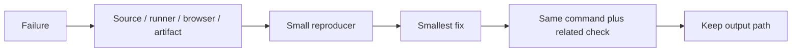

### Stop conditions

- Stop changing source when the failure is a missing runtime dependency.
- Stop updating snapshots when the diff has an unexplained content change.
- Stop widening types when the input has no runtime guard.
- Stop adding waits when the test has an ownership or cleanup bug.
- Stop after the requested behavior and rollback path have a passing check.

<a id="19--project-matching-contract"></a>
<h1 align="center">
   Project matching contract
</h1>

`Repo` carries both display data and discovery metadata. The About page uses the same project contract as project cards, so filtering does not create a second partial shape for cards.

```mermaid
flowchart TB
    U[unknown API JSON] --> G[route response guard]
    G --> R[Repo fields]
    R --> M[projectMatchesSkill]
    M --> L[Repo[] rail]
```

### How it works

- `allLanguages` remains optional because older responses may omit it.
- `topics` and `techStack` remain arrays; the matcher treats missing optional arrays as empty.
- `normalize` maps punctuation variants such as `Next.js`, `nextjs`, `C++`, and `C#` before comparison.
- Short labels use metadata equality. Longer labels may also match project name or description.
- `filterProjectsBySkill` returns the original `Repo` objects, preserving card props and stable IDs.

### Project reading

- `src/components/projects/project-card-types.ts` defines the shared `Repo` shape.
- `src/lib/profile/deriveSkills.ts` consumes the same metadata to build About groups.
- `src/lib/profile/matchProjectsToSkill.ts` consumes the metadata to find related projects.
- `src/app/api/github/repos/route.ts` supplies `allLanguages`, `techStack`, `topics`, and preview flags.

### Example

```ts
const metadata = [repo.language, ...(repo.allLanguages ?? []), ...repo.topics, ...repo.techStack ?? []];
const match = metadata.some((value) => matchesNormalized(normalize(value), target));
```

### Decision table

| Value | Type rule | Matching rule |
|---|---|---|
| `language` | `string | null` | Compare normalized language. |
| `allLanguages` | `string[]?` | Compare every detected language. |
| `topics` | `string[]` | Compare normalized topic names. |
| `techStack` | `string[]?` | Compare extracted technology names. |
| `description` | `string | null` | Search only for labels longer than two characters. |

### Checks

- Compile with `pnpm exec tsc --noEmit`.
- Test punctuation aliases and short labels.
- Test missing optional arrays.
- Confirm filtered objects still satisfy `SoloLevelingProjectCard` props.

<a id="references"></a>
<h1 align="center">
   References
</h1>

- https://www.typescriptlang.org/docs/handbook/intro.html
- https://www.typescriptlang.org/docs/handbook/2/narrowing.html
- https://react-typescript-cheatsheet.netlify.app/
- [Project README](../README.md)
- [Package scripts](../package.json)
- [GitHub Actions workflows](../.github/workflows/)

<details>
  <summary>Review checklist</summary>

- [ ] Source owner is named.
- [ ] Runtime boundary is named.
- [ ] Success and failure states are described.
- [ ] Example matches current project syntax.
- [ ] Focused check ran.
- [ ] Related browser or quality check ran.
- [ ] Evidence path is recorded.
- [ ] README link resolves.

</details>

---
