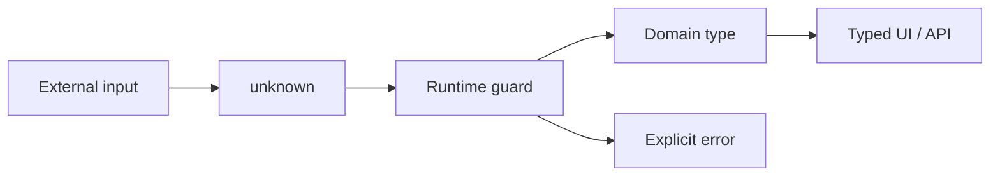

<div align="center">

<h1 align="center">
  
  TypeScript / Field Notes
</h1>

Type contracts for boundaries, state, and component APIs in this portfolio.

<a href="./react.md">React docs</a> · <a href="../README.md">README</a> · <a href="../tsconfig.json">tsconfig</a>

</div>

---

<p align="center">
  
  
  
  
</p>

<table>
  <thead>
    <tr><th>Signal</th><th>Project baseline</th><th>Use it for</th></tr>
  </thead>
  <tbody>
    <tr><td>Compiler</td><td>TypeScript 5.9.x</td><td>Strict static checks before a browser or server run.</td></tr>
    <tr><td>Primary mode</td><td><code>strict: true</code></td><td>Make nullable, unknown, and incomplete states visible.</td></tr>
    <tr><td>Runtime role</td><td>Erased after build</td><td>Types describe code; guards validate real input.</td></tr>
    <tr><td>UI seam</td><td>React + Next.js</td><td>Keep props, events, and route data explicit.</td></tr>
  </tbody>
</table>

## Contents

- [01 / Contract first](#01--contract-first)
- [02 / Runtime boundary](#02--runtime-boundary)
- [03 / Component API](#03--component-api)
- [Repository map](#repository-map)
- [Checks](#checks)

## 01 / Contract first

Types work best where information changes hands. A named union documents valid states and forces each consumer to handle the branch it receives.



### Prefer state machines over boolean soup

```ts
type LoadState<T> =
  | { status: 'idle' }
  | { status: 'loading' }
  | { status: 'success'; data: T }
  | { status: 'error'; message: string };

function statusLabel<T>(state: LoadState<T>) {
  switch (state.status) {
    case 'idle': return 'Waiting';
    case 'loading': return 'Loading';
    case 'success': return 'Ready';
    case 'error': return state.message;
  }
}
```

| Shape | Meaning | Consumer benefit |
| --- | --- | --- |
| `unknown` | Data not trusted yet | Forces a real check. |
| Union | One of a finite set of states | Exhaustive branching. |
| `readonly` | Caller cannot mutate the value | Safer sharing. |
| Generic | Same rule for many data shapes | Reuse without losing detail. |

## 02 / Runtime boundary

The compiler does not inspect a network response, uploaded file, or browser form. Keep the unsafe edge small: receive `unknown`, validate once, then pass a domain type inward.

### Boundary specimen

<article>
  <header><strong>Result&lt;User&gt;</strong><span> / PARSED</span></header>
  <p><code>unknown → guard → trusted state</code></p>
  <dl>
    <dt>input</dt><dd>external JSON</dd>
    <dt>decision</dt><dd>is this a User?</dd>
    <dt>output</dt><dd>success or explicit error</dd>
  </dl>
</article>

```ts
type User = { id: string; name: string };

function isUser(value: unknown): value is User {
  if (typeof value !== 'object' || value === null) return false;
  const record = value as Record<string, unknown>;
  return typeof record.id === 'string' && typeof record.name === 'string';
}

function parseUser(value: unknown): User | null {
  return isUser(value) ? value : null;
}
```

### Boundary rules

- Use `unknown` for external data, not `any`.
- Keep type assertions beside the runtime check that justifies them.
- Return a visible failure state; do not make invalid data look empty.
- Validate once at the edge, then keep inner functions typed.

## 03 / Component API

A component prop type is a small public API. Name each decision, use literal unions for controlled variation, and expose events as intent.

```tsx
type NoticeProps = {
  title: string;
  children: React.ReactNode;
  tone?: 'neutral' | 'ready';
  onClose?: () => void;
};

function Notice({ title, children, tone = 'neutral', onClose }: NoticeProps) {
  return (
    <aside aria-label={title} data-tone={tone}>
      {children}
      {onClose && <button onClick={onClose}>Close</button>}
    </aside>
  );
}
```

<table>
  <thead>
    <tr><th>API choice</th><th>Prefer</th><th>Skip</th></tr>
  </thead>
  <tbody>
    <tr><td>Event props</td><td><code>onSelect</code>, <code>onClose</code>, <code>onRetry</code></td><td><code>handleThing</code> leaking implementation.</td></tr>
    <tr><td>Optional props</td><td>Real variation with a stable default.</td><td>Optional values that change required behavior.</td></tr>
    <tr><td>Children</td><td>Flexible content owned by the caller.</td><td>Many slot props for one visual region.</td></tr>
  </tbody>
</table>

## Repository map

| Path | Role |
| --- | --- |
| [`tsconfig.json`](../tsconfig.json) | Compiler options and path aliases. |
| [`src/types/`](../src/types/) | Shared ambient and module types. |
| [`src/lib/`](../src/lib/) | Domain helpers and typed boundaries. |
| [`src/components/`](../src/components/) | Props, events, and UI composition. |
| [`src/i18n/`](../src/i18n/) | Locale and message contracts. |

## Checks

| Command | Signal |
| --- | --- |
| `pnpm exec tsc --noEmit` | Type errors across app and tests. |
| `pnpm run lint` | TypeScript-aware ESLint rules. |
| `pnpm run test:jest` | Component and utility behavior. |
| `pnpm run build` | Production route and type integration. |

<details>
  <summary><strong>Review checklist</strong></summary>

- [ ] External input starts as `unknown`.
- [ ] Invalid states have a named branch.
- [ ] Assertions stay at a documented boundary.
- [ ] Component props describe intent, not internal wiring.
- [ ] The browser receives semantic HTML even when data is missing.
</details>

## References

- [TypeScript Handbook](https://www.typescriptlang.org/docs/handbook/intro.html)
- [TypeScript Narrowing](https://www.typescriptlang.org/docs/handbook/2/narrowing.html)
- [React TypeScript Cheatsheet](https://react-typescript-cheatsheet.netlify.app/)
