<div align="center">

<h1 align="center">
  
  Visual effects / Field Notes
</h1>

Canvas, SVG, CSS, Framer Motion, route transitions, loading screens, and their test evidence.

<a href="react.md">React docs</a>  <a href="css.md">CSS docs</a>  <a href="testing.md">Testing docs</a>  <a href="qa.md">QA docs</a>  <a href="../README.md">README</a>

</div>

---

<p align="center">
  
  
  
  
  
</p>

| Topic | Project baseline | Use it for |
| --- | --- | --- |
| Canvas | Particle, Matrix, scroll, glitch, pointer, and WebGL layers | Paint loops, resize, pause, and disposal. |
| SVG | HexagonGrid and BongoCat | Crisp geometry, stroke timing, and fixed states. |
| CSS | Global keyframes and component style files | Data phases, theme rules, media queries, and compositing. |
| Motion | Framer Motion scroll and reveal primitives | Springs, viewport entrances, and preference branches. |
| Route | PageTransitionProvider and overlay | Cover, hold, commit, reveal, and failsafe cleanup. |
| Evidence | Component, visual, accessibility, and CI checks | Proof that pixels and behavior agree. |

## Contents

- [01 / Effect inventory and design intent](#01--effect-inventory-and-design-intent)
- [02 / Client-only render and hydration boundary](#02--client-only-render-and-hydration-boundary)
- [03 / ParticleBackground canvas](#03--particlebackground-canvas)
- [04 / MatrixBackground canvas](#04--matrixbackground-canvas)
- [05 / ScrollEffect gradient field](#05--scrolleffect-gradient-field)
- [06 / ScrollProgress spring bar](#06--scrollprogress-spring-bar)
- [07 / HexagonGrid SVG cells](#07--hexagongrid-svg-cells)
- [08 / LetterGlitch canvas text](#08--letterglitch-canvas-text)
- [09 / ScrollReveal word entrance](#09--scrollreveal-word-entrance)
- [10 / ScrollVelocityRibbon](#10--scrollvelocityribbon)
- [11 / Page transition phases](#11--page-transition-phases)
- [12 / Transition effect families](#12--transition-effect-families)
- [13 / GameLoadingScreen progress and exit](#13--gameloadingscreen-progress-and-exit)
- [14 / SoloLevelingBoot and MatrixRain](#14--sololevelingboot-and-matrixrain)
- [15 / AboutParticleField WebGL fallback](#15--aboutparticlefield-webgl-fallback)
- [16 / ClickSpark pointer feedback](#16--clickspark-pointer-feedback)
- [17 / BongoCat SVG typing loop](#17--bongocat-svg-typing-loop)
- [18 / Carousel, ticker, and marquee motion](#18--carousel-ticker-and-marquee-motion)
- [19 / CSS keyframes and data attributes](#19--css-keyframes-and-data-attributes)
- [20 / Theme interaction and color safety](#20--theme-interaction-and-color-safety)
- [21 / Reduced motion contract](#21--reduced-motion-contract)
- [22 / Performance and cleanup rules](#22--performance-and-cleanup-rules)
- [23 / Visual test strategy](#23--visual-test-strategy)
- [24 / QA and CI evidence](#24--qa-and-ci-evidence)
- [25 / Troubleshooting by symptom](#25--troubleshooting-by-symptom)
- [26 / Review checklist and change protocol](#26--review-checklist-and-change-protocol)
- [27 / Manga panel media](#27--manga-panel-media)
- [Repository map](#repository-map)
- [Command matrix](#command-matrix)
- [Evidence and troubleshooting](#evidence-and-troubleshooting)
- [References](#references)

<h1 align="center">
   Operating model
</h1>

Read an effect from input to paint, then from paint to evidence. Source files remain the executable contract; this guide records the reasoning and checks.

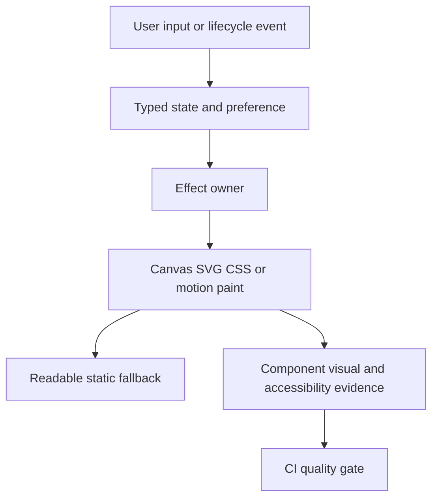

### Reading order

- Start with the effect family that owns the changed behavior.
- Read setup and cleanup as one unit.
- Check the final state before inspecting easing.
- Compare reduced motion, mobile, light, and dark behavior.
- Run the narrow check before the broad quality command.

<a id="01--effect-inventory-and-design-intent"></a>
## 01 / Effect inventory and design intent

Visual effects are small feedback systems. Each one owns one signal: depth, progress, focus, route change, or playful detail.

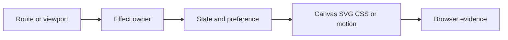

### Effect contract

- **Input:** route or viewport.
- **Output:** selected visual layer.
- **Owner:** `src/components/effects/`, `src/components/layout/`, and `src/components/loading-screen/`.
- **Evidence:** `src/components/tests/uncovered-components.test.tsx`, `remaining-components.test.tsx`, and browser specs.

### How it works

1. classify effect by rendering surface.
2. keep content readable if the layer is removed.
3. attach motion to an input the visitor can understand.

### Source reading

- Read **route or viewport** at the component boundary, not in a screenshot.
- Trace the value to **selected visual layer** and confirm its final DOM, SVG, canvas, or CSS state.
- Read the cleanup branch beside the setup branch. A decorative layer steals focus, blocks input, or becomes required for meaning.
- A reviewer can point from visible motion to one owner, one state, and one check.

### Example

```tsx
const effectContract = { signal: 'orientation', surface: 'canvas', fallback: 'content' };
```

### Decision table

| Concern | Project decision | Evidence |
| --- | --- | --- |
| route or viewport | Read it at the owner boundary. | Focused component test. |
| selected visual layer | Keep final content readable without the effect. | Browser assertion or screenshot. |
| Preference | Branch before starting repeated work. | Reduced-motion test. |
| Cleanup | Release every RAF, listener, timer, and resource. | Unmount or route test. |

### Why this is good

- The catalog prevents unrelated motion rules from becoming one large visual rule.

### Checks

- Run the focused check named in `src/components/tests/uncovered-components.test.tsx`, `remaining-components.test.tsx`, and browser specs.
- Test the normal path and the failure path.
- Test dark and light themes when color or contrast is involved.
- Test a narrow viewport when dimensions or overflow are involved.
- Test reduced motion before approving repeated animation.

<a id="02--client-only-render-and-hydration-boundary"></a>
## 02 / Client-only render and hydration boundary

Canvas and browser APIs start after hydration. The route can still render a stable shell while client effects wait for browser state.

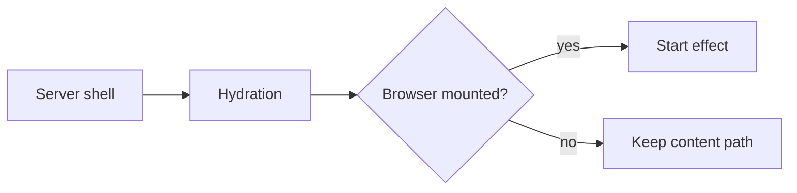

### Effect contract

- **Input:** server markup.
- **Output:** hydrated effect.
- **Owner:** `src/app/[locale]/page.tsx`, `src/app/[locale]/about/page.tsx`, and `useDeferredMount` call sites.
- **Evidence:** `src/components/tests/component-depth.test.tsx` and `src/app/tests/shell.test.tsx`.

### How it works

1. render semantic content first.
2. gate browser-only work behind client state.
3. mount expensive decoration after the first usable frame.

### Source reading

- Read **server markup** at the component boundary, not in a screenshot.
- Trace the value to **hydrated effect** and confirm its final DOM, SVG, canvas, or CSS state.
- Read the cleanup branch beside the setup branch. A server/client markup mismatch causes a warning or the effect reads an absent browser API.
- No `window`, canvas context, or observer is read during server rendering.

### Example

```tsx
const [mounted, setMounted] = useState(false);
useEffect(() => setMounted(true), []);
return mounted ? <ParticleBackground /> : null;
```

### Decision table

| Concern | Project decision | Evidence |
| --- | --- | --- |
| server markup | Read it at the owner boundary. | Focused component test. |
| hydrated effect | Keep final content readable without the effect. | Browser assertion or screenshot. |
| Preference | Branch before starting repeated work. | Reduced-motion test. |
| Cleanup | Release every RAF, listener, timer, and resource. | Unmount or route test. |

### Why this is good

- The page stays useful on slow devices and keeps server output deterministic.

### Checks

- Run the focused check named in `src/components/tests/component-depth.test.tsx` and `src/app/tests/shell.test.tsx`.
- Test the normal path and the failure path.
- Test dark and light themes when color or contrast is involved.
- Test a narrow viewport when dimensions or overflow are involved.
- Test reduced motion before approving repeated animation.

<a id="03--particlebackground-canvas"></a>
## 03 / ParticleBackground canvas

ParticleBackground adds a low-contrast depth field behind content. It is a canvas loop with a fixed particle count and theme-aware colors.

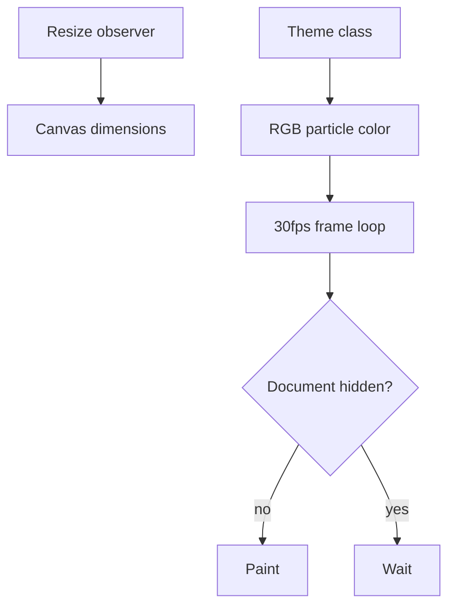

### Effect contract

- **Input:** viewport size and theme.
- **Output:** 50 moving particles.
- **Owner:** `src/components/effects/ParticleBackground.tsx`.
- **Evidence:** `src/components/tests/uncovered-components.test.tsx` covers canvas creation, resize, reduced motion, and cleanup.

### How it works

1. resize canvas for device pixel ratio.
2. draw 50 particles with the current theme color.
3. throttle frames to about 30fps.
4. pause when `document.hidden` is true.

### Source reading

- Read **viewport size and theme** at the component boundary, not in a screenshot.
- Trace the value to **50 moving particles** and confirm its final DOM, SVG, canvas, or CSS state.
- Read the cleanup branch beside the setup branch. The loop survives unmount, paints a black rectangle, or keeps running in a hidden tab.
- The canvas fills its owner without changing document layout or pointer behavior.

### Example

```tsx
const FRAME_INTERVAL = 1000 / 30;
if (now - lastFrame < FRAME_INTERVAL) return;
context.clearRect(0, 0, width, height);
```

### Decision table

| Concern | Project decision | Evidence |
| --- | --- | --- |
| viewport size and theme | Read it at the owner boundary. | Focused component test. |
| 50 moving particles | Keep final content readable without the effect. | Browser assertion or screenshot. |
| Preference | Branch before starting repeated work. | Reduced-motion test. |
| Cleanup | Release every RAF, listener, timer, and resource. | Unmount or route test. |

### Why this is good

- A bounded loop gives depth without competing with copy and controls.

### Checks

- Run the focused check named in `src/components/tests/uncovered-components.test.tsx` covers canvas creation, resize, reduced motion, and cleanup.
- Test the normal path and the failure path.
- Test dark and light themes when color or contrast is involved.
- Test a narrow viewport when dimensions or overflow are involved.
- Test reduced motion before approving repeated animation.

<a id="04--matrixbackground-canvas"></a>
## 04 / MatrixBackground canvas

MatrixBackground uses a glyph column field for the system-terminal mood. It throttles paint work and keeps reduced motion as a direct branch.

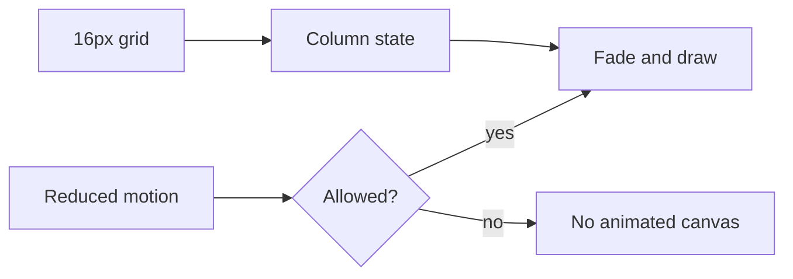

### Effect contract

- **Input:** grid width and motion preference.
- **Output:** falling glyph columns.
- **Owner:** `src/components/effects/MatrixBackground.tsx`.
- **Evidence:** `src/components/tests/uncovered-components.test.tsx` checks the canvas branch and reduced-motion behavior.

### How it works

1. derive columns from a 16px glyph grid.
2. choose blue or purple glyph colors by theme.
3. fade the prior frame instead of clearing to a hard edge.
4. use roughly an 18fps throttle.

### Source reading

- Read **grid width and motion preference** at the component boundary, not in a screenshot.
- Trace the value to **falling glyph columns** and confirm its final DOM, SVG, canvas, or CSS state.
- Read the cleanup branch beside the setup branch. The effect runs during reduced motion or the resize path leaves stale columns.
- Glyphs appear behind the page and stop when the preference asks for less motion.

### Example

```tsx
const fontSize = 16;
const columns = Math.ceil(canvas.width / fontSize);
context.fillText(char, column * fontSize, y);
```

### Decision table

| Concern | Project decision | Evidence |
| --- | --- | --- |
| grid width and motion preference | Read it at the owner boundary. | Focused component test. |
| falling glyph columns | Keep final content readable without the effect. | Browser assertion or screenshot. |
| Preference | Branch before starting repeated work. | Reduced-motion test. |
| Cleanup | Release every RAF, listener, timer, and resource. | Unmount or route test. |

### Why this is good

- The slow terminal texture communicates project tone while the page remains readable.

### Checks

- Run the focused check named in `src/components/tests/uncovered-components.test.tsx` checks the canvas branch and reduced-motion behavior.
- Test the normal path and the failure path.
- Test dark and light themes when color or contrast is involved.
- Test a narrow viewport when dimensions or overflow are involved.
- Test reduced motion before approving repeated animation.

<a id="05--scrolleffect-gradient-field"></a>
## 05 / ScrollEffect gradient field

ScrollEffect translates a background gradient from scroll position. The listener is passive and frames are coalesced through requestAnimationFrame.

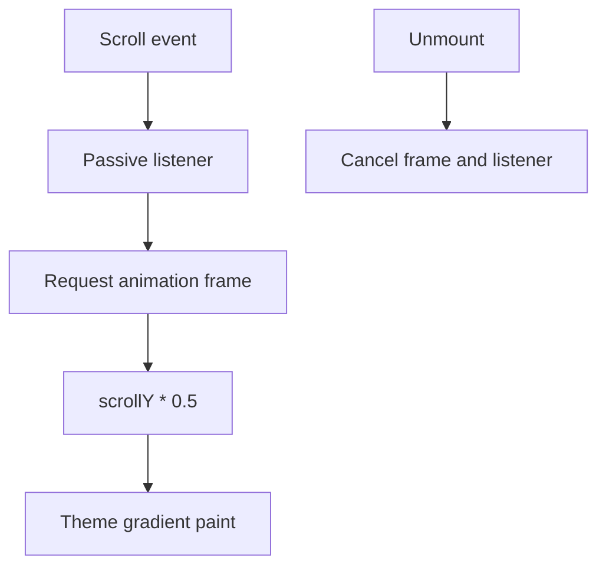

### Effect contract

- **Input:** scrollY.
- **Output:** gradient offset.
- **Owner:** `src/components/effects/ScrollEffect.tsx`.
- **Evidence:** `src/components/tests/uncovered-components.test.tsx` covers scroll registration, RAF scheduling, resize, and cleanup.

### How it works

1. listen with `{ passive: true }`.
2. keep one pending frame rather than one frame per event.
3. map `scrollY` to an offset with a 0.5 multiplier.
4. paint theme-specific gradient stops.

### Source reading

- Read **scrollY** at the component boundary, not in a screenshot.
- Trace the value to **gradient offset** and confirm its final DOM, SVG, canvas, or CSS state.
- Read the cleanup branch beside the setup branch. Every scroll event paints immediately or the listener remains after unmount.
- Fast wheel input produces one measured update per animation frame.

### Example

```tsx
let frame = 0;
const onScroll = () => {
  cancelAnimationFrame(frame);
  frame = requestAnimationFrame(draw);
};
```

### Decision table

| Concern | Project decision | Evidence |
| --- | --- | --- |
| scrollY | Read it at the owner boundary. | Focused component test. |
| gradient offset | Keep final content readable without the effect. | Browser assertion or screenshot. |
| Preference | Branch before starting repeated work. | Reduced-motion test. |
| Cleanup | Release every RAF, listener, timer, and resource. | Unmount or route test. |

### Why this is good

- Frame coalescing protects main-thread time while preserving the visual response.

### Checks

- Run the focused check named in `src/components/tests/uncovered-components.test.tsx` covers scroll registration, RAF scheduling, resize, and cleanup.
- Test the normal path and the failure path.
- Test dark and light themes when color or contrast is involved.
- Test a narrow viewport when dimensions or overflow are involved.
- Test reduced motion before approving repeated animation.

<a id="06--scrollprogress-spring-bar"></a>
## 06 / ScrollProgress spring bar

ScrollProgress exposes route position as a thin fixed bar. Motion uses a spring so small scroll changes do not look noisy.

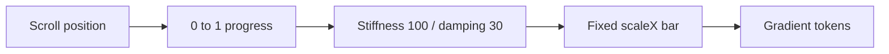

### Effect contract

- **Input:** `scrollYProgress`.
- **Output:** scaleX progress bar.
- **Owner:** `src/components/effects/ScrollProgress.tsx` and `src/app/globals.css`.
- **Evidence:** `src/components/tests/uncovered-components.test.tsx` checks the hydration gate and rendered progress element.

### How it works

1. read Framer Motion scroll progress.
2. spring it with stiffness 100 and damping 30.
3. render from the left edge with a theme gradient.
4. wait until hydration before exposing browser-derived state.

### Source reading

- Read **`scrollYProgress`** at the component boundary, not in a screenshot.
- Trace the value to **scaleX progress bar** and confirm its final DOM, SVG, canvas, or CSS state.
- Read the cleanup branch beside the setup branch. Hydration renders a different transform or the bar pushes content down.
- The bar starts at zero, follows page position, and never changes layout height.

### Example

```tsx
const { scrollYProgress } = useScroll();
const progress = useSpring(scrollYProgress, { stiffness: 100, damping: 30 });
return <motion.div style={{ scaleX: progress }} />;
```

### Decision table

| Concern | Project decision | Evidence |
| --- | --- | --- |
| `scrollYProgress` | Read it at the owner boundary. | Focused component test. |
| scaleX progress bar | Keep final content readable without the effect. | Browser assertion or screenshot. |
| Preference | Branch before starting repeated work. | Reduced-motion test. |
| Cleanup | Release every RAF, listener, timer, and resource. | Unmount or route test. |

### Why this is good

- Visitors get route orientation without a large overlay or extra interaction.

### Checks

- Run the focused check named in `src/components/tests/uncovered-components.test.tsx` checks the hydration gate and rendered progress element.
- Test the normal path and the failure path.
- Test dark and light themes when color or contrast is involved.
- Test a narrow viewport when dimensions or overflow are involved.
- Test reduced motion before approving repeated animation.

<a id="07--hexagongrid-svg-cells"></a>
## 07 / HexagonGrid SVG cells

HexagonGrid uses SVG for a crisp geometric field. It builds cells after mount, sanitizes color input, and limits simultaneous glow activity.

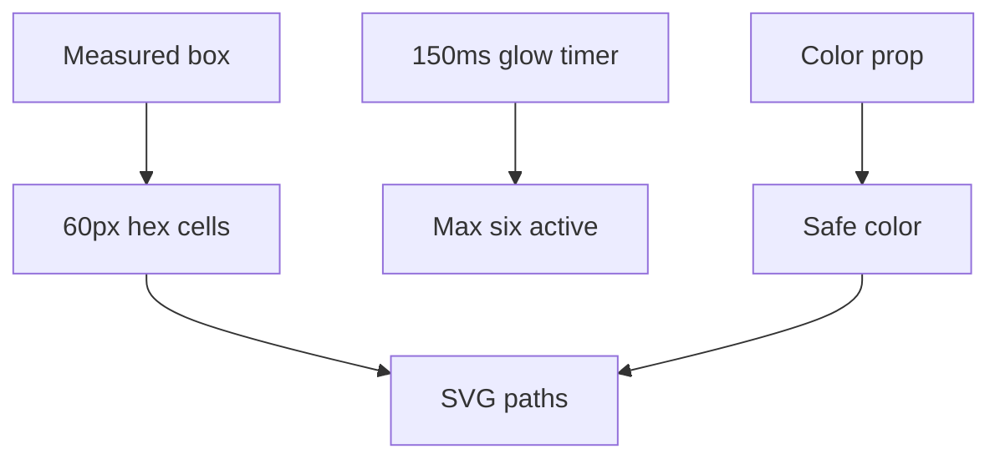

### Effect contract

- **Input:** cell size and safe color.
- **Output:** SVG hexagon grid.
- **Owner:** `src/components/effects/HexagonGrid.tsx`.
- **Evidence:** `src/components/tests/uncovered-components.test.tsx` covers default props, resize, color sanitization, glow timing, and cleanup.

### How it works

1. use a 60px default cell size.
2. rebuild cells from measured width and height.
3. queue highlights every 150ms.
4. cap active highlights at six.
5. strip unsafe color input before it reaches SVG.

### Source reading

- Read **cell size and safe color** at the component boundary, not in a screenshot.
- Trace the value to **SVG hexagon grid** and confirm its final DOM, SVG, canvas, or CSS state.
- Read the cleanup branch beside the setup branch. A hostile color string enters a style attribute or a timer survives teardown.
- The grid scales with its box and glow activity remains bounded.

### Example

```tsx
const safeColor = color.replace(/[^#(),.%\s\da-f]/gi, '');
const maxSimultaneous = 6;
const glowInterval = 150;
```

### Decision table

| Concern | Project decision | Evidence |
| --- | --- | --- |
| cell size and safe color | Read it at the owner boundary. | Focused component test. |
| SVG hexagon grid | Keep final content readable without the effect. | Browser assertion or screenshot. |
| Preference | Branch before starting repeated work. | Reduced-motion test. |
| Cleanup | Release every RAF, listener, timer, and resource. | Unmount or route test. |

### Why this is good

- SVG keeps edges sharp and lets the browser composite a small number of animated nodes.

### Checks

- Run the focused check named in `src/components/tests/uncovered-components.test.tsx` covers default props, resize, color sanitization, glow timing, and cleanup.
- Test the normal path and the failure path.
- Test dark and light themes when color or contrast is involved.
- Test a narrow viewport when dimensions or overflow are involved.
- Test reduced motion before approving repeated animation.

<a id="08--letterglitch-canvas-text"></a>
## 08 / LetterGlitch canvas text

LetterGlitch draws a changing glyph grid for headings and labels. The component owns resize, animation, color interpolation, and teardown.

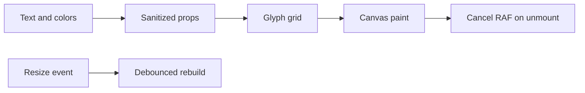

### Effect contract

- **Input:** text area and color props.
- **Output:** glitch glyph canvas.
- **Owner:** `src/components/effects/LetterGlitch.tsx`.
- **Evidence:** `src/components/tests/remaining-components.test.tsx` covers sanitization, resize, debounce, animation, and cleanup.

### How it works

1. use 16px font, 10px character width, and 20px character height.
2. randomize visible glyphs within the measured grid.
3. interpolate between sanitized colors.
4. debounce resize so layout changes do not rebuild every event.

### Source reading

- Read **text area and color props** at the component boundary, not in a screenshot.
- Trace the value to **glitch glyph canvas** and confirm its final DOM, SVG, canvas, or CSS state.
- Read the cleanup branch beside the setup branch. Color input becomes executable style text or repeated resize events create stacked listeners.
- The glyph texture stays inside its box and responds to resize without duplicate loops.

### Example

```tsx
const FONT_SIZE = 16;
const CHAR_WIDTH = 10;
const CHAR_HEIGHT = 20;
const safeColors = colors.map(sanitizeColor);
```

### Decision table

| Concern | Project decision | Evidence |
| --- | --- | --- |
| text area and color props | Read it at the owner boundary. | Focused component test. |
| glitch glyph canvas | Keep final content readable without the effect. | Browser assertion or screenshot. |
| Preference | Branch before starting repeated work. | Reduced-motion test. |
| Cleanup | Release every RAF, listener, timer, and resource. | Unmount or route test. |

### Why this is good

- The effect gives short labels a readable state change without moving their layout box.

### Checks

- Run the focused check named in `src/components/tests/remaining-components.test.tsx` covers sanitization, resize, debounce, animation, and cleanup.
- Test the normal path and the failure path.
- Test dark and light themes when color or contrast is involved.
- Test a narrow viewport when dimensions or overflow are involved.
- Test reduced motion before approving repeated animation.

<a id="09--scrollreveal-word-entrance"></a>
## 09 / ScrollReveal word entrance

ScrollReveal splits copy into words and reveals each word when its section enters the viewport. The effect adds hierarchy without changing the final text.

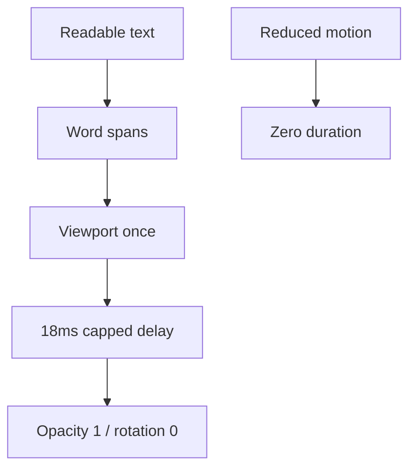

### Effect contract

- **Input:** viewport intersection.
- **Output:** word opacity and transform.
- **Owner:** `src/components/effects/ScrollReveal.tsx`.
- **Evidence:** `src/components/tests/source-enhancements.test.tsx` checks the component contract and rendered motion props.

### How it works

1. default base opacity is 0.25.
2. default rotation is 2 degrees.
3. blur strength defaults to 3px.
4. use `once` with a `-12% 0px` viewport margin.
5. cap word delay at 0.36 seconds.

### Source reading

- Read **viewport intersection** at the component boundary, not in a screenshot.
- Trace the value to **word opacity and transform** and confirm its final DOM, SVG, canvas, or CSS state.
- Read the cleanup branch beside the setup branch. A screen reader receives fragmented meaning or a hidden word never becomes visible.
- The text reaches full opacity in document order and remains readable before reveal.

### Example

```tsx
const words = text.split(' ');
const delay = Math.min(index * 0.018, 0.36);
<motion.span whileInView={{ opacity: 1, rotate: 0 }} />
```

### Decision table

| Concern | Project decision | Evidence |
| --- | --- | --- |
| viewport intersection | Read it at the owner boundary. | Focused component test. |
| word opacity and transform | Keep final content readable without the effect. | Browser assertion or screenshot. |
| Preference | Branch before starting repeated work. | Reduced-motion test. |
| Cleanup | Release every RAF, listener, timer, and resource. | Unmount or route test. |

### Why this is good

- The final state is ordinary text, so the effect adds rhythm rather than information debt.

### Checks

- Run the focused check named in `src/components/tests/source-enhancements.test.tsx` checks the component contract and rendered motion props.
- Test the normal path and the failure path.
- Test dark and light themes when color or contrast is involved.
- Test a narrow viewport when dimensions or overflow are involved.
- Test reduced motion before approving repeated animation.

<a id="10--scrollvelocityribbon"></a>
## 10 / ScrollVelocityRibbon

ScrollVelocityRibbon turns scroll velocity into a restrained marquee shift. It repeats children six times and stops on mobile or reduced motion.

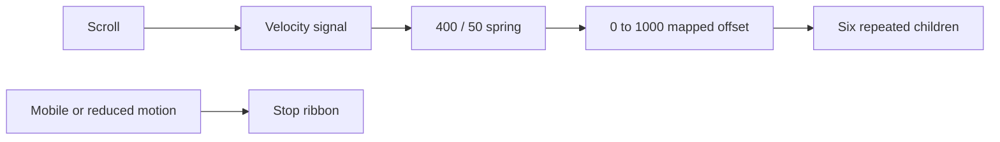

### Effect contract

- **Input:** scroll velocity.
- **Output:** horizontal ribbon transform.
- **Owner:** `src/components/effects/ScrollVelocityRibbon.tsx`.
- **Evidence:** `src/components/tests/source-enhancements.test.tsx` covers defaults, content repetition, and preference branches.

### How it works

1. default base velocity is 0.8.
2. default direction is left.
3. read `useScroll` and `useVelocity`.
4. smooth with stiffness 400 and damping 50.
5. map velocity across a 0 to 1000 range.
6. repeat children six times for a continuous track.

### Source reading

- Read **scroll velocity** at the component boundary, not in a screenshot.
- Trace the value to **horizontal ribbon transform** and confirm its final DOM, SVG, canvas, or CSS state.
- Read the cleanup branch beside the setup branch. The ribbon consumes pointer input, runs on a small viewport, or jumps when velocity returns to zero.
- Scroll input changes the ribbon while the text remains legible and bounded.

### Example

```tsx
const velocity = useVelocity(scrollY);
const smooth = useSpring(velocity, { stiffness: 400, damping: 50 });
const x = useTransform(smooth, [0, 1000], [0, 2]);
```

### Decision table

| Concern | Project decision | Evidence |
| --- | --- | --- |
| scroll velocity | Read it at the owner boundary. | Focused component test. |
| horizontal ribbon transform | Keep final content readable without the effect. | Browser assertion or screenshot. |
| Preference | Branch before starting repeated work. | Reduced-motion test. |
| Cleanup | Release every RAF, listener, timer, and resource. | Unmount or route test. |

### Why this is good

- The response makes scroll input visible without adding a second navigation system.

### Checks

- Run the focused check named in `src/components/tests/source-enhancements.test.tsx` covers defaults, content repetition, and preference branches.
- Test the normal path and the failure path.
- Test dark and light themes when color or contrast is involved.
- Test a narrow viewport when dimensions or overflow are involved.
- Test reduced motion before approving repeated animation.

<a id="11--page-transition-phases"></a>
## 11 / Page transition phases

Route transitions keep one overlay through cover, hold, and reveal. The provider controls timing; CSS controls the visible phase.

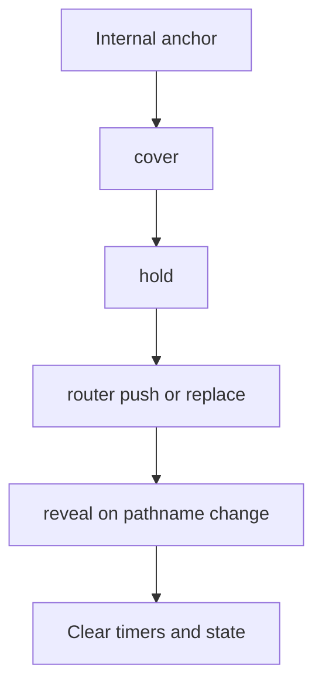

### Effect contract

- **Input:** internal link click.
- **Output:** route commit with overlay.
- **Owner:** `src/components/layout/PageTransition.tsx`, `PageTransitionOverlay.tsx`, and `page-transition-config.ts`.
- **Evidence:** `src/components/tests/page-transition.test.tsx` checks route mapping, phase order, video reuse, reduced motion, and cleanup.

### How it works

1. capture eligible internal anchor clicks.
2. select effect and video from route rules.
3. cover current content before router commit.
4. hold the same id and video across the commit.
5. start reveal after pathname change.
6. finish by clearing timers and refs.

### Source reading

- Read **internal link click** at the component boundary, not in a screenshot.
- Trace the value to **route commit with overlay** and confirm its final DOM, SVG, canvas, or CSS state.
- Read the cleanup branch beside the setup branch. A second click starts a duplicate transition or the overlay remains after a route error.
- One transition id follows the complete route change and the overlay disappears.

### Example

```tsx
type TransitionPhase = 'cover' | 'hold' | 'reveal';
const active = { effect, video, marqueeSeed, phase, id };
setTransition({ ...active, phase: 'hold' });
```

### Decision table

| Concern | Project decision | Evidence |
| --- | --- | --- |
| internal link click | Read it at the owner boundary. | Focused component test. |
| route commit with overlay | Keep final content readable without the effect. | Browser assertion or screenshot. |
| Preference | Branch before starting repeated work. | Reduced-motion test. |
| Cleanup | Release every RAF, listener, timer, and resource. | Unmount or route test. |

### Why this is good

- A state machine gives route motion a testable contract instead of scattered timeout calls.

### Checks

- Run the focused check named in `src/components/tests/page-transition.test.tsx` checks route mapping, phase order, video reuse, reduced motion, and cleanup.
- Test the normal path and the failure path.
- Test dark and light themes when color or contrast is involved.
- Test a narrow viewport when dimensions or overflow are involved.
- Test reduced motion before approving repeated animation.

<a id="12--transition-effect-families"></a>
## 12 / Transition effect families

The transition config names five families: letterbox, monocolor-wipe, black-white-slice, marquee-stripes, and loading-screen.

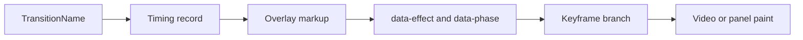

### Effect contract

- **Input:** `TransitionName`.
- **Output:** CSS data-effect branch.
- **Owner:** `src/components/layout/page-transition-config.ts` and transition selectors in `src/app/globals.css`.
- **Evidence:** `src/components/tests/page-transition.test.tsx` asserts route-specific effect choices and timing behavior.

### How it works

1. letterbox uses 620ms cover and 700ms reveal.
2. monocolor-wipe uses 3760ms cover and 900ms reveal.
3. black-white-slice uses 600ms cover and 680ms reveal.
4. marquee-stripes uses 680ms cover and 760ms reveal.
5. loading-screen uses 3000ms cover and 650ms reveal.

### Source reading

- Read **`TransitionName`** at the component boundary, not in a screenshot.
- Trace the value to **CSS data-effect branch** and confirm its final DOM, SVG, canvas, or CSS state.
- Read the cleanup branch beside the setup branch. A new name has no CSS branch or a timing change breaks the cover/reveal handoff.
- The data attribute, timing record, and overlay markup agree for every named effect.

### Example

```tsx
const effects: TransitionName[] = ['letterbox', 'monocolor-wipe', 'black-white-slice', 'marquee-stripes', 'loading-screen'];
<div data-effect={active.effect} data-phase={active.phase} />
```

### Decision table

| Concern | Project decision | Evidence |
| --- | --- | --- |
| `TransitionName` | Read it at the owner boundary. | Focused component test. |
| CSS data-effect branch | Keep final content readable without the effect. | Browser assertion or screenshot. |
| Preference | Branch before starting repeated work. | Reduced-motion test. |
| Cleanup | Release every RAF, listener, timer, and resource. | Unmount or route test. |

### Why this is good

- One typed union makes missing visual branches visible during review and type checking.

### Checks

- Run the focused check named in `src/components/tests/page-transition.test.tsx` asserts route-specific effect choices and timing behavior.
- Test the normal path and the failure path.
- Test dark and light themes when color or contrast is involved.
- Test a narrow viewport when dimensions or overflow are involved.
- Test reduced motion before approving repeated animation.

<a id="13--gameloadingscreen-progress-and-exit"></a>
## 13 / GameLoadingScreen progress and exit

GameLoadingScreen combines an image, message, percentage, and progress line. Progress is time-based and the exit class gets its own short motion.

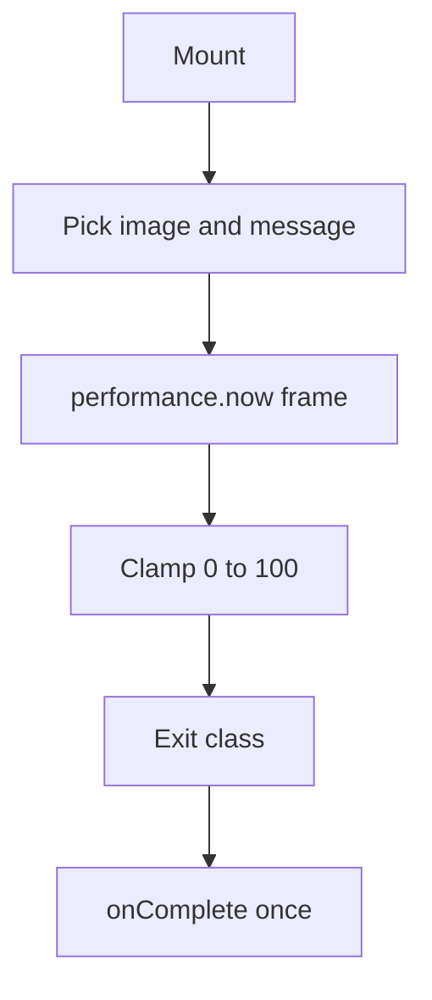

### Effect contract

- **Input:** mount and elapsed time.
- **Output:** loading state then completion.
- **Owner:** `src/components/loading-screen/GameLoadingScreen.tsx` and `GameLoadingScreen.css`.
- **Evidence:** `src/components/tests/coverage-gaps.test.tsx` covers image choice, progress, completion callback, and timer cleanup.

### How it works

1. pick theme-specific image and message after a zero-delay task.
2. use `performance.now()` for progress frames.
3. default duration is 3000ms.
4. set leaving state at 100 percent.
5. call `onComplete` after the exit window.

### Source reading

- Read **mount and elapsed time** at the component boundary, not in a screenshot.
- Trace the value to **loading state then completion** and confirm its final DOM, SVG, canvas, or CSS state.
- Read the cleanup branch beside the setup branch. A fake timer receives a stale callback or completion fires after unmount.
- The screen reports progress, exits once, and calls completion exactly once.

### Example

```tsx
const duration = durationMs ?? 3000;
const percent = Math.min(100, ((now - start) / duration) * 100);
if (percent >= 100) setLeaving(true);
```

### Decision table

| Concern | Project decision | Evidence |
| --- | --- | --- |
| mount and elapsed time | Read it at the owner boundary. | Focused component test. |
| loading state then completion | Keep final content readable without the effect. | Browser assertion or screenshot. |
| Preference | Branch before starting repeated work. | Reduced-motion test. |
| Cleanup | Release every RAF, listener, timer, and resource. | Unmount or route test. |

### Why this is good

- The screen gives slow route work a clear boundary without pretending that a percentage measures network bytes.

### Checks

- Run the focused check named in `src/components/tests/coverage-gaps.test.tsx` covers image choice, progress, completion callback, and timer cleanup.
- Test the normal path and the failure path.
- Test dark and light themes when color or contrast is involved.
- Test a narrow viewport when dimensions or overflow are involved.
- Test reduced motion before approving repeated animation.

<a id="14--sololevelingboot-and-matrixrain"></a>
## 14 / SoloLevelingBoot and MatrixRain

The boot screen layers a status panel, scan lines, rune texture, cursor, and MatrixRain. Its CSS-in-TS styles include their own reduced-motion branch.

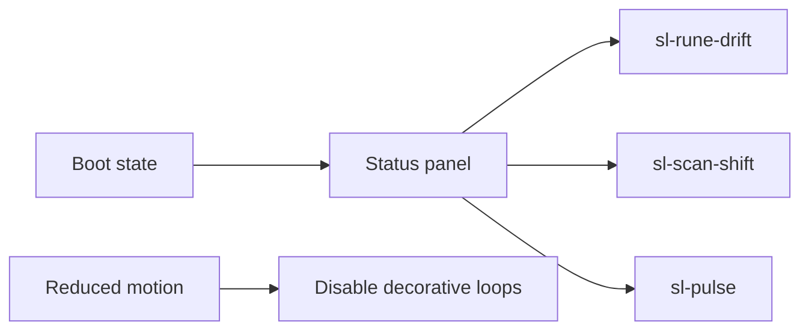

### Effect contract

- **Input:** boot phase and theme.
- **Output:** status console surface.
- **Owner:** `src/components/loading-screen/SoloLevelingBoot.tsx`, `solo-leveling-boot-styles.ts`, and `MatrixRain.tsx`.
- **Evidence:** `src/components/tests/component-depth.test.tsx` checks boot rendering, reduced motion, overlay timing, and MatrixRain paths.

### How it works

1. animate rune background with `sl-rune-drift`.
2. move scan texture with `sl-scan-shift`.
3. pulse the status dot with `sl-pulse`.
4. blink the cursor with `sl-blink`.
5. disable those animations under the preference media query.

### Source reading

- Read **boot phase and theme** at the component boundary, not in a screenshot.
- Trace the value to **status console surface** and confirm its final DOM, SVG, canvas, or CSS state.
- Read the cleanup branch beside the setup branch. A scan layer obscures status text or a media query leaves a flashing cursor active.
- Boot content is present as text and the visual layers are optional decoration.

### Example

```tsx
const bootMotion = prefersReducedMotion ? 'none' : 'sl-scan-shift 2.8s linear infinite';
<span className="sl-status-code">SYSTEM READY</span>
```

### Decision table

| Concern | Project decision | Evidence |
| --- | --- | --- |
| boot phase and theme | Read it at the owner boundary. | Focused component test. |
| status console surface | Keep final content readable without the effect. | Browser assertion or screenshot. |
| Preference | Branch before starting repeated work. | Reduced-motion test. |
| Cleanup | Release every RAF, listener, timer, and resource. | Unmount or route test. |

### Why this is good

- The status surface explains what is happening while motion supplies atmosphere rather than meaning.

### Checks

- Run the focused check named in `src/components/tests/component-depth.test.tsx` checks boot rendering, reduced motion, overlay timing, and MatrixRain paths.
- Test the normal path and the failure path.
- Test dark and light themes when color or contrast is involved.
- Test a narrow viewport when dimensions or overflow are involved.
- Test reduced motion before approving repeated animation.

<a id="15--aboutparticlefield-webgl-fallback"></a>
## 15 / AboutParticleField WebGL fallback

AboutParticleField uses a WebGL renderer when the browser supports it. It keeps the component mounted as a visual layer and returns cleanly when renderer setup fails.

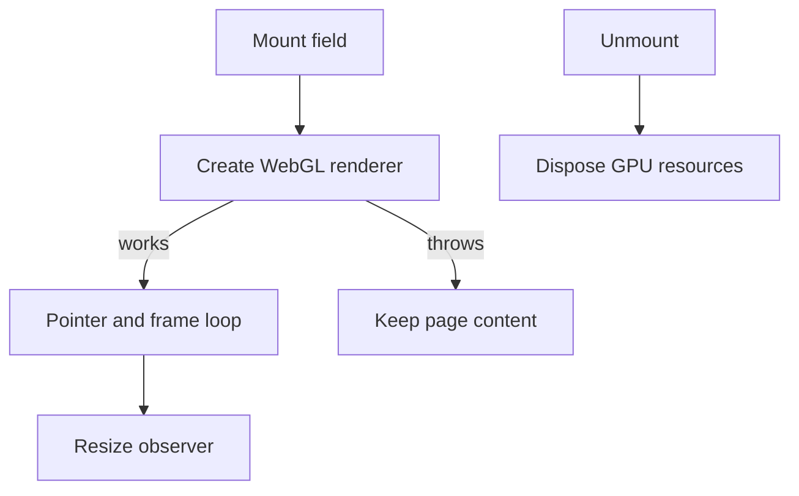

### Effect contract

- **Input:** WebGL capability and pointer.
- **Output:** interactive particle field.
- **Owner:** `src/components/about/AboutParticleField.tsx`.
- **Evidence:** `src/components/tests/coverage-gaps.test.tsx` covers renderer setup, pointer movement, resize, reduced motion, and cleanup.

### How it works

1. create renderer inside a guarded setup branch.
2. update pointer coordinates from the canvas region.
3. resize camera and renderer with the box.
4. stop animation for reduced motion.
5. dispose renderer resources on teardown.

### Source reading

- Read **WebGL capability and pointer** at the component boundary, not in a screenshot.
- Trace the value to **interactive particle field** and confirm its final DOM, SVG, canvas, or CSS state.
- Read the cleanup branch beside the setup branch. A renderer exception breaks the route or GPU resources remain after navigation.
- WebGL adds depth where available, while text and controls remain usable where it is absent.

### Example

```tsx
let renderer: WebGLRenderer | null = null;
try { renderer = new WebGLRenderer({ alpha: true }); }
catch { return; }
return () => renderer?.dispose();
```

### Decision table

| Concern | Project decision | Evidence |
| --- | --- | --- |
| WebGL capability and pointer | Read it at the owner boundary. | Focused component test. |
| interactive particle field | Keep final content readable without the effect. | Browser assertion or screenshot. |
| Preference | Branch before starting repeated work. | Reduced-motion test. |
| Cleanup | Release every RAF, listener, timer, and resource. | Unmount or route test. |

### Why this is good

- Progressive enhancement lets a visual capability fail without turning into a content failure.

### Checks

- Run the focused check named in `src/components/tests/coverage-gaps.test.tsx` covers renderer setup, pointer movement, resize, reduced motion, and cleanup.
- Test the normal path and the failure path.
- Test dark and light themes when color or contrast is involved.
- Test a narrow viewport when dimensions or overflow are involved.
- Test reduced motion before approving repeated animation.

<a id="16--clickspark-pointer-feedback"></a>
## 16 / ClickSpark pointer feedback

ClickSpark draws a short radial response at the pointer target. The effect confirms a click without changing the control label or focus order.

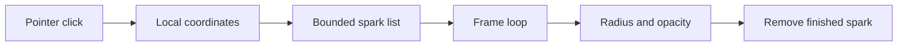

### Effect contract

- **Input:** pointer click.
- **Output:** temporary spark particles.
- **Owner:** `src/components/contact/ClickSpark.tsx`.
- **Evidence:** `src/components/tests/coverage-gaps.test.tsx` checks click registration, canvas creation, and animation cleanup.

### How it works

1. attach the handler to the intended surface.
2. create a bounded spark list at the click point.
3. animate opacity and radius with requestAnimationFrame.
4. remove finished sparks.
5. cancel the frame on unmount.

### Source reading

- Read **pointer click** at the component boundary, not in a screenshot.
- Trace the value to **temporary spark particles** and confirm its final DOM, SVG, canvas, or CSS state.
- Read the cleanup branch beside the setup branch. The overlay captures pointer input or an old frame keeps repainting an unmounted canvas.
- The click remains a normal click and the spark disappears without leaving DOM nodes.

### Example

```tsx
const sparks = useRef<Spark[]>([]);
const onClick = (event: MouseEvent) => sparks.current.push(toSpark(event));
frame.current = requestAnimationFrame(draw);
```

### Decision table

| Concern | Project decision | Evidence |
| --- | --- | --- |
| pointer click | Read it at the owner boundary. | Focused component test. |
| temporary spark particles | Keep final content readable without the effect. | Browser assertion or screenshot. |
| Preference | Branch before starting repeated work. | Reduced-motion test. |
| Cleanup | Release every RAF, listener, timer, and resource. | Unmount or route test. |

### Why this is good

- Short feedback reduces uncertainty on a command surface while preserving native control behavior.

### Checks

- Run the focused check named in `src/components/tests/coverage-gaps.test.tsx` checks click registration, canvas creation, and animation cleanup.
- Test the normal path and the failure path.
- Test dark and light themes when color or contrast is involved.
- Test a narrow viewport when dimensions or overflow are involved.
- Test reduced motion before approving repeated animation.

<a id="17--bongocat-svg-typing-loop"></a>
## 17 / BongoCat SVG typing loop

BongoCat animates SVG strokes and alternating paws. Each code line has a named keyframe, so the sequence reads as typing rather than random flashing.

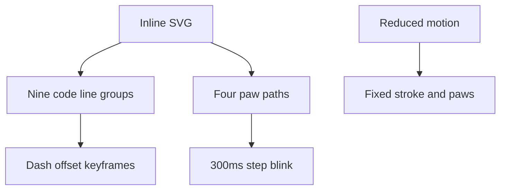

### Effect contract

- **Input:** CSS timeline.
- **Output:** stroke reveal and paw alternation.
- **Owner:** `src/components/home/BongoCat.tsx` and `src/components/home/bongo-cat-styles.ts`.
- **Evidence:** `src/components/tests/remaining-components.test.tsx` covers the SVG surface, styles, and reduced-motion fallback.

### How it works

1. run typing animation for 1.2 seconds.
2. reveal nine line groups with staggered dash offsets.
3. blink paw groups every 300ms with a 150ms offset pair.
4. use `bongo-scan` for the scan highlight.
5. show a stable paw state when motion is reduced.

### Source reading

- Read **CSS timeline** at the component boundary, not in a screenshot.
- Trace the value to **stroke reveal and paw alternation** and confirm its final DOM, SVG, canvas, or CSS state.
- Read the cleanup branch beside the setup branch. The typing loop flashes every element together or leaves both paws hidden.
- The SVG has a static readable state and animation only changes strokes and paw opacity.

### Example

```tsx
.typing-animation { animation-duration: 1.2s; animation-iteration-count: infinite; }
#f1-l1 { animation-name: typing-f1-l1; }
#paw-right--up { animation-delay: 150ms; }
```

### Decision table

| Concern | Project decision | Evidence |
| --- | --- | --- |
| CSS timeline | Read it at the owner boundary. | Focused component test. |
| stroke reveal and paw alternation | Keep final content readable without the effect. | Browser assertion or screenshot. |
| Preference | Branch before starting repeated work. | Reduced-motion test. |
| Cleanup | Release every RAF, listener, timer, and resource. | Unmount or route test. |

### Why this is good

- A deterministic sequence makes the illustration legible and gives the landing page a small human cue.

### Checks

- Run the focused check named in `src/components/tests/remaining-components.test.tsx` covers the SVG surface, styles, and reduced-motion fallback.
- Test the normal path and the failure path.
- Test dark and light themes when color or contrast is involved.
- Test a narrow viewport when dimensions or overflow are involved.
- Test reduced motion before approving repeated animation.

<a id="18--carousel-ticker-and-marquee-motion"></a>
## 18 / Carousel, ticker, and marquee motion

TechCarousel, MetricsTicker, and shared CSS tracks move repeated content across a fixed visual lane. Repetition must include readable labels and a pause path where the component supports it.

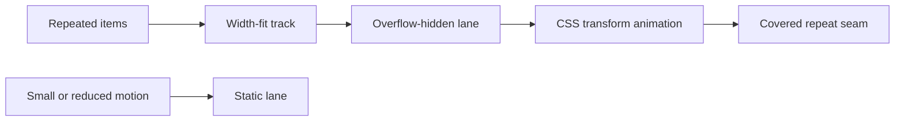

### Effect contract

- **Input:** repeated items.
- **Output:** horizontal track.
- **Owner:** `src/components/home/TechCarousel.tsx`, `MetricsTicker.tsx`, `src/app/globals.css`, and `ScrollVelocityRibbon.tsx`.
- **Evidence:** `src/components/tests/uncovered-components.test.tsx` and browser visual specs cover the home motion surfaces.

### How it works

1. duplicate enough items to cover the viewport.
2. use `scroll`, `marquee-left`, or `marquee-right` for CSS tracks.
3. keep card widths stable during translation.
4. set `will-change: transform` only on moving tracks.
5. stop or reduce motion for the user preference.

### Source reading

- Read **repeated items** at the component boundary, not in a screenshot.
- Trace the value to **horizontal track** and confirm its final DOM, SVG, canvas, or CSS state.
- Read the cleanup branch beside the setup branch. The track creates horizontal page scroll or a duplicate item looks like a second data record.
- The seam is hidden, labels remain readable, and the track does not widen the document.

### Example

```tsx
.carousel-track { display: flex; width: fit-content; animation: scroll 30s linear infinite; }
.carousel-track-right { animation: marquee-right 40s linear infinite; }
.carousel-track-left { animation: marquee-left 40s linear infinite; }
```

### Decision table

| Concern | Project decision | Evidence |
| --- | --- | --- |
| repeated items | Read it at the owner boundary. | Focused component test. |
| horizontal track | Keep final content readable without the effect. | Browser assertion or screenshot. |
| Preference | Branch before starting repeated work. | Reduced-motion test. |
| Cleanup | Release every RAF, listener, timer, and resource. | Unmount or route test. |

### Why this is good

- A moving lane adds rhythm while the repeated content stays supplemental to headings and controls.

### Checks

- Run the focused check named in `src/components/tests/uncovered-components.test.tsx` and browser visual specs cover the home motion surfaces.
- Test the normal path and the failure path.
- Test dark and light themes when color or contrast is involved.
- Test a narrow viewport when dimensions or overflow are involved.
- Test reduced motion before approving repeated animation.

<a id="19--css-keyframes-and-data-attributes"></a>
## 19 / CSS keyframes and data attributes

Global CSS owns reusable keyframes. Data attributes select route phases so one overlay can render several effect families without duplicate component trees.

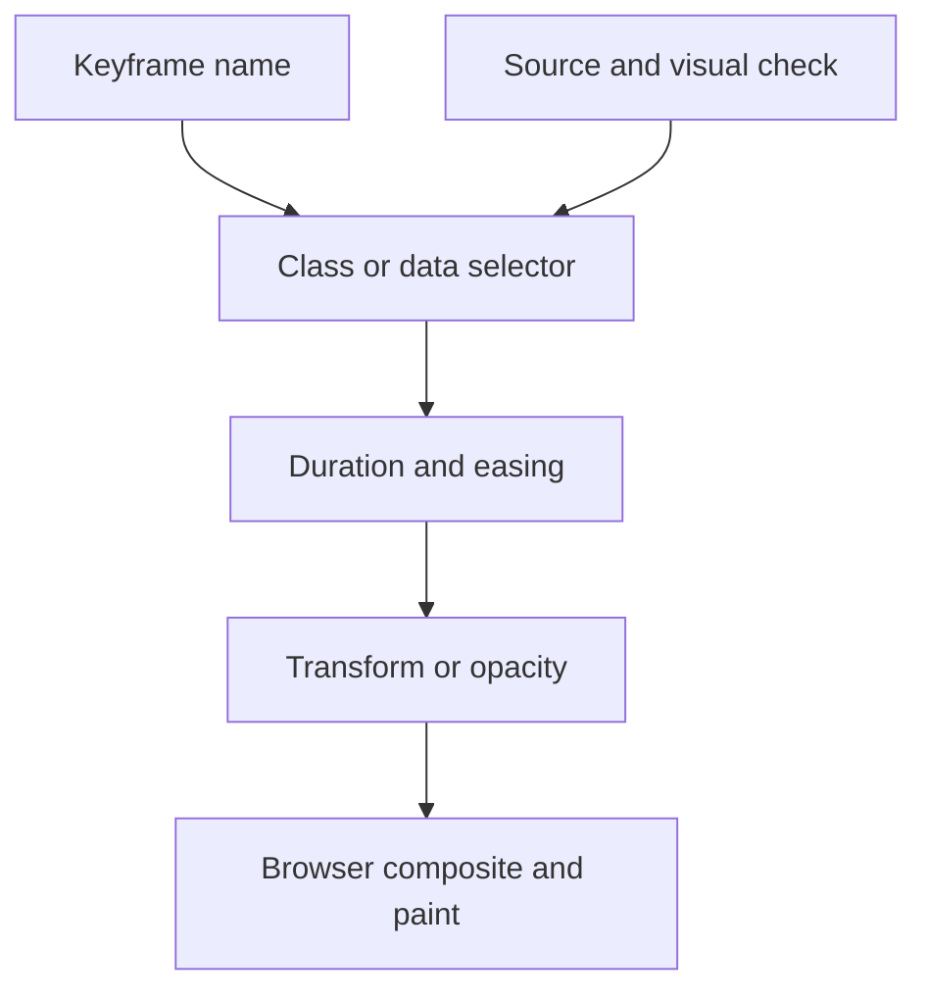

### Effect contract

- **Input:** class and data attributes.
- **Output:** computed animation rule.
- **Owner:** `src/app/globals.css` lines 251-318 and component-local style files.
- **Evidence:** `pnpm run docs:check`, visual snapshots, and component tests catch missing names or visible regressions.

### How it works

1. use named keyframes for one visual purpose.
2. select route behavior with `[data-effect]` and `[data-phase]`.
3. keep durations beside the transition config.
4. use transforms and opacity for composited motion.
5. leave final layout properties stable.

### Source reading

- Read **class and data attributes** at the component boundary, not in a screenshot.
- Trace the value to **computed animation rule** and confirm its final DOM, SVG, canvas, or CSS state.
- Read the cleanup branch beside the setup branch. A spelling mismatch silently removes motion or a paint-heavy property causes frame drops.
- A source search finds the keyframe definition, selector, owner, and check.

### Example

```tsx
@keyframes clip-intro {
  from { opacity: 0; transform: scale(0.96) translateY(10px); }
  to { opacity: 1; transform: scale(1) translateY(0); }
}
.animate-clip-intro { animation: clip-intro 0.35s ease-out forwards; }
```

### Decision table

| Concern | Project decision | Evidence |
| --- | --- | --- |
| class and data attributes | Read it at the owner boundary. | Focused component test. |
| computed animation rule | Keep final content readable without the effect. | Browser assertion or screenshot. |
| Preference | Branch before starting repeated work. | Reduced-motion test. |
| Cleanup | Release every RAF, listener, timer, and resource. | Unmount or route test. |

### Why this is good

- Naming and selectors make visual behavior searchable and reviewable.

### Checks

- Run the focused check named in `pnpm run docs:check`, visual snapshots, and component tests catch missing names or visible regressions.
- Test the normal path and the failure path.
- Test dark and light themes when color or contrast is involved.
- Test a narrow viewport when dimensions or overflow are involved.
- Test reduced motion before approving repeated animation.

<a id="20--theme-interaction-and-color-safety"></a>
## 20 / Theme interaction and color safety

Dark and light themes change tokens and selected effect colors. User-controlled color props are sanitized before reaching SVG or canvas paint.

```mermaid
flowchart LR
    THEME[Theme class] --> TOKENS[CSS variables]
    TOKENS --> COLOR[Effect color]
    PROP[Color prop] --> SANITIZE[Sanitize]
    SANITIZE --> SVG[SVG or canvas attribute]
    COLOR --> CONTRAST[Light and dark check]
```

### Effect contract

- **Input:** theme class and color prop.
- **Output:** legible contrast.
- **Owner:** `src/app/globals.css`, `HexagonGrid.tsx`, `LetterGlitch.tsx`, `ThemeProvider.tsx`, and `ThemeToggle.tsx`.
- **Evidence:** `src/components/tests/uncovered-components.test.tsx` and `remaining-components.test.tsx` cover color handling and theme branches.

### How it works

1. use CSS variables for shared ink and accent colors.
2. switch canvas RGB values for light versus dark.
3. sanitize values before interpolation or SVG attributes.
4. check focus and text contrast in both themes.
5. avoid animation that hides a theme change.

### Source reading

- Read **theme class and color prop** at the component boundary, not in a screenshot.
- Trace the value to **legible contrast** and confirm its final DOM, SVG, canvas, or CSS state.
- Read the cleanup branch beside the setup branch. A light background keeps a dark-only glow or unsafe text enters a style boundary.
- The effect remains visible but subordinate in both color modes.

### Example

```tsx
const particleColor = theme === 'light' ? '59,130,246' : '147,51,234';
const safe = sanitizeColor(userColor);
context.fillStyle = `rgb(${safe})`;
```

### Decision table

| Concern | Project decision | Evidence |
| --- | --- | --- |
| theme class and color prop | Read it at the owner boundary. | Focused component test. |
| legible contrast | Keep final content readable without the effect. | Browser assertion or screenshot. |
| Preference | Branch before starting repeated work. | Reduced-motion test. |
| Cleanup | Release every RAF, listener, timer, and resource. | Unmount or route test. |

### Why this is good

- Theme-aware motion keeps identity consistent while preserving contrast and input safety.

### Checks

- Run the focused check named in `src/components/tests/uncovered-components.test.tsx` and `remaining-components.test.tsx` cover color handling and theme branches.
- Test the normal path and the failure path.
- Test dark and light themes when color or contrast is involved.
- Test a narrow viewport when dimensions or overflow are involved.
- Test reduced motion before approving repeated animation.

<a id="21--reduced-motion-contract"></a>
## 21 / Reduced motion contract

Reduced motion is a behavior branch, not a final note. CSS media queries and runtime preference checks stop loops, shorten entrances, or keep a stable frame.

```mermaid
flowchart TD
    PREF[Motion preference] --> CHECK{Reduced?}
    CHECK -->|yes| STATIC[Static final state]
    CHECK -->|no| LOOP[Animated state]
    BOTH[Content and controls] --> CHECK
    BOTH --> ACCESS[Same semantic surface]
```

### Effect contract

- **Input:** `prefers-reduced-motion`.
- **Output:** static or short visual state.
- **Owner:** `src/app/globals.css`, `GameLoadingScreen.css`, `solo-leveling-boot-styles.ts`, and effect components.
- **Evidence:** `src/components/tests/uncovered-components.test.tsx`, `component-depth.test.tsx`, and browser accessibility specs.

### How it works

1. disable global ambient loops.
2. skip canvas animation when the hook reports reduced motion.
3. remove ribbon motion on mobile and reduced motion.
4. keep final SVG stroke state visible.
5. hide route overlay before it captures input.

### Source reading

- Read **`prefers-reduced-motion`** at the component boundary, not in a screenshot.
- Trace the value to **static or short visual state** and confirm its final DOM, SVG, canvas, or CSS state.
- Read the cleanup branch beside the setup branch. Only one animation stops while a nested loop continues or the final content becomes hidden.
- The visitor still sees content, progress, and controls with no repeated movement.

### Example

```tsx
const reduced = useReducedMotion();
if (reduced) return <StaticLayer />;
@media (prefers-reduced-motion: reduce) { .effect { animation: none !important; } }
```

### Decision table

| Concern | Project decision | Evidence |
| --- | --- | --- |
| `prefers-reduced-motion` | Read it at the owner boundary. | Focused component test. |
| static or short visual state | Keep final content readable without the effect. | Browser assertion or screenshot. |
| Preference | Branch before starting repeated work. | Reduced-motion test. |
| Cleanup | Release every RAF, listener, timer, and resource. | Unmount or route test. |

### Why this is good

- The preference branch turns motion into a removable presentation layer.

### Checks

- Run the focused check named in `src/components/tests/uncovered-components.test.tsx`, `component-depth.test.tsx`, and browser accessibility specs.
- Test the normal path and the failure path.
- Test dark and light themes when color or contrast is involved.
- Test a narrow viewport when dimensions or overflow are involved.
- Test reduced motion before approving repeated animation.

<a id="22--performance-and-cleanup-rules"></a>
## 22 / Performance and cleanup rules

Every effect has a budget: one loop, bounded arrays, passive input, and a complete cleanup path. The goal is stable interaction, not maximum activity.

```mermaid
flowchart LR
    SETUP[Setup] --> OWNER[Effect owner]
    OWNER --> WORK[RAF listener timer or GPU]
    WORK --> RESULT[Visible result]
    UNMOUNT[Unmount or route change] --> CLEAN[Cancel remove clear dispose]
    CLEAN --> READY[No stale work]
```

### Effect contract

- **Input:** frame, event, timer, or GPU resource.
- **Output:** released owner.
- **Owner:** Canvas effects, `PageTransition.tsx`, loading screens, and `AboutParticleField.tsx`.
- **Evidence:** Component tests use fake timers, mocked RAF, mocked canvas, resize events, and unmount assertions.

### How it works

1. cancel RAF handles on unmount.
2. remove document and window listeners with the same function reference.
3. clear cover, reveal, and failsafe timers.
4. pause hidden-document canvas loops.
5. dispose WebGL resources.
6. bound particles, sparks, and highlighted cells.

### Source reading

- Read **frame, event, timer, or GPU resource** at the component boundary, not in a screenshot.
- Trace the value to **released owner** and confirm its final DOM, SVG, canvas, or CSS state.
- Read the cleanup branch beside the setup branch. A test passes once but leaks work after repeated navigation or resize.
- Mount, interact, resize, hide, and unmount produce no duplicate work.

### Example

```tsx
useEffect(() => {
  const id = requestAnimationFrame(draw);
  return () => cancelAnimationFrame(id);
}, [draw]);
```

### Decision table

| Concern | Project decision | Evidence |
| --- | --- | --- |
| frame, event, timer, or GPU resource | Read it at the owner boundary. | Focused component test. |
| released owner | Keep final content readable without the effect. | Browser assertion or screenshot. |
| Preference | Branch before starting repeated work. | Reduced-motion test. |
| Cleanup | Release every RAF, listener, timer, and resource. | Unmount or route test. |

### Why this is good

- Cleanup is part of the effect contract; it protects route changes and long sessions.

### Checks

- Run the focused check named in Component tests use fake timers, mocked RAF, mocked canvas, resize events, and unmount assertions.
- Test the normal path and the failure path.
- Test dark and light themes when color or contrast is involved.
- Test a narrow viewport when dimensions or overflow are involved.
- Test reduced motion before approving repeated animation.

<a id="23--visual-test-strategy"></a>
## 23 / Visual test strategy

Visual effects need three forms of evidence: component behavior, browser pixels, and accessibility semantics. A screenshot alone cannot prove cleanup or focus.

```mermaid
flowchart TD
    CHANGE[Effect change] --> UNIT[Component test]
    CHANGE --> PIXEL[Visual snapshot]
    CHANGE --> A11Y[Accessibility check]
    CHANGE --> E2E[Route interaction]
    UNIT --> REVIEW[Review combined evidence]
    PIXEL --> REVIEW
    A11Y --> REVIEW
    E2E --> REVIEW
```

### Effect contract

- **Input:** effect change.
- **Output:** behavior plus visual evidence.
- **Owner:** `src/components/tests/`, `tests/visual/`, `tests/accessibility/`, and `tests/e2e/`.
- **Evidence:** `pnpm run test`, `pnpm run test:visual`, `pnpm run test:accessibility`, and `pnpm run test:e2e`.

### How it works

1. unit test props, branches, and cleanup.
2. run Chromium visual snapshots for desktop and mobile.
3. run accessibility assertions for roles, names, focus, and contrast.
4. exercise route transitions through real clicks.
5. inspect screenshot diffs before updating baselines.

### Source reading

- Read **effect change** at the component boundary, not in a screenshot.
- Trace the value to **behavior plus visual evidence** and confirm its final DOM, SVG, canvas, or CSS state.
- Read the cleanup branch beside the setup branch. A passing unit test hides a clipped mobile track or a focus trap.
- A change has a narrow assertion and a rendered browser check when pixels or timing matter.

### Example

```tsx
await expect(page.locator('[data-testid="scroll-progress"]')).toBeVisible();
await expect(page).toHaveScreenshot('home-effects.png');
await expect(page.getByRole('button')).toBeFocused();
```

### Decision table

| Concern | Project decision | Evidence |
| --- | --- | --- |
| effect change | Read it at the owner boundary. | Focused component test. |
| behavior plus visual evidence | Keep final content readable without the effect. | Browser assertion or screenshot. |
| Preference | Branch before starting repeated work. | Reduced-motion test. |
| Cleanup | Release every RAF, listener, timer, and resource. | Unmount or route test. |

### Why this is good

- Layered evidence catches logic, layout, and interaction failures at their source.

### Checks

- Run the focused check named in `pnpm run test`, `pnpm run test:visual`, `pnpm run test:accessibility`, and `pnpm run test:e2e`.
- Test the normal path and the failure path.
- Test dark and light themes when color or contrast is involved.
- Test a narrow viewport when dimensions or overflow are involved.
- Test reduced motion before approving repeated animation.

<a id="24--qa-and-ci-evidence"></a>
## 24 / QA and CI evidence

Quality checks turn effect documentation into a repeatable gate. Local commands and GitHub Actions use matching package scripts where practical.

```mermaid
flowchart LR
    PR[Pull request] --> DOCS[Docs check]
    PR --> CODE[Lint type tests]
    PR --> BROWSER[Visual and accessibility]
    DOCS --> ARTIFACT[Reports and screenshots]
    CODE --> ARTIFACT
    BROWSER --> ARTIFACT
    ARTIFACT --> GATE[CI status]
```

### Effect contract

- **Input:** pull request or local branch.
- **Output:** reports and pass/fail status.
- **Owner:** `.github/workflows/ci.yml`, `.github/workflows/frontend-qa.yml`, `package.json`, and `scripts/qa/`.
- **Evidence:** `pnpm run quality:full` runs docs, lint, tests, quality metrics, and build; browser suites run in their dedicated commands.

### How it works

1. check docs line count, links, diagrams, and fences.
2. lint and type check source.
3. run Jest, Vitest, and Node tests.
4. run quality metrics and security review.
5. build before production-browser or Lighthouse work.
6. save screenshots and reports as artifacts.

### Source reading

- Read **pull request or local branch** at the component boundary, not in a screenshot.
- Trace the value to **reports and pass/fail status** and confirm its final DOM, SVG, canvas, or CSS state.
- Read the cleanup branch beside the setup branch. CI tests a different Node version, package manager, or build mode than local work.
- A failed visual or docs contract blocks the same change that introduced it.

### Example

```tsx
pnpm run docs:check
pnpm run test:visual
pnpm run test:accessibility
pnpm run quality:full
```

### Decision table

| Concern | Project decision | Evidence |
| --- | --- | --- |
| pull request or local branch | Read it at the owner boundary. | Focused component test. |
| reports and pass/fail status | Keep final content readable without the effect. | Browser assertion or screenshot. |
| Preference | Branch before starting repeated work. | Reduced-motion test. |
| Cleanup | Release every RAF, listener, timer, and resource. | Unmount or route test. |

### Why this is good

- A visible artifact shortens review time and makes a failure reproducible.

### Checks

- Run the focused check named in `pnpm run quality:full` runs docs, lint, tests, quality metrics, and build; browser suites run in their dedicated commands.
- Test the normal path and the failure path.
- Test dark and light themes when color or contrast is involved.
- Test a narrow viewport when dimensions or overflow are involved.
- Test reduced motion before approving repeated animation.

<a id="25--troubleshooting-by-symptom"></a>
## 25 / Troubleshooting by symptom

Start with the visible symptom, then inspect the owner and state boundary. Avoid changing easing or z-index before proving the event, phase, and cleanup path.

```mermaid
flowchart TD
    SYMPTOM[Visible symptom] --> OWNER[Find effect owner]
    OWNER --> STATE[Inspect state and preference]
    STATE --> FOCUSED[Run focused test]
    FOCUSED --> BROWSER[Reproduce in browser]
    BROWSER --> FIX[Small source fix]
```

### Effect contract

- **Input:** failure symptom.
- **Output:** smallest corrective check.
- **Owner:** The source map below plus the matching component and test file.
- **Evidence:** Use the focused command first, then the browser suite that owns the visible behavior.

### How it works

1. blank canvas: inspect context creation and dimensions.
2. stale overlay: inspect transition timers and pathname change.
3. horizontal overflow: inspect track width and overflow mask.
4. flashing under reduced motion: inspect nested selectors.
5. mobile crop: inspect breakpoint and screenshot viewport.
6. missing glow: inspect sanitized color and active-count limit.

### Source reading

- Read **failure symptom** at the component boundary, not in a screenshot.
- Trace the value to **smallest corrective check** and confirm its final DOM, SVG, canvas, or CSS state.
- Read the cleanup branch beside the setup branch. A broad CSS change hides the symptom but leaves the state bug.
- The first check narrows the owner before any broad rewrite.

### Example

```tsx
const checks = {
  canvas: 'context and resize',
  transition: 'phase and timers',
  ribbon: 'overflow and width',
};
```

### Decision table

| Concern | Project decision | Evidence |
| --- | --- | --- |
| failure symptom | Read it at the owner boundary. | Focused component test. |
| smallest corrective check | Keep final content readable without the effect. | Browser assertion or screenshot. |
| Preference | Branch before starting repeated work. | Reduced-motion test. |
| Cleanup | Release every RAF, listener, timer, and resource. | Unmount or route test. |

### Why this is good

- Symptom-first triage keeps fixes small and evidence-based.

### Checks

- Run the focused check named in Use the focused command first, then the browser suite that owns the visible behavior.
- Test the normal path and the failure path.
- Test dark and light themes when color or contrast is involved.
- Test a narrow viewport when dimensions or overflow are involved.
- Test reduced motion before approving repeated animation.

<a id="26--review-checklist-and-change-protocol"></a>
## 26 / Review checklist and change protocol

Use this sequence when changing any animated effect. It keeps source, documentation, tests, and README navigation aligned.

```mermaid
flowchart LR
    PLAN[Effect edit] --> SOURCE[Owner and source rule]
    SOURCE --> STATES[Theme mobile motion states]
    STATES --> TEST[Test and screenshot]
    TEST --> DOC[Docs and README]
    DOC --> REVIEW[Diff review]
```

### Effect contract

- **Input:** planned effect edit.
- **Output:** reviewable change set.
- **Owner:** The owning component, local style file, `src/app/globals.css`, and related test path.
- **Evidence:** `pnpm run docs:check`, focused component test, relevant visual/a11y test, then `pnpm run quality:full`.

### How it works

1. name the signal and owner.
2. check server and client boundaries.
3. check dark, light, mobile, and reduced motion.
4. add or update cleanup assertions.
5. update this guide and README links.
6. capture literal command output.

### Source reading

- Read **planned effect edit** at the component boundary, not in a screenshot.
- Trace the value to **reviewable change set** and confirm its final DOM, SVG, canvas, or CSS state.
- Read the cleanup branch beside the setup branch. A new animation has no preference branch or no test that owns its failure mode.
- The diff explains what changed, why, how it is checked, and how the static state behaves.

### Example

```tsx
const review = ['owner', 'fallback', 'reduced motion', 'mobile', 'cleanup', 'evidence'];
console.log(review.every(Boolean));
```

### Decision table

| Concern | Project decision | Evidence |
| --- | --- | --- |
| planned effect edit | Read it at the owner boundary. | Focused component test. |
| reviewable change set | Keep final content readable without the effect. | Browser assertion or screenshot. |
| Preference | Branch before starting repeated work. | Reduced-motion test. |
| Cleanup | Release every RAF, listener, timer, and resource. | Unmount or route test. |

### Why this is good

- The protocol protects maintainability without requiring a large abstraction.

### Checks

- Run the focused check named in `pnpm run docs:check`, focused component test, relevant visual/a11y test, then `pnpm run quality:full`.
- Test the normal path and the failure path.
- Test dark and light themes when color or contrast is involved.
- Test a narrow viewport when dimensions or overflow are involved.
- Test reduced motion before approving repeated animation.

<a id="repository-map"></a>
<h1 align="center">
   Repository map
</h1>

The map joins each visible effect to its source and test owner.

| Area | Source | Tests or evidence |
| --- | --- | --- |
| Ambient canvas | `src/components/effects/ParticleBackground.tsx`, `MatrixBackground.tsx`, `ScrollEffect.tsx` | `src/components/tests/uncovered-components.test.tsx` |
| Geometric SVG | `src/components/effects/HexagonGrid.tsx` | `src/components/tests/uncovered-components.test.tsx` |
| Text canvas | `src/components/effects/LetterGlitch.tsx` | `src/components/tests/remaining-components.test.tsx` |
| Scroll motion | `ScrollProgress.tsx`, `ScrollReveal.tsx`, `ScrollVelocityRibbon.tsx` | `src/components/tests/source-enhancements.test.tsx` |
| Route overlay | `src/components/layout/PageTransition.tsx`, `PageTransitionOverlay.tsx`, `page-transition-config.ts` | `src/components/tests/page-transition.test.tsx` |
| Loading | `src/components/loading-screen/GameLoadingScreen.tsx`, `GameLoadingScreen.css` | `src/components/tests/coverage-gaps.test.tsx` |
| Boot panel | `SoloLevelingBoot.tsx`, `MatrixRain.tsx`, `solo-leveling-boot-styles.ts` | `src/components/tests/component-depth.test.tsx` |
| WebGL | `src/components/about/AboutParticleField.tsx` | `src/components/tests/coverage-gaps.test.tsx` |
| Pointer | `src/components/contact/ClickSpark.tsx` | `src/components/tests/coverage-gaps.test.tsx` |
| Illustration | `src/components/home/BongoCat.tsx`, `bongo-cat-styles.ts` | `src/components/tests/remaining-components.test.tsx` |
| Shared CSS | `src/app/globals.css` | Visual snapshots and docs check |
| Browser evidence | `tests/visual/`, `tests/accessibility/`, `tests/e2e/` | Playwright commands |
| Automation | `.github/workflows/ci.yml`, `.github/workflows/frontend-qa.yml` | GitHub Actions artifacts |

### Source reading rules

- Search the effect name before editing a selector or prop.
- Keep timing values in the config that owns the phase.
- Keep a fallback visible when the browser API is absent.
- Treat test cleanup as part of the implementation, not test-only setup.
- Update this map when a new effect owner is introduced.

<a id="command-matrix"></a>
<h1 align="center">
   Command matrix
</h1>

| Need | Command | Proof |
| --- | --- | --- |
| Unit and integration | `pnpm run test` | Jest, Vitest jsdom, Vitest browser, and Playwright output. |
| Browser effects | `pnpm run test:browser` | Real browser assertions for client behavior. |
| Visual snapshots | `pnpm run test:visual` | Desktop and mobile screenshot diff. |
| Accessibility | `pnpm run test:accessibility` | Role, focus, name, contrast, and keyboard checks. |
| End to end | `pnpm run test:e2e` | Route and interaction paths. |
| Lighthouse | `pnpm run test:lighthouse` | Built-page performance report. |
| Documentation | `pnpm run docs:check` | Line count, diagrams, links, images, anchors, and prose scan. |
| Full gate | `pnpm run quality:full` | Docs, lint, tests, quality report, and build. |

### Command order

1. Run `pnpm run docs:check` after editing this file.
2. Run the focused component test for the changed effect.
3. Run visual and accessibility checks when pixels, focus, or motion changed.
4. Run `pnpm run quality:full` before merging.
5. Save literal output and screenshot paths in the review record.

<a id="evidence-and-troubleshooting"></a>
<h1 align="center">
   Evidence and troubleshooting
</h1>

| Symptom | First inspection | Next check |
| --- | --- | --- |
| Canvas blank | Context creation, width, height, and mount gate | `pnpm run test:browser` |
| Motion still visible for reduced motion | CSS media query and runtime hook branch | `pnpm run test:accessibility` |
| Route overlay stuck | `phase`, pathname effect, cover/reveal/failsafe timers | `pnpm run test -- page-transition` |
| Horizontal page scroll | Repeated track width and parent overflow | `pnpm run test:visual` |
| Mobile crop | Media breakpoint and object position | `pnpm run test:e2e` |
| Color disappears | Theme selector and sanitized color | `pnpm run test -- effects` |
| Test hangs | RAF, timer, listener, or browser server cleanup | Focused test with open-handle output |
| Screenshot drift | Font, viewport, animation pause, or data fixture | Inspect diff before update |

### Evidence record

- Record source path and changed selector or prop.
- Record preference, theme, viewport, and route used for reproduction.
- Record command, literal result, exit code, and artifact path.
- Record whether the final state remains readable with motion removed.
- Update a baseline only when the new pixels match the intended contract.

<a id="references"></a>
<h1 align="center">
  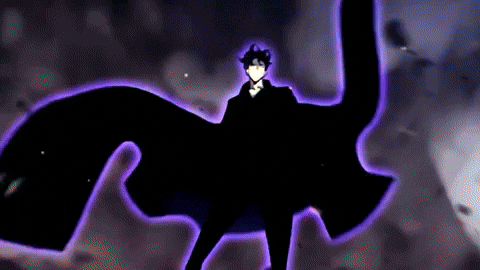 References
</h1>

- [`src/components/effects/`](../src/components/effects/) — canvas, SVG, and scroll effect owners.
- [`src/components/layout/PageTransition.tsx`](../src/components/layout/PageTransition.tsx) — route state machine and click capture.
- [`src/components/layout/page-transition-config.ts`](../src/components/layout/page-transition-config.ts) — effect names, videos, copies, and timings.
- [`src/app/globals.css`](../src/app/globals.css) — shared keyframes, selectors, themes, and reduced-motion rules.
- [`src/components/loading-screen/`](../src/components/loading-screen/) — loading and boot animation sources.
- [`tests/visual/`](../tests/visual/) — screenshot evidence.
- [`tests/accessibility/`](../tests/accessibility/) — semantic and keyboard evidence.
- [`README.md`](../README.md) — documentation entry point and project commands.

### Final review checklist

- [ ] Effect has one named owner and one clear signal.
- [ ] Server, hydration, and browser API boundaries are explicit.
- [ ] Final content remains readable before, during, and after motion.
- [ ] Dark, light, mobile, and reduced-motion states were checked.
- [ ] RAF, listener, timer, observer, and GPU cleanup were checked.
- [ ] Focus, pointer input, and semantic labels remain unchanged.
- [ ] Focused test, browser test, and quality gate outputs are recorded.
- [ ] README and local links point to this guide.

<a id="27--manga-panel-media"></a>
<h1 align="center">
   Manga panel media
</h1>

The monocolor route effect uses six animated panels. Each render alternates three MP4 files with three GIF files from `public/images/gifs/`, while the panel geometry and entrance animation stay shared.

```mermaid
flowchart LR
    VIDEOS[MOSAIC_VIDEOS] --> V[Video panels]
    GIFS[MOSAIC_GIFS] --> G[GIF panels]
    V --> FRAME[Shared panel frame]
    G --> FRAME
    FRAME --> MOTION[Panel entrance and exit]
```

### Media rules

- Keep MP4 paths in `MOSAIC_VIDEOS`.
- Keep every local GIF path in `MOSAIC_GIFS`.
- Rotate both lists with the transition seed so repeated route changes do not reuse one frame set.
- Use native `` for GIFs; it preserves animated frames without image optimization.
- Use muted looping `<video>` for MP4 files.
- Keep border and panel timing in the shared CSS selector.
- Use `contain` for GIF panels so each file keeps its source ratio; use `cover` for MP4 panels.

### Evidence

- `src/components/tests/page-transition.test.tsx` asserts three video nodes and three GIF image nodes.
- `npm run docs:check` verifies local image references used by this guide.
- Production Chromium smoke confirms the transition mounts without console or page errors.

This guide explains current behavior. When source behavior changes, update the nearest section and its evidence command in the same change.
