<div align="center">

<h1 align="center">
  
  Testing & Quality Assurance
</h1>

Browser evidence, test commands, tool versions, and CI-oriented verification for the portfolio.

<a href="./README.md">README</a> · <a href="./docs/testing.md">QA runbook</a> · <a href="./package.json">Scripts</a>

</div>

---

<h1 align="center">
   Test Stack
</h1>

<p align="center">
  
</p>

<p>
  The suite uses the cheapest reliable layer for each behavior: Jest for broad existing coverage, Vitest for focused React checks, Browser Mode and Playwright for real browser behavior, Node's test runner for QA scripts, Storybook for component states, and Lighthouse CI for built-app quality signals.
</p>

<table>
  <thead>
    <tr><th>Layer</th><th>What we used</th><th>Why it exists</th></tr>
  </thead>
  <tbody>
    <tr><td>Unit and component</td><td>Jest + React Testing Library + jsdom</td><td>Fast assertions for components, hooks, utilities, routes, and mocked integrations.</td></tr>
    <tr><td>Focused React</td><td>Vitest + Vite React plugin + jsdom</td><td>Small, isolated behavior tests with a fast feedback loop.</td></tr>
    <tr><td>Browser component</td><td>Vitest Browser Mode + Playwright Chromium</td><td>Checks DOM behavior that depends on a real browser runtime.</td></tr>
    <tr><td>End to end</td><td>Playwright</td><td>Verifies navigation, project controls, responsive pages, runtime errors, and user journeys.</td></tr>
    <tr><td>Accessibility</td><td>Playwright + <code>@axe-core/playwright</code></td><td>Automated axe checks on rendered pages, with semantic assertions in browser tests.</td></tr>
    <tr><td>Visual regression</td><td>Playwright snapshots</td><td>Compares stable desktop, mobile, page, navigation, and project-card states.</td></tr>
    <tr><td>Quality scripts</td><td>Node test runner + ESLint + TypeScript</td><td>Checks test tooling, file-size policy, duplication, complexity, and static correctness.</td></tr>
    <tr><td>Audit and inspection</td><td>Storybook + addon-a11y + Lighthouse CI</td><td>Reviews component states and audits the production build.</td></tr>
  </tbody>
</table>

<h1 align="center">
   Test Matrix
</h1>

<table>
  <thead>
    <tr>
      <th>Layer</th>
      <th>Command</th>
      <th>Coverage</th>
      <th>Evidence</th>
    </tr>
  </thead>
  <tbody>
    <tr>
      <td>Jest</td>
      <td><code>pnpm run test:jest</code></td>
      <td>Components, hooks, routes, utilities, integrations</td>
      <td><code>reports/junit.xml</code>, <code>coverage/</code></td>
    </tr>
    <tr>
      <td>Vitest jsdom</td>
      <td><code>pnpm run test:vitest</code></td>
      <td>Focused React behavior</td>
      <td>Terminal output</td>
    </tr>
    <tr>
      <td>Vitest Browser Mode</td>
      <td><code>pnpm run test:browser</code></td>
      <td>Component behavior in Chromium</td>
      <td><code>.vitest-attachments/</code></td>
    </tr>
    <tr>
      <td>Playwright E2E</td>
      <td><code>pnpm run test:e2e</code></td>
      <td>Smoke, navigation, projects, responsive behavior</td>
      <td><code>playwright-report/</code>, <code>test-results/</code></td>
    </tr>
    <tr>
      <td>Accessibility</td>
      <td><code>pnpm run test:accessibility</code></td>
      <td>Rendered page axe checks</td>
      <td>Playwright report</td>
    </tr>
    <tr>
      <td>Visual</td>
      <td><code>pnpm run test:visual</code></td>
      <td>Stable page and region screenshots in Chromium</td>
      <td><code>tests/visual/*-snapshots/</code></td>
    </tr>
    <tr>
      <td>Node QA</td>
      <td><code>pnpm run test:scripts</code></td>
      <td>Quality and reporting scripts</td>
      <td><code>reports/quality/</code></td>
    </tr>
    <tr>
      <td>Storybook</td>
      <td><code>pnpm run build-storybook</code></td>
      <td>Reproducible component catalogue</td>
      <td><code>storybook-static/</code></td>
    </tr>
    <tr>
      <td>Lighthouse</td>
      <td><code>pnpm run test:lighthouse</code></td>
      <td>Built-app performance, a11y, best practices, SEO</td>
      <td><code>.lighthouseci/</code></td>
    </tr>
  </tbody>
</table>

<h2>One command</h2>

```bash
pnpm full:tests
```

`full:tests` runs `pnpm test`, then the Node QA scripts and the recorded video journey. `pnpm test` itself runs Jest, Vitest jsdom, Vitest Browser Mode, and the local Playwright matrix: desktop Chromium, E2E Chromium, mobile Chromium, and Firefox.

CI adds WebKit with `pnpm run test:playwright:all`, then builds Storybook and runs Lighthouse CI in the [Frontend QA workflow](./.github/workflows/frontend-qa.yml).

<h2>Lighthouse command boundary</h2>

`package.json` defines a dedicated `test:lighthouse` script: `pnpm run build && lhci autorun`. Lighthouse is separate from the `test` and `full:tests` scripts because it audits a production build and takes longer than the fast test layers. Run it explicitly with:

```bash
pnpm run test:lighthouse
```

The Frontend QA workflow runs the equivalent `pnpm exec lhci autorun` step after building the application and uploads `.lighthouseci/`.

<h2>Lighthouse endpoint screenshots</h2>

The PNGs below use the same six URLs listed in [`lighthouserc.js`](./lighthouserc.js). Each image is a full-page Chromium screenshot of the latest generated `.lighthouseci/*.report.html` file for that endpoint. The Lighthouse report HTML is the source of truth; no separate endpoint page capture is used.

Run Lighthouse first, then extract its report screenshots:

```bash
pnpm run test:lighthouse
```

<table>
  <tr>
    <td align="center"><strong>/en</strong><br></td>
    <td align="center"><strong>/en/about</strong><br>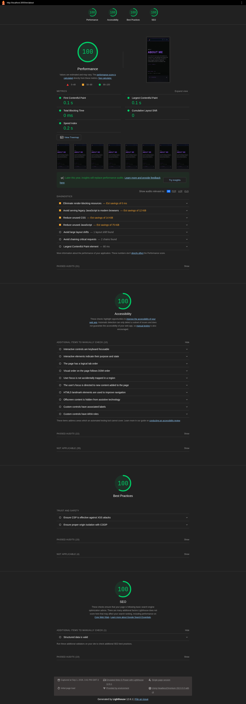</td>
  </tr>
  <tr>
    <td align="center"><strong>/en/projects</strong><br>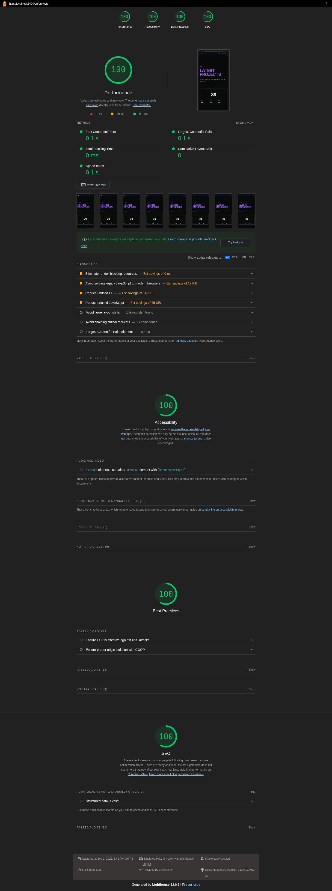</td>
    <td align="center"><strong>/en/certifications</strong><br>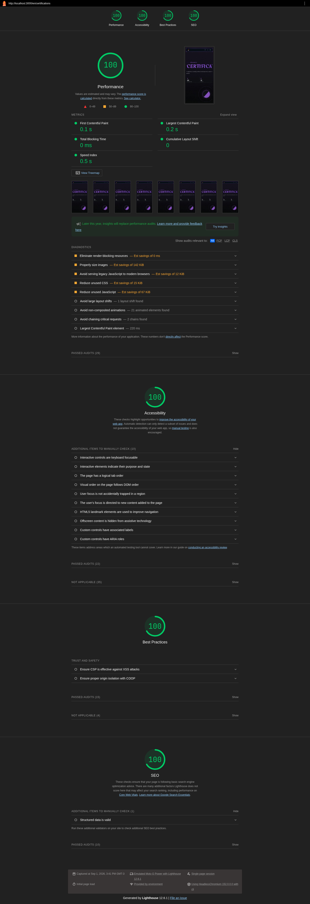</td>
  </tr>
  <tr>
    <td align="center"><strong>/en/chat</strong><br>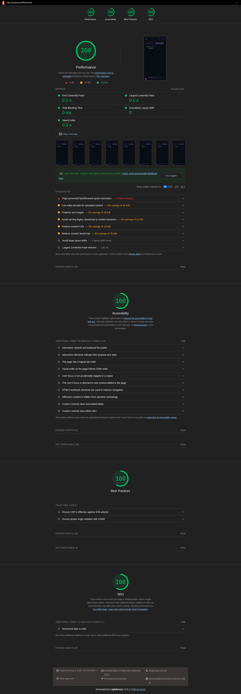</td>
    <td align="center"><strong>/en/contact</strong><br>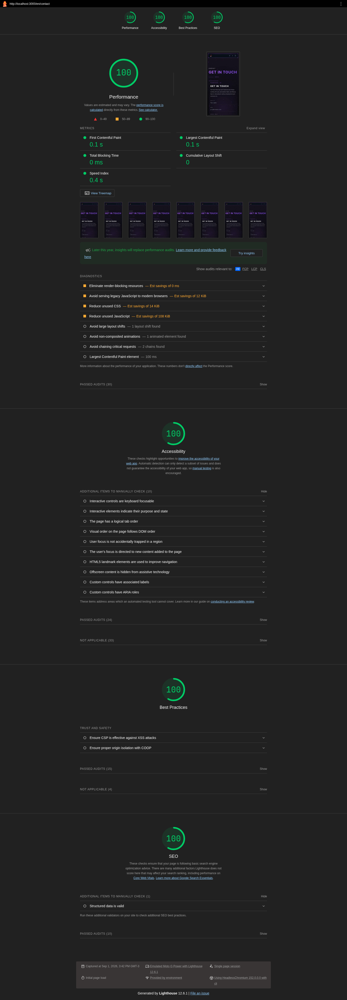</td>
  </tr>
</table>

`test:lighthouse:screenshots` is the HTML screenshot step used by `test:lighthouse`; it requires existing `.lighthouseci` HTML reports and writes `sources.json` with each endpoint-to-report mapping.

<h1 align="center">
   Version Baseline
</h1>

Version values are read from `package.json` and `pnpm-lock.yaml`. CI runtime values are read from the workflow files.

<table>
  <thead>
    <tr><th>Area</th><th>Version</th><th>Where it is pinned</th></tr>
  </thead>
  <tbody>
    <tr><td>Package manager</td><td>pnpm 11.9.0</td><td><code>packageManager</code>, CI setup</td></tr>
    <tr><td>CI runtime</td><td>Node.js 24</td><td>CI environment</td></tr>
    <tr><td>Application</td><td>Next.js 16.3.3 · React 19.2.8</td><td>Production dependencies</td></tr>
    <tr><td>Jest layer</td><td>Jest 30.5.0 · jest-environment-jsdom 30.5.0</td><td>Dev dependencies</td></tr>
    <tr><td>Testing Library</td><td>@testing-library/react 16.3.3 · jest-dom 7.0.1 · user-event 14.6.6</td><td>Dev dependencies</td></tr>
    <tr><td>Vitest layer</td><td>Vitest 4.1.11 · Browser Mode 4.1.11</td><td>Dev dependencies</td></tr>
    <tr><td>Browser layer</td><td>Playwright 1.62.1 · axe 4.13.0</td><td>Dev dependencies</td></tr>
    <tr><td>Component review</td><td>Storybook 10.5.10 · addon-a11y 10.5.10</td><td>Dev dependencies</td></tr>
    <tr><td>Static quality</td><td>TypeScript 5.9.3 · ESLint 10.9.1</td><td>Dev dependencies</td></tr>
  </tbody>
</table>

<h1 align="center">
   Verification Flow
</h1>

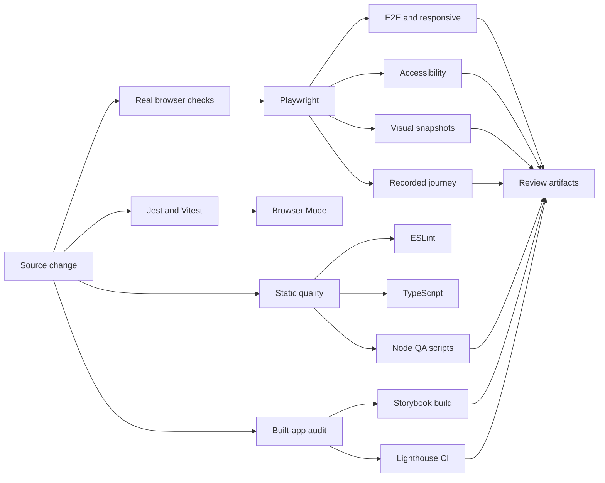

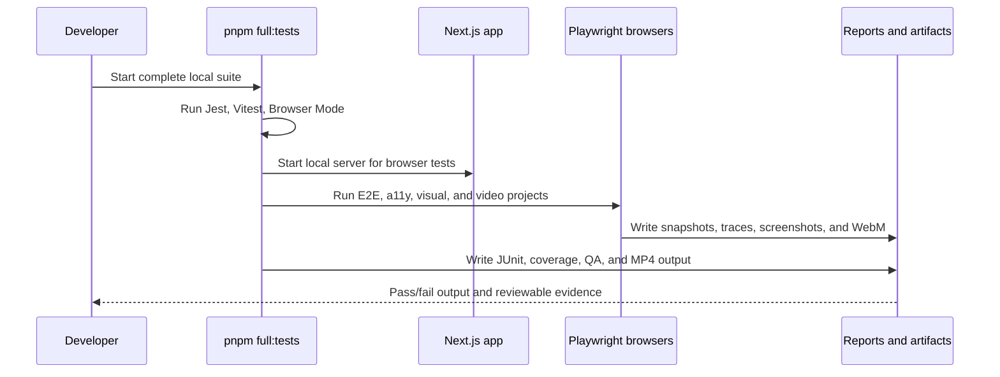

<h1 align="center">
   Browser Configuration
</h1>

<table>
  <tr><th>Setting</th><th>Value</th><th>Reason</th></tr>
  <tr><td>Desktop</td><td><code>1366 × 768</code></td><td>Stable visual baseline and recorded journey size</td></tr>
  <tr><td>Mobile</td><td><code>390 × 844</code> · Pixel 5 profile</td><td>Responsive navigation and layout checks</td></tr>
  <tr><td>Locale / timezone</td><td><code>en-US</code> / <code>UTC</code></td><td>Deterministic text and date output</td></tr>
  <tr><td>Color scheme</td><td>Dark</td><td>Matches the primary visual baseline</td></tr>
  <tr><td>Service workers</td><td>Blocked</td><td>Prevents stale worker state from changing test output</td></tr>
  <tr><td>Failure artifacts</td><td>Screenshot; CI trace and video</td><td>Fast failure diagnosis without noisy success artifacts</td></tr>
</table>

<h1 align="center">
   Latest Local Verification
</h1>

Repository evidence snapshot captured on 2026-09-01. Recorded reports are not live telemetry; rerun commands to refresh them.

<table>
  <tr><th>Suite</th><th>Result</th></tr>
  <tr><td>Jest</td><td>26 suites / 138 tests passed</td></tr>
  <tr><td>Vitest jsdom</td><td>2 files / 11 tests passed</td></tr>
  <tr><td>Vitest Browser Mode</td><td>1 file / 1 test passed</td></tr>
  <tr><td>Playwright local matrix</td><td>58 tests passed</td></tr>
  <tr><td>Node QA scripts</td><td>36 tests passed</td></tr>
  <tr><td>Video journey</td><td>1 test passed; MP4 generated</td></tr>
</table>

<table>
  <tr><th>Quality signal</th><th>Recorded result</th></tr>
  <tr><td>Jest line coverage</td><td>97.05%</td></tr>
  <tr><td>Jest branch coverage</td><td>83.94%</td></tr>
  <tr><td>Jest function coverage</td><td>95.44%</td></tr>
  <tr><td>Complexity findings</td><td>0</td></tr>
  <tr><td>Duplicated lines</td><td>0.00%</td></tr>
</table>

The test report artifact records 138 Jest tests, 138 passed, 0 failed, 0 errors, and 0 skipped. The coverage threshold in `jest.config.js` is 95% for lines.

<h1 align="center">
   Test Layout
</h1>

```text
src/**/tests/                  Jest tests beside the owned source area
  app/**/tests/                Page, route, metadata, and shell coverage
  components/tests/            Component and interaction coverage
  hooks/**/tests/              Hook behavior
  i18n/**/tests/               Locale routing behavior
  lib/**/tests/                Utility and integration behavior
tests/vitest/                  Vitest jsdom component tests
tests/browser/                 Vitest Browser Mode tests
tests/e2e/                     Playwright smoke, navigation, projects, responsive
tests/accessibility/           Playwright + axe checks
tests/visual/                  Playwright page and region snapshots
tests/video/                   Recorded Playwright journey
scripts/tests/*.node-test.mjs  Node QA and quality-script tests
```

<h1 align="center">
   Evidence & Demonstration
</h1>

The recorded journey visits the homepage, About, Projects, Certifications, and Contact pages. It exercises scrolling, primary navigation, project README modal behavior, certification filtering, and contact form validation.

<video controls width="100%" poster="./docs/assets/testing/homepage-desktop.png" src="./docs/assets/testing/test-demo.mp4">
  <a href="./docs/assets/testing/test-demo.mp4">Download the MP4 test demonstration</a>
</video>

If the embedded player does not render in a Markdown preview, use the [MP4 test demonstration](./docs/assets/testing/test-demo.mp4).

Command used:

```bash
pnpm run test:video
```

The command records `video.webm` and converts the newest recording to `test-demo.mp4` with the repository FFmpeg conversion script. Local conversion needs FFmpeg; CI installs it with apt.

<h2>Screenshot evidence</h2>

Screenshots below are generated by the Playwright visual suite and show stable states used by snapshot checks.

<table>
  <tr>
    <td align="center"><strong>Homepage desktop</strong><br>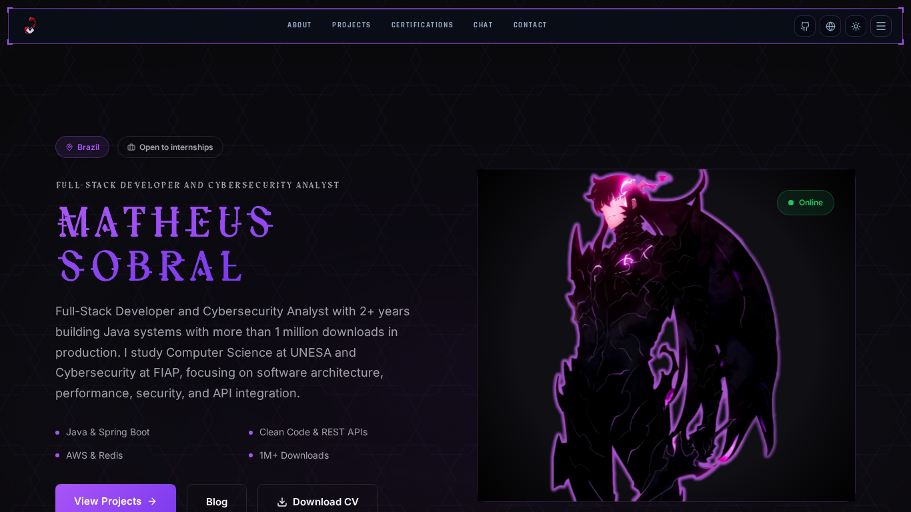</td>
    <td align="center"><strong>Homepage mobile</strong><br>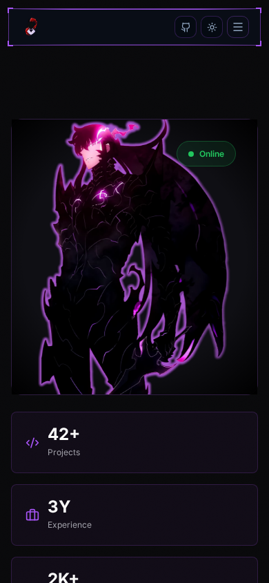</td>
  </tr>
  <tr>
    <td align="center"><strong>Projects</strong><br>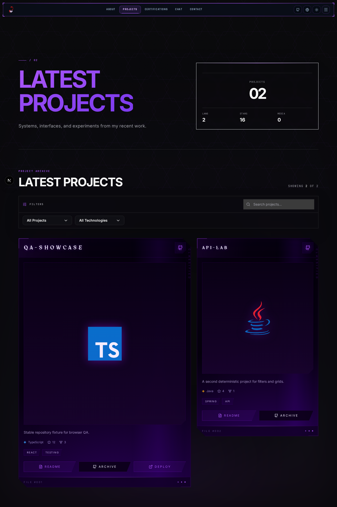</td>
    <td align="center"><strong>About</strong><br>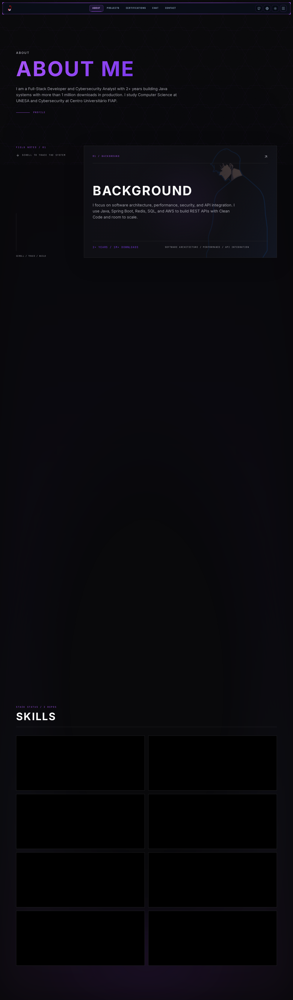</td>
  </tr>
</table>

<h2>Artifact map</h2>

<table>
  <tr><th>Path</th><th>Purpose</th></tr>
  <tr><td><code>reports/junit.xml</code></td><td>Jest results consumed by quality reporting</td></tr>
  <tr><td><code>coverage/</code></td><td>Text, LCOV, and JSON coverage output</td></tr>
  <tr><td><code>playwright-report/</code></td><td>HTML browser report</td></tr>
  <tr><td><code>test-results/</code></td><td>Traces, screenshots, WebM, and MP4 output</td></tr>
  <tr><td><code>.vitest-attachments/</code></td><td>Browser Mode attachments</td></tr>
  <tr><td><code>storybook-static/</code></td><td>Static Storybook build</td></tr>
  <tr><td><code>.lighthouseci/</code></td><td>Lighthouse CI audit output</td></tr>
</table>

<h1 align="center">
   Useful Commands
</h1>

```bash
# Full local verification
pnpm full:tests

# Fast focused suites
pnpm run test:jest
pnpm run test:vitest
pnpm run test:browser

# Browser suites
pnpm run test:e2e
pnpm run test:accessibility
pnpm run test:visual
pnpm run test:visual:update       # only after intentional visual review
pnpm run test:playwright:all      # all configured projects, including WebKit

# Reports and audits
pnpm run test:coverage
pnpm run test:scripts
pnpm run test:lighthouse
pnpm exec playwright show-report
pnpm exec playwright show-trace test-results/<trace>.zip
```

<h2>Snapshot policy</h2>

- Normal test runs never update visual baselines.
- Review the Playwright diff before approving a visual change.
- Run `pnpm run test:visual:update` only for an intentional layout change.
- Keep screenshots on the same OS, browser version, and font set as the baseline.
- Dynamic canvas, GIF, video, and ticker layers are masked only where needed; their presence, dimensions, and runtime behavior remain tested separately.

<h1 align="center">
   CI/CD Pipeline
</h1>

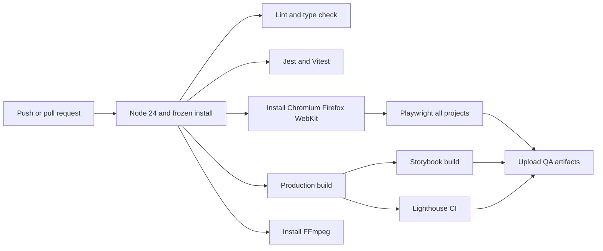

Frontend QA installs pnpm 11.9.0, Node.js 24, all Playwright browser dependencies, and FFmpeg. It runs lint, type checking, Jest, Vitest, Browser Mode, the production build, Playwright, Storybook, and Lighthouse CI. After Lighthouse writes `.report.html` files, CI captures them and uploads `playwright-report`, `test-results`, `.lighthouseci`, `docs/assets/testing/lighthouse`, and `storybook-static` for seven days.

The main CI workflow uses `npm ci` for lint, type checking, tests, and build. Dependency changes must keep `package-lock.json` and `pnpm-lock.yaml` synchronized.

<h2>Known local limits</h2>

- `pnpm test` uses local Chromium, mobile Chromium, and Firefox projects. WebKit is included by `pnpm run test:playwright:all` and CI.
- This host has the Playwright WebKit binary but lacks native WebKit libraries; CI installs them with `pnpm exec playwright install --with-deps chromium firefox webkit`.
- Lighthouse treats performance, best-practice, SEO, and most timing metrics as warnings. Accessibility and CLS remain blocking assertions.
- CI keeps browser and audit artifacts for seven days.

<h1 align="center">
   References
</h1>

- [Jest documentation](https://jestjs.io/docs/getting-started) · [React Testing Library](https://testing-library.com/docs/react-testing-library/intro/)
- [Vitest guide](https://vitest.dev/guide/) · [Vitest Browser Mode](https://vitest.dev/guide/browser/)
- [Playwright documentation](https://playwright.dev/docs/intro) · [Accessibility testing](https://playwright.dev/docs/accessibility-testing)
- [Storybook testing](https://storybook.js.org/docs/writing-tests) · [Lighthouse CI](https://github.com/GoogleChrome/lighthouse-ci/blob/main/docs/getting-started.md)
- [Node.js test runner](https://nodejs.org/api/test.html) · [pnpm documentation](https://pnpm.io/)

For the shorter operator runbook, see [docs/testing.md](./docs/testing.md).
